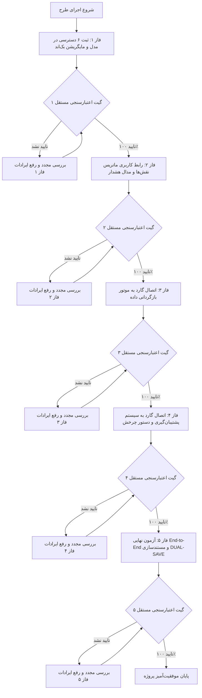

# طرح جامع و ارتقایافته پیاده‌سازی سیستم دسترسی‌های حساس، بازگردانی و پشتیبان‌گیری
## (Enhanced Sensitive RBAC, Rollback & Backup System with Strict Independent Verification Gates)

این طرح بر اساس نیازمندی‌های قطعی، بازبینی عمیق معماری، حل مشکل عدم نمایش گزینه‌ها در فرانت‌اند، و افزودن بسته کامل ۶ دسترسی بحرانی تنظیم شده است. اجرای کار به ۵ فاز مستقل همراه با **گیت‌های اعتبارسنجی مستقل و غیرقابل عبور در صورت بروز خطا (Independent Verification Gates)** تقسیم شده است.

---

## 🎯 اهداف کلان و دسترسی‌های حساس ۶‌گانه

| ردیف | نام کد دسترسی (`codename`) | عنوان فارسی دسترسی | حوزه کاربرد و سطح ریسک |
| :---: | :--- | :--- | :--- |
| ۱ | `perm_rollback_data` | بازگردانی و احیای داده‌ها و رکوردهای حذف/ویرایش شده | بازگردانی رکوردهای انبارگردانی، اسناد و کاربران به نسخه‌های قبلی (ریسک بالا) |
| ۲ | `perm_sys_backup_restore` | پشتیبان‌گیری و بازیابی پایگاه داده | ایجاد Dump، اعتبارسنجی هش و بازیابی کل دیتابیس (بسیار بحرانی) |
| ۳ | `perm_sys_purge_logs` | پاکسازی و حذف لاگ‌های ممیزی و تاریخچه | حذف لاگ‌های ممیزی قدیمی و پاکسازی ردپاها (ریسک بالا) |
| ۴ | `perm_sys_hard_delete` | حذف فیزیکی و قطعی داده‌ها (بدون حذف نرم) | حذف دائم رکوردها از پایگاه داده مستثنی از Soft Delete (بسیار بحرانی) |
| ۵ | `perm_sys_emergency_freeze` | فریز اضطراری و قفل سراسری کلیه انبارها | توقف آنی و همگانی کلیه عملیات‌های انبارگردانی در شرایط بحران (ریسک بالا) |
| ۶ | `perm_sys_factory_reset` | بازنشانی مقادیر اولیه و ریست سیستم | بازنشانی جداول یا تنظیمات اولیه کارخانه (بسیار بحرانی) |

---

## 🛡️ معماری امنیت و تجربه کاربری (UX & RBAC Architecture)

1. **نمایش دائمی تب دسترسی‌ها در ماتریس نقش‌ها:**
   - تب «دسترسی‌های حساس و بحرانی 🛡️» در فرم تعریف و ویرایش نقش‌ها برای تمامی کاربران دارای دسترسی به بخش کاربران نمایش داده می‌شود تا شفافیت ساختار حفظ شود.
2. **قفل هوشمند برای غیر Superuser:**
   - برای کاربران عادی، چک‌باکس‌ها در حالت **Disabled / Read-Only** همراه با برچسب هشدار «صرفاً توسط مدیر ارشد سامانه قابل تخصیص است» نمایش می‌یابند.
3. **تخصیص صرفاً توسط مدیر ارشد با هشدار امنیتی ۲ مرحله‌ای:**
   - صرفاً مدیر ارشد (Superuser) امکان کلیک روی چک‌باکس‌ها را دارد. با کلیک، مدال قرمز رنگ هشدار امنیتی با تشریح ریسک هر دسترسی باز می‌شود.
4. **مستثنی‌سازی قطعی از انتخاب دسته‌جمعی:**
   - دکمه‌های «انتخاب همه» به هیچ وجه دسترسی‌های حساس را تیک نخواهند زد.
5. **گارد دوطرفه سمت سرور:**
   - در صورت ارسال مستقیم درخواست API توسط کاربران غیر Superuser، بک‌اند خطای ۴۰۳ صادر خواهد کرد.

---

## 📋 فازبندی تفصیلی و گیت‌های اعتبارسنجی مستقل (Phased Plan & Verification Gates)

---

### 🔹 فاز ۱: زیرساخت امنیتی دسترسی‌های ۶‌گانه در بک‌اند (Gate 1)
- **اقدامات:**
  1. افزودن ۳ دسترسی جدید (`perm_sys_hard_delete`, `perm_sys_emergency_freeze`, `perm_sys_factory_reset`) به `CustomUser.Meta.permissions` در `warehouse-backend/accounts/models.py`.
  2. به‌روزرسانی مجموعه `SENSITIVE_PERMISSION_CODENAMES` با ۶ پرمیشن کامل.
  3. ایجاد مایگریشن `0022_add_extended_sensitive_permissions.py` و اعمال آن با `python manage.py migrate`.
  4. به‌روزرسانی `PermissionSerializer` جهت درج `is_sensitive=True` برای هر ۶ دسترسی.
  5. اعمال گارد امنیتی در `CustomRoleViewSet` و `UserViewSet` جهت ممانعت از انتساب هر یک از این ۶ دسترسی توسط غیر Superuser.
- **گیت اعتبارسنجی مستقل فاز ۱ (Gate 1 Verification):**
  - اجرای اسکریپت آزمون مستقل پایتون برای بررسی:
    - وجود هر ۶ پرمیشن در جدول `auth_permission`.
    - سریالایز شدن مشخصه `is_sensitive=True` برای تمام موارد.
    - تست تلاش کاربر عادی برای اعطای دسترسی حساس و دریافت خطای ۴۰۳ `PermissionDenied`.
  - **قانون گیت:** در صورت عدم تایید گیت ۱، به فاز بعد نمی‌رویم و تا رفع کامل نقص در همین فاز می‌مانیم.

---

### 🔹 فاز ۲: بازطراحی رابط کاربری ماتریس دسترسی‌ها در فرانت‌اند (Gate 2)
- **اقدامات:**
  1. اصلاح تابع `loadData()` در `warehouse-front/src/app/components/users/users.ts` به طوری که گروه `SENSITIVE` همواره در `systemPermissionGroups` ایجاد شود و تمام دسترسی‌های دریافتی با `is_sensitive` در آن قرار گیرند.
  2. اصلاح `users.html` برای نمایش استایل متمایز تب «دسترسی‌های حساس و بحرانی 🛡️»:
     - نمایش چک‌باکس‌ها به صورت Disabled / Read-Only برای کاربران غیر Superuser همراه با راهنما.
     - نمایش چک‌باکس‌های فعال با استایل قرمز/رز برای Superuser.
  3. اصلاح متد `toggleRolePermission` در `users.ts`: باز شدن مدال هشدار امنیتی ۲ مرحله‌ای با جزییات دقیق دسترسی برای مدیر ارشد، و جلوگیری از تغییر وضعیت برای کاربر عادی.
  4. اطمینان از عملکرد صحیح `toggleAllPermissions` و مستثنی بودن قطعی دسترسی‌های حساس.
- **گیت اعتبارسنجی مستقل فاز ۲ (Gate 2 Verification):**
  - کامپایل کامل پروژه فرانت‌اند با `npm run build` و اطمینان از خروج کد ۰ بدون هیچ خطای تایپ یا قالب.
  - تست عدم امکان انتخاب دسته‌جمعی و فعال بودن مدال هشدار.
  - **قانون گیت:** در صورت بروز هرگونه خطای بیلد یا قالب، توقف و اصلاح تا زمان اخذ خروج کد ۰.

---

### 🔹 فاز ۳: انطباق موتور بازگردانی داده با دسترسی‌های حساس (Gate 3)
- **اقدامات:**
  1. بررسی و تست اکشن‌های `preview_revert`، `revert` و `bulk_revert` در `AuditLogViewSet` با مجوز `perm_rollback_data`.
  2. بررسی سناریوی بازگردانی داده‌های یک رکورد انبارگردانی یا کاربر و ثبت لاگ ممیزی `ROLLBACK` بنفش رنگ.
- **گیت اعتبارسنجی مستقل فاز ۳ (Gate 3 Verification):**
  - اجرای اسکریپت آزمون خودکار فرآیند Revert با کاربر دارای مجوز و مسدودسازی کاربر فاقد مجوز.
  - **قانون گیت:** عدم ورود به فاز ۴ تا اطمینان از عملکرد بی‌نقص تراکنش‌های اتمیک بازگردانی.

---

### 🔹 فاز ۴: انطباق سیستم پشتیبان‌گیری و دستور چرخش خودکار (Gate 4)
- **اقدامات:**
  1. بررسی گارد امنیتی `perm_sys_backup_restore` در `DatabaseBackupViewSet`.
  2. تست تب «پشتیبان پایگاه‌داده 🛡️» در کامپوننت تنظیمات انبار (`wh-settings`).
  3. اجرای دستور مدیریتی `python manage.py run_auto_backup --keep 7` و بررسی حذف خودکار بکاپ‌های اضافه.
- **گیت اعتبارسنجی مستقل فاز ۴ (Gate 4 Verification):**
  - آزمون موفق خروجی دستور `run_auto_backup` و بررسی یکپارچگی فایل متادیتا و هش SHA-256.
  - **قانون گیت:** تایید سلامت کامل فرآیند Backup/Restore پیش از ورود به فاز نهایی.

---

### 🔹 فاز ۵: آزمون جامع End-to-End و مستندسازی کامل DUAL-SAVE (Gate 5)
- **اقدامات:**
  1. اجرای آزمون یکپارچه سراسری از لاگین، تعریف نقش، بازگردانی داده، و پشتیبان‌گیری.
  2. کامپایل نهایی فرانت‌اند و بررسی عدم وجود خطای ران‌تایم.
  3. به‌روزرسانی و ثبت فایل‌های `task_rollback.md`, `walkthrough_rollback.md`, `task.md`, `walkthrough.md` و `Master_Log.md` بر اساس قالب استاندارد Claude Opus 4.6.
- **گیت اعتبارسنجی مستقل فاز ۵ (Gate 5 Verification):**
  - تایید پاس شدن ۱۰۰٪ تمام گیت‌ها و آماده‌سازی گزارش نهایی برای کاربر.

---

## 📁 فایل‌های مشمول تغییر (Files to Modify)

1. `warehouse-backend/accounts/models.py` (تعریف دسترسی‌های جدید و مجموعه حساس)
2. `warehouse-backend/accounts/migrations/0022_add_extended_sensitive_permissions.py` (مایگریشن جدید)
3. `warehouse-backend/accounts/serializers.py` (سریالایزر دسترسی‌ها)
4. `warehouse-backend/accounts/views.py` (گاردهای امنیتی ویوست‌ها)
5. `warehouse-front/src/app/components/users/users.ts` (لاجیک بارگذاری و ماتریس دسترسی‌ها)
6. `warehouse-front/src/app/components/users/users.html` (طراحی تب دسترسی‌های حساس و مدال هشدار)
7. `warehouse-front/src/app/components/wh-settings/wh-settings.ts` & `wh-settings.html` (تب پشتیبان‌گیری)
8. اسناد DUAL-SAVE در پوشه `Documents/`

