<div dir="rtl" align="right">

# طرح جامع و ارتقایافته بازبینی، عیب‌یابی و بهینه‌سازی صفحه تخصیص کالا (Dispatch Optimization)

این سند حاوی طرح تفصیلی، گام‌به‌گام و فازبندی‌شده برای رفع کلیه ایرادات کشف‌شده در صفحه تخصیص کالا، پیاده‌سازی سازوکار انتخاب ۳ حالته فیلترمحور، اتصال به وب‌سوکت برای به‌روزرسانی بلادرنگ درجا (In-Place Update)، حذف منوی تکراری ستون‌ها، و ساختار اعتبارسنجی مستقل توسط **ایجنت بازبین (Reviewer Subagent Gate)** در پایان هر فاز می‌باشد.

---

## ۱. گزارش جامع ایرادات کشف‌شده و الزامات مهندسی

| ردیف | موضوع ایراد / چالش | شدت | پیامد فنی و راه‌حل مهندسی ارتقایافته |
| :---: | :--- | :---: | :--- |
| **۱** | **عدم اتصال به وب‌سوکت و ایستا بودن جدول** | 🔴 بحرانی | صفحه تخصیص هیچ اتصالی به `WebSocketService` ندارد؛ شمارش کالا در میدان یا تایید سرپرست منعکس نمی‌شود. <br>✅ **راه‌حل:** اشتراک هوشمند روی وب‌سوکت با به‌روزرسانی درجا (In-Place Patch) بر روی رکوردهای صفحه جاری بدون پرش صفحه، به همراه Debounce ۶۰۰ میلی‌ثانیه‌ای برای رویدادهای گروهی. |
| **۲** | **خطای 400 Bad Request در مرتب‌سازی ستون‌ها** | 🔴 بحرانی | فیلدهای camelCase (مانند `fieldStatus`، `docStatus`، `labelStatus`، `fieldAssignee`) مستقیماً به پارامتر `ordering` جنگو ارسال شده و خطای ساختاری تولید می‌کنند. <br>✅ **راه‌حل:** جدول نگاشت جامع (Ordering Dictionary) برای تبدیل خودکار به snake_case مطابق فیلدهای مدل دیتابیس (`field_status`، `doc_status`، `tag_status` و...). |
| **۳** | **محدودیت و ابهام در انتخاب دسته‌جمعی بین صفحات** | 🟠 بالا | امکان انتخاب «تمامی رکوردهای فیلترشده در کل دیتابیس» وجود ندارد و فقط صفحه ۱ انتخاب می‌شود. <br>✅ **راه‌حل:** سیستم انتخاب ۳ حالته هماهنگ با فیلترینگ (کلیک ۱: صفحه جاری / کلیک ۲: کل دیتابیس فیلترشده / کلیک ۳: لغو کامل) همراه با بج بصری وضعیت. |
| **۴** | **تکرار منوی انتخاب ستون‌ها در کنار دکمه‌های زوم** | 🟡 متوسط | وجود دکمه ساده انتخاب ستون‌ها در دیتا تیبل علاوه بر دکمه تفکیک‌شده «دسته‌بندی ستون‌ها» در تولبار بالا. <br>✅ **راه‌حل:** غیرفعال‌سازی `showColumnToggle` در فراخوانی جدول تخصیص. |
| **۵** | **نقص در استخراج و تفکیک تگ‌ها** | 🟠 بالا | اسکن تگ‌ها محدود به ۱۰۰ رکورد صفحه ۱ است و تفکیک فقط با کاراکتر `،` انجام می‌شود. <br>✅ **راه‌حل:** پشتیبانی همزمان از ویرگول فارسی (`،`) و انگلیسی (`,`) با Regex و اسکن امن تگ‌های رکوردهای انتخابی. |
| **۶** | **مشکل فیلتر تاریخ‌های DRF در `buildApiFilters`** | 🟡 متوسط | نادیده گرفتن پسوندهای `_after` و `_before` ارسالی از تقویم جلالی. <br>✅ **راه‌حل:** تفکیک دقیق فیلترهای نمایشی از فیلترهای بازه زمانی ISO. |
| **۷** | **نشت حافظه در اشتراک‌ها (Memory Leaks)** | 🟡 متوسط | سابسکرایب‌های کاربران و تنظیمات در `ngOnInit` ذخیره نشده و در تخریب کامپوننت لغو نمی‌شوند. <br>✅ **راه‌حل:** تجمیع در `Subscription` و لغو خودکار در `ngOnDestroy`. |
| **۸** | **پایداری آفلاین و SWR Live Revalidation** | 🟢 بهبود | عدم تطبیق با استعلام پس‌زمینه `liveDataUpdates$`. <br>✅ **راه‌حل:** سابسکرایب به لایو آپدیت‌های `OfflineSyncService`. |

---

## ۲. ساختار فازبندی و پروتکل نظارت چندایجنت (Multi-Agent Phased Execution Protocol)

```mermaid
graph TD
    subgraph Phase1 [فاز ۱: وب‌سوکت و پایداری درجا]
        P1_Dev[پیاده‌سازی وب‌سوکت و In-Place Patch] --> P1_Gate[🔍 گیت بررسی ایجنت بازبین ۱]
        P1_Gate -->|تایید نشد: بازگشت برای رفع نقص| P1_Dev
        P1_Gate -->|تایید شد: مجوز فاز ۲| Phase2
    end

    subgraph Phase2 [فاز ۲: موتور انتخاب ۳ حالته فیلترمحور]
        P2_Dev[پیاده‌سازی انتخاب ۳ حالته و بج بصری] --> P2_Gate[🔍 گیت بررسی ایجنت بازبین ۲]
        P2_Gate -->|تایید نشد: بازگشت برای رفع نقص| P2_Dev
        P2_Gate -->|تایید شد: مجوز فاز ۳| Phase3
    end

    subgraph Phase3 [فاز ۳: حذف تکرار ستون‌ها و اصلاح نگاشت‌ها]
        P3_Dev[حذف دکمه تکراری + نگاشت Sort + پارسر تگ] --> P3_Gate[🔍 گیت بررسی ایجنت بازبین ۳]
        P3_Gate -->|تایید نشد: بازگشت برای رفع نقص| P3_Dev
        P3_Gate -->|تایید شد: مجوز فاز نهایی| Phase4
    end

    subgraph Phase4 [فاز ۴: تست یکپارچه و اعتبارسنجی نهایی]
        P4_Dev[بیلد کامل، تست سراسری و مستندسازی] --> P4_Gate[🔍 تاییدیه نهایی ایجنت ناظر]
    end
```



> [!IMPORTANT]
> **قانون گیت نظارت ایجنت بازبین (Reviewer Subagent Gate):**
> ورود به هر فاز جدید منوط به اجرای مستقل بررسی توسط ایجنت بازبین، اعتبارسنجی کامل لاگ‌ها، تست خطاها و عدم وجود هرگونه عارضه جانبی (Zero Regression) است. در صورت رد توسط ایجنت بازبین، فاز جاری بلافاصله مورد بازنگری قرار گرفته و تا رفع کامل ایراد ادامه می‌یابد.

---

## ۳. شرح تفصیلی فازهای اجرایی

### 🔷 فاز ۱: اتصال به وب‌سوکت، پایداری درجا (In-Place Update) و مدیریت اشتراک‌ها

#### اقدامات اجرایی:
1. **تزریق `WebSocketService` در `dispatch.ts`:**
   - برقراری اشتراک روی `wsService.notifications$`.
   - شنود رویدادهای `count_task_update`، `doc_task_update`، `item_update`.
2. **پیاده‌سازی متد `updateRowInPlace(payload: any)`:**
   - جستجوی رکورد متناظر در آرایه `this.items` بر اساس شناسه کالا.
   - به‌روزرسانی درجا و نرم فیلدهای `fieldStatus`، `docStatus`، `fieldAssignee`، `docAssignee`، `has_conflict` و `labelStatus`.
   - فراخوانی `cdr.markForCheck()` جهت رندر آنی بدون پرش اسکرول، بدون لرزش و بدون لغو چک‌باکس‌های انتخابی کاربر.
3. **مکانیزم Debounce برای رویدادهای دسته‌جمعی:**
   - استفاده از `Subject` و `debounceTime(600)` برای رویدادهای گروهی جهت جلوگیری از ارسال رگباری درخواست به سرور.
4. **هماهنگی با `OfflineSyncService`:**
   - گوش دادن به `liveDataUpdates$` جهت هماهنگی با فرآیند SWR پس از همگام‌سازی آفلاین.
5. **پاکسازی کامل حافظه:**
   - پیاده‌سازی اینترفیس `OnDestroy` و لغو تمام اشتراک‌ها (`wsSub`, `wsDebounceSub`, `swrSub`, `loadSubscription`, `exportSubscription`, `usersSub`, `settingsSub`).

> [!TIP]
> **معیارهای تایید ایجنت بازبین در فاز ۱:**
> - [x] کامپایل کامل تایپ‌اسکریپت بدون هیچ‌گونه خطا یا هشدار تایپ.
> - [x] اطمینان از بسته شدن کامل اشتراک‌ها در `ngOnDestroy`.
> - [x] حفظ دقیق رکوردهای انتخابی در هنگام دریافت رویدادهای بلادرنگ وب‌سوکت.

---

### 🔷 فاز ۲: سیستم انتخاب ۳ حالته فیلترمحور (3-State Selection Engine)

#### اقدامات اجرایی:
1. **ارتقای کامپوننت جدول (`DataTableComponent`):**
   - افزودن ورودی `@Input() selectionMode: 'none' | 'page' | 'all' = 'none'`.
   - افزودن خروجی `@Output() selectionModeChanged = new EventEmitter<'none' | 'page' | 'all'>()`.
   - به‌روزرسانی هدر چک‌باکس با ۳ حالت بصری مجزا:
     - **حالت ۱ (خالی):** بدون انتخاب.
     - **حالت ۲ (تیک آبی):** انتخاب رکوردهای صفحه جاری.
     - **حالت ۳ (تیک سبز/پررنگ با حاشیه):** انتخاب تمامی رکوردهای منطبق بر فیلتر در کل دیتابیس.
   - متد چرخش انتخاب `cycleMasterSelection()` (صفحه جاری -> کل دیتابیس -> لغو).
2. **مدیریت وضعیت در `dispatch.ts`:**
   - متغیرهای `selectionMode: 'none' | 'page' | 'all'` و `isSelectAllMatching: boolean`.
   - نمایش تگ وضعیت انتخاب در بالای جدول:
     - در حالت صفحه جاری: `(۱۰۰ رکورد از صفحه جاری انتخاب شد)`.
     - در حالت کل دیتابیس: `(تمامی ۳,۴۵۰ رکورد فیلترشده انتخاب شدند)`.
3. **هماهنگ‌سازی متدهای ارجاع و عملیات دسته‌جمعی:**
   - در صورت فعال بودن حالت کل دیتابیس (`selectionMode === 'all'`)، ارسال فلگ انتخاب کل به همراه پارامترهای فیلتر فعال (`this.buildApiFilters(false)`) به متدهای `executeFieldDispatch`، `executeDocDispatch`، `applyBatchTags` و `executeExport`.
   - درج متن شفاف در دیالوگ‌های تایید: «آیا از ارجاع تمامی ۳,۴۵۰ کالای فیلترشده اطمینان دارید؟».

> [!TIP]
> **معیارهای تایید ایجنت بازبین در فاز ۲:**
> - [x] چرخش صحیح ۳ حالته با کلیک روی هدر جدول.
> - [x] رعایت دقیق فیلترهای فعال در حالت انتخاب کل دیتابیس.
> - [x] مدیریت صحیح کلیک روی چک‌باکس تکی ردیف‌ها بدون به هم ریختن حالت عمومی.
> - [x] صحت ارسال پارامترها در متدهای ارجاع و عدم بروز خطای Payload Length.

---

### 🔷 فاز ۳: حذف منوی تکراری ستون‌ها، اصلاح نگاشت Sort و پارسر تگ‌ها

#### اقدامات اجرایی:
1. **حذف دکمه تکراری ستون‌ها در `dispatch.html`:**
   - تنظیم `[showColumnToggle]="false"` در فراخوانی `<app-data-table>`.
   - حفظ و بهینه‌سازی دکمه «دسته‌بندی ستون‌ها» در نوار ابزار بالا به عنوان مرجع واحد مدیریت ستون‌ها.
2. **اصلاح نگاشت مرتب‌سازی ستون‌ها (Ordering Map):**
   - ایجاد جدول تبدیل نام‌های camelCase به snake_case:
     ```typescript
     const orderingMap: Record<string, string> = {
       fieldStatus: 'field_status',
       docStatus: 'doc_status',
       labelStatus: 'tag_status',
       fieldAssignee: 'field_assignee',
       docAssignee: 'doc_assignee',
       created_by_name: 'created_by__username',
       modified_by_name: 'modified_by__username',
     };
     ```
   - اصلاح متد `buildApiFilters()` جهت ارسال نام معتبر فیلدهای دیتابیس به جنگو.
3. **اصلاح استخراج و پارس تگ‌ها:**
   - پشتیبانی از هر دو کاراکتر `،` و `,` در متد `getSplitTags` و `filterByTag`.
   - ایمن‌سازی متد `updateSelectedItemsTags` برای خواندن تگ‌های رکوردهای انتخاب‌شده.
4. **اصلاح فیلترهای بازه زمانی:**
   - اطمینان از عبور صحیح پارامترهای `created_at_after`، `created_at_before`، `updated_at_after`، `updated_at_before`.

> [!TIP]
> **معیارهای تایید ایجنت بازبین در فاز ۳:**
> - [x] عدم نمایش دکمه ساده انتخاب ستون‌ها در کنار دکمه‌های زوم.
> - [x] موفقیت‌آمیز بودن مرتب‌سازی صعودی و نزولی روی تمام ستون‌های محاسباتی و عدم دریافت خطای 400.
> - [x] صحت عملکرد فیلتر تگ‌ها با هر دو نوع ویرگول.

---

### 🔷 فاز ۴: تست یکپارچه، اعتبارسنجی سراسری و مستندسازی

#### اقدامات اجرایی:
1. **بررسی خطاهای کامپایل و سلامت پروژه:**
   - بررسی کامل لاگ‌های ترمینال فرانت‌اند و بک‌اند.
2. **تست‌های عملکردی سناریوهای واقعی:**
   - سناریوی ۱: فیلتر کردن رکوردها بر اساس وضعیت -> انتخاب ۳ حالته -> ارجاع میدانی -> دریافت پاسخ موفق از سرور.
   - سناریوی ۲: تست تغییر بلادرنگ وضعیت در میدان توسط انبارگردان -> مشاهده آپدیت درجا در صفحه تخصیص.
   - سناریوی ۳: تست مرتب‌سازی و فیلترهای ترکیبی (تگ + تاریخ + وضعیت).
3. **ثبت مستندات نهایی DUAL-SAVE:**
   - ایجاد گزارش تفصیلی تغییرات در `walkthrough.md` و ثبت در `Documents/Master_Log.md`.

---

## ۴. برنامه اعتبارسنجی و تست (Verification Plan)

### ابزارهای اعتبارسنجی
| نوع تست | دستور / روش اجرا | معیار قبولی |
| :--- | :--- | :--- |
| **بررسی کامپایل فرانت‌اند** | `npx ng build --configuration development` یا بررسی کامپایلر Angular | Zero Errors |
| **تست وب‌سوکت** | شبیه‌سازی تغییر وضعیت تسک انبارگردانی | آپدیت درجا فیلدهای ردیف بدون رفرش کل جدول |
| **تست انتخاب ۳ حالته** | چرخه کلیک هدر جدول در حالت فیلترشده | انتخاب دقیق ۱۰۰ رکورد در کلیک ۱، کل دیتابیس در کلیک ۲، لغو در کلیک ۳ |
| **تست مرتب‌سازی ستون‌ها** | کلیک روی ستون‌های فاز میدانی و اسناد | مرتب‌سازی بدون خطای 400 Bad Request |

---

> [!CAUTION]
> طبق قوانین حاکم بر پروژه، فرآیند اجرای کدها متوقف بوده و آغاز آن مستلزم ارسال دستور صریح شما (مانند **«تایید»** یا **«شروع»**) می‌باشد.

</div>
