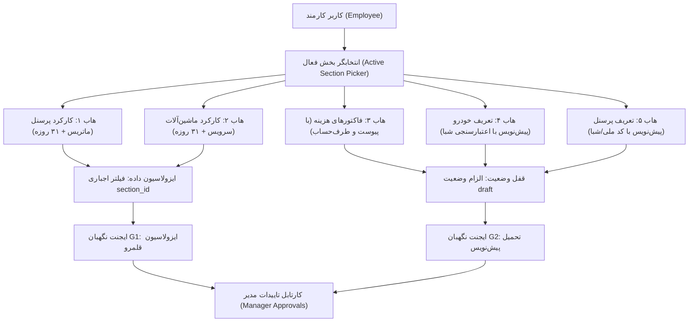

# طرح جامع مهندسی انتقال ماژولار کارکرد، ناوگان و فاکتورها به زیرمنوهای اختصاصی کارمند
## (Employee Portal Modular Migration Architecture & Engineering Blueprint)

---

> [!NOTE]
> **شناسه سند:** `DOC-ARCH-EMP-001`  
> **دامنه:** ماژول حسابداری و پرسنلی (`/app/finance/...`)  
> **هدف:** تفکیک و کپی تمیز ماژول‌های بهینه‌سازی‌شده صفحه حضور و غیاب (`/app/finance/attendance`) به ۵ زیرمنوی مستقل پنل کارمند بدون هیچ‌گونه دستکاری یا پس‌رفت در کدهای مبدا.

---

## ۱. مقدمه و چرایی معماری (Architectural Rationale)

در مراحل پیشین، صفحه کارکرد و حضور و غیاب سازمانی (`WarehouseAttendance`) به عنوان یکی از غنی‌ترین و حساس‌ترین صفحات سامانه، مجهز به ویژگی‌های زیر گردید و تمامی نقایص عملکردی آن برطرف شد:
- **ارگونومی پیشرفته کیبورد (Keyboard Navigation):** پیمایش سریع با کلیدهای جهت‌نما، اینتر و تاگل‌های وضعیت.
- **موتور حضور و غیاب روزانه و تقویم ۳۱ روزه ماهانه:** پشتیبانی از قانون پایه ۱۰ ساعت کارکرد، اضافه‌کاری، ماموریت و جمعه‌کاری.
- **موتور ثبت و ممیزی تردد ناوگان و ماشین‌آلات:** جدول ماتریسی روزانه و تقویم ۳۱ روزه ثبت سرویس‌ها.
- **ابزارهای پیشرفته تبادل داده:** پیست هوشمند اکسل، خروجی‌های دوطرفه، پرینت استاندارد و ممیزی ناهماهنگی‌ها.

با تصمیم هوشمندانه اتخاذشده، مقرر شد به جای متراکم کردن این همه قابلیت در یک صفحه ۵ تبی، **هر بخش دارای یک زیرمنوی مستقل، اختصاصی و سبک در سایدبار (منوی ثبت کارمند)** باشد تا کارمند کارگاه در محیطی خلوت، فوکوس‌شده و ایزوله تنها عملیات مرتبط با بخش خود را به انجام رساند.

---

## ۲. کالبدشکافی عمیق قطعات صفحه مبدا (`WarehouseAttendance`)

صفحه مبدا [warehouse-attendance.ts](file:///e:/warehouse%20project/warehouse-front/src/app/components/personnel/warehouse-attendance/warehouse-attendance.ts) شامل دو هسته بزرگ است:

### ۲.۱. هسته کارکرد پرسنل (`mainSectionTab === 'personnel'`)
1. **ماتریس روزانه (`daily`):**
   - متغیرهای کلیدی: `attendanceRows`، `filteredAttendanceRows`، `selectedDateShamsi`.
   - قابلیت‌ها: دکمه‌های تاگل وضعیت (حاضر ۱۰ ساعته، نیمه‌وقت ۵ ساعته، مرخصی، غایب، ماموریت، جمعه‌کاری)، ثبت سریع اضافه‌کاری و مساعده، انتخاب دسته‌ای سطرها.
   - مودال‌ها: مودال اعمال دسته‌ای ساعات (`isBulkHoursModalOpen`)، پیست هوشمند اکسل (`isExcelPasteModalOpen`).
2. **تقویم ۳۱ روزه ماهانه (`monthly_grid`):**
   - متغیرهای کلیدی: `monthlyGridRows`، `monthlyGridDays`، `selectedYearMonth`.
   - قابلیت‌ها: جدول ۳۱ روزه با نمایش نماد وضعیت و ساعات هر روز، پرینت ماهانه (`isPrintModalOpen`)، رهگیری ناهماهنگی‌ها (`anomalies`).
   - مودال‌ها: مودال جزییات روز پرسنل (`isDayDetailModalOpen`)، مودال بازه تاریخی ماهانه (`isRangeModalOpen`).

### ۲.۲. هسته کارکرد و مدیریت ناوگان (`mainSectionTab === 'fleet'`)
1. **ماتریس روزانه ناوگان (`daily`):**
   - متغیرهای کلیدی: `vehicleRows`، `displayedVehicleRows`.
   - قابلیت‌ها: ثبت تعداد سرویس روزانه، نرخ واحد سرویس، شماره حواله دیسپچ، مبدا و مقصد، فیلتر فعال/غیرفعال.
   - مودال‌ها: پیست هوشمند اکسل ناوگان (`isFleetExcelPasteModalOpen`).
2. **تقویم ۳۱ روزه ماهانه ناوگان (`monthly_grid`):**
   - متغیرهای کلیدی: `fleetMonthlyGridRows`، `displayedFleetMonthlyGridRows`.
   - قابلیت‌ها: جدول ۳۱ روزه تردد هر خودرو، چاپ خلاصه کارکرد ماهانه (`isFleetPrintModalOpen`).
   - مودال‌ها: مودال جزییات سرویس روز خودرو (`isFleetDayDetailModalOpen`)، تاریخچه و لاگ ترددها (`isFleetAuditLogsModalOpen`).
3. **مدیریت پرونده ناوگان:**
   - مودال ثبت و ویرایش مشخصات راننده و خودرو (`isVehicleProfileModalOpen`) همراه با اعتبارسنجی الگوریتم شبا (`validateSheba`) و بانک‌های ایران.

---

## ۳. ماتریس نگاشت تفصیلی قطعات مبدا به ۵ زیرمنوی کارمند

| ردیف | زیرمنوی مقصد در پنل کارمند | مسیر روتینگ | قطعات و متدهای کپی‌شونده از `attendance` | نقش و عملکرد در صفحه مقصد |
| :---: | :--- | :--- | :--- | :--- |
| **۱** | **📋 کارکرد پرسنل** | `/app/finance/employee-attendance` | • ماتریس روزانه کارکرد (`attendanceRows`) • تقویم ۳۱ روزه ماهانه (`monthlyGridRows`) • مودال جزییات روز (`isDayDetailModalOpen`) • مودال اعمال دسته‌ای (`isBulkHoursModalOpen`) • مودال بازه تاریخی (`isRangeModalOpen`) • پیست هوشمند اکسل پرسنل • چاپ تایم‌شیت استاندارد | ثبت و پایش روزانه و ماهانه ساعات حضور، اضافه‌کاری و وضعیت همکاران کارگاه با فیلتر خودکار بخش فعال |
| **۲** | **🚚 کارکرد ماشین‌آلات** | `/app/finance/employee-fleet` | • ماتریس روزانه ناوگان (`vehicleRows`) • تقویم ۳۱ روزه ناوگان (`fleetMonthlyGridRows`) • مودال جزییات سرویس (`isFleetDayDetailModalOpen`) • پیست اکسل ناوگان (`isFleetExcelPasteModalOpen`) • چاپ ماهانه تردد ماشین‌آلات • لاگ ممیزی ترددها (`isFleetAuditLogsModalOpen`) | ثبت تعداد سرویس‌های روزانه، حواله‌های دیسپچ، مبدا-مقصد و محاسبات ریالی کارکرد ناوگان بخش |
| **۳** | **🧾 ثبت فاکتور هزینه** | `/app/finance/employee-invoices` | • مدل و سرویس‌های `ExpenseInvoice` و `Counterparty` • فرم ثبت سند هزینه با تاریخ شمسی و مبلغ • آپلود تصویر پیوست فاکتور • مودال تعریف سریع طرف‌حساب (`QuickCounterpartyModal`) | ثبت فاکتورهای هزینه‌ای کارگاه با وضعیت تضمین‌شده `draft` و امکان ایجاد بلادرنگ طرف‌حساب‌های جدید |
| **۴** | **🚗 تعریف خودرو جدید** | `/app/finance/employee-new-vehicle` | • فرم پروفایل خودرو و راننده (`selectedVehicleProfile`) • موتور اعتبارسنجی آنلاین شبا (`validateSheba`) • دیکشنری بانک‌های ایران (`IRANIAN_BANKS`) • جدول سوابق خودروهای ثبت‌شده | تعریف خودروها و رانندگان جدید کارگاه با انتساب به بخش و ثبت به عنوان پیش‌نویس جهت تایید مدیر |
| **۵** | **👥 تعریف پرسنل جدید** | `/app/finance/employee-new-personnel` | • فرم مشخصات هویتی و پرسنلی (`PersonnelProfile`) • اعتبارسنجی الگوریتم ۱۰ رقمی کد ملی • فیلد شبا و شماره حساب بانکی • جدول سوابق پرسنل ثبت‌شده | معرفی نیروهای کارگری یا فنی جدید در کارگاه جهت ارسال به کارتابل تاییدات مدیر سیستم |

---

## ۴. اصول راهبردی و ایجنت‌های نگهبان سخت‌گیر (Architectural Guardrails)

### ۴.۱. نگهبان G1: ایزولاسیون قلمرو بخش (Data Isolation Guardian)
> [!IMPORTANT]
> در تمامی کوئری‌های واکشی پرسنل، ناوگان، کارکرد و فاکتورها، پارامتر `section_id` باید به صورت اجباری به اندپوینت‌های بک‌اند ارسال گردد. کارمند تحت هیچ شرایطی نباید قادر به مشاهده یا تغییر اطلاعات بخش‌های غیرمجاز باشد.

### ۴.۲. نگهبان G2: تحمیل وضعیت پیش‌نویس (Enforced Draft Invariant)
> [!CAUTION]
> در زیرمنوهای ۳، ۴ و ۵، هیچ رکوردی نباید مستقیماً به حالت فعال (`is_active=True`) یا تاییدشده (`approved`) ثبت شود. کلیه ثبت‌های اولیه کارمند به صورت قطعی در وضعیت `draft` ذخیره می‌شوند تا پس از بازبینی در کارتابل تاییدات مدیر (`ManagerApprovals`) فعال گردند.

### ۴.۳. نگهبان G3: مصونیت کدهای مبدا (Zero-Regression Guardian)
> [!WARNING]
> فایل [warehouse-attendance.ts](file:///e:/warehouse%20project/warehouse-front/src/app/components/personnel/warehouse-attendance/warehouse-attendance.ts) به عنوان ستون فقرات کارکرد پرسنل سازمان نباید دستخوش تغییرات مخرب یا حذف کد شود. فرآیند انتقال به صورت پیوند ماژولار مستقل انجام می‌پذیرد.

### ۴.۴. نگهبان G4: انطباق محاسباتی تیرماه و تقویم شمسی (Personnel & Payroll Invariant)
- روزهای کاری استاندارد دارای پایه ۱۰ ساعت هستند.
- در وضعیت‌های مرخصی (`LEAVE`) و غیبت (`ABSENT`)، ساعت موثر و اضافه‌کاری باید اکیداً صفر باشند.
- جمعه‌ها و تعطیلات رسمی نباید به عنوان صفر ساعت ثبت شوند (جمعه‌کاری ۱۰ ساعت با اضافه‌کاری قانونی محاسبه می‌گردد).

### ۴.۵. نگهبان G5: سلامت بیلد و عاری بودن از خطای تایپ‌اسکریپت (Build & Type-Safety Guardian)
- کامپایل بدون خطا با خروجی صفر در دستورات `npx tsc --noEmit` و `npx ng build`.

---

## ۵. برنامه‌ریزی فازهای اجرایی (Implementation Phasing)

- **فاز ۱:** پیاده‌سازی کامل موتور کارکرد روزانه و ماهانه پرسنل در [employee-attendance.ts](file:///e:/warehouse%20project/warehouse-front/src/app/components/finance/employee/employee-attendance/employee-attendance.ts).
- **فاز ۲:** پیاده‌سازی کامل موتور کارکرد روزانه و ماهانه ناوگان در [employee-fleet.ts](file:///e:/warehouse%20project/warehouse-front/src/app/components/finance/employee/employee-fleet/employee-fleet.ts).
- **فاز ۳:** استقرار کارتابل و فرم ثبت فاکتور هزینه و طرف‌حساب‌ها در [employee-invoices.ts](file:///e:/warehouse%20project/warehouse-front/src/app/components/finance/employee/employee-invoices/employee-invoices.ts).
- **فاز ۴:** استقرار فرم استاندارد تعریف خودرو با اعتبارسنجی شبا در [employee-new-vehicle.ts](file:///e:/warehouse%20project/warehouse-front/src/app/components/finance/employee/employee-new-vehicle/employee-new-vehicle.ts).
- **فاز ۵:** استقرار فرم استاندارد تعریف پرسنل با اعتبارسنجی کد ملی در [employee-new-personnel.ts](file:///e:/warehouse%20project/warehouse-front/src/app/components/finance/employee/employee-new-personnel/employee-new-personnel.ts).
- **فاز ۶:** راستی‌آزمایی جامع با ایجنت‌های نگهبان، تست‌های تایپ‌اسکریپت و بیلد نهایی پروداکشن.

