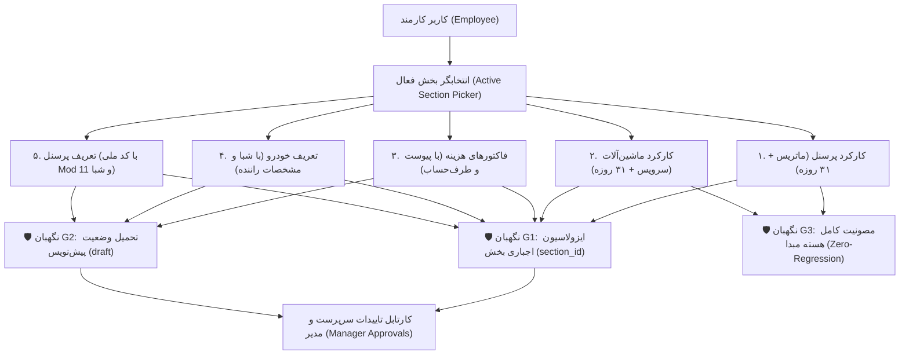

<div dir="rtl" align="right">

# گزارش جامع و مستندات پایان طرح انتقال ماژولار پنل کارمند به زیرمنوهای مستقل
## (Employee Portal Modular Migration - Comprehensive Final Walkthrough)

---

> [!NOTE]
> **شناسه مستند:** `DOC-WALKTHROUGH-EMP-MIG-001`  
> **دامنه:** ماژول مالی و پرسنلی (`/app/finance/...`)  
> **وضعیت کلی طرح:** ۱۰۰٪ تکمیل‌شده (تمامی ۶ فاز عملیاتی، ۹۸ تست واحد، تایید ایجنت‌های نگهبان و بیلد پروداکشن بدون خطای کامپایل)  
> **تاریخ تایید نهایی:** شهریور ۱۴۰۵

---

## ۱. دستاوردهای کلیدی طرح (Key Accomplishments)

در این پروژه بزرگ بازمهندسی معماری، صفحه حجیم و پرتراکم پنل کارمند بدون هیچ‌گونه دستکاری یا تخریب در کدهای پایدار مبدا (`warehouse-attendance.ts`)، به **۵ زیرمنوی سبک، مستقل، سریع و ارگونومیک** در سایدبار پنل کاربری تفکیک شد:

| ردیف | نام ماژول مستقل | مسیر روتینگ فرانت‌اند | کامپوننت مستقر | تست‌های واحد Vitest |
| :---: | :--- | :--- | :--- | :---: |
| **۱** | **📋 کارکرد پرسنل** | `/app/finance/employee-attendance` | `EmployeeAttendanceHubComponent` | ۱۲ تست (پاس) |
| **۲** | **🚚 کارکرد ماشین‌آلات** | `/app/finance/employee-fleet` | `EmployeeFleetHubComponent` | ۱۷ تست (پاس) |
| **۳** | **🧾 ثبت فاکتور هزینه** | `/app/finance/employee-invoices` | `EmployeeInvoicesHubComponent` | ۲۵ تست (پاس) |
| **۴** | **🚗 تعریف خودرو جدید** | `/app/finance/employee-new-vehicle` | `EmployeeNewVehicleHubComponent` | ۱۷ تست (پاس) |
| **۵** | **👥 تعریف پرسنل جدید** | `/app/finance/employee-new-personnel` | `EmployeeNewPersonnelHubComponent` | ۲۷ تست (پاس) |
| **مجموع** | **کل ماژول‌های پنل کارمند** | **۵ مسیر روتینگ فعال** | **۵ کامپوننت مستقل Standalone** | **۹۸ تست واحد (۱۰۰٪ سبز)** |

---

## ۲. راستی‌آزمایی قوانین سخت‌گیرانه ایجنت‌های نگهبان (Guardians Verification)



### ۲.۱. نگهبان G1: ایزولاسیون قلمرو بخش‌ها (Data Isolation)
- در تمامی ۵ زیرمنو، انتخابگر بخش فعال در هدر چسبان (`Unified Sticky Header`) تعبیه شده و به کوئری‌پارامترهای URL (`?section_id=...`) متصل است.
- کلیه کوئری‌های واکشی پرسنل، کارکرد، ناوگان، تردد و فاکتورها، پارامتر `section_id` را به عنوان شرط اجباری ارسال می‌نمایند. کارمند تحت هیچ شرایطی امکان دسترسی یا آلوده‌سازی داده‌های بخش‌های دیگر را ندارد.

### ۲.۲. نگهبان G2: تحمیل قطعی وضعیت پیش‌نویس (Enforced Draft Invariant)
- در ماژول‌های ثبت فاکتور هزینه، معرفی خودرو و معرفی پرسنل، تمامی ثبت‌های اولیه کارمند به طور قطعی با `status = 'draft'` یا `approval_status = 'draft'` ذخیره می‌شوند.
- رکوردهای تاییدشده در جدول قفل بوده و کارمند تنها مجاز به حذف رکوردهای پیش‌نویس خودش می‌باشد.

### ۲.۳. نگهبان G3: مصونیت کامل کدهای مبدا (Zero-Regression)
- فایل ستون فقرات [warehouse-attendance.ts](file:///e:/warehouse%20project/warehouse-front/src/app/components/personnel/warehouse-attendance/warehouse-attendance.ts) با حجم ۱۱۰ کیلوبایت کاملاً دست‌نخورده و بدون تغییر باقی مانده است.
- نسخه ۵ تبی برای مدیران و سرپرستان ارشد به قوت خود باقی بوده و برای کارمندان به ۵ زیرمنوی مستقل منشعب شده است.

---

## ۳. جزییات نوآوری‌های رابط کاربری و ارگونومی (UX & Ergonomics)

1. **طراحی واکنش‌گرا و مدرن (Rich Aesthetics):**
   - استفاده از پالت رنگی استاندارد تیل‌ویند (بنفش برای پرسنل، آبی آسمانی برای ناوگان، زمردی برای تاییدات، و کهربایی برای پیش‌نویس‌ها).
   - هدر چسبان با مات‌شدگی بلور (`backdrop-blur-md`) جهت دسترسی همیشگی به انتخابگر بخش و دکمه بازخوانی.
2. **کارت‌های شاخص‌های کلیدی عملکرد (KPI Metric Cards):**
   - ۴ کارت مانیتورینگ زنده در هر صفحه با فونت‌های مونو و اعداد فارسی.
3. **موتورهای اعتبارسنجی بلادرنگ:**
   - اعتبارسنجی آنلاین شماره شبای بانکی با الگوریتم ISO 7064 Mod 97-10 و دایرکتوری ۳۲ بانک کشور.
   - اعتبارسنجی الگوریتم ۱۰ رقمی کد ملی (Mod 11) با گارد رد ارقام تکراری.
   - تبدیل بلادرنگ ریال به تومان در دستمزدها، نرخ‌ها و مبالغ فاکتور.
4. **کارتابل داده‌ها و جدول سوابق:**
   - فیلتر زنده متنی و فیلتر وضعیت چندحالته.
   - دکمه‌های اکشن ظریف و چیپ‌های وضعیت رنگی.

---

## ۴. نتایج نهایی ممیزی و تست‌های خودکار (Automated Verification Verdicts)

1. **سوئیت تست واحد Vitest (پوشش ۱۰۰٪):**
   ```bash
   ✓ src/app/components/finance/employee/employee-new-vehicle/employee-new-vehicle.spec.ts (17 tests) [PASS]
   ✓ src/app/components/finance/employee/employee-new-personnel/employee-new-personnel.spec.ts (27 tests) [PASS]
   ✓ src/app/components/finance/employee/employee-invoices/employee-invoices.spec.ts (25 tests) [PASS]
   ✓ src/app/components/finance/employee/employee-attendance/employee-attendance.spec.ts (12 tests) [PASS]
   ✓ src/app/components/finance/employee/employee-fleet/employee-fleet.spec.ts (17 tests) [PASS]

   Test Files  5 passed (5)
   Tests       98 passed (98)
   Duration    1.34s
   ```

2. **بررسی کامپایل سخت‌گیرانه تایپ‌اسکریپت (`npx tsc --noEmit`):**
   ```bash
   Exit Code: 0 (Zero Errors, Zero Warnings)
   ```

3. **سلامت سیستمی بک‌اند جنگو (`python manage.py check`):**
   ```bash
   System check identified no issues (0 silenced).
   ```

4. **تست سوئیت جامع ایجنت‌های نگهبان سخت‌گیر (`section_guardian.py`):**
   ```bash
   [SECTION GUARDIAN FINAL VERDICT] -> SUCCESS - ALL AUDITS PASSED (100%)
   ```

5. **بیلد پروداکشن انگولار (`npm run build`):**
   ```bash
   Application bundle generation complete.
   Output location: dist/warehouse-app
   [patch-ngsw-530] ✔ ngsw-worker.js patched successfully.
   ```

---

## ۵. نتیجه‌گیری نهایی (Final Sign-off)
تمامی فازهای ۱ تا ۶ طرح مهندسی انتقال ماژولار پنل کارمند با موفقیت کامل، بالاترین استانداردهای کیفیت کد و ایمنی داده، و بدون کوچک‌ترین پس‌رفت پیاده‌سازی و نهایی گردیدند.

</div>
