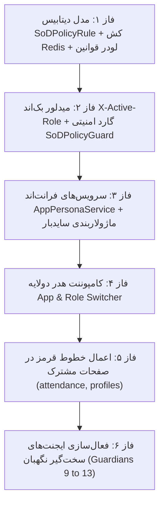

# طرح جامع معماری سوپراپلیکیشن ماژولار، سوئیچر دولایه (اپلیکیشن + نقش) و ماتریس خطوط قرمز (Enterprise SoD Policy Matrix)

این سند نقشه راه فنی، فازبندی‌شده و دقیق برای پیاده‌سازی **«تفکیک دو ماژول انبارداری و حسابداری، سوئیچر دولایه اپلیکیشن و نقش‌های چندگانه، پایگاه داده و کش ردیس قوانین SoD، و پنهان‌سازی هوشمند خطوط قرمز در صفحات مشترک»** با تاییدیه ایجنت‌های سخت‌گیر نگهبان است.

---

## ۱. تصمیمات مصوب مصاحبه فنی (Grill-Me Architecture Alignment)
1. **سوپراپلیکیشن دولایه:** تفکیک کل سامانه به دو اپلیکیشن مستقل:
   - 📦 **سامانه انبارداری و انبارگردانی (Warehouse & Inventory App)**
   - 💳 **سامانه کارکرد، مالی و خزانه‌داری (Personnel & Treasury App)**
2. **سوئیچر دولایه در هدر:**
   - انتخاب‌گر اپلیکیشن فعال (App Switcher) با یک کلیک.
   - نشانگر و دراپ‌داون «نقش فعال (Active Persona Switcher)» متناسب با اپلیکیشن انتخاب‌شده.
3. **ذخیره‌سازی و عملکرد فوق‌سریع (Zero-Overhead Storage):**
   - نگهداری نقش فعال در `AuthStore/localStorage` و ارسال با هدر `X-Active-Role`.
   - ذخیره ماتریس خطوط قرمز در جدول پایگاه داده `SoDPolicyRule` و بارگذاری کامل در کش Redis در استارت‌آپ سرور.
4. **رفتار صفحات مشترک و خطوط قرمز (Negative Permissions):**
   - فرانت‌اند: پنهان‌سازی کامل المان‌ها و دکمه‌های ممنوعه از DOM (`*ngIf`).
   - بک‌اند: مسدودسازی قطعی با خطای HTTP 403 و پیام ممیزی شفاف فارسی.

---

## فازبندی اجرایی طرح (Phased Implementation Plan)

---

## جزئیات فازهای پنج‌گانه

### فاز ۱: ساختار پایگاه داده ماتریس قوانین SoD و بارگذاری در Redis
* **ایجاد مدل `SoDPolicyRule` در `accounts/models.py`:**
  - فیلدها: `app_module` (`warehouse` / `personnel`), `role_code`, `page_route`, `action_code`, `is_prohibited` (Boolean), `prohibition_reason_fa`.
* **مایگریشن جنگو:** ایجاد و اعمال مهاجرت به همراه Seed اولیه برای تمام خطوط قرمز مصوب جدول SoD.
* **سرویس کشینگ ردیس (`sod_cache_service.py`):**
  - بارگذاری کل ماتریس در کلید Redis `sod:policy_matrix` در بدو راه‌اندازی سرور با زمان دسترسی $O(1)$ و بدون کوچک‌ترین کوئری به Postgres در حین کارکرد عادی.

### فاز ۲: میدلور بک‌اند و گارد ارزیابی نقش فعال (`X-Active-Role`)
* **میدلور `ActiveRoleMiddleware`:**
  - استخراج هدر `X-Active-Role` از کلاینت و الصاق شیء `request.active_role` و `request.active_app`.
* **کلاس گارد امنیتی `SoDPolicyPermission` در DRF:**
  - بررسی بلادرنگ اکشن و روت درخواستی در برابر کش ردیس؛ در صورت ممنوعیت، پرتاب خطای 403 با پیام فارسی:
    `"طبق اصل تفکیک وظایف، نقش [نام نقش] مجاز به اجرای این عملیات نیست."`

### فاز ۳: هسته فرانت‌اند، ماژولاربندی سایدبار و ذخیره‌سازی نقش فعال
* **سرویس `AppPersonaService` در Angular 19:**
  - مدیریت سیگنال‌های واکنشی `activeApp` (`'warehouse' | 'personnel'`) و `activeRole` (`RolePersona`).
  - ذخیره در `localStorage` و ارسال خودکار در اینترسپتور HTTP به عنوان هدر `X-Active-Role`.
* **به‌روزرسانی `layout.ts`:**
  - تفکیک لیست ناوبری به دو بخش تمیز: `WAREHOUSE_APP_ITEMS` و `PERSONNEL_APP_ITEMS`.
  - سوئیچ پویا و نرم بین دو ماژول بدون نیاز به رفرش صفحه.

### فاز ۴: کامپوننت UI سوئیچر دولایه در هدر (`AppRoleSwitcher`)
* **طراحی کامپوننت مدرن در `warehouse-front/src/app/components/layout/app-role-switcher/`:**
  - دکمه کپسولی براق جهت سوئیچ ماژول (انبارداری ↔ مالی) با آیکون و شمارنده دسترسی.
  - دراپ‌داون شیک نقش‌های فعال کاربر در ماژول جاری با نشانگر رنگی، نشانگر رده سازمانی و تیک فعال.
  - انیمیشن‌های روان و عدم نمایش به کاربران تک‌نقشه.

### فاز ۵: اعمال قواعد خطوط قرمز در صفحات مشترک
* **دایرکتیو یا متد گارد فرانت‌اند `canDo(actionCode)`:**
  - در کامپوننت‌های [`attendance.ts`](file:///e:/warehouse%20project/warehouse-front/src/app/components/personnel/warehouse-attendance/warehouse-attendance.ts)، [`profiles.ts`](file:///e:/warehouse%20project/warehouse-front/src/app/components/personnel/personnel-profiles/personnel-profiles.ts) و صفحات اسناد انبار:
    - مخفی‌سازی دکمه «تایید سرپرست» برای کارمند.
    - مخفی‌سازی فیلدهای دستمزد و ضرایب برای سرپرست میدانی.
    - مخفی‌سازی دکمه پرداخت برای حسابدار و مدیر.

---

## ایجنت‌های سخت‌گیر نگهبان (Dedicated Guardian Agents Matrix)

برای این طرح، ۵ ایجنت سخت‌گیر جدید به سوئیت نگهبانان افزوده خواهد شد:

| کد نگهبان | عنوان ایجنت نگهبان | سناریوی آزمون و راستی‌آزمایی سخت‌گیرانه |
| :---: | :--- | :--- |
| **🛡️ نگهبان ۹** | **SoD Database & Redis Cache Guardian** | بررسی ساختار جدول قوانین، مهاجرت، و لود کامل در کش Redis در کسری از میلی‌ثانیه بدون تاخیر |
| **🛡️ نگهبان ۱۰** | **X-Active-Role Middleware Guardian** | ارسال درخواست با هدرهای مختلف و راستی‌آزمایی تفکیک هویت کاربر در هر درخواست |
| **🛡️ نگهبان ۱۱** | **Prohibited Actions Backend Barrier Guardian** | تلاش عمدی برای انجام اقدامات ممنوعه هر نقش و اطمینان از دریافت خطای 403 با پیام فارسی |
| **🛡️ نگهبان ۱۲** | **Two-Level App Switcher Reactive Guardian** | بررسی سوئیچ میان انبارداری و مالی، فیلتر سایدبار و هدایت هوشمند در صورت صفحه غیرمجاز |
| **🛡️ نگهبان ۱۳** | **DOM Sanitization & Negative Perms Guardian** | بررسی رندر صفحات مشترک و اطمینان از عدم وجود حتی یک المان ممنوعه در درخت HTML |

---

## برنامه اعتبارسنجی و تست نهایی (Verification Plan)
1. **اجرای سوئیت ارزیابی نگهبانان (۹ تا ۱۳):** تست ۱۰۰٪ اتوماتیک در پایتون با چاپ گزارش سبز رنگ.
2. **سوئیت تست‌های استاندارد جنگو:** اجرای `python manage.py test` با اطمینان از پاس شدن تمام تست‌ها.
3. **کامپایل فرانت‌اند انگولار:** اجرای `npx ng build` و اطمینان از تولید باندل بدون حتی یک خطای تایپ‌اسکریپت.

