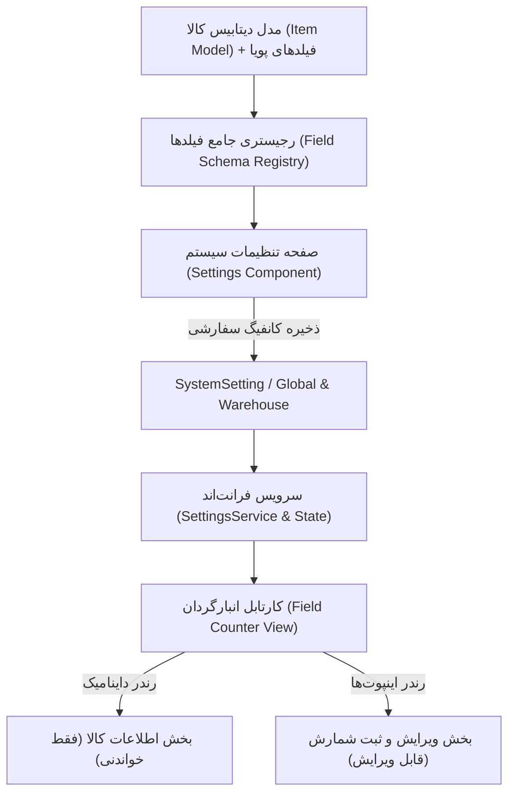

# طرح جامع سفارشی‌سازی فیلدهای کارتابل انبارگردان در تنظیمات سیستم

این طرح فنی، معماری و پیاده‌سازی کامل امکان **مدیریت داینامیک فیلدهای قابل نمایش و ویرایش برای انبارگردان** در صفحه تنظیمات سیستم را شرح می‌دهد؛ به طوری که تمام فیلدهای جدول کالا (`Item`) به همراه فیلدهای پویا پشتیبانی شوند، عناوین نمایشی سفارشی‌سازی گردند، و مقادیر پیش‌فرض فعلی بدون هیچ ریسکی حفظ شوند.

---

## 🎯 اهداف اصلی طرح (Core Objectives)

1. **پوشش ۱۰۰٪ فیلدهای جدول کالا:** امکان انتخاب هر کدام از ستون‌های مدل `Item` و فیلدهای پویای تعریف‌شده در انبار.
2. **حفظ رفتار و پیش‌فرض‌های فعلی سیستم (Default Preservation):** سیستم در حالت صفر (بدون دستکاری کاربر) دقیقاً مثل امروز کار می‌کند و هیچ وابستگی شکستنی نخواهد داشت.
3. **نام‌گذاری منعطف (Dynamic & Custom Labeling):**
   - نام ستون در دیتابیس به صورت پیش‌فرض درج می‌شود (`Default Label from Model / Column`).
   - کاربر می‌تواند نام نمایشی را به دلخواه خود در تنظیمات تغییر دهد (`Custom Display Label`).
   - دکمه بازنشانی نام به عنوان پیش‌فرض ستون در جدول وجود خواهد داشت.
4. **کنترل دو سطحی دسترسی:**
   - **قابل نمایش (Visible):** آیا انبارگردان این فیلد را در فرم/کارت کارتابل خود ببیند؟
   - **قابل ویرایش (Editable):** آیا انبارگردان اجازه ورود و تغییر مقدار این فیلد را دارد؟

---

## 🏗 معماری فنی و ساختار داده‌ها (Technical Architecture)

---

## 📑 دسته‌بندی و رجیستری فیلدهای جدول کالا (`ITEM_FIELD_REGISTRY`)

| ردیف | نام سیستمی فیلد | عنوان پیش‌فرض ستون در دیتابیس | دسته‌بندی | نوع داده | وضعیت پیش‌فرض نمایش | وضعیت پیش‌فرض ویرایش |
| :---: | :--- | :--- | :---: | :---: | :---: | :---: |
| ۱ | `fa_unic_code` | کد یکتا (FA-UNIC) | شناسه‌ها و کدها | متنی | ✅ بله | ❌ فقط خواندنی |
| ۲ | `description` | شرح کالا | مشخصات کالا | چندخطی | ✅ بله | ❌ فقط خواندنی |
| ۳ | `new_location` | لوکیشن انبار | مکان و انبارداری | متنی | ✅ بله | ❌ فقط خواندنی |
| ۴ | `counted_qty` | تعداد شمارش شده | موجودی و شمارش | عددی | ✅ بله | ✅ قابل ویرایش |
| ۵ | `counter_note` | توضیحات انبارگردان | موجودی و شمارش | چندخطی | ✅ بله | ✅ قابل ویرایش |
| ۶ | `inventory` | موجودی سیستمی | موجودی و شمارش | عددی | 🔒 وابسته به شمارش کور | ❌ فقط خواندنی |
| ۷ | `tag` | شماره تگ کالا | شناسه‌ها و کدها | متنی | ❌ خیر | ❌ فقط خواندنی |
| ۸ | `pl` | پکینگ لیست (PL) | بازرگانی و خرید | متنی | ❌ خیر | ❌ فقط خواندنی |
| ۹ | `po` | سفارش خرید (PO) | بازرگانی و خرید | متنی | ❌ خیر | ❌ فقط خواندنی |
| ۱۰ | `pk_number` | پکیج (PK) | شناسه‌ها و کدها | متنی | ❌ خیر | ❌ فقط خواندنی |
| ۱۱ | `size` | سایز اصلی | مشخصات کالا | متنی | ❌ خیر | ❌ فقط خواندنی |
| ۱۲ | `unit` | واحد سنجش | مشخصات کالا | متنی | ❌ خیر | ❌ فقط خواندنی |
| ۱۳ | `scope_discipline` | دیسیپلین کاری | مشخصات کالا | متنی | ❌ خیر | ❌ فقط خواندنی |
| ۱۴ | `bal4miv` | موجودی مجاز MIV | موجودی و شمارش | عددی | ❌ خیر | ❌ فقط خواندنی |
| ۱۵ | `vendor` | سازنده (Vendor) | بازرگانی و خرید | متنی | ❌ خیر | ❌ فقط خواندنی |
| ۱۶ | `supplier` | تامین‌کننده (Supplier) | بازرگانی و خرید | متنی | ❌ خیر | ❌ فقط خواندنی |
| ۱۷ | `price_amount` | قیمت واحد (UnitPrice) | اسناد و مالی | عددی | ❌ خیر | ❌ فقط خواندنی |
| ۱۸ | `total_value` | ارزش کل | اسناد و مالی | عددی | ❌ خیر | ❌ فقط خواندنی |
| ۱۹ | `currency` | ارز | اسناد و مالی | متنی | ❌ خیر | ❌ فقط خواندنی |
| ۲۰ | `hov_no` | شماره HOV | بازرگانی و خرید | متنی | ❌ خیر | ❌ فقط خواندنی |
| ۲۱ | `hov_date` | تاریخ HOV | بازرگانی و خرید | تاریخ | ❌ خیر | ❌ فقط خواندنی |
| ۲۲ | `msr_status` | وضعیت MSR | بازرگانی و خرید | متنی | ❌ خیر | ❌ فقط خواندنی |
| ۲۳ | `irn_no` | شماره IRN | بازرگانی و خرید | متنی | ❌ خیر | ❌ فقط خواندنی |
| ۲۴ | `indent` | تقاضای خرید (INDENT) | بازرگانی و خرید | متنی | ❌ خیر | ❌ فقط خواندنی |
| ۲۵ | `invoice_type` | نوع فاکتور | اسناد و مالی | متنی | ❌ خیر | ❌ فقط خواندنی |
| ۲۶ | `invoice_date` | تاریخ فاکتور | اسناد و مالی | متنی | ❌ خیر | ❌ فقط خواندنی |
| ۲۷ | `inv_rti_number` | شماره RTI فاکتور | اسناد و مالی | متنی | ❌ خیر | ❌ فقط خواندنی |
| ۲۸ | `folder_address` | مسیر پوشه اسناد | اسناد و مالی | متنی | ❌ خیر | ❌ فقط خواندنی |
| ۲۹ | `hyperlink` | هایپرلینک اسناد | اسناد و مالی | متنی | ❌ خیر | ❌ فقط خواندنی |
| ۳۰ | `remark` | ملاحظات | مشخصات کالا | چندخطی | ❌ خیر | ❌ فقط خواندنی |
| ۳۱ | `my_tag` | تگ‌ها | شناسه‌ها و کدها | متنی | ❌ خیر | ❌ فقط خواندنی |
| ۳۲ | `dynamic_fields` | فیلدهای پویای انبار | متغیرها | پویا | ❌ بر اساس تعریف | ❌ بر اساس تعریف |

---

## 🛠 تغییرات در فایل‌ها و لایه‌ها (Proposed Changes)

### ۱. بک‌اند (Backend)
#### `warehouse-backend/warehouses/services.py`
- افزودن رجیستری فیلدهای کالا (`ITEM_FIELD_REGISTRY`) و تنظیم کلید پیش‌فرض `field_permissions_counter` در `DEFAULT_SETTINGS`.
- ارائه یک اندپوینت برای واکشی فیلدهای استاندارد کالا و فیلدهای پویای فعال هر انبار.

#### `warehouse-backend/inventory/models.py` و `inventory/views.py`
- پشتیبانی از ذخیره مقادیر فیلدهای ویرایش‌شده اضافی توسط انبارگردان در تسک شمارش (`CountTask.custom_data` یا مقادیر اختصاصی) جهت بررسی سرپرست.

---

### ۲. فرانت‌اند (Frontend)
#### `warehouse-front/src/app/core/models/field-config.model.ts` [NEW]
- تعریف تایپ‌های TypeScript برای ساختار فیلدها، دسته‌بندی‌ها و تنظیمات نمایش/ویرایش.

#### `warehouse-front/src/app/components/settings/settings.html` و `settings.ts` [MODIFY]
- افزودن یک تب اختصاصی به نام **«فیلدهای انبارگردان» (Counter Fields)** در کنار تب‌های عملیات، لیبل و بک‌آپ.
- پیاده‌سازی جدول تنظیمات با قابلیت‌های:
  - فیلتر بر اساس دسته‌بندی (همه، اطلاعات پایه، موجودی، بازرگانی، اسناد و مالی، فیلدهای پویا).
  - جستجوی سریع نام فیلد.
  - اینپوت ویرایش نام نمایشی (`Custom Display Label`) با آیکون ریست به نام پیش‌فرض ستون.
  - چک‌باکس‌های «قابل نمایش» و «قابل ویرایش».
  - دکمه «بازنشانی به پیش‌فرض‌های کارخانه».

#### `warehouse-front/src/app/components/field/field.html` و `field.ts` [MODIFY]
- خواندن تنظیمات فیلدهای انبارگردان از سرویس تنظیمات.
- رندرینگ داینامیک فیلدهای فقط-خواندنی در کارت اطلاعات کالا با لیبل‌های تنظیم‌شده.
- رندرینگ داینامیک اینپوت‌های قابل ویرایش در فرم شمارش متناسب با نوع داده (عدد، متن، تاریخ، چندخطی).

---

## 🔍 برنامه تست و اعتبارسنجی (Verification Plan)

| مرحله تست | اقدام مورد نظر | نتیجه مورد انتظار |
| :--- | :--- | :--- |
| **تست پیش‌فرض** | باز کردن کارتابل انبارگردان بدون تغییر در تنظیمات | دقیقاً همان فیلدهای قبلی (کد، شرح، لوکیشن، تعداد شمارش و یادداشت) بدون هیچ تغییری نمایش داده می‌شوند. |
| **تست تغییر نام نمایشی** | تغییر نام فیلد «لوکیشن جدید» به «موقعیت قفسه در انبار» و ذخیره | در صفحه انبارگردان عنوان «موقعیت قفسه در انبار» با همان مقدار لوکیشن نمایش داده می‌شود. |
| **تست فعال‌سازی فیلد جدید** | فعال کردن فیلد «سازنده (Vendor)» در حالت نمایش | در کارت کالای انبارگردان فیلد سازنده با برچسب مشخص اضافه می‌شود. |
| **تست فعال‌سازی فیلد ویرایشی** | فعال کردن فیلد «شماره تگ کالا» در حالت ویرایش | در فرم شمارش انبارگردان، فیلد ورودی شماره تگ ظاهر شده و مقدار آن همراه با شمارش ثبت می‌گردد. |
| **تست بازنشانی به پیش‌فرض** | کلیک روی دکمه «بازنشانی به تنظیمات پیش‌فرض» در صفحه تنظیمات | تمام تیک‌ها و عناوین فوراً به حالت استاندارد اولیه سیستم بازمی‌گردند. |

