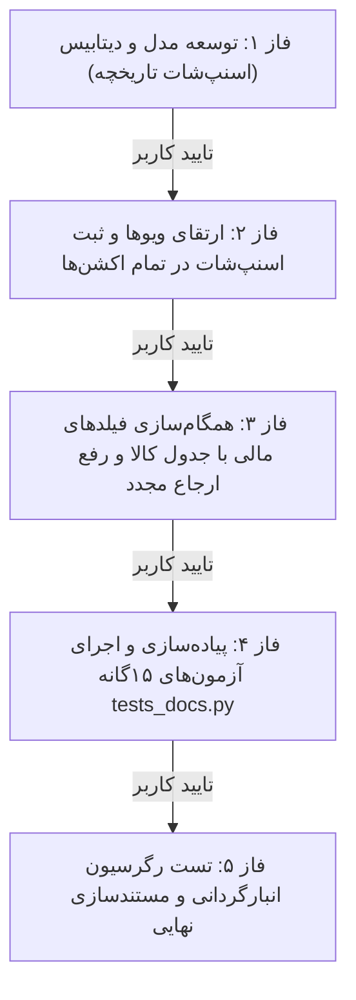

# 📋 طرح اجرایی فازبندی‌شده چرخه بک‌اند کارتابل مالی (Financial Cartable Backend Cycle)

این سند مراحل اجرایی را به **۵ فاز کاملاً مستقل و مجزا** با جزئیات کامل فنی و معیارهای راستی‌آزمایی تفکیک می‌کند. طبق دستور، **ورود به هر فاز صرفاً پس از اتمام و تایید فاز قبلی** انجام خواهد شد.

---

## 🗺️ ساختار فازهای اجرایی

---

## 📑 جزئیات کامل فازها و معیارهای پذیرش

### 🔹 فاز ۱: توسعه مدل، سریالایزر و دیتابیس (Model & Database Updates)
* **هدف:** ایجاد زیرساخت ذخیره اسنپ‌شات در مدل تاریخچه بدون دستکاری میگریشن‌های قبلی.
* **فایل‌های مشمول تغییر:**
  - [`inventory/models.py`](file:///e:/warehouse%20project/warehouse-backend/inventory/models.py): افزودن `data_snapshot = models.JSONField(null=True, blank=True)` به مدل `DocTaskHistory`.
  - [`inventory/serializers.py`](file:///e:/warehouse%20project/warehouse-backend/inventory/serializers.py): حصول اطمینان از سریالایز شدن `data_snapshot` در `DocTaskHistorySerializer`.
* **اقدامات اجرایی:**
  1. ویرایش مدل `DocTaskHistory`.
  2. اجرای `python manage.py makemigrations inventory` و تولید فایل میگریشن جدید.
  3. اعمال میگریشن به دیتابیس با `python manage.py migrate`.
* **معیار راستی‌آزمایی فاز ۱:** اجرای بدون خطای دستور `migrate` و بررسی دیتابیس.

---

### 🔹 فاز ۲: ارتقای منطق ویوها و ثبت اسنپ‌شات در چرخه کار (Views & Snapshot Logging)
* **هدف:** ثبت خودکار اسنپ‌شات کامل فیلدهای مالی در هر بار تغییر وضعیت تسک.
* **فایل‌های مشمول تغییر:**
  - [`inventory/views.py`](file:///e:/warehouse%20project/warehouse-backend/inventory/views.py)
* **اقدامات اجرایی:**
  1. پیاده‌سازی متد هلپر `_create_doc_task_snapshot(task)` برای استخراج مقادیر ۱۴ فیلد مالی و فیلدهای پویا.
  2. به‌روزرسانی متدهای تغییر وضعیت در `DocTaskViewSet` شامل:
     - `perform_update`
     - `bulk_submit`
     - `bulk_approve`
     - `reject`
     - `manager_reject`
     - `bulk_manager_approve`
* **معیار راستی‌آزمایی فاز ۲:** اعتبارسنجی ایجاد رکورد تاریخچه همراه با مقدار فیلد `data_snapshot` در هنگام تغییر وضعیت.

---

### 🔹 فاز ۳: همگام‌سازی فیلدها با جدول کالا و اصلاح ارجاع مجدد (Data Sync & Dispatch Fix)
* **هدف:** تضمین انتقال مقادیر تاییدشده مالی به مدل `Item` در مرحله تایید نهایی مدیر، و اصلاح هشدار ارجاع مجدد.
* **فایل‌های مشمول تغییر:**
  - [`inventory/views.py`](file:///e:/warehouse%20project/warehouse-backend/inventory/views.py)
* **اقدامات اجرایی:**
  1. در متد `bulk_manager_approve`: رونویسی مقادیر ۱۴ فیلد مالی (`price_amount`, `total_value`, `inv_rti_number`, `added_rti_no`, `invoice_type`, `invoice_date`, `currency`, `doc_supplier`, `folder_address`, `stamp`, `signature`, `page_row`, `invoice_page`, `similar_unit_price`) از `DocTask` روی رکورد `Item` متناظر.
  2. به‌روزرسانی وضعیت کالا به `Item.doc_status = 'approved'`.
  3. در متد `bulk_assign`: اصلاح شرط بررسی هشدار ارجاع مجدد اسناد برای وضعیت `doc_status == 'processing'`.
* **معیار راستی‌آزمایی فاز ۳:** تست عملیاتی متد `bulk_manager_approve` و راستی‌آزمایی انتقال داده‌ها به مدل `Item`.

---

### 🔹 فاز ۴: پیاده‌سازی و اجرای آزمون‌های ۱۵گانه کارتابل مالی (`tests_docs.py`)
* **هدف:** پیاده‌سازی و راستی‌آزمایی ۱۰۰٪ خودکار تمام ۱۵ سناریوی منطقی بک‌اند کارتابل مالی.
* **فایل‌های مشمول ایجاد:**
  - [`inventory/tests_docs.py`](file:///e:/warehouse%20project/warehouse-backend/inventory/tests_docs.py)
* **ماتریس ۱۵ آزمون خودکار:**
  1. `test_01_full_happy_path_with_supervisor`: چرخه استاندارد کامل و انتقال فیلدها به کالا.
  2. `test_02_unlimited_manager_rejects_and_corrections`: رد مکرر مدیر (۴ دور متوالی) بدون محدودیت و ثبت اسنپ‌شات هر دور.
  3. `test_03_direct_to_manager_skip_supervisor`: پرش از سرپرست با `skip_supervisor` یا تنظیم انبار.
  4. `test_04_pool_tasks_and_claim`: استخر عمومی تسک‌های مالی و ادعای تسک (`claim`) توسط کارشناس مالی.
  5. `test_05_manager_rejection_with_notes_and_snapshot`: رد مدیر همراه با یادداشت و ثبت دقیق اسنپ‌شات.
  6. `test_06_bulk_cancel_doc_tasks`: لغو دسته‌ای تسک‌های مالی و بازگشت وضعیت کالا.
  7. `test_07_doc_field_permissions_sync`: پایش تنظیمات دسترسی فیلدهای مالی در سطح سیستم و انبار.
  8. `test_08_dynamic_extra_fields_saving`: ثبت و ذخیره فیلدهای پویا در `dynamic_data` و تاریخچه.
  9. `test_09_concurrency_and_claim_conflict`: جلوگیری از تداخل Claim همزمان دو کارشناس.
  10. `test_10_redispatch_with_force_flag`: ارجاع مجدد تسک مالی با گزینه `force=True`.
  11. `test_11_financial_precision_and_zero_values`: دقت اعشاری تا ۲ رقم، مبالغ تا ۲۰ رقم و مقادیر صفر.
  12. `test_12_supervisor_pool_and_claim`: استخر سرپرستان مالی و Claim توسط سرپرست.
  13. `test_13_resolution_after_rejection`: تایید نهایی پس از اصلاح سند رد شده.
  14. `test_14_soft_delete_handling`: رفتار تسک‌های مالی در حذف نرم کالا (`is_deleted=True`).
  15. `test_15_persistence_and_sync_to_item`: پایداری و صحه‌گذاری نهایی ذخیره ۱۴ فیلد مالی روی مدل کالا.
* **معیار راستی‌آزمایی فاز ۴:** قبولی ۱۰۰٪ تمام ۱۵ تست با دستور `python manage.py test inventory.tests_docs`.

---

### 🔹 فاز ۵: تست رگرسیون انبارگردانی و مستندسازی نهایی (Regression & Walkthrough)
* **هدف:** حصول اطمینان از عدم ایجاد هرگونه رگرسیون در سایر بخش‌های سیستم و ثبت مستندات کامل DUAL-SAVE.
* **اقدامات اجرایی:**
  1. اجرای آزمون‌های چرخه انبارگردانی: `python manage.py test inventory.tests`.
  2. ایجاد مستند گزارش نهایی [`walkthrough.md`](file:///C:/Users/Payandeh/.gemini/antigravity-ide/brain/d0e1eafb-cb3d-4983-9681-05b8a129eefa/walkthrough.md).
  3. به‌روزرسانی [`Master_Log.md`](file:///e:/warehouse%20project/Documents/Master_Log.md) و بستن تیکت‌های `task.md`.
* **معیار راستی‌آزمایی فاز ۵:** پاس شدن تمام آزمون‌های رگرسیون و تکمیل مستندات.

---

> [!IMPORTANT]
> طبق دستور شما، پس از اتمام هر فاز، گزارش نتیجه و راستی‌آزمایی آن فاز ارائه شده و **تنها پس از تایید شما، فاز بعدی آغاز خواهد شد.**

