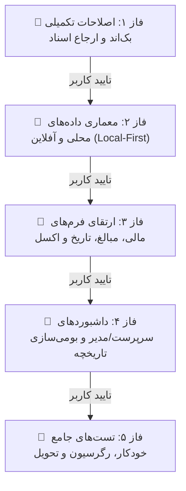

# 📋 طرح جامع و فازبندی‌شده ارتقا و رفع کلیه ایرادات کارتابل مالی (Financial Cartable Comprehensive Plan)

این طرح بر مبنای گزارش جامع آسیب‌شناسی کارتابل مالی و دستاوردهای چرخه بک‌اند (ثبت اسنپ‌شات تاریخچه و همگام‌سازی با جدول کالا)، به صورت **۵ فاز کاملاً تفکیک‌شده و استاندارد** تدوین گردیده است. طبق دستورالعمل، **ورود به هر فاز صرفاً پس از اتمام، راستی‌آزمایی و اخذ تاییدیه صریح از کاربر در فاز قبلی** صورت خواهد پذیرفت.

---

## 🧭 نمودار جریان فازهای اجرایی

---

## 📑 تفکیک تفصیلی فازهای اجرایی

---

### 🔹 فاز ۱: تکمیل زیرساخت بک‌اند و ارجاع اسناد (Backend Sync & Dispatch Enhancements)

> [!NOTE]
> **هدف فاز ۱:** رفع نواقص باقی‌مانده در ساختار اولیه تسک‌ها، پشتیبانی از شناسه‌های سینک آفلاین در ارسال گروهی، و ثبت کامل تاریخچه و دسترسی‌های نقشی در بک‌اند.

#### ۱. اقدامات اجرایی فاز ۱:
1. **کپی مقادیر اولیه از کالا به تسک در ارجاع (`bulk_dispatch`):**
   - در متد `bulk_assign` در [`inventory/views.py`](file:///e:/warehouse%20project/warehouse-backend/inventory/views.py#L613)، در زمان ایجاد `DocTask`، مقادیر ۱۴ فیلد مالی و فیلدهای متناظر کالا (`price_amount`, `similar_unit_price`, `total_value`, `currency`, `invoice_type`, `invoice_date`, `inv_rti_number`, `added_rti_no`, `page_row`, `invoice_page`, `doc_supplier`, `folder_address`, `stamp`, `signature`) از رکورد `Item` خوانده شده و تسک با مقادیر پرشده ایجاد شود تا سابقه و داده‌های موجود از بین نرود.
2. **پشتیبانی از `sync_ids` در متد `bulk_submit` بک‌اند:**
   - در متد `bulk_submit` در [`views.py`](file:///e:/warehouse%20project/warehouse-backend/inventory/views.py#L2425)، فیلتر تسک‌ها علاوه بر `task_ids` از لیست `sync_ids` ارسالی از کلاینت آفلاین نیز پشتیبانی کند.
3. **ثبت لاگ تاریخچه در متد `claim_tasks`:**
   - در زمان اختصاص تسک از استخر به کارشناس یا سرپرست در `claim_tasks`، رکورد `DocTaskHistory` با `action_type = 'CLAIMED'` و ثبت کاربر مربوطه ایجاد گردد.
4. **اعمال پرمیشن‌های دقیق نقشی در `DocTaskViewSet`:**
   - متدهای `bulk_approve`، `bulk_manager_approve`، `reject`، `manager_reject` و `bulk_cancel` دارای اعتبارسنجی سطح دسترسی نقشی (`HasMenuAccess` یا نقش‌های مجاز سرپرست/مدیر) شوند.
5. **پشتیبانی از تاریخ شمسی در ورودی سریالایزر `DocTaskSerializer`:**
   - فیلد `invoice_date` قابلیت دریافت رشته تاریخ شمسی (مانند `1403/05/20`) و تبدیل خودکار به فرمت استاندارد میلادی `YYYY-MM-DD` بدون ایجاد خطای ۴۰۰ را دارا باشد.

#### ۲. فایل‌های مشمول تغییر در فاز ۱:
- [`warehouse-backend/inventory/views.py`](file:///e:/warehouse%20project/warehouse-backend/inventory/views.py)
- [`warehouse-backend/inventory/serializers.py`](file:///e:/warehouse%20project/warehouse-backend/inventory/serializers.py)
- [`warehouse-backend/inventory/tests_docs.py`](file:///e:/warehouse%20project/warehouse-backend/inventory/tests_docs.py)

#### ۳. معیار راستی‌آزمایی و تایید فاز ۱:
- اجرای موفقیت‌آمیز تست‌های بک‌اند با دستور `python manage.py test inventory.tests_docs` و صحت کپی مقادیر در ارجاع جدید.

---

### 🔹 فاز ۲: ارتقای معماری داده‌های محلی و عملکرد آفلاین (Local-First & Offline Architecture)

> [!NOTE]
> **هدف فاز ۲:** تضمین پایداری ۱۰۰٪ اطلاعات مالی، فیلدهای پویا و تنظیمات دسترسی در حالت قطع ارتباط شبکه (Local-First)، و هماهنگی کامل فرانت‌اند با دیتابیس محلی Dexie.

#### ۱. اقدامات اجرایی فاز ۲:
1. **پایداری آفلاین فیلدهای پویا و غیرمستقیم کالا (`saveExtraEditedFields`):**
   - در [`customs.ts`](file:///e:/warehouse%20project/warehouse-front/src/app/components/customs/customs.ts#L653)، در حالت `localFirst`، تغییرات فیلدهای کالا و `dynamic_data` ابتدا در جدول محلی `offlineDb.items` ذخیره شده و سپس درخواست به‌روزرسانی در صف آفلاین `OfflineSyncService.enqueue` قرار گیرد تا هیچ داده‌ای در زمان آفلاین مفقود نشود.
2. **خواندن تنظیمات فیلدها و فیلدهای پویا از حافظه محلی Dexie:**
   - متد `loadFieldPermissions()` در صورت آفلاین بودن یا عدم دسترسی به سرور، تعاریف فیلدهای پویا را از جدول `offlineDb.dynamicFields` لود نماید.
3. **پیش‌بینی دقیق وضعیت محلی در `submitTasks`:**
   - در [`doc-task-store.ts`](file:///e:/warehouse%20project/warehouse-front/src/app/core/services/doc-task-store.ts#L125)، وضعیت تسک محلی با توجه به فلگ `skip_supervisor` تعیین شود (در صورت پرش از سرپرست، محلی نیز مستقیماً `DOC_MANAGER_REVIEW` شود).
4. **مدیریت هوشمند رفرش در صورت باز بودن فرم جزئیات:**
   - در صورت دریافت سیگنال وب‌سوکت در زمان باز بودن فرم کالا، پرچم `needsRefresh` تنظیم شده و به محض بستن فرم یا اتمام ویرایش، لیست کارهای من به صورت خودکار رفرش شود.

#### ۲. فایل‌های مشمول تغییر در فاز ۲:
- [`warehouse-front/src/app/components/customs/customs.ts`](file:///e:/warehouse%20project/warehouse-front/src/app/components/customs/customs.ts)
- [`warehouse-front/src/app/core/services/doc-task-store.ts`](file:///e:/warehouse%20project/warehouse-front/src/app/core/services/doc-task-store.ts)

#### ۳. معیار راستی‌آزمایی و تایید فاز ۲:
- تست قطع شبکه (Offline Mode) در مرورگر، ثبت اطلاعات مالی و فیلدهای پویا، و همگام‌سازی خودکار و بدون خطا پس از اتصال مجدد شبکه.

---

### 🔹 فاز ۳: ارتقای فرم‌های مالی، مبالغ، تاریخ و اکسل (UX, Financial Fields, Date & Excel Fixes)

> [!NOTE]
> **هدف فاز ۳:** بهبود ارگونومی ثبت اطلاعات مالی برای کارشناس، رفع باگ مودال خروجی اکسل، فرمت‌بندی سه رقمی مبالغ، و تقویم شمسی.

#### ۱. اقدامات اجرایی فاز ۳:
1. **فرمت‌بندی ۳ رقمی و تفکیک هزارگان مبالغ مالی:**
   - اعمال پایپ و کنترل ورودی برای فیلدهای `price_amount` (قیمت واحد)، `similar_unit_price` (قیمت مشابه) و `total_value` (ارزش کل) به صورت زنده با نمایش جداکننده کاما (مانند `۱۵,۰۰۰,۰۰۰`).
2. **محاسبه‌گر خودکار کمکی ارزش کل (Total Value Helper):**
   - تعبیه دکمه یا محاسبه خودکار ارزش کل بر مبنای `قیمت واحد × موجودی فیزیکی کالا` با امکان ویرایش دستی توسط کارشناس مالی.
3. **انتخابگر تاریخ شمسی (Jalali Datepicker):**
   - افزودن کامپوننت تقویم شمسی استاندارد به فیلد `invoice_date` به جای اینپوت متنی خام، با تبدیل مطمئن به فرمت استاندارد.
4. **رفع کامل باگ انتخاب ستون‌ها در مودال خروجی اکسل:**
   - در متد `executeExport()` در [`customs.ts`](file:///e:/warehouse%20project/warehouse-front/src/app/components/customs/customs.ts#L981)، هنگام انتخاب گزینه «فقط ستون‌های فعال در این کارتابل» (`visible`)، کلیدهای ستون‌های فعال (`this.fieldConfigs.filter(f => f.visible).map(f => f.key)`) در `payload.columns_list` قرار گیرد تا اکسل دقیقاً مطابق انتخاب کاربر تولید شود.
5. **ارتقای اسکنر بارکد و نرمال‌سازی جستجو:**
   - پشتیبانی جستجوی بارکد از پارت‌نامبر (`part_no`)، شماره تگ (`tag_number`) و PO، همراه با نرمال‌سازی حروف فارسی و عربی («ی/ي» و «ک/ك»).

#### ۲. فایل‌های مشمول تغییر در فاز ۳:
- [`warehouse-front/src/app/components/customs/customs.html`](file:///e:/warehouse%20project/warehouse-front/src/app/components/customs/customs.html)
- [`warehouse-front/src/app/components/customs/customs.ts`](file:///e:/warehouse%20project/warehouse-front/src/app/components/customs/customs.ts)
- [`warehouse-front/src/app/components/customs/customs.css`](file:///e:/warehouse%20project/warehouse-front/src/app/components/customs/customs.css)

#### ۳. معیار راستی‌آزمایی و تایید فاز ۳:
- بررسی چشمی و تعاملی فرم مالی: درج مبالغ بزرگ با فرمت ۳ رقمی، انتخاب تاریخ از تقویم شمسی، و دانلود اکسل با ستون‌های سفارشی فعال.

---

### 🔹 فاز ۴: داشبوردهای نظارتی سرپرست و مدیر و بومی‌سازی تاریخچه (Supervisor & Manager Reviews & Localization)

> [!NOTE]
> **هدف فاز ۴:** بومی‌سازی کامل تاریخچه اقدامات، نمایش فارسی عناوین و مقادیر در کارتابل سرپرست و مدیر، و امکان باز کردن و مشاهده جزئیات کامل سند قبل از تایید یا رد.

#### ۱. اقدامات اجرایی فاز ۴:
1. **بومی‌سازی و فارسی‌سازی تایم‌لاین تاریخچه (`DocTaskHistory`):**
   - ترجمه اکشن‌های انگلیسی مانند `DOC_PROCESSED` («ارسال جهت بررسی سرپرست»)، `DOC_SUPERVISOR_REJECTED` («رد شده توسط سرپرست»)، `DOC_MANAGER_REVIEW` («در انتظار تایید مدیر»)، `DOC_MANAGER_REJECTED` («رد شده توسط مدیر»)، `DOC_FINAL_APPROVED` («تایید نهایی») و `CLAIMED` («بر عهده گرفته شد») در تمپلیت تاریخچه.
2. **فارسی‌سازی عناوین فاکتور و ارزها در داشبورد سرپرست و مدیر:**
   - در [`supervisor-dashboard.html`](file:///e:/warehouse%20project/warehouse-front/src/app/components/supervisor/supervisor-dashboard/supervisor-dashboard.html) و [`manager-review.html`](file:///e:/warehouse%20project/warehouse-front/src/app/components/manager-review/manager-review.html)، مقادیر `invoice_type` و `currency` از دیکشنری فارسی (`رسمی/مالیاتی`، `ریال`، `دلار` و...) نمایش یابند.
3. **مدال/دراور مشاهده جزئیات کامل سند مالی برای سرپرست و مدیر:**
   - امکان کلیک روی کارت کالا در داشبورد سرپرست و مدیر برای باز شدن مودال جامع نمایش تمام ۱۴ فیلد مالی، مشخصات کالا، فیلدهای پویا، اسنپ‌شات و تاریخچه، قبل از تصمیم‌گیری برای تایید یا رد.

#### ۲. فایل‌های مشمول تغییر در فاز ۴:
- [`warehouse-front/src/app/components/customs/customs.html`](file:///e:/warehouse%20project/warehouse-front/src/app/components/customs/customs.html)
- [`warehouse-front/src/app/components/supervisor/supervisor-dashboard/supervisor-dashboard.html`](file:///e:/warehouse%20project/warehouse-front/src/app/components/supervisor/supervisor-dashboard/supervisor-dashboard.html)
- [`warehouse-front/src/app/components/supervisor/supervisor-dashboard/supervisor-dashboard.ts`](file:///e:/warehouse%20project/warehouse-front/src/app/components/supervisor/supervisor-dashboard/supervisor-dashboard.ts)
- [`warehouse-front/src/app/components/manager-review/manager-review.html`](file:///e:/warehouse%20project/warehouse-front/src/app/components/manager-review/manager-review.html)
- [`warehouse-front/src/app/components/manager-review/manager-review.ts`](file:///e:/warehouse%20project/warehouse-front/src/app/components/manager-review/manager-review.ts)

#### ۳. معیار راستی‌آزمایی و تایید فاز ۴:
- بازبینی کارتابل سرپرست و مدیر، مشاهده جزئیات کامل فاکتور و تایید/رد اسناد با مشاهده پیش‌نمایش دقیق.

---

### 🔹 فاز ۵: آزمون‌های یکپارچگی، رگرسیون کامل و تحویل نهایی (Integration Tests, Regression & Final Handover)

> [!NOTE]
> **هدف فاز ۵:** اجرای کلیه تست‌های خودکار بک‌اند و فرانت‌اند، تست بیلد نهایی پروژه، اطمینان از سلامت ۱۰۰٪ سیستم بدون کوچک‌ترین خطا، و مستندسازی DUAL-SAVE.

#### ۱. اقدامات اجرایی فاز ۵:
1. **اجرای آزمون‌های رگرسیون کامل بک‌اند:**
   - اجرای `python manage.py test inventory.tests inventory.tests_docs` برای راستی‌آزمایی پاس شدن تمام ۳۰+ تست.
2. **بررسی و تست بیلد فرانت‌اند Angular:**
   - اجرای کامپایل فرانت‌اند با `npm run build` یا بررسی ترمینال و رفع هرگونه اخطار یا خطای نوع‌داده (Type Error).
3. **تست سناریوی کامل کاربردی (End-to-End Smoke Test):**
   - ارجاع کالا $\rightarrow$ باز شدن در کارتابل کارشناس با مقادیر اولیه $\rightarrow$ ثبت ارقام با فرمت ۳ رقمی و تاریخ شمسی $\rightarrow$ ذخیره آفلاین و آنلاین $\rightarrow$ تایید سرپرست با دراور جزئیات $\rightarrow$ تایید نهایی مدیر $\rightarrow$ بررسی درج قطعی فیلدها در جدول کالا و خروجی اکسل.
4. **تکمیل مستندات DUAL-SAVE:**
   - ثبت گزارش کامل در [`walkthrough.md`](file:///e:/warehouse%20project/Documents/Financial_Cartable_Comprehensive_Fixes/walkthrough_financial_cartable_comprehensive_fixes.md) و به‌روزرسانی [`Master_Log.md`](file:///e:/warehouse%20project/Documents/Master_Log.md).

#### ۲. معیار راستی‌آزمایی و تایید فاز ۵:
- پاس شدن ۱۰۰٪ آزمون‌ها، بیلد موفق فرانت‌اند بدون ارور، و تایید نهایی کارکرد سامانه توسط کاربر.

---

## 📊 ماتریس خلاصه فازها، ریسک‌ها و فایل‌ها

| فاز | عنوان فاز | لایه | ریسک / وابستگی | فایل‌های اصلی مشمول تغییر |
| :-: | :--- | :-: | :-: | :--- |
| **۱** | اصلاحات تکمیلی بک‌اند و ارجاع اسناد | Backend | انتقال صحیح مقادیر موجود کالا | `views.py`, `serializers.py`, `tests_docs.py` |
| **۲** | معماری داده‌های محلی و آفلاین | Front / Local-First | حفظ یکپارچگی صف آفلاین و Dexie | `customs.ts`, `doc-task-store.ts` |
| **۳** | ارتقای فرم‌های مالی، مبالغ، تاریخ و اکسل | Frontend UI | فرمت‌بندی اعداد و تاریخ شمسی | `customs.html`, `customs.ts`, `customs.css` |
| **۴** | داشبوردهای سرپرست/مدیر و بومی‌سازی | Front Dashboard | یکپارچگی نمایش جزئیات کامل | `supervisor-dashboard.*`, `manager-review.*` |
| **۵** | تست‌های جامع خودکار، رگرسیون و تحویل | Full-Stack QA | عدم بروز هرگونه رگرسیون | کل مخزن و مستندات `Documents/` |

---

> [!IMPORTANT]
> **قانون تایید و آغاز عملیات:**
> طبق قوانین سیستم، هیچ کدی بدون تایید صریح شما تغییر نخواهد کرد. در صورت تایید این طرح کلی، لطفاً دستور شروع را صادر فرمایید تا **فاز ۱** بلافاصله آغاز گردد.

