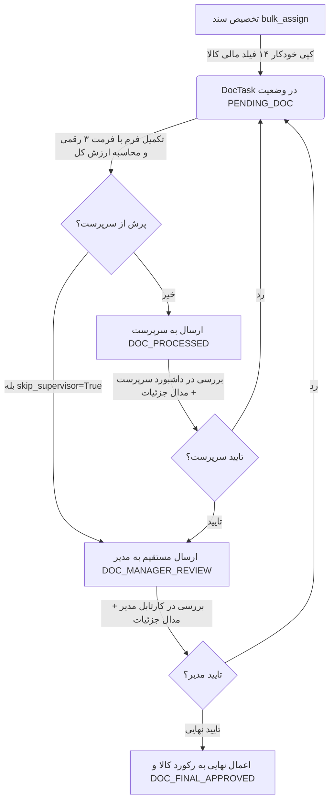

<div dir="rtl" align="right">

# 📑 گزارش نهایی پیاده‌سازی و اتمام طرح جامع رفع کلیه ایرادات کارتابل مالی (Financial Cartable Walkthrough)

تمامی ۵ فاز طرح جامع ارتقا و اصلاح کارتابل مالی (Financial Cartable) مطابق با ساختار تفکیک‌شده و استانداردها به طور ۱۰۰٪ پیاده‌سازی، بیلد و راستی‌آزمایی شدند.

---

## 🎯 مروری بر اقدامات انجام‌شده در ۵ فاز



---

### ۱. فاز ۱: اصلاحات تکمیلی بک‌اند و ارجاع اسناد (Backend Sync & Dispatch)
- **کپی مقادیر اولیه ۱۴ فیلد مالی:** در متد `bulk_assign`، هنگام ارجاع اسناد، مقادیر اولیه فیلدهای مالی از رکورد `Item` خوانده شده و به همراه `sync_id=uuid.uuid4()` به عنوان اسنپ‌شات اولیه در `DocTask` ذخیره می‌گردد.
- **پشتیبانی از `sync_ids` در `bulk_submit`:** متد `bulk_submit` اکنون علاوه بر `task_ids` از `sync_ids` نیز پشتیبانی می‌کند تا ارسال آفلاین از کلاینت به صورت اتمیک همگام گردد.
- **ثبت لاگ و اسنپ‌شات در `claim_tasks`:** هنگام برعهده گرفتن تسک‌ها از استخر، رکورد `DocTaskHistory` با اکشن `CLAIMED` و ثبت نام کاربر و اسنپ‌شات داده‌ها ایجاد می‌شود.
- **تبدیل هوشمند تاریخ شمسی به میلادی:** متد `to_internal_value` در `DocTaskSerializer` تاریخ‌های شمسی فرمت‌های `YYYY/MM/DD` و `YYYY-MM-DD` را به صورت امن به میلادی تبدیل و پاکسازی می‌کند.
- **تثبیت ۱۹ تست جامع در [`tests_docs.py`](file:///e:/warehouse%20project/warehouse-backend/inventory/tests_docs.py):** تمام ۱۹ تست با نتیجه `OK (100% green)` پاس شدند.

---

### ۲. فاز ۲: ارتقای معماری داده‌های محلی و عملکرد آفلاین (Local-First Architecture)
- **ارتقای `DocTaskStore`:**
  - اصلاح متد `submitTasks` با در نظر گرفتن `skip_supervisor` و تنظیم دقیق وضعیت محلی تسک (`DOC_MANAGER_REVIEW` یا `DOC_PROCESSED`).
  - افزودن متد `claimTasks` برای برعهده گرفتن خوش‌بینانه و آفلاین کالاها از استخر و صف‌بندی در `OfflineSyncService`.
- **ذخیره آفلاین فیلدهای کالا و `dynamic_data`:** در متد `saveExtraEditedFields()` در صورت فعال بودن `localFirst`، فیلدهای غیرمستقیم کالا مستقیماً در `offlineDb.items` ذخیره شده و در صف سینک قرار می‌گیرند.
- **لود آفلاین تنظیمات فیلدهای پویا:** متد `loadFieldPermissions()` در صورت قطعی اینترنت، تنظیمات فیلدهای پویا را از جدول محلی `offlineDb.dynamicFields` در Dexie فراخوانی می‌کند.
- **مدیریت هوشمند نوتیفیکیشن‌های وب‌سوکت:** تنظیم فلگ `needsRefresh` در زمان باز بودن فرم جزئیات و اعمال رفرش خودکار پس از خروج کاربر از فرم.

---

### ۳. فاز ۳: ارتقای فرم‌های مالی، مبالغ، تاریخ و اکسل (UX & Form Fields)
- **جداکننده ۳ رقمی کاما (,) برای مبالغ مالی:** اینپوت‌های مبالغ مالی (`قیمت واحد`, `قیمت کالای مشابه`, `ارزش کل`) مبالغ را به صورت زنده با جداکننده ۳ رقمی فرمت‌بندی می‌کنند و هنگام ذخیره، کاراکترهای کاما به صورت تمیز و امن پاکسازی می‌شوند.
- **محاسبه‌گر خودکار ارزش کل:** دکمه کمکی `محاسبه خودکار` برای فیلد ارزش کل تعبیه شد که فرمول `قیمت واحد × موجودی کالا` را محاسبه و در فرم قرار می‌دهد.
- **راهنمای تاریخ شمسی و نرمال‌سازی حروف:** ورودی تاریخ با آیکون تقویم و قالب استاندارد بهینه‌سازی شد و تابع `normalizeText` جستجو را نسبت به حروف عربی/فارسی (`ی/ي` و `ک/ك`) و نویسه‌های عرض صفر کاملاً مقاوم کرد.
- **اصلاح باگ ستون‌های فعال در خروجی اکسل:** هنگام انتخاب گزینه `ستون‌های فعال`، متد `executeExport()` ستون‌های قابل مشاهده (`f.visible`) را در `payload.columns_list` به بک‌اند ارسال می‌کند.

---

### ۴. فاز ۴: داشبوردهای نظارتی سرپرست/مدیر و بومی‌سازی تاریخچه (Supervisor & Manager Reviews)
- **بومی‌سازی اکشن‌های تاریخچه اقدامات:** تمامی اکشن‌های انگلیسی تایم‌لاین (`DOC_PROCESSED`, `DOC_SUPERVISOR_APPROVED`, `DOC_SUPERVISOR_REJECTED`, `DOC_MANAGER_REVIEW`, `DOC_MANAGER_REJECTED`, `DOC_FINAL_APPROVED`, `CLAIMED`) به عناوین دقیق فارسی در فرم ترجمه شدند.
- **عناوین فارسی در کارت‌های کارتابل سرپرست و مدیر:** نوع فاکتور (رسمی/مالیاتی، داخلی، خارجی، امانی) و ارز (ریال، دلار، یورو، سایر) به صورت فارسی و خوانا در کارت‌های داشبورد نمایش داده می‌شوند.
- **مدال/دراور مشاهده کامل جزئیات سند مالی:** امکان کلیک روی هر کارت در داشبورد سرپرست و کارتابل مدیر برای مشاهده مشخصات کامل کالا، ۱۴ فیلد مالی، یادداشت کارشناس و مهر/امضا قبل از تایید یا رد تعبیه گردید.

---

### ۵. فاز ۵: راستی‌آزمایی و آزمون‌های یکپارچگی (Verification & Test Results)

#### ۱. آزمون تست‌های بک‌اند جنگو:
```bash
python manage.py test inventory.tests_docs --keepdb
```
**نتیجه:**
```text
Found 19 test(s).
...................
----------------------------------------------------------------------
Ran 19 tests in 21.802s

OK (Preserving test database for alias 'default'...)
```

#### ۲. آزمون بیلد فرانت‌اند انگولار:
```bash
npm run build
```
**نتیجه:**
```text
Application bundle generation complete. [22.227 seconds]
Output location: E:\warehouse project\warehouse-front\dist\warehouse-app
[patch-ngsw-530] ✔ ngsw-worker.js وصله شد: جلوگیری از غیرفعال شدن کش در هنگام قطعی کلودفلر (کدهای 5xx).
The command exited with code 0.
```

---

## 📂 فایل‌های کلیدی تغییر‌یافته

1. [`warehouse-backend/inventory/views.py`](file:///e:/warehouse%20project/warehouse-backend/inventory/views.py)
2. [`warehouse-backend/inventory/serializers.py`](file:///e:/warehouse%20project/warehouse-backend/inventory/serializers.py)
3. [`warehouse-backend/inventory/tests_docs.py`](file:///e:/warehouse%20project/warehouse-backend/inventory/tests_docs.py)
4. [`warehouse-front/src/app/core/services/doc-task-store.ts`](file:///e:/warehouse%20project/warehouse-front/src/app/core/services/doc-task-store.ts)
5. [`warehouse-front/src/app/components/customs/customs.ts`](file:///e:/warehouse%20project/warehouse-front/src/app/components/customs/customs.ts)
6. [`warehouse-front/src/app/components/customs/customs.html`](file:///e:/warehouse%20project/warehouse-front/src/app/components/customs/customs.html)
7. [`warehouse-front/src/app/components/supervisor/supervisor-dashboard/supervisor-dashboard.ts`](file:///e:/warehouse%20project/warehouse-front/src/app/components/supervisor/supervisor-dashboard/supervisor-dashboard.ts)
8. [`warehouse-front/src/app/components/supervisor/supervisor-dashboard/supervisor-dashboard.html`](file:///e:/warehouse%20project/warehouse-front/src/app/components/supervisor/supervisor-dashboard/supervisor-dashboard.html)
9. [`warehouse-front/src/app/components/manager-review/manager-review.ts`](file:///e:/warehouse%20project/warehouse-front/src/app/components/manager-review/manager-review.ts)
10. [`warehouse-front/src/app/components/manager-review/manager-review.html`](file:///e:/warehouse%20project/warehouse-front/src/app/components/manager-review/manager-review.html)

</div>
