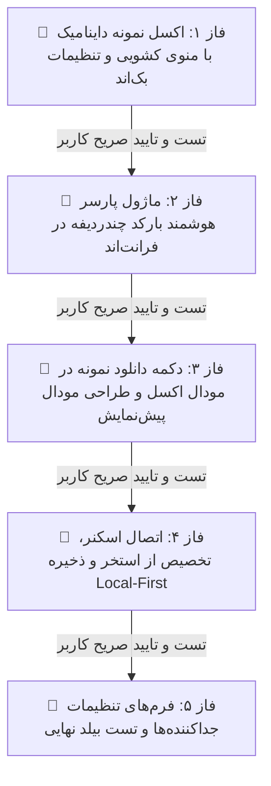

<div dir="rtl" align="right">

# 📑 طرح فنی تفصیلی و فازبندی‌شده پیاده‌سازی اسکنر چندردیفه و اکسل نمونه کارتابل مالی

این سند طرح فنی کامل را به **۵ فاز کاملاً مستقل و قابل اعتبارسنجی گام‌به‌گام (Step-by-Step Verification Gates)** تفکیک می‌نماید. طبق قوانین صریح پروژه، **ورود به هر فاز صرفاً پس از اتمام، راستی‌آزمایی کامل و تایید صریح شما در فاز قبلی انجام خواهد شد.**

---

## 🎯 ماتریس فازهای اجرایی و گیت‌های اعتبارسنجی



| فاز | موضوع فاز | دامنه تغییرات | گیت اعتبارسنجی (Verification Gate) | وضعیت |
| :---: | :--- | :--- | :--- | :---: |
| **فاز ۱** | **اکسل نمونه داینامیک با دراپ‌داون + تنظیمات** | بک‌اند (`inventory/views.py`, `warehouses/services.py`) | دانلود اکسل نمونه با فیلدهای داینامیک و سلول‌های کشویی + پاس شدن تست‌های جنگو | ⏳ در انتظار |
| **فاز ۲** | **ماژول پارسر هوشمند بارکد چندردیفه** | فرانت‌اند (`customs-scanner.types.ts`, `customs.ts`) | پارس موفق داده‌های متنی با هدر فارسی/انگلیسی و جداکننده‌های مختلف | ⏳ در انتظار |
| **فاز ۳** | **دکمه دانلود نمونه و مودال پیش‌نمایش** | فرانت‌اند (`customs.html`, `customs.ts`) | دکمه دانلود در مودال Export + رندر مودال پیش‌نمایش با آمار ۴گانه و بج استخر | ⏳ در انتظار |
| **فاز ۴** | **اتصال اسکنر، تخصیص استخر و ذخیره آفلاین** | فرانت‌اند (`customs.ts`) | اسکن کامل، تخصیص از استخر و اعمال تغییرات در IndexedDB و کارتابل | ⏳ در انتظار |
| **فاز ۵** | **تنظیمات جداکننده‌ها و بیلد نهایی** | فرانت‌اند (`settings`, `wh-settings`) | ذخیره جداکننده‌ها در تنظیمات + بیلد سبز و بدون خطای Angular | ⏳ در انتظار |

---

## 📋 جزئیات فنی و اقدامات هر فاز

---

### 🔹 فاز ۱: اکشن تولید اکسل نمونه داینامیک با سلول‌های کشویی و تنظیمات بک‌اند

#### اهداف و تغییرات:
1. **بک‌اند (`inventory/views.py`):**
   - پیاده‌سازی متد `@action(detail=False, methods=['get'], url_path='download_template')` در `DocTaskViewSet`.
   - استخراج انبار انتخابی و واکشی فیلدهای `editable` از تنظیمات انبار/سراسری (`field_permissions_doc`) + فیلدهای داینامیک فعال انبار (`ItemFieldDefinition`).
   - اضافه کردن ستون شناساگر «کد یکتا» (`fa_unic_code`) به ابتدای جدول.
   - هدر ردیف ۱: عناوین فارسی واضح فیلدها با استایل سرمه‌ای دودی مدرن (`1E293B`) و فونت بولد تاهوما.
   - ردیف‌های ۲ و ۳: داده‌های آزمایشی معتبر متناسب با نوع هر فیلد (فرمت تاریخ شمسی `1405/05/25 07:10`، مبالغ عددی، شماره‌های RTI).
   - اعمال **DataValidation** در `openpyxl`:
     * کشوی بله/خیر (`stamp`, `signature`)
     * کشوی نوع فاکتور (`invoice_type`) با مقادیر «رسمی/مالیاتی,خریدهای داخلی,خریدهای خارجی,امانی»
     * کشوی ارز (`currency`) با مقادیر «ریال,دلار,یورو,سایر»
2. **بک‌اند (`warehouses/services.py`):**
   - افزودن کلیدهای `'scanner_row_delimiter': ';'` و `'scanner_col_delimiter': '|'` به دیکشنری `DEFAULT_SETTINGS`.

#### 🧪 گیت اعتبارسنجی فاز ۱ (Verification Gate 1):
- اجرای تست‌های خودکار بک‌اند:
  ```bash
  .\venv\Scripts\python.exe manage.py test inventory.tests_docs warehouses.tests --noinput
  ```
- بررسی فایل اکسل دانلودشده و اطمینان از عملکرد روان سلول‌های کشویی (Dropdown) و صحت فرمت داده‌ها.
- **توقف و تایید:** تا این فاز به صورت ۱۰۰٪ تست و توسط شما تایید نشود، فاز ۲ آغاز نخواهد شد.

---

### 🔹 فاز ۲: سرویس دانلود و ماژول پارسر هوشمند بارکد چندردیفه در فرانت‌اند

#### اهداف و تغییرات:
1. **فرانت‌اند (`customs-scanner.types.ts` [NEW]):**
   - تعریف اینترفیس `ParsedScanRow` (شامل ردیف، کد یکتا، مقادیر فیلدها، وضعیت تطبیق `ready`, `pool`, `readonly`, `not_found` و پیام وضعیت).
   - تعریف اینترفیس `ScanBatchSummary` (شامل تعداد کل، آماده، استخر، قفل‌شده، ناموجود).
2. **فرانت‌اند (`doc-task-api.service.ts`):**
   - افزودن متد `downloadTemplate(warehouseId?: number): Observable<Blob>`.
3. **فرانت‌اند (`customs.ts`):**
   - پیاده‌سازی متد `parseMultiRowBarcode(rawText: string)`:
     * تشخیص خودکار جداکننده‌ها بر اساس تنظیمات یا کاراکترهای استاندارد (`;`, `\n` برای ردیف، و `|`, `,`, `\t` برای ستون).
     * تطبیق خودکار هدر ورودی با عناوین فارسی فیلدهای کارتابل مالی (`getFieldLabel`) یا کلیدهای دیتابیسی (`fa_unic_code`, `price_amount`, ...) و فیلدهای داینامیک.
     * استخراج کد یکتا از ردیف‌ها و دسته‌بندی اقلام.

#### 🧪 گیت اعتبارسنجی فاز ۲ (Verification Gate 2):
- تست واحد متد پارسر با نمونه رشته ارسالی کاربر و ورودی‌های متنی با هدرهای فارسی و انگلیسی.
- اطمینان از عدم وجود خطای کامپایل تایپ‌اسکریپت.
- **توقف و تایید:** تا تایید صحت عملکرد پارسر، فاز ۳ آغاز نخواهد شد.

---

### 🔹 فاز ۳: دکمه دانلود فایل نمونه در مودال اکسل و طراحی مودال پیش‌نمایش

#### اهداف و تغییرات:
1. **فرانت‌اند (`customs.html` & `customs.ts`):**
   - افزودن دکمه کم‌جا و شیک «دانلود قالب اکسل نمونه با داده‌های آزمایشی» به پاورقی مودال موجود «خروجی اکسل» (`isExportModalOpen`).
   - اتصال دکمه به متد `downloadSampleTemplate()` و ذخیره خودکار فایل در مرورگر.
2. **فرانت‌اند (`customs.html` - طراحی مودال پیش‌نمایش):**
   - هدر جذاب با آیکون بارکد و دکمه بستن.
   - ۴ کارت آماری رنگی (کل ردیف‌ها، آماده به‌روزرسانی - سبز، از استخر اسناد - بنفش، غیرقابل ویرایش/ارسال‌شده - کهربایی، ناموجود - خاکستری).
   - جدول پیش‌نمایش با نمایش نام کالا، کد یکتا، برچسب بنفش «از استخر اسناد»، فیلدهای تغییریافته و مقادیر جدید.
   - دکمه‌های اکشن «تأیید و به‌روزرسانی N کالا» و «انصراف».

#### 🧪 گیت اعتبارسنجی فاز ۳ (Verification Gate 3):
- تست کلیک روی دکمه دانلود نمونه در مودال اکسل و تایید دانلود موفق.
- باز کردن مودال پیش‌نمایش در مرورگر و تایید زیبایی بصری، تراز راست‌به‌چپ (RTL)، کارت‌های آماری و برچسب بنفش استخر اسناد.
- **توقف و تایید:** تا تایید ظاهر و فرمت رابط کاربری، فاز ۴ آغاز نخواهد شد.

---

### 🔹 فاز ۴: اتصال جریان اسکنر، تخصیص خودکار از استخر و ذخیره Local-First

#### اهداف و تغییرات:
1. **فرانت‌اند (`customs.ts`):**
   - ارتقای متد `onBarcodeScanned(code: string)`:
     * اگر ورودی حاوی جداکننده یا چندردیفه بود: فعال‌سازی پارسر، جستجوی هم‌زمان در تسک‌های کارتابل (`myTasks`) و استخر (`poolTasks`)، و باز شدن مودال پیش‌نمایش.
     * اگر ورودی تک‌بارکد معمولی بود: حفظ رفتار پیشین بدون تغییر.
   - پیاده‌سازی متد `applyBulkScanUpdate()`:
     * در صورت وجود تسک‌های استخر: تخصیص خودکار به کاربر جاری (`claimScannedTask`).
     * فیلتر کردن مقادیر و اعمال منحصراً روی فیلدهای با مجوز `editable`.
     * ذخیره در مخزن Local-First (`store.saveDraft`) و فیلدهای کالا (`saveExtraEditedFields`).
     * بستن مودال، به‌روزرسانی لیست و نمایش نوتیفیکیشن موفقیت.

#### 🧪 گیت اعتبارسنجی فاز ۴ (Verification Gate 4):
- اسکن داده چندردیفه واقعی شامل کالاهای کارتابل و کالاهای استخر.
- تایید تغییرات در مودال و مشاهده به‌روزرسانی آنی مقادیر در جدول و ماندگاری در IndexedDB (`offlineDb`).
- **توقف و تایید:** تا این سناریو به صورت کامل تایید نشود، فاز ۵ آغاز نخواهد شد.

---

### 🔹 فاز ۵: فرم‌های تنظیمات جداکننده‌ها و راستی‌آزمایی نهایی بیلد

#### اهداف و تغییرات:
1. **فرانت‌اند (`settings` و `wh-settings`):**
   - افزودن ورودی‌های تنظیم کاراکتر جداکننده ردیف و ستون اسکنر به همراه توضیحات راهنما.
2. **بیلد نهایی و آزمون جامع:**
   - اجرای `npm run build` در پوشه فرانت‌اند و اطمینان از بیلد ۱۰۰٪ موفق.
   - ثبت گزارش نهایی در `walkthrough.md`.

#### 🧪 گیت اعتبارسنجی فاز ۵ (Verification Gate 5):
- تست ذخیره و تغییر کاراکترهای جداکننده در فرم تنظیمات.
- بیلد موفق بدون هیچ‌گونه خطا یا هشدار کامپایل.

</div>
