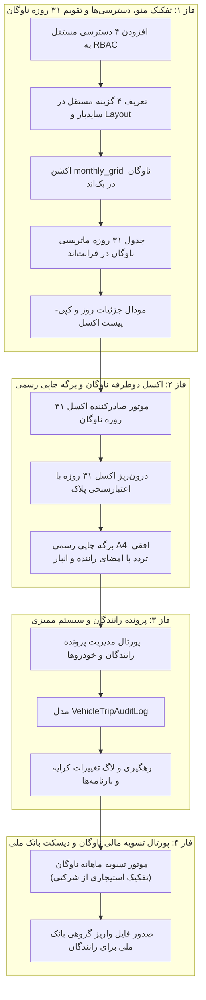

<div dir="rtl" align="right">

# طرح جامع و ارتقایافته همگام‌سازی کامل پنل کارکرد ناوگان و پرسنل (معماری ۴ پورتال مجزا)

این سند معماری و نقشه راه فنی، بر اساس تمامی تصمیمات نهایی اتخاذشده در فرآیند تحلیل عمیق، ساختار یکپارچه سیستم را بر مبنای **۴ منوی اصلی مستقل در سایدبار با سطوح دسترسی (RBAC) کاملاً تفکیک‌شده** و نظارت **۷ ایجنت نگهبان سخت‌گیر** تعریف می‌کند.

---

## ۱. ساختار ۴ پورتال مستقل در منوی اصلی سیستم (The 4 Core Pillars)

| نام گزینه در منوی اصلی | مسیر (Route) | شناسه دسترسی (RBAC Permission) | شرح کارکرد و قابلیت‌ها |
| :--- | :--- | :--- | :--- |
| **۱. 👥 ثبت کارکرد پرسنل** | `/attendance` | `view_sys_personnel_attendance` | ثبت ماتریسی روزانه حضور و غیاب پرسنل، تقویم ۳۱ روزه، اعمال گروهی، اکسل ۲ طرفه و چاپ برگه اثر انگشت |
| **۲. 🚛 ثبت کارکرد ناوگان و ماشین‌آلات** | `/fleet` | `view_sys_fleet_attendance` | ثبت ماتریسی روزانه سرویس‌های ناوگان، تقویم ۳۱ روزه، مودال جزئیات بارنامه/مسیر، چسباندن از اکسل، اکسل ۲ طرفه و چاپ برگه تردد |
| **۳. 💰 حقوق و دستمزد پرسنل (دیسکت‌ها)** | `/personnel` | `view_sys_payroll` | پورتال مالی محاسبه ۵۸ ستون حقوق پرسنل، دیسکت‌های بیمه (`DSK`)، مالیات (`WH/WP`)، دیسکت بانک ملی، جدول ۲۰ گروه شغلی و پرونده پرسنل |
| **۴. 💳 تسویه و محاسبات مالی ناوگان** | `/fleet-settlement` | `view_sys_fleet_settlement` | محاسبه کارکرد و کرایه ماهانه رانندگان استیجاری/ملکی، تفکیک خودروهای شرکتی، صدور دیسکت واریز بانکی ناوگان و مدیریت پرونده رانندگان |

---

## ۲. کارنامه مأموریت ۷ ایجنت نگهبان سخت‌گیر (The 7 Sentry Guards)

| ایجنت نگهبان | محدوده نظارت و مأموریت | خط قرمز و قانون غیرقابل نقض |
| :--- | :--- | :--- |
| 🛡️ **Sentry 1: نگهبان تفکیک کامل مجوزها و امنیت RBAC** | سطوح دسترسی ۴ پورتال | هر یک از ۴ بخش باید کلید دسترسی مستقل داشته باشد؛ دسترسی به کارکرد نباید دسترسی مالی بدهد. |
| 🛡️ **Sentry 2: نگهبان فرمول‌های مرجع و محاسبات پرسنل** | صیانت از موتور ۵۸ ستونی | فرمول‌های حقوق پرسنل و شیت `Emp_info` دست‌نخورده باقی بماند؛ تسویه ناوگان در ماژول اختصاصی باشد. |
| 🛡️ **Sentry 3: نگهبان استاندارد ۲ سطری اکسل** | فرمت‌های ورودی/خروجی Excel | ساختار ۳۱ روزه ماتریسی ناوگان (پلاک/راننده در ابتدا، ۳۱ روز در وسط، جمع و شبا در انتها) با فریز `A3`. |
| 🛡️ **Sentry 4: نگهبان وب‌سوکت و ارگونومی کیبورد** | همگام‌سازی زنده و ناوبری سریع | لایو آپدیت بی‌صدا بدون رفرش با فیلتر `client_tab_id` و ناوبری سریع با کیبورد (`Enter/Escape/Arrows`). |
| 🛡️ **Sentry 5: نگهبان قفل دوره‌ها و ترنزکشن‌های اتمیک** | امنیت داده و پیشگیری از Race Condition | ثبت رکوردهای کارکرد و تسویه منوط به وضعیت `OPEN` دوره ماهانه و محصور در `transaction.atomic()`. |
| 🛡️ **Sentry 6: نگهبان کامپایل و سلامت فرانت‌اند** | یکپارچگی کدهای Angular و Routing | اتمام بیلد با `ng build` با کد خروجی ۰ و صحت روت‌های ۴ گانه سایدبار. |
| 🛡️ **Sentry 7: نگهبان تست‌های جامع خودکار جنگو** | ممیزی خودکار رگرسیون | پوشش ۱۰۰٪ و پاس شدن تست‌های واحد بک‌اند برای کلیه اکشن‌های ۴ گانه. |

---

## ۳. تغییرات فنی پیشنهادی به تفکیک فازها و لایه‌ها



---

### 🔹 جزئیات فنی فازهای ۴ گانه

#### **🔹 فاز ۱: ایجاد ۴ پورتال مستقل در سایدبار، مجوزها (RBAC) و تقویم ۳۱ روزه ناوگان**
- **بک‌اند (`views.py`, `models.py`):**
  - ثبت دسترسی‌های جدید: `view_sys_personnel_attendance`, `view_sys_fleet_attendance`, `view_sys_payroll`, `view_sys_fleet_settlement`.
  - افزودن اکشن `monthly_grid` در `VehicleTripViewSet` جهت واکشی ماتریس ۳۱ روزه به تفکیک رانندگان و محاسبه روزهای ماه.
  - افزودن اکشن `update_day_trip` جهت ذخیره سریع ویرایش روزانه از روی تقویم.
- **فرانت‌اند (`layout.ts`, `layout.html`, `app.routes.ts`, `warehouse-attendance.ts`):**
  - به‌روزرسانی آرایه `SYSTEM_NAV_ITEMS` با ۴ گزینه مستقل و آیکون‌های استاندارد.
  - تعریف روت‌های مجزای `/attendance` (کارکرد پرسنل) و `/fleet` (کارکرد ناوگان).
  - پیاده‌سازی نمای تقویم ۳۱ روزه ماهانه ناوگان با سلول‌های تعداد سرویس.
  - مودال سریع کلیک روی سلول روز جهت نمایش و ویرایش شماره بارنامه، مبدا/مقصد، نرخ و یادداشت.
  - مودال چسباندن سریع از اکسل (`Smart Paste`) برای ردیف‌های ناوگان.

#### **🔹 فاز ۲: اکسل دوطرفه ناوگان و برگه چاپی رسمی با امضا**
- **بک‌اند (`fleet_excel_engine.py`):**
  - ماژول `export_fleet_monthly_excel`: تولید قالب ۲ سطری استاندارد با مشخصات خودرو در ابتدا، ۳۱ روز در میانه، جمع سرویس، جمع مبلغ و شماره شبا در انتها با فریز `A3`.
  - ماژول `import_fleet_monthly_excel`: خواندن فایل اکسل و ثبت اتمیک ترددها.
- **فرانت‌اند (`warehouse-attendance.html`):**
  - دکمه‌های دانلود و بارگذاری شیت ماهانه اکسل در صفحه کارکرد ناوگان.
  - مودال پیش‌نمایش چاپی استاندارد A4 افقی کارکرد ناوگان با کادرهای امضای ۳ گانه راننده، سرپرست انبار و مدیر مالی.

#### **🔹 فاز ۳: پرونده رانندگان و ناوگان در فرانت‌اند و سیستم ممیزی**
- **بک‌اند (`models.py`, migrations):**
  - ایجاد مدل `VehicleTripAuditLog` برای ثبت هرگونه تغییر در کرایه سرویس، تعداد سفر یا بارنامه توسط سرپرستان.
- **فرانت‌اند:**
  - ساخت صفحه و مودال کامل تعریف و ویرایش پرونده راننده/خودرو شامل: پلاک انتظامی، نام راننده، کد ملی، تلفن، نوع مالکیت (استیجاری/شرکتی/ملکی)، نرخ پایه پیش‌فرض، شماره حساب و شماره شبا.

#### **🔹 فاز ۴: پورتال تسویه مالی ناوگان و دیسکت پرداخت بانک ملی**
- **بک‌اند (`tax_bank_exporter.py`, `views.py`):**
  - موتور تسویه ماهانه ناوگان: محاسبه مبالغ ناخالص برای خودروهای استیجاری/ملکی بر مبنای `(trip_count × unit_rate)` و صفر لحاظ کردن مبلغ برای خودروهای شرکتی.
  - تولید فایل متنی/اکسل واریز گروهی بانک ملی برای رانندگان استیجاری بر اساس شماره شبای ثبت‌شده.
- **فرانت‌اند (`app.routes.ts`, کامپوننت تسویه ناوگان):**
  - صفحه مستقل `/fleet-settlement` برای مشاهده کاردکس مالی خودروها، جمع مبالغ، و دکمه دانلود دیسکت پرداخت بانک ملی.

---

## ۴. برنامه جامع تست و راستی‌آزمایی (Verification Plan)

### تست‌های واحد بک‌اند جنگو:
```powershell
& "e:\warehouse project\warehouse-backend\venv\Scripts\python.exe" manage.py test personnel.test_attendance_fleet_audit
```
* **تست ۱:** بررسی دسترسی‌های ۴ گانه RBAC (`test_rbac_four_pillars`).
* **تست ۲:** اعتبارسنجی ماتریس ۳۱ روزه ناوگان (`test_fleet_monthly_grid`).
* **تست ۳:** اعتبارسنجی رفت و برگشت اکسل دوطرفه ناوگان (`test_fleet_two_way_excel`).
* **تست ۴:** اعتبارسنجی لاگ ممیزی ناوگان (`test_fleet_audit_log`).
* **تست ۵:** اعتبارسنجی تسویه و تولید دیسکت بانک ملی رانندگان (`test_fleet_bank_export`).

### اعتبارسنجی فرانت‌اند:
```powershell
npm run build
```
* تضمین صفر بودن خطاهای کامپایلر و سلامت کامل مسیریابی و تمپلیت‌ها.

</div>
