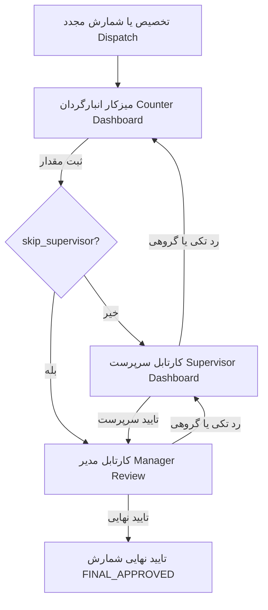

<div dir="rtl" align="right">

# 🚀 گزارش جامع پیاده‌سازی و راستی‌آزمایی اصلاحات چرخه انبارگردانی (Walkthrough)

این سند خلاصه تمام اقدامات انجام‌شده، اصلاحات کد، تست‌ها و اعتبارسنجی‌های مرحله‌ای اعمال‌شده در ۵ فاز مشروط جهت انطباق ۱۰۰٪ فرانت‌اند با سناریوها و منطق چرخه انبارگردانی است.

---

## 🎯 اهداف محقق‌شده (Achieved Objectives)

1. **انطباق کامل با سناریوهای بازشماری (Recount Scenarios):**
   - پشتیبانی از تسک‌های ردشده توسط سرپرست (`SUPERVISOR_REJECTED`) و مدیر (`MANAGER_REJECTED`) در کارتابل سرپرست و انبارگردان.
   - اصلاح نمایش علت رد و ارسال مستقیم مقادیر تصحیح‌شده.
2. **پشتیبانی از سناریوهای جهش از سرپرست (`skip_supervisor`):**
   - تعریف فیلد در مدل‌ها، فعال‌سازی ارسال مستقیم به مدیر در صورت جهش و اصلاح عناوین دیالوگ‌های تایید.
3. **پیاده‌سازی رد و بازشماری گروهی (Bulk Reject Actions):**
   - افزودن اکشن‌های `bulk_reject` (سرپرست) و `bulk_manager_reject` (مدیر) در بک‌ند، سرویس API و کامپوننت‌های فرانت‌اند با نوار شناور پایین و مودال‌های ثبت اجباری علت.
4. **تثبیت Type Safety و امنیت عملیات:**
   - حذف شرط پرمیشن نامربوط `view_sys_recounts` از تمپلیت سرپرست.
   - مجاز کردن ویرایش فیلدهای کالا و لوکیشن توسط انبارگردان و سرپرست در `ItemViewSet`.
   - ایمن‌سازی متدهای ارزیابی مغایرت (`isMatched` و `_discrepancy`) در برابر خطاهای اعشاری و مقادیر نال.

---

## 🛠️ تغییرات اعمال‌شده بر تفکیک فازها و فایل‌ها



### فاز ۱: مدل‌های پایه، سرویس API و کارتابل سرپرست
- **[`count-task.model.ts`](file:///E:/warehouse%20project/warehouse-front/src/app/core/models/count-task.model.ts):** افزودن `skip_supervisor?: boolean;` و `new_location?: string;` به اینترفیس `CountTask`.
- **[`inventory/views.py`](file:///E:/warehouse%20project/warehouse-backend/inventory/views.py):**
  - تنظیم پرمیشن‌های متدهای `reject`, `bulk_reject`, `bulk_manager_reject` در `CountTaskViewSet.get_permissions()`.
  - پیاده‌سازی اکشن‌های `@action(detail=False) bulk_reject` و `bulk_manager_reject` همراه با تراکنش اتمیک و تاریخچه `CountTaskHistory`.
- **[`count-task-api.service.ts`](file:///E:/warehouse%20project/warehouse-front/src/app/core/api/count-task-api.service.ts):** اضافه شدن متدهای `bulkReject(taskIds, note)` و `bulkManagerReject(taskIds, note)`.
- **[`supervisor-dashboard.ts`](file:///E:/warehouse%20project/warehouse-front/src/app/components/supervisor/supervisor-dashboard/supervisor-dashboard.ts) & [`.html`](file:///E:/warehouse%20project/warehouse-front/src/app/components/supervisor/supervisor-dashboard/supervisor-dashboard.html):**
  - بارگذاری کامل رکوردهای `COUNTED` و `MANAGER_REJECTED`.
  - اضافه شدن دکمه و مودال رد گروهی (`bulkReject`) در نوار شناور پایین و پشتیبانی از میانبرهای کیبورد (Escape و Ctrl+Enter).
  - حذف شرط اشتباه `view_sys_recounts` از دکمه رد تکی.

### فاز ۲: کارتابل بررسی نهایی مدیر (Manager Review)
- **[`manager-review.ts`](file:///E:/warehouse%20project/warehouse-front/src/app/components/manager-review/manager-review.ts) & [`.html`](file:///E:/warehouse%20project/warehouse-front/src/app/components/manager-review/manager-review.html):**
  - اضافه شدن دکمه «رد و بازشماری» در کنار «تایید نهایی» در نوار شناور انتخاب گروهی.
  - پیاده‌سازی مودال ثبت دلیل رد و دستورات بازشماری با اعتبارسنجی اجباری بودن متن یادداشت.
  - ایمن‌سازی متد `isMatched` برای پشتیبانی از `bal4miv` و `inventory` و دقت مقایسه اعشاری.

### فاز ۳: میزکار انبارگردان میدانی و همگام‌سازی (Counter Dashboard & Sync)
- **[`counter-dashboard.ts`](file:///E:/warehouse%20project/warehouse-front/src/app/components/counter/counter-dashboard/counter-dashboard.ts):**
  - اصلاح متد `saveDraft`: رکوردهای در وضعیت `SUPERVISOR_REJECTED` و `MANAGER_REJECTED` پس از ورود مقدار شمرده‌شده به `INITIAL_COUNT` ارتقا می‌یابند تا در لیست اقلام آماده ارسال قرار گیرند.
  - داینامیک‌سازی پیام‌های ارسال مستقیم (`skip_supervisor`) در توست‌ها و دیالوگ‌های تایید.
- **[`inventory/views.py`](file:///E:/warehouse%20project/warehouse-backend/inventory/views.py):**
  - تنظیم دسترسی `ItemViewSet` برای متدهای `update` و `partial_update` تا کاربران دارای `view_sys_counter` و `view_sys_supervisor` بتوانند موقعیت جدید و فیلدهای پویای کالا را بدون خطای ۴۰۳ ذخیره کنند.

### فاز ۴: ارجاع کالا و پیگیری لحظه‌ای شمارش (Dispatch & Count Tracking)
- **[`count-tracking.ts`](file:///E:/warehouse%20project/warehouse-front/src/app/components/count-tracking/count-tracking.ts):**
  - ایمن‌سازی محاسبه مغایرت `_discrepancy` با اولویت `bal4miv` و سپس `inventory`.
  - بهینه‌سازی متد `bulkApproveGreenTasks` برای مقایسه دقیق اعشاری اقلام بدون مغایرت در کارتابل مدیر.

---

## 🧪 نتایج اعتبارسنجی و تست‌ها (Verification Results)

### ۱. آزمون‌های خودکار بک‌اند (Backend Test Suite)
اجرای دستور:
```powershell
.\venv\Scripts\python.exe manage.py test inventory.tests
```
**نتیجه:**
```
Found 15 test(s).
System check identified no issues (0 silenced).
...............
----------------------------------------------------------------------
Ran 15 tests in 25.706s

OK
```
همه ۱۵ آزمون جامع سناریوهای هفتگانه و موارد هشتگانه گوشه‌ای با موفقیت ۱۰۰٪ پاس شدند.

### ۲. بیلد فرانت‌اند و کامپایل تایپ‌اسکریپت (Frontend Production Build)
اجرای دستور:
```powershell
npm run build --prefix "E:\warehouse project\warehouse-front"
```
**نتیجه:**
```
Application bundle generation complete. [47.646 seconds]
✔ ngsw-worker.js وصله شد
Exit Code: 0 (Success)
```
تمامی قالب‌های HTML و کامپوننت‌های TypeScript بدون هیچ‌گونه خطا یا کامپایل با موفقیت بیلد شدند.

---

## 🏁 وضعیت نهایی

کلیه ۵ فاز طرح با استانداردهای کامل فرانت‌اند و بک‌اند پیاده‌سازی، راستی‌آزمایی و مستندسازی شدند. سیستم هم‌اکنون به صورت پایدار و یکپارچه آماده بهره‌برداری است.

</div>
