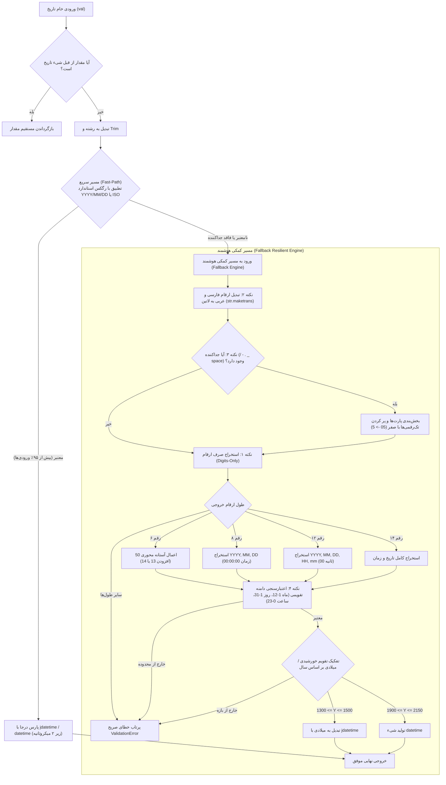

# طرح جامع و نهایی پیاده‌سازی موتور سراسری پارسر تاریخ (Dual-Path Date Parser Engine)

این مستند طرح جامع و نهایی معماری **موتور سراسری تحلیل و تبدیل تاریخ و زمان** است که بر اساس خروجی مصاحبه فنی تعاملی (`/grill-me`)، اعمال الگوی دو مسیره (**Fast-Path / Fallback Engine**)، و تحقق ۴ اصل کلیدی چت پیشین تدوین شده است.

---

## ۱. تصمیمات قطعی مصاحبه فنی تعاملی (/grill-me Alignment)

| ردیف | شاخه تصمیم‌گیری | گزینه مصوب | جزئیات فنی و رفتار سامانه |
| :---: | :--- | :--- | :--- |
| **۱** | **دامنه استقرار (Scope)** | **پیاده‌سازی دوطرفه (Full-Stack)** | استقرار ماژول در بک‌اند پایتون (`common/date_utils.py`) و فرانت‌اند تایپ‌اسکریپت (`src/app/core/utils/date-utils.ts`) جهت تضمین همگامی کامل کلاینت و سرور. |
| **۲** | **قانون سده در سال ۲ رقمی (Pivot Rule)** | **آستانه محوری ۵۰ (Pivot=50)** | در ورودی‌های ۶ رقمی (`YYMMDD`): اگر `YY >= 50` باشد قرن ۱۳ اضافه می‌شود (`93` -> `1393`) و اگر `YY < 50` باشد قرن ۱۴ اضافه می‌شود (`03` -> `1403`). |
| **۳** | **ساختار خروجی (Return Type)** | **سازگار و تطبیق‌پذیر (Polymorphic)** | در بک‌اند خروجی شیء میلادی `datetime.date` (یا `datetime.datetime` در صورت وجود زمان) و در فرانت‌اند آبجکت استاندارد `Date` به همراه هلپر تولید رشته استاندارد خورشیدی `YYYY/MM/DD`. |
| **۴** | **مدیریت خطای ورودی (Error Policy)** | **سخت‌گیرانه (Strict Validation)** | در صورت ورود داده‌های ناقص، غیرقابل اصلاح، یا مقادیر خارج از دامنه تقویمی (مانند ماه ۱۳ یا روز ۳۵)، خطای صریح (`ValidationError` در بک‌اند و `Error` در فرانت‌اند) پرتاب می‌شود. |

---

## ۲. چهار نکته محوری چت پیشین و معماری اجرایی آن‌ها

---

## ۳. مشخصات ماژول‌ها و فایل‌های پروژه

### ۳.۱. ماژول مرکزی بک‌اند: `warehouse-backend/common/date_utils.py`
این فایل ماژول جدید و مرجع برای تمام تبدیل‌های تاریخ در سمت سرور خواهد بود:
* **`parse_date_smart(val, as_datetime=False, strict=True)`**:
  * ورودی‌های استاندارد را با کمترین سربار پردازش می‌کند.
  * در صورت نیاز، مسیر کمکی `_parse_fallback_digits` را صدا می‌زند.
  * سال‌های ۲ رقمی را بر اساس قاعده `pivot=50` تفکیک می‌کند.
  * در صورت مغایرت و فعال بودن `strict=True`، خطای `django.core.exceptions.ValidationError` صادر می‌کند.
* **جایگزینی در کدهای موجود:**
  * متد محلی `_parse_date_flexible` در `warehouse-backend/inventory/views.py` به این ماژول هدایت و متصل می‌شود.
  * در فرآیند ایمپورت فایل‌های اکسل و کالاهای دارای اسناد تاییدشده (`Pre-Approved Docs Import`) فراخوانی می‌گردد.

### ۳.۲. ماژول متناظر فرانت‌اند: `warehouse-front/src/app/core/utils/date-utils.ts`
این فایل ماژول مرجع برای کنترلرهای فرم، فیلترها و ماسک‌های ورودی رابط کاربری خواهد بود:
* **`parseSmartDate(val: any, options?: { asTime?: boolean; strict?: boolean }): Date`**:
  * منطق یکپارچه و عینی معادل بک‌اند با رعایت تبدیل ارقام فارسی/عربی، پدینگ تک‌رقمی‌ها و قاعده آستانه ۵۰.
* **`formatToStandardShamsi(date: Date | string, includeTime?: boolean): string`**:
  * تولید خروجی استاندارد خورشیدی اسلش‌دار (`YYYY/MM/DD` یا `YYYY/MM/DD HH:mm:ss`) جهت نمایش در UI.

### ۳.۳. تست‌های خودکار (Unit Tests)
* **بک‌اند:** `warehouse-backend/common/tests/test_date_utils.py` شامل تست‌های رگرسیون، پوشش تمامی ارقام فارسی، سال‌های ۲ رقمی، پدینگ تک‌رقمی‌ها، و پرتاب استثنای داده نامعتبر.
* **فرانت‌اند:** `warehouse-front/src/app/core/utils/date-utils.spec.ts` جهت اطمینان از پاس شدن کلیه سناریوهای کلاینت.

---

## ۴. ماتریس سناریوهای آزمون (Verification Matrix)

| سناریو | ورودی آزمون | نتیجه مورد انتظار | مسیر پردازشی |
| :--- | :--- | :--- | :---: |
| ورودی استاندارد خط‌تیره‌دار | `1403/05/12` | `date(2024, 8, 2)` | مسیر سریع (Fast-Path) |
| ارقام فارسی با اسلش | `۱۴۰۳/۰۵/۱۲` | `date(2024, 8, 2)` | مسیر کمکی (نکته ۲) |
| تاریخ پیوسته بدون جداکننده (۸ رقم) | `14030512` | `date(2024, 8, 2)` | مسیر کمکی (نکته ۱) |
| روز و ماه تک‌رقمی با جداکننده | `1403/5/8` | `date(2024, 7, 29)` | مسیر کمکی (نکته ۳ - Padding) |
| سال دو رقمی اسناد قدیمی (>= 50) | `930520` | `date(2014, 8, 11)` | مسیر کمکی (قرن ۱۳: 1393) |
| سال دو رقمی مدرن (< 50) | `030520` | `date(2024, 8, 10)` | مسیر کمکی (قرن ۱۴: 1403) |
| تاریخ همراه با ساعت و دقیقه (۱۲ رقم) | `140305121430` | `datetime(2024, 8, 2, 14, 30)` | مسیر کمکی (نکته ۱) |
| تاریخ کامل با ثانیه (۱۴ رقم) | `14030512143045` | `datetime(2024, 8, 2, 14, 30, 45)` | مسیر کمکی (نکته ۱) |
| ماه غیرمجاز | `14031520` | پرتاب `ValidationError` (ماه ۱۵) | نکته ۴ - اعتبارسنجی |
| روز غیرمجاز | `14030535` | پرتاب `ValidationError` (روز ۳۵) | نکته ۴ - اعتبارسنجی |
| رشته نامعتبر یا ناهنجار | `نامعتبر_123` | پرتاب `ValidationError` | سیاست سخت‌گیرانه مصوب |

