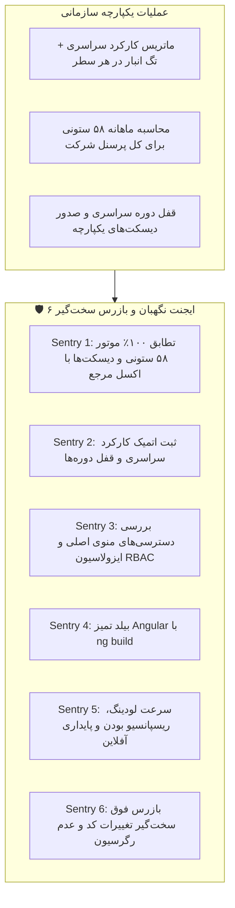

# طرح جامع سراسری‌سازی حقوق و کارکرد و حذف وابستگی به انبار (Global Personnel & Attendance Architecture)

## ۱. اهداف و نیازمندی‌های بیزنس

پرسنل شرکت دارایی‌های سازمانی در سطح کل شرکت هستند و نه متعلق به یک انبار فیزیکی خاص؛ ممکن است یک کارمند در طول ماه یا حتی در طول هفته در چند انبار مختلف فعالیت کند.
بنابراین:
1. **انتقال به منوی اصلی سیستم:** هر دو بخش «ثبت کارکرد و ناوگان» و «حقوق و دستمزد و دیسکت‌ها» در سایدبار اصلی سیستم قرار می‌گیرند و از سایدبار انبار حذف می‌شوند.
2. **سراسری‌سازی کارکرد و حقوق (Company-Wide Scope):** محاسبه ۵۸ ستونی حقوق، قفل دوره‌ها، صدور دیسکت‌های بیمه و مالیات برای کل پرسنل شرکت به صورت یکپارچه عمل می‌کند.
3. **انبار به عنوان برچسب (تگ) اختیاری:** انبار صرفاً به عنوان یک تگ/برچسب اختیاری در ردیف‌های کارکرد ثبت می‌شود تا مشخص باشد فرد در آن روز در کدام انبار کار کرده است.

---

## ۲. معماری ایجنت‌های نگهبان ۶ گانه (The 6 Sentry Guards)

---

## ۳. تغییرات در فایل‌ها

### فرانت‌اند:
- **`src/app/components/layout/layout.ts`:**
  - انتقال هر دو منوی `attendance` و `personnel` به `SYSTEM_NAV_ITEMS`.
  - حذف `attendance` از `WAREHOUSE_NAV_ITEMS`.
- **`src/app/components/personnel/warehouse-attendance/warehouse-attendance.html` و `warehouse-attendance.ts`:**
  - افزودن ستون «تگ انبار» به جدول ماتریس کارکرد روزانه.
  - حذف اخطار اجباری بودن انتخاب انبار در ثبت و ارسال دوره‌ها.
- **`src/app/components/personnel/personnel-management/personnel-management.html` و `personnel-management.ts`:**
  - حذف الزام انتخاب انبار برای محاسبه ۵۸ ستونی حقوق و صدور دیسکت‌ها.

### بک‌اند (Django):
- **`warehouse-backend/personnel/views.py`:**
  - پشتیبانی از `warehouse_id = None` در تجمیع و محاسبه حقوق ۵۸ ستونی، قفل دوره‌ها و ماتریس کارکرد سراسری.

---

## ۴. برنامه راستی‌آزمایی (Verification Plan)
- اجرای `python manage.py check` در بک‌اند.
- اجرای `ng build` و اطمینان از صفر بودن خطای کامپایلر فرانت‌اند.
- تست ثبت کارکرد با تگ‌های انبار مختلف برای پرسنل شناور.
- تست محاسبه حقوق ۵۸ ستونی برای کل پرسنل شرکت به صورت یکپارچه.
- تست صدور دیسکت‌های بیمه و مالیات در سطح کل سازمان.

