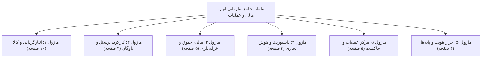
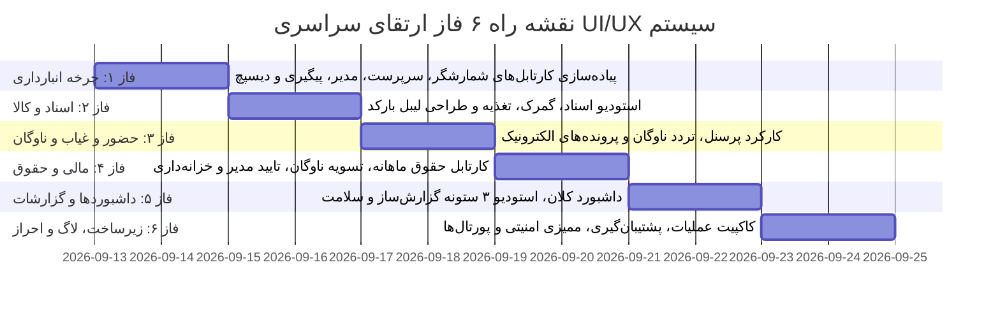

# 🏛️ طرح جامع، فازبندی‌شده و استاندارد ارتقای تمامی ۳۱ صفحه سامانه (Global UI/UX Master Implementation Plan)

این سند فنی، نقشه راه کلان، معماری، ماتریس انطباق و برنامه اجرایی گام‌به‌گام برای تعمیم **۱۲ الگوی استاندارد جهانی طراحی رابط کاربری (UI/UX) و پایداری عملکردی** بر روی **تمامی ۳۱ صفحه و کارتابل موجود** در سراسر زیرسیستم‌های نرم‌افزار (انبارگردانی، حسابداری و پرسنل، مرکز عملیات و زیرساخت کلان) را تشریح می‌کند.

---

> [!IMPORTANT]
> **اصل بنیادین عدم دستکاری کد پیش از تایید نهایی (Zero Code Modifications Before Approval):**
> مطابق با بند ۵ دستور صریح کاربر و قوانین کلان پروژه (`AGENTS.md`)، این سند یک طرح تفصیلی و معماری تصمیم‌گیرنده است. پس از نگارش این طرح و اسناد مکمل DUAL-SAVE، **هیچ خط کدی در سورس‌پروژه تغییر نخواهد کرد** تا زمانی که تاییدیه صریح و دستی کاربر به صورت متنی صادر شود.

---

## ۱. فهرست ۱۲ الگوی استاندارد مرجع (Design System Blueprint)

| ردیف | نام الگو | عنوان فنی (Technical Name) | خلاصه عملکرد و نقش استاندارد |
| :---: | :--- | :--- | :--- |
| **P-01** | دکمه‌های آیکونی هدر با نشانگر | `Icon-Square Actions with Badges` | تبدیل دکمه‌های متنی طولانی هدر به آیکون‌های فشرده مربعی با بج‌های شمارنده زنده |
| **P-02** | تجمیع هدر و عنوان واحد | `Header Consolidation & Single Title` | حذف عناوین تکراری در بدنه تب‌ها و ادغام اکشن‌ها و تب‌ها در هدر یکپارچه بالای صفحه |
| **P-03** | نوار فیلتر چندمعیاره | `Multi-Criteria Toolbar Filter Bar` | تعبیه همزمان جستجوی متنی، دراپ‌داون‌های فیلتر سازمانی و چیپ‌های وضعیت بالای جدول |
| **P-04** | انتخاب گروهی و نوار اقدام شناور | `Bulk Selection & Floating Bar` | مدیریت گزینش با `Set<number>` و نمایش بار تیره شیشه‌ای شناور با دکمه‌های اکشن گروهی |
| **P-05** | خروجی اکسل انتخابی در بک‌اند | `Selective Backend Excel Export` | پذیرش پارامتر `ids` در اکشن‌های `export_excel` جهت دانلود اکسل صرفاً برای منتخبین |
| **P-06** | صفحه‌بندی مدرن، فشرده و استاندارد | `Compact Modern Pagination` | حذف اسکرول بی‌نهایت و ایجاد فوتر ۳ بخشی (بازه سطرها، سلکتور اندازه صفحه، ناوبری) |
| **P-07** | معماری استودیو ۳ ستونه هم‌اندازه | `3-Column Equal-Height Studio` | چیدمان ۳ ستونه هم‌عرض (`grid-cols-3`) و هم‌ارتفاع (`h-[780px]`) با اسکرول مستقل پنل‌ها |
| **P-08** | تب‌بندی خرد سگمنتد در فرم‌ها | `In-Card Segmented Control` | تفکیک فرم‌های فوق‌العاده بلند به بخش‌های متمرکز با کنترل سگمنتد بدون رفرش صفحه |
| **P-09** | نوار پیشرفت بصری شاخص‌ها | `Visual Coverage & KPI Mini-Bar` | نمایش مینی‌پروگرس‌بار ظریف رنگی در کنار درصد پوشش یا پیشرفت شمارش و انطباق |
| **P-10** | پاپ‌اور پیش‌نمایش سریع داده‌ها | `Quick Inspection Popover` | نمایش کارت شناور خلاصه جزئیات رکورد با کلیک/هاور روی آیکون اطلاعات سریع |
| **P-11** | بارگذاری دفاعی با تایم‌اوت محافظتی | `Defensive Loading Safety Timeout` | سقف ۱.۵ ثانیه‌ای برای لود تصاویر و فال‌بک امن به آواتار متنی جهت جلوگیری از فریز UI |
| **P-12** | سوئیچ دوگانه نما با ذخیره محلی | `Persistent Dual View (Grid/Table)` | ارائه دو نمای کارتی و جدولی متراکم به همراه ماندگاری حالت در `localStorage` |

---

## ۲. ماتریس تطبیق و پوشش تمامی ۳۱ صفحه موجود پروژه

> [!NOTE]
> تمامی ۳۱ صفحه زیر به طور کامل و ۱۰۰٪ بررسی شده‌اند و جدول زیر نیازمندی‌های ارتقای هر صفحه به تفکیک ۱۲ الگو را مشخص می‌کند:

| ردیف | مسیر روت (Route) | نام صفحه / کارتابل | الگوهای اصلی قابل اعمال (Applied Patterns) | وضعیت جاری (Current State) |
| :---: | :--- | :--- | :--- | :--- |
| **۱** | `/app/warehouse/counter` | کارتابل انبارگردان (Counter) | P-01, P-03, P-04, P-09, P-11, P-12 | نیازمند نوار فیلتر ترکیبی و پیش‌نمایش سریع |
| **۲** | `/app/warehouse/supervisor` | کارتابل سرپرست انبار (Supervisor) | P-01, P-03, P-04, P-05, P-06, P-09, P-10 | نیازمند نوار شناور و خروجی انتخابی مغایرت‌ها |
| **۳** | `/app/warehouse/manager-review` | کارتابل مدیر انبار (Manager Review) | P-01, P-03, P-04, P-05, P-06, P-09, P-10 | نیازمند نوار اکشن گروهی و صفحه‌بندی مدرن |
| **۴** | `/app/warehouse/count-tracking` | پیگیری وضعیت شمارش (Count Tracking) | P-01, P-03, P-04, P-05, P-06, P-09, P-10 | نیازمند تعمیم نوار فیلتر و انتخاب گروهی |
| **۵** | `/app/warehouse/dispatch` | تخصیص کالا و استخر اقلام (Dispatch) | P-01, P-03, P-04, P-05, P-06, P-12 | نیازمند نوار شناور تخصیص و سوئیچ نما |
| **۶** | `/app/warehouse/docs` | کارتابل اسناد و فاکتورها (Docs) | P-01, P-02, P-03, P-04, P-05, P-07, P-11 | نیازمند استودیو ۳ ستونه تطبیق و پیش‌نمایش عکس |
| **۷** | `/app/warehouse/customs` | کارتابل امور گمرکی و مالی (Customs) | P-01, P-02, P-03, P-04, P-05, P-06, P-10 | نیازمند نوار فیلتر و اکسل انتخابی گمرک |
| **۸** | `/app/warehouse/feeding` | تغذیه فایل‌های MT و پایه (Feeding) | P-01, P-02, P-03, P-06, P-08 | نیازمند صفحه‌بندی استاندارد و تب‌های سگمنتد |
| **۹** | `/app/warehouse/wh-settings` | استودیو طراحی لیبل کالا (Label Studio) | P-01, P-02, P-07, P-08, P-11 | نیازمند ارتقا به معماری استودیو ۳ ستونه پریمیوم |
| **۱۰** | `/app/warehouse/placeholders` | صفحات کارتابل‌های در دست اقدام | P-01, P-02, P-08 | استانداردسازی تم و همگام‌سازی بصری |
| **۱۱** | `/app/finance/attendance` | کارکرد و حضور و غیاب پرسنل | P-01, P-02, P-03, P-04, P-05, P-06, P-09 | نیازمند نوار فیلتر ترکیبی و اکسل انتخابی |
| **۱۲** | `/app/finance/fleet` | کارکرد و تردد ماشین‌آلات و ناوگان | P-01, P-02, P-03, P-04, P-05, P-06, P-09 | نیازمند نوار اکشن گروهی و صفحه‌بندی |
| **۱۳** | `/app/finance/profiles` | پرونده الکترونیک پرسنل (Profiles Hub) | P-01, P-03, P-04, P-05, P-06, P-08, P-11 | نیازمند تب‌های سگمنتد داخل مودال پرونده |
| **۱۴** | `/app/finance/base-settings` | تنظیمات پایه حقوق، معافیت و شیفت | P-01, P-02, P-08 | نیازمند تقسیم فرم‌های محاسباتی به سگمنتد |
| **۱۵** | `/app/finance/finance-cartable` | کارتابل مالی و حقوق ماهانه (Payroll) | P-01, P-02, P-03, P-04, P-05, P-06, P-10 | نیازمند نوار شناور تایید و پاپ‌اور کسورات |
| **۱۶** | `/app/finance/fleet-settlement` | تسویه حساب پیمانکاران ناوگان | P-01, P-02, P-03, P-04, P-05, P-06, P-10 | نیازمند اکسل گزینشی و نوار انتخاب گروهی |
| **۱۷** | `/app/finance/manager-approvals` | کارتابل تاییدات مدیریت حقوق و کارکرد | P-01, P-02, P-03, P-04, P-05, P-09, P-10 | نیازمند نوار شناور تایید پرداخت و شاخص‌ها |
| **۱۸** | `/app/finance/treasury` | کارتابل خزانه‌داری و حواله بانکی | P-01, P-02, P-03, P-04, P-05, P-06, P-10 | نیازمند صفحه‌بندی متراکم و پاپ‌اور شبا |
| **۱۹** | `/app/finance/projects-and-sections`| ساختار پروژه‌ها، فازها و طرف‌حساب‌ها | P-01, P-02, P-03, P-05, P-06, P-12 | نیازمند سوئیچ نما و دراپ‌داون‌های فیلتر |
| **۲۰** | `/app/warehouse/dashboard` | داشبورد کلان انبارگردانی (Dashboard) | P-01, P-02, P-09, P-10 | نیازمند مینی‌پروگرس‌بارها و پاپ‌اور کارت‌ها |
| **۲۱** | `/app/warehouse/reports` | گزارش‌ساز پویا و جامع (Reports) | P-01, P-02, P-03, P-05, P-06, P-07, P-08 | نیازمند استودیو ۳ ستونه فیلتر-ستون-پیش‌نمایش |
| **۲۲** | `/app/warehouse/audit` | لاگ‌های ممیزی انبار (Audit - Wh) | P-01, P-02, P-03, P-05, P-06, P-10 | نیازمند صفحه‌بندی متراکم و اکسل انتخابی |
| **۲۳** | `/app/finance/audit` | لاگ‌های ممیزی مالی (Audit - Finance) | P-01, P-02, P-03, P-05, P-06, P-10 | نیازمند نوار فیلتر چندمعیاره و پاپ‌اور |
| **۲۴** | `/app/operations/cockpit` | کاکپیت فرماندهی مرکز عملیات | P-01, P-02, P-09, P-10 | نیازمند شاخص‌های پیشرفت بصری و هدر آیکونی |
| **۲۵** | `/app/operations/snapshots` | مدیریت نسخه‌های پشتیبان (Snapshots) | P-01, P-02, P-03, P-04, P-06, P-10 | نیازمند نوار اکشن گروهی و صفحه‌بندی |
| **۲۶** | `/app/operations/users` | مدیریت کلان پرسنل و دسترسی زیرساخت | P-01, P-02, P-03, P-04, P-05, P-06, P-09 | در چت جاری اجرا شد؛ تایید یکپارچگی |
| **۲۷** | `/app/operations/health` | مانیتورینگ سلامت زیرساخت کلان | P-01, P-02, P-09, P-10 | نیازمند نوار سلامت بصری و تایم‌اوت محافظتی |
| **۲۸** | `/app/operations/sync-monitor` | پایش همگام‌سازی و کش آفلاین (Sync) | P-01, P-02, P-03, P-06, P-09, P-10 | نیازمند صفحه‌بندی استاندارد و پروگرس سینک |
| **۲۹** | `/app/operations/rbac-governance` | حاکمیت ماتریس دسترسی سازمانی (RBAC) | P-01, P-02, P-03, P-09, P-10, P-12 | نیازمند نوار درصد پوشش و پاپ‌اور مجوزها |
| **۳۰** | `/app/warehouse/projects` | مدیریت انبارها و پروژه‌ها (Projects) | P-01, P-02, P-03, P-04, P-05, P-06, P-12 | نیازمند سوئیچ نما و فیلترهای چندمعیاره |
| **۳۱** | پورتال‌های ورود، رمز، لانچر و QR | `login`, `launcher`, `change-pwd`, `verify-card` | P-01, P-02, P-08, P-11 | نیازمند تایم‌اوت محافظتی و تب‌های شیشه‌ای |

---

## ۳. نقشه راه فازبندی‌شده اجرای پروژه (۶ فاز اجرایی)

---

### 🔴 فاز ۱: کارتابل‌های عملیاتی انبارگردانی و شمارش (صفحات ۱ تا ۵)
* **هدف فاز:** تجهیز زنجیره شمارش کالا به نوار فیلتر چندمعیاره، نوار شناور اقدام گروهی، خروجی اکسل انتخابی و صفحه‌بندی فشرده.
* **صفحات تحت پوشش:**
  1. [`counter-dashboard.html`](file:///e:/warehouse%20project/warehouse-front/src/app/components/counter/counter-dashboard/counter-dashboard.html)
  2. [`supervisor-dashboard.html`](file:///e:/warehouse%20project/warehouse-front/src/app/components/supervisor/supervisor-dashboard/supervisor-dashboard.html)
  3. [`manager-review.html`](file:///e:/warehouse%20project/warehouse-front/src/app/components/manager-review/manager-review.html)
  4. [`count-tracking.html`](file:///e:/warehouse%20project/warehouse-front/src/app/components/count-tracking/count-tracking.html)
  5. [`dispatch.html`](file:///e:/warehouse%20project/warehouse-front/src/app/components/dispatch/dispatch.html)
* **تسک‌های کلیدی:**
  - [ ] افزودن چک‌باکس انتخاب سطرها و اتصال به نوار شناور شیشه‌ای در پایین صفحه.
  - [ ] اعمال دکمه‌های آیکونی مربعی در هدر کارتابل‌ها با نشانگر زنده تعداد اقلام منتظر اقدام.
  - [ ] اضافه کردن نوار فیلتر ترکیبی بالای جدول (جستجو + انبار + وضعیت مغایرت).
  - [ ] اعمال صفحه‌بندی مدرن ۳ بخشی و حذف اسکرول بی‌نهایت سنگین.
  - [ ] اتصال اکشن‌های خروجی اکسل در بک‌اند به پارامتر `ids` انتخابی.

---

### 🟠 فاز ۲: کارتابل‌های اسناد، کالا، گمرک و لیبل (صفحات ۶ تا ۱۰)
* **هدف فاز:** تبدیل کارتابل اسناد و طراحی لیبل به استودیو ۳ ستونه هم‌ارتفاع، بارگذاری دفاعی تصاویر با تایم‌اوت محافظتی و اکسپورت انتخابی.
* **صفحات تحت پوشش:**
  6. [`docs.html`](file:///e:/warehouse%20project/warehouse-front/src/app/components/docs/docs.html)
  7. [`customs.html`](file:///e:/warehouse%20project/warehouse-front/src/app/components/customs/customs.html)
  8. [`feeding.html`](file:///e:/warehouse%20project/warehouse-front/src/app/components/feeding/feeding.html)
  9. [`wh-settings.html`](file:///e:/warehouse%20project/warehouse-front/src/app/components/wh-settings/wh-settings.html)
  10. [`placeholders.html`](file:///e:/warehouse%20project/warehouse-front/src/app/components/placeholders/placeholders.html)
* **تسک‌های کلیدی:**
  - [ ] طراحی استودیو ۳ ستونه در ماژول طراحی لیبل (ستون تنظیمات، بوم زنده و میز شیت چاپ).
  - [ ] اعمال تایم‌اوت محافظتی ۱۵۰۰ میلی‌ثانیه‌ای روی بارگذاری عکس کالاهای فاکتور و قبوض باسکول.
  - [ ] تجهیز کارتابل اسناد و امور گمرکی به انتخاب گروهی، نوار شناور و سوئیچ نمای کارت/جدول.
  - [ ] صفحه‌بندی متراکم در جداول اقلام پایه و لاگ‌های ایمپورت.

---

### 🟡 فاز ۳: کارکرد پرسنل، تردد ناوگان و پرونده‌ها (صفحات ۱۱ تا ۱۴)
* **هدف فاز:** تفکیک ارگونومیک جدول کارکرد پرسنل و ماشین‌آلات، اعمال فیلتر ترکیبی، اکسل انتخابی و سگمنتد کنترل پرونده‌ها.
* **صفحات تحت پوشش:**
  11. [`warehouse-attendance.html (Personnel)`](file:///e:/warehouse%20project/warehouse-front/src/app/components/personnel/warehouse-attendance/warehouse-attendance.html)
  12. [`warehouse-attendance.html (Fleet)`](file:///e:/warehouse%20project/warehouse-front/src/app/components/personnel/warehouse-attendance/warehouse-attendance.html)
  13. [`personnel-profiles.html`](file:///e:/warehouse%20project/warehouse-front/src/app/components/personnel/personnel-profiles/personnel-profiles.html)
  14. [`base-settings.html`](file:///e:/warehouse%20project/warehouse-front/src/app/components/personnel/base-settings/base-settings.html)
* **تسک‌های کلیدی:**
  - [ ] استقرار نوار فیلتر ترکیبی بالای تقویم کارکرد ماهانه (جستجوی فرد + فیلتر انبار + فیلتر وضعیت حضور).
  - [ ] اضافه شدن نوار شناور برای عملیات گروهی ثبت وضعیت (حاضر، غایب، مرخصی) روی منتخبین.
  - [ ] سازماندهی مودال پرونده پرسنل به تب‌های سگمنتد (اطلاعات فردی، مالی و بیمه، اسناد و امضاها).
  - [ ] صفحه‌بندی فشرده برای کارت‌های پرونده پرسنل و ماشین‌آلات ناوگان.

---

### 🟢 فاز ۴: کارتابل‌های مالی، حقوق و خزانه‌داری (صفحات ۱۵ تا ۱۹)
* **هدف فاز:** مجهزسازی کارتابل‌های مالی به نوار اقدام شناور تایید/رد، پاپ‌اور بازرسی سریع کسورات فیش حقوقی و خروجی دیسکت‌های انتخابی.
* **صفحات تحت پوشش:**
  15. [`finance-cartable.html (Payroll)`](file:///e:/warehouse%20project/warehouse-front/src/app/components/personnel/finance-cartable/finance-cartable.html)
  16. [`finance-cartable.html (Fleet)`](file:///e:/warehouse%20project/warehouse-front/src/app/components/personnel/finance-cartable/finance-cartable.html)
  17. [`manager-approvals.html`](file:///e:/warehouse%20project/warehouse-front/src/app/components/personnel/manager-approvals/manager-approvals.html)
  18. [`treasury-cartable.html`](file:///e:/warehouse%20project/warehouse-front/src/app/components/personnel/treasury-cartable/treasury-cartable.html)
  19. [`projects-and-sections.html`](file:///e:/warehouse%20project/warehouse-front/src/app/components/organization/projects-and-sections/projects-and-sections.html)
* **تسک‌های کلیدی:**
  - [ ] تعبیه نوار شناور تایید گروهی مالی و صدور مجوز پرداخت بانکی.
  - [ ] اضافه کردن پاپ‌اور سریع روی ردیف‌های حقوق جهت مشاهده ریز محاسبات (حق مسکن، بن کارگری، مالیات، سهم بیمه).
  - [ ] فعال‌سازی خروجی اکسل و دیسکت بانکی گزینشی برای سطرهای تیک‌خورده در بک‌اند.
  - [ ] یکسان‌سازی هدر کارتابل خزانه‌داری با دکمه‌های آیکونی مربعی و بج شمارنده حواله‌ها.

---

### 🔵 فاز ۵: داشبوردها، گزارش‌ساز و پایش سلامت (صفحات ۲۰ تا ۲۶)
* **هدف فاز:** استودیو ۳ ستونه موتور گزارش‌ساز، مینی‌پروگرس‌بارهای شاخص‌های کلیدی (KPI) و پایش بصری سلامت سرورها.
* **صفحات تحت پوشش:**
  20. [`dashboard.html`](file:///e:/warehouse%20project/warehouse-front/src/app/components/dashboard/dashboard.html)
  21. [`reports.html`](file:///e:/warehouse%20project/warehouse-front/src/app/components/reports/reports.html)
  22. [`health-dashboard.html (Warehouse)`](file:///e:/warehouse%20project/warehouse-front/src/app/components/health-dashboard/health-dashboard.html)
  23. [`health-dashboard.html (Finance)`](file:///e:/warehouse%20project/warehouse-front/src/app/components/health-dashboard/health-dashboard.html)
  24. [`operations-cockpit.html`](file:///e:/warehouse%20project/warehouse-front/src/app/components/operations/operations-cockpit/operations-cockpit.html)
  25. [`operations-sync-monitor.html`](file:///e:/warehouse%20project/warehouse-front/src/app/components/operations/operations-sync-monitor/operations-sync-monitor.html)
  26. [`health-dashboard.html (Operations)`](file:///e:/warehouse%20project/warehouse-front/src/app/components/health-dashboard/health-dashboard.html)
* **تسک‌های کلیدی:**
  - [ ] بازطراحی صفحه گزارش‌ساز به معماری استودیو ۳ ستونه: پنل فیلترها، پنل انتخاب ستون‌ها و پنل پیش‌نمایش جدول زنده.
  - [ ] تجهیز ویجت‌های داشبورد به نوارهای پیشرفت بصری گرادیانی با تفکیک انبارها.
  - [ ] پاپ‌اورهای بازرسی سریع روی نودهای مانیتورینگ سلامت دیتابیس، کش ردیس و ترافیک وب‌سوکت.
  - [ ] صفحه‌بندی متراکم در جدول رخدادهای همگام‌سازی و قطعی‌های شبکه.

---

### 🟣 فاز ۶: زیرساخت، حاکمیت RBAC، لاگ و پورتال‌های عمومی (صفحات ۲۷ تا ۳۱)
* **هدف فاز:** ممیزی لاگ‌های امنیتی، مدیریت اسنپ‌شات‌ها، حاکمیت ماتریس دسترسی، لانچر هوشمند و ورود.
* **صفحات تحت پوشش:**
  27. [`projects.html`](file:///e:/warehouse%20project/warehouse-front/src/app/components/projects/projects.html)
  28. [`settings.html & backup-tab.html`](file:///e:/warehouse%20project/warehouse-front/src/app/components/settings/settings.html)
  29. [`audit.html (Security & All Scopes)`](file:///e:/warehouse%20project/warehouse-front/src/app/components/audit/audit.html)
  30. [`operations-rbac-governance.html`](file:///e:/warehouse%20project/warehouse-front/src/app/components/operations/operations-rbac-governance/operations-rbac-governance.html)
  31. [`login`, `launcher`, `change-pwd`, `verify-card`](file:///e:/warehouse%20project/warehouse-front/src/app/components/login/login.html)
* **تسک‌های کلیدی:**
  - [ ] تجهیز جدول لاگ‌های ممیزی به صفحه‌بندی مدرن، فیلتر ترکیبی و خروجی اکسل انتخابی.
  - [ ] اعمال نوار درصد پوشش مجوزهای RBAC و بازرسی سریع نقش‌ها در حاکمیت امنیت.
  - [ ] پشتیبانی از سوئیچ نما (کارت/جدول) در مدیریت انبارها و پروژه‌ها.
  - [ ] پیاده‌سازی تایم‌اوت محافظتی در استعلام و بررسی کارت دیجیتال در پورتال عمومی.

---

## ۴. معیارهای پذیرش و اعتبارسنجی کیفی (Quality Acceptance Criteria)

| معیار پذیرش | ابزار و روش راستی‌آزمایی | شرط قبولی قطعی |
| :--- | :--- | :--- |
| **۱. کامپایل بدون خطای تایپ‌اسکریپت و قالب** | `npm run build` در `warehouse-front` | بیلد موفق تولیدی با کد خروجی ۰ (`Exit code: 0`) |
| **۲. یکپارچگی سیستم بک‌اند جنگو** | `python manage.py check` | اجرای سیستم بدون ارور (`0 issues identified`) |
| **۳. سرعت تعامل بدون لگ** | ابزار DevTools Performance | پاسخ رابط کاربری و باز شدن پاپ‌اورها زیر ۱۰۰ میلی‌ثانیه |
| **۴. عدم به هم ریختگی در صفحات کوچک** | تست ریسپانسیو در تبلت (768px) و موبایل | عدم اسکرول افقی ناخواسته در کل صفحه |
| **۵. حفظ داده‌های انتخاب‌شده بین صفحات** | تست سناریوی انتخاب چندگانه و صفحه‌بندی | نگهداری شناسه‌ها در `Set` و لغو صریح با دکمه انصراف |

---

> [!CAUTION]
> **قفل اجرای خودکار و استانداردهای کدبیس:**
> هیچ کدی نباید پیش از تایید صریح انسان تغییر کند. این طرح کلیه ۳۱ صفحه را طبق درخواست کاربر بدون هیچ‌گونه قلم‌افتادگی پوشش داده و آماده بررسی نهایی است.

