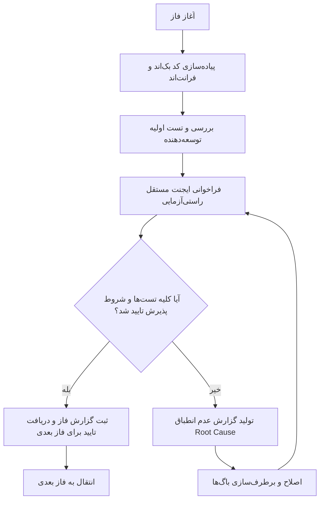

# طرح جامع تفکیک دسترسی‌های حساس و عملیاتی سیستم انبارداری (Granular RBAC Architecture)

این سند نقشه راه جامع و فازبندی‌شده برای تفکیک دسترسی‌های حساس، بحرانی و عملیاتی در سامانه اتوماسیون انبارداری بر اساس اصول **حداقل اختیارات (Principle of Least Privilege)** و **تفکیک وظایف (Separation of Duties - SoD)** است.

> [!IMPORTANT]
> **قانون ارزیابی و تایید مستقل (Independent Agent Verification Rule):**
> ورود به هر فاز جدید منوط به اتمام کامل پیاده‌سازی، اجرای تست‌های خودکار و **تایید قطعی توسط ایجنت مستقل راستی‌آزمایی** در فاز قبلی است. در صورت بروز هرگونه خطا یا عدم تطابق با معیارهای پذیرش (Acceptance Criteria)، فرایند اصلاح و اعتبارسنجی تکرار خواهد شد.

---

## نیازمندی‌های تایید و بررسی توسط کاربر (User Review Required)

> [!WARNING]
> این تغییرات شامل افزودن دسترسی‌های جدید به مدل کاربر (`CustomUser`) و ایجاد مایگریشن‌های جدید جنگو بدون تغییر یا حذف مایگریشن‌های قبلی است. تمامی دسترسی‌های پیشین حفظ و ارتقا می‌یابند تا اختلالی در عملکرد کاربران جاری ایجاد نگردد.

---

## ماتریس جامع تفکیک دسترسی‌های حساس و عملیاتی

| ردیف | حوزه عملیاتی | دسترسی قبلی (یکپارچه) | دسترسی‌های جدید و تفکیک‌شده (Granular Permissions) | عنوان فارسی | سطح حساسیت |
| :---: | :--- | :--- | :--- | :--- | :--- |
| **۱** | پشتیبان‌گیری و بازیابی | `perm_sys_backup_restore` | `perm_sys_backup_manage` | مشاهده لیست، بررسی سلامت هش و ایجاد نسخه پشتیبان | حساس (Sensitive) |
| | | | `perm_sys_backup_restore` | بازیابی و بازنویسی کامل دیتابیس (با تاییدیه امنیتی صریح) | فوق‌العاده حساس (Critical) |
| **۲** | لاگ‌های ممیزی امنیتی | `perm_sys_purge_logs` | `perm_sys_audit_export` | خروجی گرفتن و آرشیو فایل لاگ‌های ممیزی | متوسط (Operational) |
| | | | `perm_sys_purge_logs` | پاکسازی و حذف قطعی لاگ‌ها از پایگاه داده | فوق‌العاده حساس (Critical) |
| **۳** | بازگردانی و احیای داده‌ها | `perm_rollback_data` | `perm_rollback_single` | بازگردانی موردی یک فیلد یا یک سند به نسخه قبل | متوسط (Supervisory) |
| | | | `perm_rollback_bulk` | بازگردانی گروهی و زمانی تراکنش‌ها | فوق‌العاده حساس (Critical) |
| | | | `perm_restore_deleted` | احیای رکوردهای حذف‌شده (Undelete) | متوسط (Supervisory) |
| **۴** | تاییدات سرپرست و انبارگردانی | `view_wh_doc_approvals` `view_wh_feed_approvals` | `perm_doc_approve_action` | حق امضا و تایید/رد اسناد کالا در کارتابل سرپرست | عملیاتی / سرپرستی |
| | | | `perm_feed_approve_action` | حق امضا و تایید/رد رکوردهای تغذیه MT | عملیاتی / سرپرستی |
| | | | `perm_inventory_finalize` | تایید نهایی مغایرت‌ها و بستن دوره انبارگردانی | حساس (Managerial) |

---

## فازبندی تفصیلی و نقشه راه اجرا

### فاز ۱: تفکیک دسترسی‌های پشتیبان‌گیری و بازیابی پایگاه‌داده (Database Backup vs. Restore)
* **هدف:** تفکیک اکشن‌های امن و غیرمخرب (مشاهده لیست، بررسی یکپارچگی هش و تولید فایل بکاپ) از عملیات تخریبی و بازنویسی دیتابیس.
* **تغییرات بک‌اند:**
  * ثبت پرمیشن `perm_sys_backup_manage` در `accounts/models.py`.
  * اعمال گارد `perm_sys_backup_manage` برای متدهای `list`، `create` و `verify` در `DatabaseBackupViewSet`.
  * حفظ گارد اختصاصی `perm_sys_backup_restore` به انضمام تایید متنی `RESTORE_DATABASE_CONFIRM` منحصراً برای اکشن `restore`.
* **تغییرات فرانت‌اند:**
  * تفکیک وضعیت دسترسی دکمه‌های «پشتیبان‌گیری جدید» و «بازیابی پایگاه داده» در تب تنظیمات سیستم (`wh-settings.ts` / `wh-settings.html`).
* **معیار پذیرش و راستی‌آزمایی ایجنت مستقل (Phase 1 Acceptance Criteria):**
  * کاربر دارای `perm_sys_backup_manage` بتواند بکاپ بگیرد ولی در درخواست به `/api/accounts/database-backups/restore/` خطای `403 Forbidden` دریافت کند.
  * کاربر دارای `perm_sys_backup_restore` بتواند با تاییدیه متنی عملیات بازیابی را آغاز کند.

---

### فاز ۲: تفکیک خروجی/آرشیو لاگ‌ها از پاکسازی قطعی (Audit Export vs. Purge)
* **هدف:** اعطای مجوز گزارش‌گیری و دانلود لاگ به بازرسان بدون دادن حق امحای لاگ‌ها.
* **تغییرات بک‌اند:**
  * ثبت پرمیشن `perm_sys_audit_export` در مدل کاربر و دستور بذر (`seed_permissions.py`).
  * تفکیک متد خروجی اکسل/CSV لاگ‌ها (`export_audit_logs`) و اعمال گارد `perm_sys_audit_export`.
  * مقید ساختن اکشن `purge_audit_logs` به پرمیشن بحرانی `perm_sys_purge_logs` + ثبت لاگ ممیزی امنیتی برای خود عملیات پاکسازی.
* **تغییرات فرانت‌اند:**
  * کنترل نمایش دکمه «خروجی لاگ‌ها (Export CSV/Excel)» با پرمیشن آرشیو و مجزا ساختن آن از دکمه خطرناک «پاکسازی لاگ‌ها».
* **معیار پذیرش و راستی‌آزمایی ایجنت مستقل (Phase 2 Acceptance Criteria):**
  * دسترسی اکسپورت بدون دسترسی پرژ کار کند و متد پرژ برای کاربران فاقد مجوز صریح با `403` رد شود.

---

### فاز ۳: تفکیک سطوح رول‌بک و احیای داده‌ها (Single, Bulk, Undelete)
* **هدف:** کاهش ریسک تخریب دسته‌ای اطلاعات و تفکیک صلاحیت سرپرستان از مدیران ارشد.
* **تغییرات بک‌اند:**
  * افزودن دسترسی‌های `perm_rollback_single`، `perm_rollback_bulk` و `perm_restore_deleted` به `SENSITIVE_PERMISSION_CODENAMES`.
  * به‌روزرسانی `AuditRollbackViewSet` جهت اعتبارسنجی دقیق نوع اکشن درخواستی:
    * اکشن رول‌بک تکی (`revert_field` / `revert_record`): نیاز به `perm_rollback_single` یا Superuser.
    * اکشن رول‌بک گروهی و تراکنشی (`revert_batch` / `revert_time_range`): نیاز به `perm_rollback_bulk` یا Superuser.
    * اکشن احیای داده‌های حذف‌شده (`restore_soft_deleted`): نیاز به `perm_restore_deleted` یا Superuser.
* **تغییرات فرانت‌اند:**
  * تطبیق دکمه‌های «بازگردانی این فیلد»، «بازگردانی کل تغییرات این لاگ» و «احیای رکورد حذف‌شده» در مودال‌های ممیزی با دسترسی‌های جدید.
* **معیار پذیرش و راستی‌آزمایی ایجنت مستقل (Phase 3 Acceptance Criteria):**
  * تست رول‌بک تکی با مجوز `perm_rollback_single` با موفقیت پاس شود اما درخواست رول‌بک گروهی همان کاربر مسدود گردد.

---

### فاز ۴: تفکیک اکشن‌های تایید و امضا از دسترسی‌های صرفاً نمایشی (Action vs. View)
* **هدف:** تفکیک حق مشاهده اسناد منتظر تایید از حق امضا و تغییر وضعیت اسناد (مناسب حسابرسان و ناظران).
* **تغییرات بک‌اند:**
  * افزودن `perm_doc_approve_action` و `perm_feed_approve_action` و `perm_inventory_finalize`.
  * اعمال گارد روی اکشن‌های تایید نهایی کالا، تایید رکوردهای تغذیه و صدور فایل تغذیه/بستن دوره.
* **تغییرات فرانت‌اند:**
  * فعال/غیرفعال بودن دکمه‌های تایید/رد در کارتابل‌ها بر اساس مجوز اکشن (در صورتی که کاربر فقط دسترسی `view_` داشته باشد، کارتابل به صورت Read-Only با دکمه‌های غیرفعال باز می‌شود).
* **معیار پذیرش و راستی‌آزمایی ایجنت مستقل (Phase 4 Acceptance Criteria):**
  * کاربر دارای مجوز View بتواند کارتابل را ببیند ولی نتواند دکمه‌های تایید/رد را بزند و اندپوینت API نیز درخواست‌های تایید وی را مسدود نماید.

---

### فاز ۵: به‌روزرسانی پنل مدیریت نقش‌ها، بذر داده‌ها و آزمون یکپارچه امنیتی
* **هدف:** یکپارچه‌سازی کامل در ماتریس نقش‌ها و کاربران در رابط کاربری و ارزیابی نهایی.
* **اقدامات:**
  * اجرای فرمان `makemigrations` و `migrate` جهت ثبت رسمی پرمیشن‌ها در دیتابیس.
  * به‌روزرسانی `seed_permissions.py` جهت دسته‌بندی و رنگ‌بندی شفاف پرمیشن‌های حساس در UI.
  * به‌روزرسانی کامپوننت `wh-users` و `wh-roles` در فرانت‌اند برای نمایش چک‌باکس‌های تفکیک‌شده با آیکون و نشانگر سطح حساسیت.
  * اجرای تست‌های خودکار سرتاسری (E2E & Unit Tests).
* **معیار پذیرش نهایی (Final Acceptance):**
  * کلیه تست‌های اعتبارسنجی با خروجی سبز (Passed) به اتمام برسند و گزارش مستند نهایی در `walkthrough` ثبت گردد.

---

## پروتکل اعتبارسنجی ایجنت مستقل و فرایند تکرار (Independent Agent Verification Protocol)

