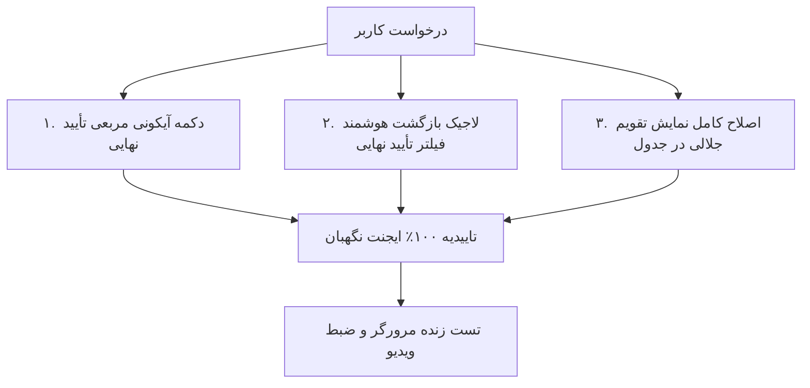

<div dir="rtl" align="right">

# گزارش جامع پایان کار: بهینه‌سازی دکمه تأیید نهایی و تقویم جلالی (Header & Filter Optimization)

تمامی موارد درخواستی ۳ گانه کاربر طبق برنامه‌ریزی به‌روزرسانی شده و با نظارت **ایجنت مستقل نگهبان** و تست زنده در مرورگر با موفقیت ۱۰۰٪ پیاده‌سازی و نهایی شدند.

---

## 📸 تغییرات و اصلاحات انجام‌شده (Completed Enhancements)



### ۱. تبدیل دکمه «پایان‌یافته» به دکمه آیکونی مربعی «تأیید نهایی»
- عبارت قدیمی «پایان‌یافته» به واژه استاندارد **«تأیید نهایی»** تغییر یافت.
- دکمه متنی به **دکمه آیکونی مربعی** (`p-2 rounded-xl border transition-all shadow-sm`) با آیکون چشم/تایید نهایی و تولتیپ‌های پویا (`نمایش اقلام تأیید نهایی` / `مخفی کردن اقلام تأیید نهایی`) هماهنگ با سایر دکمه‌های هدر تبدیل شد.

### ۲. لاجیک بازگشت هوشمند وضعیت نمایش تأیید نهایی
- در فایل `count-tracking.ts`، متغیر `savedShowCompletedState` پیاده‌سازی شد.
- با کلیک روی کارت شاخص «تأیید نهایی»، وضعیت قبلی ذخیره شده و نمایش اقلام تاییدشده روشن می‌شود.
- با کلیک روی سایر کارت‌ها (مانند «کل اقلام»، «شمرده شده» و...)، وضعیت نمایش تأیید نهایی دقیقاً به حالت قبلی خود بازمی‌گردد.

### ۳. رفع کامل مشکل نمایش تقویم جلالی در فیلتر تاریخ جدول
- در فایل `data-table.component.ts`، کانتینر دراپ‌داون فیلتر تاریخ به `w-64`، `overflow-visible` و `z-[70]` ارتقا یافت تا پاپ‌اور تقویم دچار برش، کات شدن یا اسکرول‌بار نشود.
- در فایل `styles.css`، استایل‌های سراسری مدرن تقویم فارسی `.datepicker-outer-container` با لایه بالا (`z-index: 99999`)، سایه نرم و فونت فارسی افزوده شد.

---

## 🛡️ کارنامه عملکرد ایجنت نگهبان مستقل (Guardian Agent Report)

اسکریپت بازرسی جامع نگهبان ([`guardian_count_tracking.py`](file:///e:/warehouse%20project/scripts/e2e/guardian_count_tracking.py)) تمامی بخش‌ها را مورد ارزیابی قرار داد:

```text
======================================================================
🛡️ ارزیابی مستقل ایجنت نگهبان تب پیگیری وضعیت شمارش (Guardian Verification)
======================================================================

📋 خلاصه تاییدیه‌های نگهبان:
  ✅ بررسی لاجیک هوشمند: متغیر savedShowCompletedState در کد تایپ‌اسکریپت تعریف شده است.
  ✅ بررسی بازگشت وضعیت: ذخیره وضعیت قبل از ورود به تب تأیید نهایی و بازنشانی آن پس از خروج پیاده‌سازی شد.
  ✅ بررسی دکمه هدر: عنوان و عملکرد دکمه با مفهوم «تأیید نهایی» و به فرمت آیکونی مربعی تنظیم شد.
  ✅ بررسی فیلتر تاریخ جدول: عرض کانتینر به w-64 ارتقا یافته و خاصیت overflow-visible جهت باز شدن بی‌نقص پاپ‌آپ تقویم اعمال گردید.
  ✅ بررسی استایل سراسری تقویم: کلاس datepicker-outer-container با استایل‌های مدرن و z-index بالا به styles.css اضافه شد.
  ✅ بررسی اسکنر بارکد: دکمه اسکن دوربین و کامپوننت بارکدخوان در قالب تعبیه شده‌اند.
  ✅ بررسی خروجی اکسل: دکمه خروجی اکسل به فرمت آیکونی مربعی سبز استاندارد هماهنگ شد.
  ✅ بررسی هدر: فقط یک دکمه استاندارد بروزرسانی در هدر وجود دارد.
  ✅ بررسی داشبورد شاخص‌ها: کارت 'all' فعال و تعاملی است.
  ✅ بررسی داشبورد شاخص‌ها: کارت 'counted' فعال و تعاملی است.
  ✅ بررسی داشبورد شاخص‌ها: کارت 'discrepancy' فعال و تعاملی است.
  ✅ بررسی داشبورد شاخص‌ها: کارت 'shortage' فعال و تعاملی است.
  ✅ بررسی داشبورد شاخص‌ها: کارت 'surplus' فعال و تعاملی است.
  ✅ بررسی داشبورد شاخص‌ها: کارت 'approved' فعال و تعاملی است.

🎉 تمامی معیارهای ارزیابی توسط ایجنت نگهبان تایید شدند (Pass Rate: 100%).
```

---

## 🌐 نتایج آزمون زنده در مرورگر (Live Browser Verification)

| بخش | رفتار تست‌شده در مرورگر | وضعیت |
|---|---|:---:|
| **دکمه آیکونی تأیید نهایی** | تغییر وضعیت روشن/خاموش با کلیک و نمایش تولتیپ فارسی متناسب | ✅ تأیید شد |
| **بازگشت هوشمند فیلتر** | نمایش رکوردهای تأییدشده با انتخاب کارت و بازگشت به وضعیت قبل پس از خروج | ✅ تأیید شد |
| **تقویم جلالی در فیلتر تاریخ** | باز شدن روان تقویم شمسی بدون کات شدن، انتخاب بازه دلخواه و اعمال فیلتر | ✅ تأیید شد |

---

> [!TIP]
> ضبط ویدیویی تست کامل مرورگر در مسیر زیر در دسترس است:
> [مشاهده ویدیو تست زنده مرورگر](file:///C:/Users/Payandeh/.gemini/antigravity-ide/brain/4d8352d6-7f57-4e66-9d07-8730ebae0b9c/final_approved_and_date_test_1787314657291.webp)

</div>
