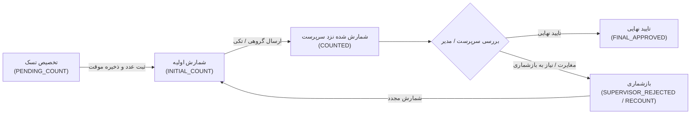

<div dir="rtl" align="right">

# طرح جامع پیاده‌سازی وضعیت «شمارش اولیه» در فرآیند انبارگردانی (Initial Count Workflow)

این سند معماری فنی، تحلیل دقیق فرآیند و فازبندی گام‌به‌گام اضافه شدن وضعیت **«شمارش اولیه» (`INITIAL_COUNT`)** به چرخه حیات تسک‌های انبارگردانی (`CountTask`) را در هر دو لایه بک‌اند (Django) و فرانت‌اند (Angular + Dexie Local-First) تبیین می‌کند.

---

## ۱. اهداف و نیازمندی‌های سیستم (Problem Statement & Goals)

در ساختار فعلی، تسک به محض ایجاد در وضعیت `PENDING_COUNT` («در انتظار شمارش») قرار می‌گیرد و تنها دو حالت برای شمارشگر قابل مشاهده است: تسک دست‌نخورده و تسک نهایی‌شده (`COUNTED`). 

### چالش‌های ساختار قبلی:
1. **عدم تفکیک اقلام دست‌نخورده از اقلام در دست اقدام:** مدیر و سرپرست نمی‌توانند تشخیص دهند شمارشگر روی کدام اقلام کار کرده و شمارش فیزیکی اولیه را ثبت کرده است.
2. **ابهام در پیش‌نویس‌های محلی:** شمارشگر پس از وارد کردن مقدار در فرم، مایل است مطمئن شود قلم در سیستم با برچسب مشخص «شمارش اولیه» علامت‌گذاری شده تا قبل از ارسال دسته‌ای (Bulk Submit) کل انبار، بازبینی راحتی داشته باشد.
3. **گزارش‌گیری و مانیتورینگ دقیق‌تر:** ایجاد امکان پایش درصد پیشرفت عملیات بر اساس ۴ مرحله مجزا: **دست‌نخورده $\rightarrow$ شمارش اولیه $\rightarrow$ بازشماری $\rightarrow$ تکمیل شده/نزد سرپرست**.



---

## ۲. بررسی نیازمندی به تایید کاربر (User Review Required)

> [!IMPORTANT]
> **تصمیمات کلیدی فرآیندی جهت تایید نهایی:**
> 1. **نام‌گذاری و عنوان وضعیت:** عنوان رسمی در سیستم به صورت `شمارش اولیه (ثبت موقت)` با کلید فنی `INITIAL_COUNT` ثبت می‌شود.
> 2. **رفتار خودکار هنگام ذخیره فرم:** وقتی انبارگردان در صفحه جزئیات کالا مقدار شمارش‌شده را وارد کرده و دکمه **ذخیره / Ctrl+Enter** را می‌زند، وضعیت تسک از `PENDING_COUNT` به `INITIAL_COUNT` ارتقا می‌یابد.
> 3. **شرایط ارسال گروهی:** دکمه «ارسال به سرپرست» هم اقلام در وضعیت `PENDING_COUNT` (در صورت داشتن عدد) و هم اقلام در وضعیت `INITIAL_COUNT` و `SUPERVISOR_REJECTED` را به عنوان اقلام آماده ارسال به سرپرست (`COUNTED`) منتقل می‌کند.

---

## ۳. معماری تغییرات پیشنهادی (Proposed Changes)

| ردیف | لایه / کامپوننت | فایل‌های هدف | شرح تغییرات |
| :--- | :--- | :--- | :--- |
| **۱** | **مدل و دیتابیس بک‌اند** | [models.py](file:///e:/warehouse%20project/warehouse-backend/inventory/models.py) | افزودن `INITIAL_COUNT` به `STATUS_CHOICES` در مدل `CountTask` و ایجاد مایگریشن |
| **۲** | **ویوها و کنترلرهای بک‌اند** | [views.py](file:///e:/warehouse%20project/warehouse-backend/inventory/views.py) | به‌روزرسانی متد `bulk_submit`، کوئری‌های فیلتر و اکشن‌های سرپرست/شمارشگر |
| **۳** | **رجیستری و گزارشات بک‌اند** | [registry.py](file:///e:/warehouse%20project/warehouse-backend/reports/registry.py) | افزودن لیبل فارسی و فیلتر وضعیت در رجیستری گزارش‌ساز جامع |
| **۴** | **تایپ‌ها و مدل‌های فرانت‌اند** | [count-task.model.ts](file:///e:/warehouse%20project/warehouse-front/src/app/core/models/count-task.model.ts) | افزودن `INITIAL_COUNT` به `CountTaskStatus` و اکشن‌های تاریخچه |
| **۵** | **لایه Local-First و آفلاین** | [count-task-store.ts](file:///e:/warehouse%20project/warehouse-front/src/app/core/services/count-task-store.ts) | ارتقای وضعیت به `INITIAL_COUNT` در متد `saveDraft` و هماهنگی با صف همگام‌سازی Dexie |
| **۶** | **داشبورد انبارگردان (UI & Logic)** | [counter-dashboard.ts](file:///e:/warehouse%20project/warehouse-front/src/app/components/counter/counter-dashboard/counter-dashboard.ts)<br>[counter-dashboard.html](file:///e:/warehouse%20project/warehouse-front/src/app/components/counter/counter-dashboard/counter-dashboard.html) | افزودن چیپ فیلتر «شمارش اولیه»، به‌روزرسانی شمارنده‌ها، بج اختصاصی و منطق دسترسی ویرایش |
| **۷** | **مانیتورینگ و رهگیری شمارش** | [count-tracking.ts](file:///e:/warehouse%20project/warehouse-front/src/app/components/count-tracking/count-tracking.ts)<br>[count-tracking.html](file:///e:/warehouse%20project/warehouse-front/src/app/components/count-tracking/count-tracking.html) | افزودن ستون وضعیت، بج رنگی (Indigo/Purple)، محاسبه زمان توقف و فیلترهای زنده |

---

## ۴. فازبندی اجرایی گام‌به‌گام (Implementation Phases)

### 🔹 فاز ۱: زیرساخت داده و بک‌اند (Backend Foundation & Migrations)
1. **به‌روزرسانی مدل [CountTask](file:///e:/warehouse%20project/warehouse-backend/inventory/models.py):**
   * اضافه کردن گزینه `('INITIAL_COUNT', 'شمارش اولیه (ثبت موقت)')` به `STATUS_CHOICES`.
   * اجرای دستور `makemigrations` و `migrate` برای ساخت مایگریشن رو به جلو بدون حذف یا تغییر مایگریشن‌های پیشین.
2. **اصلاح اکشن `bulk_submit` در [views.py](file:///e:/warehouse%20project/warehouse-backend/inventory/views.py):**
   * گسترش شرط فیلتر تسک‌های مجاز برای ارسال به سرپرست:
     ```python
     status__in=['PENDING_COUNT', 'INITIAL_COUNT', 'SUPERVISOR_REJECTED', 'MANAGER_REJECTED']
     ```
3. **پشتیبانی در تاریخچه [CountTaskHistory](file:///e:/warehouse%20project/warehouse-backend/inventory/models.py):**
   * ثبت اکشن `INITIAL_COUNT` در لاگ تغییرات تسک هنگام ثبت شمارش اولیه.

---

### 🔹 فاز ۲: لایه داده محلی و همگام‌سازی آفلاین فرانت‌اند (Dexie & Store Layer)
1. **به‌روزرسانی مدل [count-task.model.ts](file:///e:/warehouse%20project/warehouse-front/src/app/core/models/count-task.model.ts):**
   * اضافه شدن `INITIAL_COUNT` به اتحادیه تایپ‌های وضعیت `CountTaskStatus`.
2. **ارتقای مخزن محلی [count-task-store.ts](file:///e:/warehouse%20project/warehouse-front/src/app/core/services/count-task-store.ts):**
   * در متد `saveDraft`، در صورتی که تسک در وضعیت `PENDING_COUNT` باشد و کاربر عدد شمارش را ثبت کند، وضعیت به صورت محلی و خوش‌بینانه به `INITIAL_COUNT` تغییر می‌یابد.
   * ثبت در صف سینک آفلاین با اکشن متناظر جهت همگام‌سازی بی‌درنگ با سرور در صورت اتصال اینترنت.

---

### 🔹 فاز ۳: ارتقای رابط کاربری داشبورد انبارگردان (Counter Dashboard UI/UX)
1. **سیستم فیلتر و چیپ‌های وضعیت در [counter-dashboard.ts](file:///e:/warehouse%20project/warehouse-front/src/app/components/counter/counter-dashboard/counter-dashboard.ts):**
   * بازطراحی `statusCounts` جهت تفکیک ۴ وضعیت:
     * **همه (All):** تمام اقلام
     * **دست‌نخورده (Pending):** فقط `PENDING_COUNT`
     * **شمارش اولیه (Initial Count):** تسک‌های دارای وضعیت `INITIAL_COUNT`
     * **نیاز به بازشماری (Recount):** تسک‌های رد شده توسط سرپرست یا مدیر
     * **تکمیل شده (Completed):** تسک‌های ارسال شده به سرپرست/مدیر
2. **طراحی بصری و بج‌ها در [counter-dashboard.html](file:///e:/warehouse%20project/warehouse-front/src/app/components/counter/counter-dashboard/counter-dashboard.html):**
   * طراحی بج اختصاصی مدرن با تم بنفش/نیلی (`bg-indigo-50 text-indigo-700 border-indigo-200`) برای وضعیت «شمارش اولیه».
   * نمایش وضعیت صریح «شمارش اولیه» در کارت‌های کالا و فرم جزئیات.
   * به‌روزرسانی کلیدهای میانبر (`Ctrl+Enter` و غیره) برای ذخیره در این وضعیت.

---

### 🔹 فاز ۴: مانیتورینگ زنده و گزارش‌ساز (Count Tracking & Reports)
1. **به‌روزرسانی کارتابل رهگیری [count-tracking.ts](file:///e:/warehouse%20project/warehouse-front/src/app/components/count-tracking/count-tracking.ts):**
   * افزودن رنگ و برچسب `INITIAL_COUNT` به جدول مانیتورینگ زنده انبار.
   * محاسبه دقیق مدت زمان توقف کالا در مرحله شمارش اولیه توسط انبارگردان.
2. **سازگاری خروجی اکسل و گزارش‌ساز:**
   * نمایش نام خوانا و استاندارد فارسی برای ستون وضعیت در خروجی‌های اکسل.

---

### 🔹 فاز ۵: تست جامع، بیلد و راستی‌آزمایی (Verification & Build Check)
1. **تست بیلد فرانت‌اند و بک‌اند:** اطمینان از عدم وجود خطای تایپ‌اسکریپت و صحت مایگریشن‌های جنگو.
2. **راستی‌آزمایی جریان آفلاین/آنلاین:** تست ثبت شمارش در حالت قطع اتصال، تایید بروزرسانی برچسب به «شمارش اولیه» و سپس همگام‌سازی پس از اتصال مجدد.
3. **تست جریان ارسال به سرپرست:** ارسال گروهی اقلام شمارش اولیه و مشاهده در کارتابل سرپرست.

</div>
