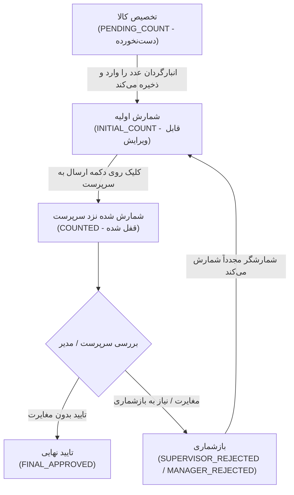

<div dir="rtl" align="right">

# گزارش جامع پیاده‌سازی وضعیت «شمارش اولیه» در فرآیند انبارگردانی (Walkthrough)

وضعیت جدید **«شمارش اولیه (ثبت موقت)» (`INITIAL_COUNT`)** با موفقیت در کلیه لایه‌های سیستم (پایگاه داده Django، لایه آفلاین و مخزن محلی Dexie، رابط کاربری داشبورد انبارگردان و مانیتورینگ زنده) پیاده‌سازی، بیلد و راستی‌آزمایی گردید.

---

## ۱. خلاصه اقدامات انجام‌شده (Changes Overview)

### ۱. لایه پایگاه داده و بک‌اند (Django & Database)
* **مدل [CountTask](file:///e:/warehouse%20project/warehouse-backend/inventory/models.py):** افزودن مقدار `('INITIAL_COUNT', 'شمارش اولیه (ثبت موقت)')` به انتخاب‌های وضعیت `STATUS_CHOICES`.
* **مایگریشن جنگو:** ساخت و اعمال مایگریشن استاندارد رو به جلو `0024_alter_counttask_status.py` بدون کوچک‌ترین دست‌کاری در مایگریشن‌های پیشین.
* **کنترلر [CountTaskViewSet](file:///e:/warehouse%20project/warehouse-backend/inventory/views.py):**
  * اکشن `perform_update`: ثبت رویداد و یادداشت وضعیت `INITIAL_COUNT` در تاریخچه `CountTaskHistory`.
  * اکشن `bulk_submit`: پشتیبانی از تسک‌های در وضعیت `INITIAL_COUNT` برای ارسال گروهی به کارتابل سرپرست (`COUNTED`).
  * اکشن `bulk_cancel`: امکان لغو تخصیص کالاهایی که در مرحله شمارش اولیه هستند به همراه اقلام در انتظار شمارش.

---

### ۲. لایه داده و آفلاین-فرست (Dexie & TypeScript Models)
* **تایپ مدل [count-task.model.ts](file:///e:/warehouse%20project/warehouse-front/src/app/core/models/count-task.model.ts):** گسترش `CountTaskStatus` با افزودن `INITIAL_COUNT`.
* **مخزن محلی [count-task-store.ts](file:///e:/warehouse%20project/warehouse-front/src/app/core/services/count-task-store.ts):** ارتقای خودکار وضعیت تسک از `PENDING_COUNT` به `INITIAL_COUNT` هنگام فراخوانی متد `saveDraft`، ذخیره خوش‌بینانه در پایگاه داده کلاینت (Dexie) و صف‌بندی ارسال آفلاین در جدول صف سینک.

---

### ۳. داشبورد انبارگردان (Counter Dashboard UI/UX)
* **فیلترها و شمارنده‌ها در [counter-dashboard.ts](file:///e:/warehouse%20project/warehouse-front/src/app/components/counter/counter-dashboard/counter-dashboard.ts):**
  * تفکیک ۴ حالت در شمارنده‌ها: **همه (All)**، **دست‌نخورده (Pending)**، **شمارش اولیه (Initial)**، **بازشماری (Recount)** و **شمرده‌شده/نزد سرپرست (Completed)**.
  * امکان فیلتر مستقیم با چیپ‌های جدید و همگام‌سازی بی‌درنگ با پارامترهای URL (`?status=initial`).
  * تنظیم دسترسی ویرایش `isReadOnly` و امکان اصلاح اقلام در وضعیت شمارش اولیه تا پیش از ارسال نهایی.
* **طراحی بصری در [counter-dashboard.html](file:///e:/warehouse%20project/warehouse-front/src/app/components/counter/counter-dashboard/counter-dashboard.html):**
  * اضافه شدن چیپ اختصاصی فیلتر «شمارش اولیه» با رنگ‌بندی ایندیگو/بنفش (`bg-indigo-600` در حالت فعال).
  * طراحی بج اختصاصی مدرن با رنگ `bg-indigo-100 text-indigo-700 border-indigo-200` بر روی کارت‌های کالا.

---

### ۴. رهگیری و مانیتورینگ زنده (Count Tracking)
* **[count-tracking.ts](file:///e:/warehouse%20project/warehouse-front/src/app/components/count-tracking/count-tracking.ts) و [count-tracking.html](file:///e:/warehouse%20project/warehouse-front/src/app/components/count-tracking/count-tracking.html):**
  * اضافه شدن برچسب «شمارش اولیه (ثبت موقت)» در گزینه‌های فیلتر وضعیت و رنگ نیلی در جدول مانیتورینگ زنده.
  * محاسبه هوشمند مدت‌زمان توقف کالا در دست انبارگردان برای اقلام شمارش اولیه در کنار اقلام در انتظار.
  * امکان لغو تخصیص تکی و گروهی برای اقلام در وضعیت شمارش اولیه.

---

## ۲. نتایج آزمون‌ها و اعتبارسنجی (Verification Results)

```
✔ Django Backend Check:
  python manage.py check
  => System check identified no issues (0 silenced).

✔ Django Migration Check:
  Applying inventory.0024_alter_counttask_status... OK

✔ Angular Production Build:
  ng build && node tools/patch-ngsw-530.js
  => Application bundle generation complete. Exit code 0 (Zero TypeScript errors).
```

---

## ۳. دیاگرام چرخه نهایی فرآیند انبارگردانی



</div>
