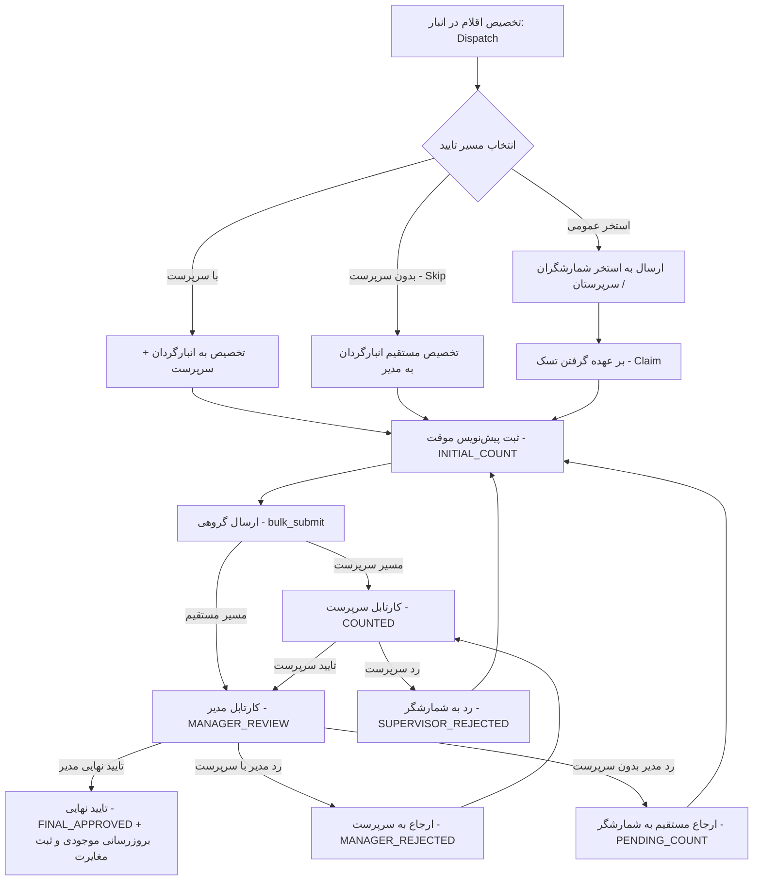

# 🧪 طرح جامع آزمون‌های سرتاسری و پوشش ۱۰۰٪ کلیه سناریوهای انبارگردانی (Comprehensive Inventory Stocktaking Test Suite)

این سند طرح فنی و ماتریس آزمون‌های تفصیلی برای سنجش و راستی‌آزمایی تمام سناریوهای محتمل در چرخه کامل انبارگردانی (از تخصیص و کارتابل شمارشگر تا تاییدات سرپرست، بررسی مدیر، بازشماری‌های مکرر، کشف مغایرت، شمارش کور، لغو تخصیص و امنیت نقش‌ها) می‌باشد.

---

## 🎯 اهداف و دامنه پوشش تست‌ها (Test Scope & Objectives)

---

## 📊 ماتریس ۱۰ گانه سناریوهای آزمون انبارگردانی (Comprehensive Test Matrix)

| ردیف | رده سناریو (Test Category) | تعداد تست‌ها | شرح و نقاط تمرکز آزمون |
| :---: | :--- | :---: | :--- |
| **۱** | **تخصیص و ارجاع (Dispatch & Routing)** | ۵ سناریو | تخصیص مستقیم، دور زدن سرپرست (Skip)، استخر عمومی، تخصیص با فیلترهای پیشرفته (`select_all`) و کنترل هشدار ارجاع مجدد با `force` |
| **۲** | **استخر عمومی و رقابت همزمان (Pools & Concurrency)** | ۴ سناریو | استعلام استخر و Claim برای شمارشگر، سرپرست و مدیر، همراه با آزمون عدم تداخل و قفل همزمانی (`select_for_update`) |
| **۳** | **ثبت شمارش و کارتابل شمارشگر (Field Counting)** | ۷ سناریو | پیش‌نویس موقت، شمارش صفر به عنوان مقدار معتبر کسری، دقت اعشاری ۳ رقمی، ارسال گروهی، پایداری Idempotency، ارسال با `sync_id` آفلاین و آپدیت فیلدهای پویا |
| **۴** | **کارتابل سرپرستی (Supervisor Workflows)** | ۵ سناریو | فیلترینگ کارتابل سرپرست، تایید گروهی (`bulk_approve`)، رد تکی و رد گروهی به شمارشگر (`bulk_reject`) و اصلاح و ارسال مجدد |
| **۵** | **کارتابل مدیر و تحلیل مغایرت (Manager & Conflict)** | ۸ سناریو | تایید نهایی اقلام بدون مغایرت و دارای مغایرت، مسیریابی هوشمند رد مدیر (با/بدون سرپرست)، رد گروهی مدیر، اجباری بودن یادداشت، بازشماری‌های نامحدود (بدون سقف تکرار) و رفع مغایرت در بازشماری |
| **۶** | **لغو تخصیص و انصراف (Task Cancellation)** | ۳ سناریو | لغو موفق تسک‌های مجاز (`PENDING_COUNT`, `INITIAL_COUNT`)، حذف نرم تاریخچه، ریست وضعیت کالا به `checking` و ممانعت از لغو تسک‌های پیشرفته |
| **۷** | **شمارش کور و همگام‌سازی آفلاین (Blind & Sync)** | ۴ سناریو | پنهان‌سازی موجودی دفتری (`inventory`, `bal4miv`) برای انبارگردان در حالت `blind_counting`، عدم سانسور برای مدیر، کنترل تداخل خوش‌بینانه (`409 Conflict`) و تومب‌استون‌های حذف نرم |
| **۸** | **تاریخچه و لاگ‌های امنیتی (Audit Integrity)** | ۲ سناریو | راستی‌آزمایی ثبت گام‌به‌گام در `CountTaskHistory` با اسنپ‌شات مقدار شمرده شده و تولید رویدادهای `AuditLog` سیستم |
| **۹** | **امنیت و حدود دسترسی نقش‌ها (RBAC Guardrails)** | ۴ سناریو | مسدودسازی کاربران احرازهویت‌نشده، ممانعت از اقدامات فراتر از نقش برای شمارشگر و سرپرست، و ایزولاسیون تسک‌های شخصی کاربران |
| **۱۰** | **خروجی اکسل و فراداده (Excel Export & Metadata)** | ۲ سناریو | دریافت متادیتای ستون‌های داینامیک و تولید موفقیت‌آمیز فایل اکسل کارتابل بدون خطا |

---

## 📁 فایل‌های هدف جهت ایجاد/به‌روزرسانی (Proposed Changes)

| ردیف | مسیر فایل | نوع تغییر | شرح عملیات |
| :---: | :--- | :---: | :--- |
| **۱** | [inventory/tests.py](file:///e:/warehouse%20project/warehouse-backend/inventory/tests.py) | **MODIFY** | پیاده‌سازی کامل و بازنویسی جامع سوئیت تست انبارگردانی با بیش از ۴۴ سناریوی اتمیک |
| **۲** | `Documents/Inventory_Audit_Comprehensive_Testing/` | **NEW** | ذخیره‌سازی مستندات و پلن‌ها بر اساس پروتکل DUAL-SAVE |
| **۳** | `Documents/Master_Log.md` | **MODIFY** | به‌روزرسانی مستر لاگ پروژه |

