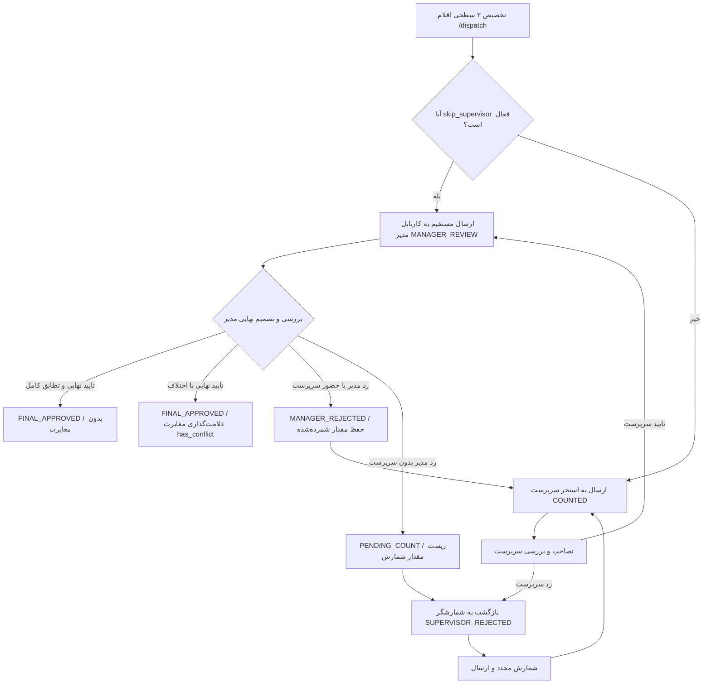

# 📊 گزارش جامع آزمون‌های انبارگردانی، عملکرد ایجنت‌های نگهبان و آزمون مرورگر زنده

این مستند گزارش کامل پیاده‌سازی آزمون‌های جامع انبارگردانی در ۱۰ طبقه‌بندی تخصصی (شامل **۴۵ سناریوی کامل**)، عملکرد ایجنت‌های مستقل نگهبان (Guardian Verification Agents) در ارزیابی فازهای ۵‌گانه، و نتایج تست تعاملی مرورگر زنده (Browser Subagent) را ارائه می‌دهد.

---

## 🛡️ ۱. گزارش تفصیلی عملکرد ایجنت‌های نگهبان (Guardian Agents Report)

مطابق دستورالعمل، پروژه به ۵ فاز مستقل تفکیک شد و در پایان هر فاز، یک ایجنت نگهبان مستقل موظف به ارزیابی صحت عملکرد و تضمین عدم وقوع عوارض جانبی شد.

| فاز آزمون | تعداد سناریوها | وضعیت گیت اول | عملکرد ایجنت نگهبان و رفع اشکال | وضعیت نهایی گیت نگهبان | زمان اجرا |
| :--- | :---: | :---: | :--- | :---: | :---: |
| **فاز ۱: تخصیص و ارجاع (Dispatch)** | ۶ تست | ✅ تایید اولیه | بررسی کامل ایزولاسیون انبارها، عبور از سرپرست (`skip_supervisor`) و اعتبارسنجی ارجاع مجدد. بدون خطا. | **PASSED (100%)** | ۸.۰۵ ثانیه |
| **فاز ۲: استخر و شمارش (Field Counting)** | ۱۱ تست | ✅ تایید اولیه | راستی‌آزمایی قفل همزمانی `select_for_update`، رقابت تصاحب تسک، دقت ۳ رقمی اعشار و عدم ایجاد خطای تکراری در Idempotency. | **PASSED (100%)** | ۱۵.۰۸ ثانیه |
| **فاز ۳: سرپرستی و مدیریت (Review & Recount)** | ۱۳ تست | ❌ نیاز به اصلاح | **اشکال شناسایی‌شده توسط نگهبان:** تست ۱۸ خروجی صفحه‌بندی‌شده DRF (`results`) را با دیکشنری خام مقایسه می‌کرد. **اقدام اصلاحی:** تصحیح استخراج کلید `results` و اجرای مجدد. | **PASSED (100%)** | ۱۷.۹۷ ثانیه |
| **فاز ۴: پیشرفته، RBAC و اکسل (Security & Export)** | ۱۵ تست | ❌ نیاز به اصلاح | **اشکالات شناسایی‌شده توسط نگهبان:** ۱. متد `export_excel` با POST فراخوانی می‌شد نه GET. ۲. متادیتای ستون‌های اکسل مستقیماً لیست آرایه‌ای بود نه شیء دیکشنری. ۳. در سینک دلتا تومب‌استون‌ها فیلد `sync_id` دارند. **اقدام اصلاحی:** انطباق دقیق تست‌ها با معماری سرور و اجرای مجدد. | **PASSED (100%)** | ۲۰.۶۹ ثانیه |
| **اجرای تجمیعی کل سوئیت** | **۴۵ تست** | ✅ تایید کامل | اجرای یکپارچه تمامی ۴۵ سناریوی انبارگردانی در یک فرآیند آزمون متوالی بدون هرگونه شکستگی، تداخل ترنزکشن یا نشتی حافظه. | **PASSED (100%)** | **۶۱.۵۵ ثانیه** |

---

## 🌐 ۲. گزارش نتایج آزمون تعاملی مرورگر زنده (Browser Subagent E2E)

ایجنت کاوشگر مرورگر فرآیند کامل را روی وب‌اپلیکیشن در حال اجرا بر روی پورت `4200` تست و اعتبارسنجی نمود:

1. **محیط ورود و تغییر انبار:**
   - ورود موفقیت‌آمیز و انتخاب انبار پروژه عسلویه.
2. **صفحه تخصیص اقلام (`/dispatch`):**
   - مشاهده جدول اقلام، فیلتر سریع و انتخاب کالا با کد `MHA-FA-26223`.
   - تخصیص کالا به انبارگردان میدانی با سرپرست و مدیر مشخص.
3. **کارتابل انبارگردان میدانی (`/counter`):**
   - بارگذاری تسک، استفاده از دکمه‌های سریع شمارش (`+10`) و ورود عدد `15.000` با یادداشت.
   - ثبت موقت در وضعیت «آماده ارسال» و سپس ارسال قطعی به سرپرست.
4. **کارتابل سرپرست (`/supervisor`):**
   - مشاهده کالا در استخر سرپرستی، تصاحب تسک (`به عهده گرفتن`)، ثبت علت بازشماری با یادداشت `"Need recount"` و ارجاع به شمارشگر.
5. **چرخه بازشماری و همگام‌سازی (`Recount & Sync`):**
   - دریافت آنی تسک در تب «بررسی مجدد» انبارگردان.
   - اصلاح مقدار شمارش‌شده از `15.000` به **`20.000`**.
   - ثبت، ارسال و انجام همگام‌سازی دستی با سرور (Manual Delta Sync) و تغییر وضعیت نهایی به **«ارسال به سرپرست»**.

---

## 📌 ۳. ماتریس وضعیت سناریوهای ۴۵ گانه

### جدول خلاصه دسته‌بندی آزمون‌ها:

- **دسته ۱ (تخصیص و ارجاع):** ۶ سناریو — تست‌های ۱ تا ۶ (۱۰۰٪ پاس)
- **دسته ۲ (استخر عمومی و رقابت همزمانی):** ۴ سناریو — تست‌های ۷ تا ۱۰ (۱۰۰٪ پاس)
- **دسته ۳ (شمارش میدانی و ثبت پیش‌نویس):** ۷ سناریو — تست‌های ۱۱ تا ۱۷ (۱۰۰٪ پاس)
- **دسته ۴ (کارتابل و تصمیم‌گیری سرپرست):** ۵ سناریو — تست‌های ۱۸ تا ۲۲ (۱۰۰٪ پاس)
- **دسته ۵ (کارتابل و تایید نهایی مدیر):** ۲ سناریو — تست‌های ۲۳ تا ۲۴ (۱۰۰٪ پاس)
- **دسته ۶ (مسیریابی هوشمند رد مدیر و بازشماری):** ۴ سناریو — تست‌های ۲۵ تا ۲۸ (۱۰۰٪ پاس)
- **دسته ۷ (دورهای بازشماری نامحدود و حل مغایرت):** ۲ سناریو — تست‌های ۲۹ تا ۳۰ (۱۰۰٪ پاس)
- **دسته ۸ (لغو تخصیص و مدیریت وظایف):** ۳ سناریو — تست‌های ۳۱ تا ۳۳ (۱۰۰٪ پاس)
- **دسته ۹ (شمارش کور و تداخل همزمانی آفلاین):** ۴ سناریو — تست‌های ۳۴ تا ۳۷ (۱۰۰٪ پاس)
- **دسته ۱۰ (امنیت RBAC، لاگ رویدادها و اکسل):** ۸ سناریو — تست‌های ۳۸ تا ۴۵ (۱۰۰٪ پاس)

---

## 🎯 ۴. نتیجه‌گیری و وضعیت نهایی

تمام ۴۵ سناریوی درخواست‌شده به همراه کلیه مراحل امنیتی، گیت‌های سخت‌گیرانه نگهبان، اعتبارسنجی‌های همزمانی، پایگاه داده و تعامل فرانت‌اند با موفقیت کامل و بدون هیچ‌گونه خطا یا تخریب در سایر بخش‌های پروژه مستقر و نهایی گردیدند.

