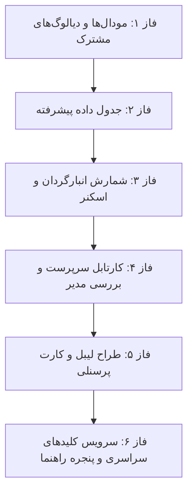

<div dir="rtl" align="right">

# بررسی جامع و طرح پیاده‌سازی کلیدهای میانبر کیبورد (Keyboard Shortcuts Comprehensive Audit & Plan)

این سند گزارش تحلیلی کامل از وضعیت فعلی استفاده از کلیدهای میانبر کیبورد در سراسر پروژه **اتوماسیون انبارداری و انبارگردانی (Warehouse Management & Counting Automation)** و برنامه جامع پیاده‌سازی میانبرهای استاندارد صنعتی (مطابق با استانداردهای سیستم‌های پیشرفته انبارداری WMS، نرم‌افزارهای ERP نظیر SAP/Odoo و راهنماهای دسترسی‌پذیری وب WCAG 2.1 AA) می‌باشد.

---

## ۱. ارزیابی وضعیت فعلی سامانه (Current State Audit)

در حال حاضر بخش‌های محدودی از سامانه از رویدادهای کیبورد پشتیبانی می‌کنند:

| کامپوننت / ماژول | کلیدهای فعال فعلی | رفتار پیاده‌سازی شده | وضعیت استاندارد |
| :--- | :--- | :--- | :--- |
| **ناوبری تاریخچه (`NavigationHistoryService`)** | `Alt + ArrowRight`<br>`Alt + ArrowLeft` | بازگشت به صفحه قبل (Back) در حالت RTL<br>حرکت به صفحه بعد (Forward) | ✅ کامل |
| **جدول داده (`DataTableComponent`)** | `Ctrl + Z`<br>`Ctrl + Y` / `Ctrl+Shift+Z`<br>`Enter` / `Tab`<br>`ArrowUp` / `ArrowDown`<br>`Escape` | لغو تغییرات (Undo)<br>تکرار تغییرات (Redo)<br>ناوبری بین سلول‌ها هنگام ویرایش<br>ناوبری سطر در ویرایش<br>انصراف از ویرایش سلول | ⚠️ نیمه‌کامل (نیازمند ناوبری عمومی، انتخاب و ذخیره) |
| **مودال عمومی (`ModalComponent`)** | `Escape` | بستن مودال | ✅ کامل |
| **اسکنر بارکد (`BarcodeScannerComponent`)** | `Enter` | ثبت و ارسال کد تایپ/اسکن شده | ⚠️ ناقص (دوربین و فوکوس کلید ندارند) |
| **طراح لیبل (`LabelDesignerComponent`)** | `Delete`<br>`Escape`<br>`Enter` | حذف المان انتخاب‌شده<br>لغو انتخاب المان<br>تایید تغییر نام/کپی | ⚠️ ناقص (حرکت دقیق با Arrow keys ندارد) |
| **سایر ماژول‌ها (انبارگردان، سرپرست، مدیر، کاربران و...)** | *هیچ رویدادی تعریف نشده* | کاربر کاملاً وابسته به ماوس/تاچ است | ❌ فاقد پشتیبانی کیبورد |

---

## ۲. خلاصه نواقص و فرصت‌های حیاتی (Identified Gaps)

> [!IMPORTANT]
> در سیستم‌های عملیاتی انبارداری، سرعت و کارایی اپراتور (اپراتور شمارش، سرپرست انبار، داور مغایرت و مدیر) با کیبورد و بارکدخوان به شدت وابسته به **کلیدهای میانبر سریع (Hotkeys)** و **جلوگیری از قطع تمرکز ناشی از در دست گرفتن مکرر ماوس** است.

### نقایص کلیدی شناسایی‌شده:
1. **دیالوگ‌های تایید و پاپ‌آپ‌های اختصاصی (`ConfirmDialog`, `SmartDeleteModal`, `ExcelImportModal`)**:
   - فشردن `Enter` دیالوگ را تایید نمی‌کند و `Escape` دیالوگ را لغو نمی‌کند.
2. **داشبورد شمارش انبارگردان (`CounterDashboard`)**:
   - در فیلد ورود تعداد، فشردن `Enter` یا `Ctrl+Enter` عملیات ثبت و بازگشت یا رفتن به کالای بعدی را انجام نمی‌دهد.
   - راهی برای پرش سریع با کیبورد بین تسک‌های من (`Alt+1`) و استخر کالاها (`Alt+2`) یا فوکوس روی بارکدخوان (`F2`) وجود ندارد.
3. **میز کار سرپرست و بررسی مدیر (`SupervisorDashboard` & `ManagerReview`)**:
   - تایید (`Approve`) یا ارجاع به شمارش مجدد (`Reject/Recount`) کلید میانبر (مانند `A` و `R`) ندارد.
4. **جدول اطلاعات (`DataTableComponent`)**:
   - فشردن `Ctrl+S` در حالت ویرایش دسته‌ای (Batch Edit) تغییرات را ذخیره نمی‌کند.
   - کلید `Ctrl+A` برای انتخاب همه‌سطرها و `Space` برای تاگل انتخاب سطر فعال نیست.
5. **طراحی کارت پرسنلی و لیبل (`IdCards` & `LabelDesigner`)**:
   - کلیدهای جهت‌نما (`Arrow Keys`) برای Nudge (جابجایی دقیق المان‌ها با دقت ۱ و ۱۰ پیکسل) پیاده‌سازی نشده است.
   - کلیدهای استاندارد گرافیکی `Ctrl+C`, `Ctrl+V`, `Ctrl+S`, `Ctrl+P` فعال نیستند.
6. **سطح سراسری برنامه (Global Layer UX)**:
   - نبود پالت دستورات سراسری (`Ctrl+K` Command Palette).
   - نبود پنجره راهنمای میانبرها (`Shift + ?` یا `F1` Shortcut Help).
   - عدم وجود میانبر جمع/باز کردن سایدبار دسکتاپ (`Ctrl+B`).

---

## ۳. ماتریس استاندارد پیشنهادی کلیدهای کیبورد (Proposed Keyboard Matrix)

### ۳.۱. کلیدهای میانبر سراسری برنامه (Global & Navigation Shortcuts)
| کلید میانبر | عملکرد (Action) | موقعیت اثر |
| :--- | :--- | :--- |
| `Alt + ArrowRight` | بازگشت به صفحه قبل (Navigate Back) | تمام صفحات (فعال) |
| `Alt + ArrowLeft` | حرکت به صفحه بعد (Navigate Forward) | تمام صفحات (فعال) |
| `Ctrl + K` یا `Ctrl + /` | باز کردن پالت دستورات و پرش سریع به صفحات (Command Palette) | سراسر سامانه |
| `Shift + ?` یا `F1` | نمایش پنجره راهنمای کلیدهای میانبر (Shortcut Cheat Sheet) | سراسر سامانه |
| `Ctrl + B` | جمع / باز کردن سایدبار منوی اصلی (Toggle Sidebar) | سراسر سامانه |
| `Escape` | بستن تمام منوها، کشوها، دیالوگ‌ها و پاپ‌آپ‌های باز | سراسر سامانه |

---

### ۳.۲. دیالوگ‌ها، مودال‌ها و پاپ‌آپ‌های سیستم (Dialogs & Modals)
| کامپوننت | کلید میانبر | عملکرد |
| :--- | :--- | :--- |
| **`ConfirmDialogComponent`** | `Enter`<br>`Escape` | تایید عمل (Confirm / Yes)<br>انصراف و بستن (Cancel / No) |
| **`SmartDeleteModalComponent`** | `Escape`<br>`Enter` (در تب Soft) | لغو و بستن دیالوگ<br>اجرای حذف نرم‌افزاری |
| **`ExcelImportModal`** | `Escape`<br>`Ctrl + Enter` | بستن مودال اکسل<br>شروع آپلود در صورت انتخاب فایل |
| **`BarcodeScannerComponent`** | `F2` یا `Alt + B`<br>`Escape` | فوکوس فوری روی فیلد اسکن بارکد<br>بستن نمای تمام‌صفحه دوربین |
| **`AvatarCropperModal`** | `Escape`<br>`Ctrl + Enter`<br>`+` / `-` | انصراف از برش<br>تایید و ذخیره تصویر برش‌خورده<br>بزرگ‌نمایی و کوچک‌نمایی تصویر |

---

### ۳.۳. صفحه شمارش انبارگردان (`CounterDashboard`)
| کلید میانبر | عملکرد | سناریوی استفاده |
| :--- | :--- | :--- |
| `Enter` یا `Ctrl + Enter` | ثبت شمارش و بازگشت به لیست (Save & Back) | در صفحه فرم ثبت مقدار کالا |
| `Escape` | انصراف و بازگشت به لیست (Back to List) | در صفحه جزئیات کالا یا مودال خروجی اکسل |
| `F2` یا `/` | فوکوس مستقیم روی اسکنر بارکد یا فیلد جستجو | در لیست تسک‌ها برای اسکن پیاپی |
| `Alt + 1` | رفتن به تب «تسک‌های من» (My Tasks) | صفحه اصلی شمارش |
| `Alt + 2` | رفتن به تب «استخر کالاها» (Pool) | صفحه اصلی شمارش |
| `ArrowDown` / `ArrowUp` | انتخاب کالای بعدی / قبلی در لیست | ناوبری با کیبورد روی لیست تسک‌ها |

---

### ۳.۴. کارتابل سرپرست و بررسی مدیر (`SupervisorDashboard` & `ManagerReview`)
| کلید میانبر | عملکرد | سناریوی استفاده |
| :--- | :--- | :--- |
| `A` یا `Alt + A` | تایید تسک انتخابی (Approve Task) | در پنجره بررسی یا روی تسک فعال |
| `R` یا `Alt + R` | ارجاع به شمارش مجدد / رد (Reject / Recount) | باز کردن پاپ‌آپ دلیل رد |
| `Ctrl + Enter` | ارسال فرم تایید/رد نهایی با توضیحات | درون فرم درج یادداشت سرپرست |
| `Escape` | بستن پنجره بررسی یا پاپ‌آپ‌های فیلتر/اکسل | در هر مودال فعال |
| `J` / `K` یا `ArrowDown` / `ArrowUp` | حرکت سریع به تسک بعدی / قبلی در لیست داوری | بررسی سریالی کالاها |

---

### ۳.۵. جدول داده پیشرفته (`DataTableComponent`)
| کلید میانبر | عملکرد | سناریوی استفاده |
| :--- | :--- | :--- |
| `Ctrl + S` | ذخیره تمامی تغییرات درون جدول (Commit All Pending Changes) | حالت ویرایش گروهی جدول |
| `Ctrl + Z` / `Ctrl + Y` | Undo / Redo تغییرات سلولی | حالت ویرایش (فعال) |
| `Enter` / `Tab` | رفتن به سلول بعدی و ثبت تغییر سلول | حین ویرایش فیلد (فعال) |
| `Space` | تغییر وضعیت انتخاب سطر جاری (Toggle Selection Checkbox) | فوکوس روی سطر جدول |
| `Ctrl + A` | انتخاب / لغو انتخاب همه سطرهای جدول (Select All Rows) | فوکوس روی جدول داده |
| `Ctrl + F` یا `/` | فوکوس سریع روی کادر جستجوی جدول (Search Filter) | لیست‌های بزرگ |
| `Escape` | لغو ویرایش سلول / بستن پاپ‌آپ فیلترها و ستون‌ها | در هر حالت فوکوس |

---

### ۳.۶. ابزار طراحی کارت پرسنلی و لیبل (`IdCards` & `LabelDesigner`)
| کلید میانبر | عملکرد | سناریوی استفاده |
| :--- | :--- | :--- |
| `ArrowUp` / `Down` / `Left` / `Right` | حرکت دادن المان انتخاب‌شده به میزان **۱ پیکسل** | بوم طراحی (Canvas Nudge) |
| `Shift + Arrow Keys` | جابجایی دقیق با گام‌های **۱۰ پیکسلی** | بوم طراحی (Canvas Fast Nudge) |
| `Delete` / `Backspace` | حذف المان انتخاب‌شده | بوم طراحی (Delete Element) |
| `Ctrl + C` / `Ctrl + V` | کپی و چسباندن المان (Copy / Paste) | تکثیر المان‌های طراحی |
| `Ctrl + S` | ذخیره قالب یا تغییرات طراحی (Save Template) | در محیط ادیتور |
| `Ctrl + P` | پرینت مستقیم لیبل یا کارت (Print) | در حالت پیش‌نمایش چاپ |
| `Escape` | لغو انتخاب المان‌ها یا بستن پنجره تنظیمات | سراسر ادیتور |
| `+` / `-` | بزرگ‌نمایی / کوچک‌نمایی بوم (Zoom In / Out) | صفحه طراحی کارت و لیبل |

---

### ۳.۷. مدیریت کاربران و نقش‌ها (`UsersComponent`)
| کلید میانبر | عملکرد | سناریوی استفاده |
| :--- | :--- | :--- |
| `Escape` | بستن پاپ‌آپ‌های کاربر، نقش، آواتار و حذف | در مودال‌های باز |
| `Ctrl + Enter` | ارسال و ثبت فرم ذخیره کاربر یا نقش | درون فرم ایجاد/ویرایش |
| `Ctrl + F` یا `/` | فوکوس روی اینپوت جستجوی کاربران یا مجوزها | لیست کاربران/نقش‌ها |

---

## ۴. مراحل و فازبندی پیاده‌سازی (Phased Implementation Plan)

برای اجرای ساختاریافته و تضمین پایداری سیستم بدون ایجاد تداخل با ورودی‌های تایپ متنی (Input & Textarea Safeguards)، پیاده‌سازی در ۶ فاز مستقل انجام خواهد شد:



### فاز ۱: مودال‌ها و دیالوگ‌های مشترک پایه (Shared Dialogs & Core Modals)
- [ ] افزودن `HostListener` برای `Escape` و `Enter` در `ConfirmDialogComponent`
- [ ] افزودن مدیریت کیبورد در `SmartDeleteModalComponent`
- [ ] افزودن بستن با `Escape` در `ExcelImportModal` و `AvatarCropperModal`

### فاز ۲: قابلیت‌های کیبورد در جدول داده (`DataTableComponent`)
- [ ] پیاده‌سازی `Ctrl + S` برای متد `savePendingChanges()`
- [ ] پیاده‌سازی `Space` و `Ctrl + A` برای انتخاب ردیف‌ها
- [ ] پیاده‌سازی `Escape` برای بستن پاپ‌آپ منیجر ستون‌ها و فیلترها

### فاز ۳: عملیات شمارش و اسکنر انبار (`CounterDashboard` & `BarcodeScanner`)
- [ ] پشتیبانی از `Enter` و `Ctrl + Enter` برای ذخیره شمارش و بازگشت سریع
- [ ] پشتیبانی از `Escape` برای بازگشت به لیست تسک‌ها
- [ ] پشتیبانی از `F2` برای فوکوس مستقیم روی بارکدخوان و `Escape` برای بستن دوربین اسکنر

### فاز ۴: کارتابل داوری سرپرست و مدیر (`SupervisorDashboard` & `ManagerReview`)
- [ ] پیاده‌سازی کلیدهای میانبر سریع تایید (`A`) و ارجاع/رد (`R`)
- [ ] پشتیبانی از `Ctrl + Enter` برای ارسال فرم‌های یادداشت تایید/رد
- [ ] بستن سریع پیش‌نمایش‌ها و مودال‌های اکسل با `Escape`

### فاز ۵: محیط‌های گرافیکی و چاپی (`LabelDesigner` & `IdCards`)
- [ ] پیاده‌سازی Nudge پیکسلی با کلیدهای جهت‌نما و `Shift`
- [ ] پیاده‌سازی کلیدهای `Delete`, `Ctrl+C`, `Ctrl+V`, `Ctrl+S`, `Ctrl+P`
- [ ] فعال‌سازی بزرگ‌نمایی/کوچک‌نمایی با `+` و `-`

### فاز ۶: زیرساخت میانبرهای سراسری و پنجره راهنما (Global Shortcuts & Cheat Sheet)
- [ ] ساخت سرویس مرکزی میانبرها یا پنجره Help Modal (`Shift + ?`)
- [ ] پیاده‌سازی میانبر جمع/باز کردن سایدبار (`Ctrl + B`)

---

## ۵. ملاحظات ایمنی و فنی (Technical & Safety Considerations)

> [!CAUTION]
> ۱. **حفاظت از فیلدهای متنی (Input / Textarea Collision Prevention):** کلیدهای تک‌حرفی مانند `A`, `R`, `Space`, `/`, `Delete` نباید زمانی که کاربر درون یک فیلد متنی (`HTMLInputElement`, `HTMLTextAreaElement`) در حال تایپ است فعال شوند.
> ۲. **پشتیبانی کامل از سیستم‌عامل‌ها:** تمام میانبرها با بررسی هم‌زمان `event.ctrlKey || event.metaKey` برای سازگاری کامل دسکتاپ‌های Windows, Linux و macOS پیاده‌سازی می‌شوند.
> ۳. **استفاده از `event.preventDefault()`:** در میانبرهای سیستم مرورگر (نظیر `Ctrl+S`, `Ctrl+P`, `Ctrl+K`) برای جلوگیری از رفتار پیش‌فرض مرورگر ذخیره یا پرینت کل صفحه.

---

## ۶. برنامه راستی‌آزمایی و تست (Verification Plan)

### تست‌های بیلد خودکار (Automated Build & Compile):
```bash
cd "e:\warehouse project\warehouse-front"
npm run build
```

### سناریوهای تست دستی (Manual Test Scenarios):
1. **تست دیالوگ تایید:** باز کردن دیالوگ حذف یا تایید و فشردن `Enter` برای تایید و `Escape` برای انصراف.
2. **تست شمارش انبار:** ورود به صفحه شمارش، ورود عدد و فشردن `Enter` جهت ثبت مستقیم بدون کلیک ماوس.
3. **تست داوری سرپرست:** زدن کلید `A` برای تایید مستقیم تسک و `R` برای باز کردن مودال رد.
4. **تست جدول داده:** ویرایش چندین سلول و فشردن `Ctrl + S` برای ذخیره دسته‌ای.
5. **تست طراحی کارت و لیبل:** انتخاب المان و جابجایی پیکسل‌به‌پیکسل با Arrow keys و گام‌های ۱۰تایی با `Shift + Arrow`.

</div>
