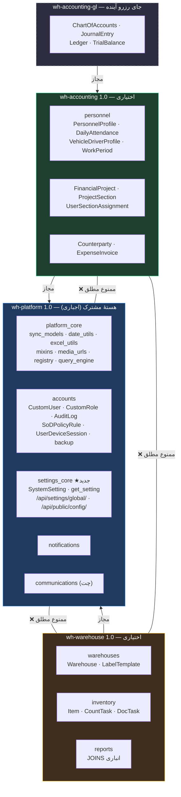

# طرح جامع مهندسی: جداسازی انبارگردانی و حسابداری به دو ماژول نصب‌شدنی مستقل

<div dir="rtl" align="right">

## ۱. اهداف و چشم‌انداز معماری (Architecture Vision & Objectives)

امروز کل سامانه یک بستهٔ یکپارچهٔ تفکیک‌ناپذیر است. `INSTALLED_APPS` هر هفت اپلیکیشن را بی‌قید و شرط بار می‌کند، `app.routes.ts` هر ۴۰ کامپوننت را به صورت eager ایمپورت می‌کند، و مفهوم «ماژول» صرفاً یک enum دوحالتهٔ سخت‌کدشده در چند نقطهٔ پراکنده است. در نتیجه مشتری نمی‌تواند فقط حسابداری یا فقط انبارگردانی را نصب کند.

این طرح، سامانه را به **سه توزیع نسخه‌دار و مستقل** تبدیل می‌کند:

| توزیع | نسخه | ماهیت | اجباری؟ |
| :--- | :---: | :--- | :---: |
| **`wh-platform`** | ۱.۰ | هستهٔ مشترک: هویت، RBAC، نقش‌های سازمانی، ممیزی، تفکیک وظایف، تنظیمات، نشست دستگاه، بکاپ/بازگردانی، زیرساخت همگام‌سازی، رجیستری قابلیت‌ها | ✅ بله |
| **`wh-warehouse`** | ۱.۰ | انبارگردانی: انبارها، کالا، شمارش کور، تخصیص، تغذیه، گمرکی، لیبل، گزارش‌ساز انباری | ⬜ اختیاری |
| **`wh-accounting`** | ۱.۰ | حسابداری: پروژه و بخش، پرسنل، کارکرد، ناوگان، حقوق، خزانه، طرف‌حساب، فاکتور هزینه | ⬜ اختیاری |

**معیار پذیرش قاطع:** دستور `pip install wh-platform wh-accounting` باید نصبی بدهد که **اصلاً یک خط کد انبار در آن نیست** — نه مدل، نه مایگریشن، نه اندپوینت، نه chunk جاوااسکریپت.

**دامنهٔ حسابداری:** همان دامنهٔ مالی و پرسنلی موجود، به‌علاوهٔ نقاط توسعهٔ مرزبندی‌شده تا دفتر کل دوطرفهٔ آینده (کدینگ حساب، سند حسابداری، دفاتر، تراز) بدون شکستن چیزی بنشیند. **در این پروژه هیچ جدول دفتر کل ساخته نمی‌شود.**

**راهبرد مخزن:** همین مخزن باقی می‌ماند. مرزها با `import-linter` و آزمون خودکار تحمیل می‌شوند، نه با تقسیم مخزن. تاریخچهٔ گیت کامل حفظ می‌شود.

---

## ۲. قوانین طلایی و الزامات راهبردی (Golden Invariants)

> [!IMPORTANT]
> **قانون ۱ (عدم بازنویسی):**
> هیچ کامپوننت، فرم، جدول، پایپ شمسی، محاسبهٔ ساعت یا سرویس موجودی از نو نوشته نمی‌شود. جداسازی صرفاً با **جابجایی مالکیت** (کدام بسته صاحب کدام فایل است) و **وارونه‌سازی وابستگی** (رجیستری به جای شرط سخت‌کد) انجام می‌شود.

> [!IMPORTANT]
> **قانون ۲ (رویکرد ساخت تمیز از پایگاه داده خالی):**
> چون سیستم هنوز در محیط عملیاتی مستقر نشده، کل گراف مایگریشن‌ها از ابتدا به صورت تمیز بازتولید شد تا وابستگی‌های جداولی حذف شود. این جایگزین رویکرد `SeparateDatabaseAndState` می‌شود تا کدهایی بسیار تمیزتر حفظ شوند.

> [!IMPORTANT]
> **قانون ۳ (سازگاری رو به عقب مطلق):**
> همهٔ مسیرهای API (`/api/settings/global/`، `/api/public/config/`، …) و همهٔ مسیرهای فرانت‌اند شامل هر ۳۵ ریدایرکت legacy عیناً حفظ می‌شوند. فیلدهای جدید الزاماً `null=True, blank=True`. کد `'personnel'` در `SoDPolicyRule` تغییر نمی‌کند و `'accounting'` فقط به‌عنوان alias اضافه می‌شود.

> [!IMPORTANT]
> **قانون ۴ (دادهٔ کاربر هرگز از بین نمی‌رود):**
> نام دو پایگاه‌دادهٔ محلی `WarehouseOfflineDB_warehouse` و `WarehouseOfflineDB_finance` عیناً ثابت می‌ماند تا هیچ IndexedDB کاربری یتیم نشود. هیچ مسیر کد جدیدی مجاز نیست `syncQueue`، `photoQueue` یا `syncErrors` را پاک کند.

> [!IMPORTANT]
> **قانون ۵ (عدم افشای ماژول نصب‌نشده):**
> درخواست به پیشوند API ماژول نصب‌نشده باید **۴۰۴** برگرداند، نه ۴۰۳. یک نصب حسابداری‌تنها نباید وجود اندپوینت‌های انبار را لو بدهد.

---

## ۳. معماری هدف و نمودار وابستگی (Target Architecture)



### قراردادهای وابستگی (تحمیل‌شده با `import-linter`)

| قرارداد | قاعده |
| :--- | :--- |
| **C1 — لایه‌بندی** | ترتیب لایه: `platform` (پایین) → `warehouse` و `accounting` (بالا). ایمپورت رو به پایین مجاز، رو به بالا ممنوع. |
| **C2 — استقلال ماژول‌ها** | `warehouse` و `accounting` مستقل‌اند: هیچ یالی در هیچ جهتی بین آن‌ها مجاز نیست. |
| **C3 — پاکی هسته** | `platform_core`، `accounts`، `settings_core`، `notifications` و `communications` هیچ‌گاه `warehouses`، `inventory`، `reports` یا `personnel` را ایمپورت نمی‌کنند. |
| **C4 — استثنای مهارشده** | ایمپورت تنبل درون تابع همراه گارد `apps.is_installed(...)` تنها استثنای مجاز است و باید در فایل `.importlinter` صریحاً فهرست شود. |

### سازوکار زمان اجرا

هر ماژول یک `ModuleSpec` را از طریق entry point گروه `wh.module` و متد `AppConfig.ready()` در رجیستری ثبت می‌کند. سه فایل کلیدی دیگر هیچ نام ماژولی را سخت‌کد نمی‌کنند و از رجیستری ساخته می‌شوند: `config/settings.py` (ساخت `INSTALLED_APPS`)، `config/urls.py` (تجمیع مسیرها) و `config/asgi.py` (تجمیع مسیرهای وب‌سوکت).

---

## ۴. وضع موجود (۱): درزهایی که از قبل ساخته شده‌اند

خبر خوب این است که کار قبلی بیشترِ درزها را از پیش گذاشته است. این‌ها **بازاستفاده** می‌شوند، نه بازنویسی:

| دارایی موجود | مسیر دقیق | نقش در طرح |
| :--- | :--- | :--- |
| `SoDPolicyRule.app_module` با enum دوماژولی | `accounts/models.py:290-293` | تاکسونومی ماژول از قبل در دیتابیس ماندگار است |
| `UserDeviceSession.app_scope` | `accounts/models.py:331` | قلمرو نشست، آمادهٔ چندماژولی |
| کلیم‌های `allowed_apps` / `active_app` در JWT | `accounts/middleware.py:80-101` | نقطهٔ تزریق رجیستری |
| هدرهای `X-Active-App` / `X-Active-Role` / `X-Client-Tab-Id` / `X-Warehouse-Id` | `accounts/middleware.py` | پروتکل قلمرو سمت کلاینت |
| `AppScope`، `SCOPED_DB_NAMES`، کارخانهٔ `getOfflineDb()` | `core/services/offline-db.ts:150-347` | **دو IndexedDB مستقل از قبل موجود است** |
| `SyncModelMixin` / `ActiveManager` / `soft_delete_queryset` | `common/sync_models.py` | دامنه‌بی‌طرف و خالص پلتفرم |
| `user_warehouse_ids()` با گارد `hasattr` | `common/warehouse_scope.py:38` | **از قبل نبودن M2M انبار را تحمل می‌کند** |
| `FinancialProject` / `ProjectSection` | `personnel/models.py` | بُعد قلمروبندی جانشین `warehouse` در حسابداری |
| بکاپ = `pg_dump` کل دیتابیس، بدون manifest مدل | `accounts/rollback_service.py:130-185` | با نبود یک ماژول نمی‌شکند |
| سه گروه مسیر جدا + `/app/launcher` | `app.routes.ts:73, 120, 165` | مرزبندی مسیر از قبل انجام شده |

**کوپلینگ حسابداری → انبار عملاً صفر است.** هر پنج ارجاع موجود اختیاری‌اند (`null=True, blank=True, on_delete=SET_NULL`) و هر پنج از قبل `project`/`section` موازی دارند:

| مدل | فیلد | سطر | `related_name` |
| :--- | :--- | :---: | :--- |
| `PersonnelProfile` | `assigned_warehouse` | ۲۹۸ | `personnel_members` |
| `VehicleDriverProfile` | `assigned_warehouse` | ۵۳۸ | `assigned_vehicles` |
| `WorkPeriod` | `warehouse` | ۹۹۰ | `work_periods` |
| `DailyAttendance` | `warehouse` | ۱۱۰۸ | `daily_attendances` |
| `VehicleTripLog` | `warehouse` | ۱۲۲۹ | `vehicle_trip_logs` |

ایمپورت `warehouses` در `personnel` فقط در سه جای غیرتولیدی است: `management/commands/seed_fleet_vehicles.py:4`، `phase_guardian.py:112` (تنبل، درون تابع) و چهار فایل تست. **هیچ مسیر اجرایی تولیدی وجود ندارد.** در جهت مخالف هم هیچ اپ سمت انبار به `personnel` ارجاع نمی‌دهد. دفتر کل هم اصلاً وجود ندارد (جست‌وجوی `ledger|journal|debit|credit|voucher` در کل بک‌اند: صفر نتیجه).

---

## ۵. وضع موجود (۲): موانع ساختاری واقعی، به ترتیب شدت

| # | مانع | مسیر دقیق | چرا مانع است |
| :---: | :--- | :--- | :--- |
| **۱** | **هستهٔ تنظیمات و کانفیگ بوت داخل اپ انبار زندانی است** | `warehouses/models.py:50` (`SystemSetting`)، `warehouses/services.py:132` (`get_setting`)، `config/urls.py:26-27` | `/api/public/config/` دقیقاً همان **پروب تشخیص آنلاین/آفلاین** برنامه است (`network-status.service.ts:140`) و منبع کانفیگ بوت. حذف بستهٔ انبار ⇒ تشخیص شبکه، بازهٔ سینک، TTL کش و پرچم چت همه می‌میرند. |
| **۲** | M2M هسته → انبار | `accounts/models.py:20` | وابستگی سطح مایگریشن؛ نصب حسابداری‌تنها ساختاراً ناممکن است |
| **۳** | `AuditLog.warehouse` و `MODULE_CHOICES` فقط انباری | `accounts/models.py:250` و `209-222` | ممیزی در هسته است ولی شکل انبار دارد؛ **هیچ ماژول مالی در choices نیست** |
| **۴** | ایمپورت ماژول‌سطح `Warehouse` در هسته | `accounts/serializers.py:5`، `accounts/excel_utils.py:16`، `accounts/management/commands/setup_project.py:5` | `ImportError` در نصب بدون انبار |
| **۵** | **چت به دامنهٔ انبار چسبیده است** | `communications/models.py:6` (دو FK در سطرهای ۲۴ و ۲۰۷)، `consumers.py:79`، `permissions.py:33`، `views.py:42, 528`، و مصرف `inventory.models` | چت امروز خنثی نیست و در نصب حسابداری‌تنها بار نمی‌شود |
| **۶** | گزارش‌ساز: موتور عام، رجیستری انباری | `reports/registry.py` (`JoinDef.warehouse_path`) + ایمپورت `inventory.models`، `warehouses.models`، `warehouses.services` | یک موتور کوئری کاملاً عام درون بستهٔ انبار حبس است |
| **۷** | **فرانت‌اند هیچ سازوکاری برای حذف کد ماژول دیگر ندارد** | `app.routes.ts:1-42` (۴۰ ایمپورت eager)، `angular.json` تنها یک پروژه `warehouse-app` دارد، بدون library و بدون `loadChildren` | بیلد حسابداری‌تنها امروز فنی غیرممکن است |
| **۸** | دانش ماژولی سخت‌کد در یک سرویس | `app-persona.service.ts:8` (`AppModuleType`) و حدود ۱۰ شرط در سطرهای `227-241`، `251-261`، `339-355`، `361-369`، `383-406`، `442-455`، `478` | باید یکجا به رجیستری وارونه شود |
| **۹** | آرایه‌های مجوز سخت‌کد ریشهٔ ریدایرکت | `app.routes.ts:44-60` (`WAREHOUSE_CHECK_PERMS` و `PERSONNEL_CHECK_PERMS`) | نبود یک ماژول، تصمیم ریدایرکت ریشه را می‌شکند |
| **۱۰** | منوی سایدبار سخت‌کد | `layout.ts:502-525` (`SYSTEM_NAV_ITEMS`)، `527-542` (`WAREHOUSE_NAV_ITEMS`)، پرچم `isAccounting`، و سیگنال‌های `1030-1098` | هر ماژول باید منوی خودش را عرضه کند |
| **۱۱** | رجیستری Pull فقط انباری | `sync-pull.service.ts:25-30` (`MODEL_TABLES`) و کلید cursor بستهٔ `warehouseId` | حسابداری نمی‌تواند موجودیت Pull ثبت کند |
| **۱۲** | قواعد سخت‌کد مسیر → قلمرو | `accounts/authentication.py:55-73` | زنجیرهٔ `if path.startswith(...)` باید حلقهٔ رجیستری شود |
| **۱۳** | `active_app` دوحالتهٔ اجباری | `accounts/middleware.py:221` | `active_app = 'warehouse' if raw_app == 'warehouse' else 'personnel'` |
| **۱۴** | تجمیع سخت‌کد وب‌سوکت | `config/asgi.py` | `notifications.routing... + communications.routing...` |
| **۱۵** | **هیچ زیرساخت بسته‌بندی وجود ندارد** | نه `pyproject.toml`، نه `setup.py`، نه `setup.cfg`، نه `.importlinter` در کل مخزن | این بخش کاملاً greenfield است |

### مقیاس کار

بک‌اند ۴۴٬۲۹۷ خط. سنگین‌ترین فایل‌ها: `inventory/views.py` (۵۰۲۴)، `personnel/views.py` (۴۳۵۸)، `personnel/phase_guardian_approval.py` (۳۶۶۰)، `accounts/views.py` (۲۸۴۵)، `personnel/models.py` (۱۶۷۶). فرانت‌اند: `layout.ts` (۱۲۶۸)، `offline-sync.service.ts` (۱۲۶۲)، `offline-db.ts` (۵۳۰)، `app-persona.service.ts` (۴۹۱). پشتهٔ فنی: Django ۵.۰.۴ + DRF + Channels + Daphne، Angular ۲۲ با بیلدر `@angular/build:application` و TypeScript ۶.۰، Dexie ۴.۴.

نگهبان‌های موجود تا شمارهٔ **۲۸** رسیده‌اند (`personnel/phase_guardian_approval.py`)، پس نگهبان‌های این طرح از **۲۹** شروع می‌شوند. اجراکنندهٔ تست پروژه `manage.py test <app>` است (اپ پرسنل امروز ۷۵ تست سبز دارد). مخزن هیچ CI ندارد.

---

## ۶. فازبندی اجرا (۹ فاز)

ترتیب فازها تصادفی نیست: ابتدا حصار نصب می‌شود (فاز ۰)، بعد شدیدترین مانع باز می‌شود (فاز ۱)، بعد یال‌های ساختاری بریده می‌شوند (فاز ۲)، و تنها وقتی رجیستری آماده شد (فاز ۳) به سراغ تغییرات پرریسک دیتابیسی (فاز ۴) و سنگین‌ترین فاز فرانت‌اند (فاز ۶) می‌رویم.

### فاز ۰ — نصب حصار، پیش از هر تغییر رفتاری

هدف: هیچ خط منطقی عوض نمی‌شود؛ فقط ابزار سنجش مرز ساخته می‌شود تا از این لحظه به بعد هر پس‌رفت دیده شود.

| # | اقدام | جزئیات |
| :---: | :--- | :--- |
| ۰.۱ | افزودن `pyproject.toml` | سه توزیع اعلام می‌شوند و در محیط توسعه همچنان کنار هم نصب‌اند (`pip install -e .`) |
| ۰.۲ | افزودن `.importlinter` | قراردادهای C1 تا C4 با حالت **report-only** |
| ۰.۳ | ثبت snapshot نقض‌ها | خروجی فعلی `lint-imports` در فایل ذخیره می‌شود تا مبنای مقایسه باشد |
| ۰.۴ | ساخت نگهبان ۲۹ | `scripts/e2e/guardian_modularization.py` — شمار نقض باید **یکنوا کاهشی** باشد؛ افزایش = شکست |

**معیار خروج فاز:** `lint-imports` اجرا می‌شود، عدد نقض ثبت شده است، و هیچ تست موجودی سرخ نشده است.

### فاز ۱ — آزادسازی هستهٔ تنظیمات از اپ انبار (شدیدترین مانع)

اپ پلتفرمی جدید `settings_core` ساخته می‌شود و هستهٔ تنظیمات از `warehouses` به آن منتقل می‌شود، **بدون یک بایت جابجایی داده**.

| # | اقدام | جزئیات فنی |
| :---: | :--- | :--- |
| ۱.۱ | انتقال `SystemSetting` | `migrations.SeparateDatabaseAndState` با تثبیت `db_table='warehouses_systemsetting'` ⇒ همان جدول، همان `unique_together` |
| ۱.۲ | نرم کردن ارجاع انبار | `warehouse = FK(Warehouse, CASCADE)` ⟶ `warehouse_id = IntegerField(null=True, db_index=True, db_column='warehouse_id')` |
| ۱.۳ | بازسازی رفتار CASCADE | یک سیگنال `post_delete` که **`wh-warehouse` ثبت می‌کند** تنظیمات انبار حذف‌شده را پاک می‌کند؛ در نصب بدون انبار این سیگنال وجود ندارد و لازم هم نیست |
| ۱.۴ | انتقال سرویس‌ها | `get_setting`، `get_all_settings`، `clear_setting_cache`، `compute_settings_etag`، `validate_settings_payload`، `DEFAULT_SETTINGS` ⟶ `settings_core.services` |
| ۱.۵ | لایهٔ shim | `warehouses.services` همان نام‌ها را **re-export** می‌کند ⇒ هر ۳ فراخوان `communications` و همهٔ فراخوان‌های `inventory`/`reports` دست‌نخورده می‌مانند |
| ۱.۶ | انتقال ویوها | `SettingsViewSet` و `PublicConfigViewSet` ⟶ `settings_core.views`؛ **مسیرهای `/api/settings/global/` و `/api/public/config/` عیناً حفظ می‌شوند** |
| ۱.۷ | تفکیک کلیدهای پیش‌فرض | پلتفرم: `system_version`، `system_name`، `offline_sync_interval_minutes`، `offline_cache_ttl_minutes`، `chat_enabled`، `chat_file_sharing`. کلیدهای انباری از `wh-warehouse` ثبت می‌شوند |
| ۱.۸ | افزودن `installed_modules` | به پاسخ `/api/public/config/` اضافه می‌شود و **منبع manifest ماژول برای فرانت‌اند** می‌شود |

> [!NOTE]
> `PublicConfigViewSet` امروز `AllowAny` است و همان ضربان تشخیص اتصال (`network-status.service.ts:140`) را تغذیه می‌کند. `clamped_minutes()` و شکل پاسخ فعلی بدون تغییر می‌مانند؛ فقط یک کلید **اضافه** می‌شود.

**معیار خروج فاز:** با حذف `warehouses` از `INSTALLED_APPS`، هر دو اندپوینت تنظیمات پاسخ می‌دهند (نگهبان ۳۰).

### فاز ۲ — بریدن یال‌های FK هسته → انبار (expand-contract، صفر مهاجرت داده)

| # | اقدام | جزئیات فنی |
| :---: | :--- | :--- |
| ۲.۱ | جابجایی مالکیت M2M | همان M2M در اپ `warehouses` روی `Warehouse` اعلام می‌شود با `related_name='assigned_warehouses'` و `db_table='accounts_customuser_assigned_warehouses'`؛ در `accounts` حذف و دو طرف با `SeparateDatabaseAndState` |
| ۲.۲ | حفظ اکسسور | `user.assigned_warehouses` **بدون هیچ تغییری** کار می‌کند ⇒ همهٔ فراخوان‌های تولیدی سالم می‌مانند: `accounts/admin.py:17,26`، `accounts/excel_utils.py:132`، `accounts/serializers.py:28,43,106,119,140`، `accounts/views.py:406,421,478,497,1482`، `common/warehouse_scope.py:38,41` |
| ۲.۳ | ایمپورت‌های ماژول‌سطح | `accounts/serializers.py:5` و `accounts/excel_utils.py:16` ⟶ resolve اختیاری با `apps.is_installed('warehouses')`؛ در نصب بدون انبار، فیلد از سریالایزر **حذف** می‌شود نه اینکه خطا بدهد |
| ۲.۴ | انتقال دستور مدیریتی | `accounts/management/commands/setup_project.py` ⟶ `warehouses/management/commands/` |
| ۲.۵ | گارد ایمپورت‌های تنبل | `accounts/audit_utils.py:115,121` و `accounts/rollback_service.py:151-160` از قبل ایمپورت درون‌تابعی دارند ⇒ فقط گارد `apps.is_installed` اضافه می‌شود |
| ۲.۶ | نرم کردن `AuditLog.warehouse` | ⟶ `warehouse_id = IntegerField(null=True, db_index=True, db_column='warehouse_id')`؛ **همان ستون، همان ایندکس** |
| ۲.۷ | رجیستری `MODULE_CHOICES` | پلتفرم: `users`/`warehouses`/`settings`/`system`. انبار اضافه می‌کند: `docs`/`dispatch`/`customs`/`feeding`/`labels`/`counter`/`supervisor`/`manager`. حسابداری اضافه می‌کند: `attendance`/`fleet`/`payroll`/`treasury`/`projects`/`invoices` (که **امروز کلاً غایب است**) |

> [!WARNING]
> `common/warehouse_scope.py:38` از قبل با `hasattr` نبود M2M را تحمل می‌کند و `STRICT_WAREHOUSE_SCOPE = False` است. این رفتار **عیناً حفظ می‌شود**؛ سخت‌گیرانه کردنش در دامنهٔ این طرح نیست.

**معیار خروج فاز:** `sqlmigrate` هیچ `ALTER`/`COPY` روی سه جدول حساس نشان ندهد و شمار ردیف‌ها قبل و بعد یکسان بماند (نگهبان ۳۲).

### فاز ۳ — رجیستری قابلیت‌ها (بک‌اند)

قلب طرح. از این نقطه به بعد هیچ فایل هسته‌ای نام هیچ ماژولی را نمی‌داند.

```python
# platform_core/registry.py
@dataclass(frozen=True)
class ModuleSpec:
    code: str                      # 'warehouse' | 'accounting'
    title_fa: str
    django_apps: tuple[str, ...]
    api_prefixes: tuple[str, ...]  # ('api/warehouses/', 'api/inventory/', ...)
    permission_markers: tuple[str, ...]
    roles: tuple[str, ...]
    nav: tuple[dict, ...]
    ws_routes: tuple                # الگوهای وب‌سوکت
    audit_modules: tuple[tuple[str, str], ...]
    sod_app_module: str            # برای حسابداری: 'personnel' (سازگاری داده)
    pull_entities: tuple[str, ...]
    requires_platform: str         # '>=1.0,<2.0'
```

| # | اقدام | جزئیات فنی |
| :---: | :--- | :--- |
| ۳.۱ | ثبت خودکار | `register_module()` در `AppConfig.ready()` + کشف از entry point گروه `wh.module` |
| ۳.۲ | حل مسیر → ماژول | `module_for_path(path)` جای زنجیرهٔ `if path.startswith(...)` در `accounts/authentication.py:55-73` |
| ۳.۳ | **۴۰۴ نه ۴۰۳** | درخواست به پیشوند ماژول نصب‌نشده ⟶ `Http404`؛ ثبت `AuditLog` با `details.event='CROSS_APP_DENIED'` برای تلاش قلمرو نامعتبر **حفظ می‌شود** |
| ۳.۴ | ماژول‌های مجاز کاربر | `get_user_allowed_apps` (`middleware.py:80-101`) بر پایهٔ `spec.permission_markers` و `get_user_valid_roles_for_app` (`108-147`) بر پایهٔ `spec.roles` بازنویسی می‌شوند |
| ۳.۵ | حذف دوحالتگی | `middleware.py:221` ⟶ `code if code in installed_modules() else default_module()` |
| ۳.۶ | `SoDPolicyRule` | `APP_MODULE_CHOICES` پویا از رجیستری. **کد `'personnel'` عیناً می‌ماند** و `'accounting'` فقط alias است؛ `unique_together` دست‌نخورده |
| ۳.۷ | ساخت کانفیگ از رجیستری | `INSTALLED_APPS` = اپ‌های پایهٔ پلتفرم + کشف entry point (با override محیطی `WH_MODULES` برای توسعه)؛ `config/urls.py` و `config/asgi.py` از رجیستری ساخته می‌شوند |

**معیار خروج فاز:** در نصب حسابداری‌تنها، `GET /api/inventory/` کد **۴۰۴** برمی‌گرداند و `installed_modules` فقط `['accounting']` است.

### فاز ۴ — جدا کردن چت از دامنهٔ انبار

پرریسک‌ترین تغییر دیتابیسی این طرح (دو FK واقعی)، و عمداً بعد از فاز ۳ که رجیستری آماده است.

| # | اقدام | جزئیات فنی |
| :---: | :--- | :--- |
| ۴.۱ | نرم کردن دو FK | `communications/models.py:24` و `:207` ⟶ `warehouse_id` عددی nullable با **همان `db_column`**، با `SeparateDatabaseAndState` |
| ۴.۲ | دامنهٔ دید مخاطبین | از گراف کاربر پلتفرم می‌آید. **این تغییر رفتاری نیست:** بر اساس تصمیم پذیرفته‌شدهٔ پروژه، مخاطبین چت عمداً محدود به انبار نیستند |
| ۴.۳ | تنظیمات چت | `warehouses.services.get_setting` ⟶ `settings_core.services.get_setting` در `consumers.py:79`، `permissions.py:33`، `views.py:42` (از فاز ۱ آماده است) |
| ۴.۴ | گارد مصرف کالا | `communications/views.py:528` و مصرف `inventory.models` ⟶ درون گارد رجیستری؛ در نصب حسابداری‌تنها قابلیت «اشتراک کالا در چت» بی‌صدا غیرفعال می‌شود |

**نتیجه:** چت جزو `wh-platform` می‌شود و در نصب حسابداری‌تنها کامل کار می‌کند.

### فاز ۵ — گزارش‌ساز: جدا کردن موتور از رجیستری انباری

| # | اقدام | جزئیات فنی |
| :---: | :--- | :--- |
| ۵.۱ | انتقال موتور | موتور کوئری عام ⟶ `platform_core/query_engine` |
| ۵.۲ | انتقال JOINS | `JOINS` و ورودی‌های `JoinDef` انباری ⟶ `wh-warehouse` |
| ۵.۳ | تعمیم بُعد قلمرو | `JoinDef.warehouse_path` ⟶ `scope_path` تا هر ماژول بُعد خودش را بدهد (حسابداری: `project`/`section`) |
| ۵.۴ | قلمرو اندپوینت | `/api/reports/` در `authentication.py` می‌شود «هر ماژول نصب‌شده‌ای که join ثبت کرده» |
| ۵.۵ | حفظ سخت‌گیری‌ها | `SENSITIVE_BYPASS_PERMS` و whitelist عملگرها **دست‌نخورده** می‌مانند |

**سود جانبی:** گزارش حقوق، کارکرد و خزانه بعداً بدون لمس یک خط از موتور اضافه می‌شود.

### فاز ۶ — فرانت‌اند: کتابخانه‌های workspace، مسیر lazy و manifest ماژول

سنگین‌ترین فاز طرح.

| # | اقدام | جزئیات فنی |
| :---: | :--- | :--- |
| ۶.۱ | ساختار workspace | `warehouse-app` پوستهٔ اپ می‌ماند؛ افزودن کتابخانه‌های `platform-shell`، `warehouse-ui`، `accounting-ui` به `angular.json` |
| ۶.۲ | مسیرهای lazy | ۴۰ ایمپورت eager ⟶ `loadChildren: () => import('warehouse-ui').then(m => m.WAREHOUSE_ROUTES)` و مشابه برای حسابداری |
| ۶.۳ | حفظ مطلق مسیرها | همهٔ مسیرها و **هر ۳۵ ریدایرکت legacy** (`app.routes.ts:217-254`) عیناً باقی می‌مانند |
| ۶.۴ | حذف آرایه‌های سخت‌کد | `WAREHOUSE_CHECK_PERMS`/`PERSONNEL_CHECK_PERMS` (سطر ۴۴-۶۰) ⟶ `moduleRegistry.permissionMarkers(code)` که از `installed_modules` در `/api/public/config/` تغذیه می‌شود |
| ۶.۵ | وارونه‌سازی persona | اتحاد `AppModuleType` ⟶ کد رشته‌ای ماژول؛ ~۱۰ شرط `if (app === ...)` ⟶ lookup در `spec`؛ `accessibleApps` از رجیستری |
| ۶.۶ | منوی ماژولی | هر کتابخانه `NavItem[]` خودش را export می‌کند؛ `navItems` (`layout.ts:1098`) گروه‌های ثبت‌شده را merge می‌کند؛ پرچم `isAccounting: true` ⟶ `module: 'accounting'`. گیت‌های SoD روی `finance-cartable`/`treasury-cartable`/`manager-approvals` **حفظ می‌شوند** |
| ۶.۷ | لانچر پویا | `app-launcher.ts`: سه متد `enterX()` و سه گتر `hasX` ⟶ یک حلقه روی `persona.accessibleApps()` |
| ۶.۸ | رجیستری Pull | `MODEL_TABLES` (`sync-pull.service.ts:25-30`) ⟶ `pullEntities` ثبتی؛ کلید cursor از `${userId}:${warehouseId}` به `${userId}:${scopeKind}:${scopeId}` به‌روش expand-contract (کلیدهای قدیمی **همچنان خوانده می‌شوند**) |
| ۶.۹ | تداوم IndexedDB | `AppScope` ⟶ کد ماژول و `SCOPED_DB_NAMES` مشتق‌شده، ولی **نام دو دیتابیس فعلی عیناً ثابت می‌ماند**. نسخهٔ دیتابیس مالی فقط در صورت نیاز به جدول جدید به `version(2)` می‌رود؛ **هرگز rename** |
| ۶.۱۰ | رفع نگاشت غلط قلمرو | `offline-db.ts:213` الگوی `/doc-tasks\|/doc_tasks` را به `finance` نگاشت می‌کند، در حالی که `docTasks` در `MODEL_TABLES` (`sync-pull.service.ts:29`) موجودیت **انباری** است و جدولش در دیتابیس انبار (v4) ساخته شده. این تناقض یک رکورد صف را در دیتابیس اشتباه می‌نویسد و باید با تست راستی‌آزمایی و اصلاح شود |
| ۶.۱۱ | کانفیگ بیلد | پروفایل `accounting-only` که در `dist/` هیچ chunk انباری ندارد |

> [!CAUTION]
> **تداخل زمان‌بندی:** فاز ۳ (پنل کارمند) و فاز ۴ (نگهبان‌ها) در `Documents/Accounting_Project_Section_Architecture/task_accounting_project_section.md` هنوز `[ ]` هستند و همان `app.routes.ts`/`layout.ts` را لمس می‌کنند. پیشنهاد قاطع: پنل کارمند **درون `accounting-ui` و پس از فاز ۶** ساخته شود تا دوباره‌کاری نشود.

### فاز ۷ — بسته‌بندی و پروفایل‌های نصب

جایی که معیار پذیرش خود کاربر اثبات می‌شود.

| # | اقدام | جزئیات فنی |
| :---: | :--- | :--- |
| ۷.۱ | سه توزیع | `wh-platform`، `wh-warehouse`، `wh-accounting`، هر یک با `[project.entry-points."wh.module"]` |
| ۷.۲ | قفل نسخه | دو ماژول `wh-platform >= 1.0, < 2.0` را الزام می‌کنند؛ رجیستری در استارت‌آپ بازهٔ `requires_platform` را چک می‌کند و ماژول ناسازگار را با **پیام فارسی روشن** رد می‌کند |
| ۷.۳ | سه پروفایل سبز | (الف) `platform + accounting`، (ب) `platform + warehouse`، (ج) هر سه. پروفایل (ج) باید **رفتار امروز را بی‌کم‌و‌کاست** تکرار کند |
| ۷.۴ | راستی‌آزمایی بدون CI | مخزن CI ندارد ⇒ سه venv جدا + نگهبان ۳۱. (افزودن CI پیشنهاد می‌شود ولی **خارج از دامنهٔ این طرح** است) |

### فاز ۸ — آمادگی دفتر کل (فقط نقاط توسعه، بدون پیاده‌سازی GL)

تأیید شد که امروز هیچ دفتر کلی وجود ندارد. این فاز فقط جای خالی را مرزبندی می‌کند تا GL دوطرفهٔ آینده بدون شکستن چیزی بنشیند.

| # | نقطهٔ توسعه | تعریف |
| :---: | :--- | :--- |
| ۸.۱ | پروتکل `AccountingDocumentSource` | هر مدلی که رویداد مالی می‌زاید (`ExpenseInvoice`، تسویهٔ حقوق، پرداخت خزانه، تسویهٔ ناوگان) متد `to_journal_lines()` را پیاده می‌کند. **پلتفرم فقط پروتکل را می‌دهد، نه دفتر را** |
| ۸.۲ | جدول outbox | `AccountingEvent(source_model, source_id, occurred_at, payload, posted_at NULL)` که **تراکنشی و درون همان جریان‌های تایید موجود** نوشته می‌شود ⇒ GL آینده از outbox عقب‌پرکنی می‌کند، نه بازاستخراج تاریخ |
| ۸.۳ | ابعاد حساب | `FinancialProject`/`ProjectSection` رسماً بُعد **مرکز هزینه** و `Counterparty` بُعد **تفصیلی** اعلام می‌شوند؛ `account_code` nullable روی `Counterparty` رزرو می‌شود |
| ۸.۴ | قفل دقت پول | عیناً `DecimalField(max_digits=15, decimal_places=0)` (ریال، مطابق `ExpenseInvoice.amount`) قفل و مستند می‌شود |
| ۸.۵ | رزرو توزیع | جای `wh-accounting-gl` در گراف وابستگی رزرو می‌شود. **در این پروژه هیچ جدول GL ساخته نمی‌شود** |

---

## ۷. ماتریس نگهبان‌های جدید (۲۹ تا ۳۶)

| شناسه | نگهبان | آزمون‌های سخت‌گیرانه |
| :---: | :--- | :--- |
| **۲۹** | قرارداد وابستگی | `lint-imports` سبز؛ هیچ ایمپورت پلتفرم → ماژول؛ هیچ یال انبار ↔ حسابداری؛ snapshot نقض‌ها یکنوا کوچک می‌شود |
| **۳۰** | هستهٔ تنظیمات | با حذف `warehouses` از `INSTALLED_APPS`، `/api/settings/global/` و `/api/public/config/` پاسخ می‌دهند؛ shim `warehouses.services.get_setting` همچنان resolve می‌شود |
| **۳۱** | پروفایل نصب | هر ۳ پروفایل: `check`، `migrate` از دیتابیس خالی، صحت `installed_modules`، و **۴۰۴ (نه ۴۰۳)** برای پیشوند ماژول نصب‌نشده |
| **۳۲** | صفر مهاجرت داده | `sqlmigrate` هیچ `ALTER`/`COPY` روی `accounts_customuser_assigned_warehouses`، `warehouses_systemsetting`، `accounts_auditlog` نشان ندهد؛ شمار ردیف‌ها قبل و بعد یکسان |
| **۳۳** | ایزولاسیون باندل | `dist/` حسابداری‌تنها صفر chunk انباری دارد (جست‌وجوی `counter-dashboard`، `inventory`، `feeding` در خروجی بیلد بی‌نتیجه) |
| **۳۴** | تداوم آفلاین | دو دیتابیس فعلی با همان نسخه بدون خطای upgrade باز می‌شوند؛ هیچ مسیر کد جدیدی `syncQueue`/`photoQueue`/`syncErrors` را پاک نمی‌کند؛ هیچ رکورد صف در دیتابیس قلمرو اشتباه نمی‌نشیند |
| **۳۵** | تطابق مسیر و مجوز | هر مسیر امروزی `app.routes.ts` (شامل هر ۳۵ ریدایرکت legacy) پس از lazy شدن یکسان resolve می‌شود؛ جدول تصمیم ریدایرکت ریشه برای همهٔ ترکیب‌های مجوز بدون تغییر |
| **۳۶** | آمادگی دفتر کل | برای هر گذار تایید یک `AccountingEvent` نوشته می‌شود؛ هیچ جدول `ledger`/`journal` ساخته نشده؛ دقت پول همان (۱۵، ۰) |

**رگرسیون الزامی:** نگهبان‌های ۱ تا ۲۸ و کل `manage.py test` سبز بمانند (پرسنل: ۷۵/۷۵).

---

## ۸. ریسک، استراتژی بازگشت و ترتیب اجرا

| فاز | سطح ریسک | چرا | مسیر بازگشت |
| :---: | :---: | :--- | :--- |
| ۰ | 🟢 ناچیز | هیچ تغییر رفتاری ندارد؛ فقط ابزار سنجش | حذف دو فایل کانفیگ |
| ۱ | 🟡 متوسط | مسیر بوت برنامه را لمس می‌کند، ولی state-only است | یک مایگریشن معکوس `SeparateDatabaseAndState` + حذف shim |
| ۲ | 🟡 متوسط | سه جدول حساس، ولی هیچ داده‌ای حرکت نمی‌کند | مایگریشن معکوس؛ ستون‌ها و ایندکس‌ها هرگز حذف نشده‌اند |
| ۳ | 🟠 قابل توجه | هستهٔ احراز هویت و middleware بازنویسی می‌شود | رجیستری با فقط دو ماژول ثبت‌شده، رفتار امروز را بازتولید می‌کند ⇒ برگشت با feature flag |
| ۴ | 🔴 **بالا** | تنها فازی که دو FK واقعی را نرم می‌کند | مایگشن معکوس FK؛ به همین دلیل بعد از ۱-۳ قرار گرفته |
| ۵ | 🟡 متوسط | جابجایی ماژولی، نه منطقی | shim ایمپورت در `reports` |
| ۶ | 🔴 **بالا** | ۴۰ ایمپورت، ۳۵ ریدایرکت، منو، persona، سینک | هر زیرگام مستقل قابل برگشت است؛ نگهبان ۳۵ تطابق مسیرها را قبل از merge اثبات می‌کند |
| ۷ | 🟡 متوسط | ساخت زیرساخت جدید، نه تغییر کد موجود | نصب یکجا (پروفایل ج) همیشه ممکن است |
| ۸ | 🟢 ناچیز | فقط یک جدول outbox و یک پروتکل | حذف اپ outbox |

### ریسک‌های عرضی و پاسخ آن‌ها

| ریسک | پاسخ طرح |
| :--- | :--- |
| یتیم شدن IndexedDB کاربر | نام دو دیتابیس **قفل** است؛ نسخه فقط بالا می‌رود، هرگز rename (قانون ۴ + نگهبان ۳۴) |
| از دست رفتن صف آفلاین در انبار بی‌آنتن | هیچ مسیر کد جدیدی مجاز به clear کردن `syncQueue`/`photoQueue`/`syncErrors` نیست |
| شکستن دادهٔ `SoDPolicyRule` | کد `'personnel'` در دیتابیس **تغییر نمی‌کند**؛ `'accounting'` فقط alias است |
| افشای وجود ماژول نصب‌نشده | ۴۰۴ اجباری، نه ۴۰۳ (قانون ۵ + نگهبان ۳۱) |
| شکستن بکاپ در نصب تک‌ماژولی | بکاپ امروز `pg_dump` کل دیتابیس و بدون manifest مدل است ⇒ ساختاراً امن |
| دوباره‌کاری با پنل کارمند | پنل کارمند درون `accounting-ui` و **پس از** فاز ۶ (هشدار فاز ۶) |
| تداخل مایگریشن‌های موازی | فازهای ۱، ۲ و ۴ هر یک در یک PR جدا و به‌ترتیب merge می‌شوند |

### قواعد حاکم موروثی

قواعد طلایی سند حسابداری قبلی همچنان حاکم می‌مانند: عدم بازنویسی کامپوننت‌های موجود، فیلدهای جدید الزاماً `null=True, blank=True`، و تحمیل وضعیت `draft` برای کارمند.

---

## ۹. راستی‌آزمایی و معیار پذیرش نهایی

```bash
cd "E:/warehouse project/warehouse-backend" && python manage.py check && python manage.py makemigrations --check --dry-run
```

```bash
cd "E:/warehouse project/warehouse-backend" && python manage.py test accounts personnel warehouses inventory reports communications
```

```bash
cd "E:/warehouse project" && lint-imports && python scripts/e2e/guardian_modularization.py && python scripts/e2e/guardian_all.py
```

```bash
cd "E:/warehouse project/warehouse-front" && npx tsc --noEmit && npm run build
```

راستی‌آزمایی پروفایل نصب (از فاز ۷ به بعد) در سه venv جدا: در هر پروفایل `manage.py check`، سپس `migrate` روی دیتابیس خالی، سپس `curl /api/public/config/` برای صحت `installed_modules` و اثبات ۴۰۴ بودن پیشوند ماژول نصب‌نشده.

### معیار پذیرش قاطع (خواستهٔ خود کاربر)

```bash
pip install wh-platform wh-accounting
```

این نصب باید سامانه‌ای بدهد که **اصلاً یک خط کد انبار در آن نیست** — نه مدل، نه مایگریشن، نه اندپوینت، نه chunk جاوااسکریپت — و در همان حال ورود، RBAC، ممیزی، چت، تنظیمات، تشخیص آنلاین/آفلاین، بکاپ و کل دامنهٔ حسابداری بی‌عیب کار کند.

> [!NOTE]
> تأیید نهایی مسیرهای پشت ورود و بیلد روی محیط عملیاتی (پشت Cloudflare Tunnel) با خود کاربر است. فایل‌های `walkthrough_phase*.md` مطابق رویهٔ خانه **پس از اتمام هر فاز** نوشته می‌شوند، نه پیش از آن.

</div>
