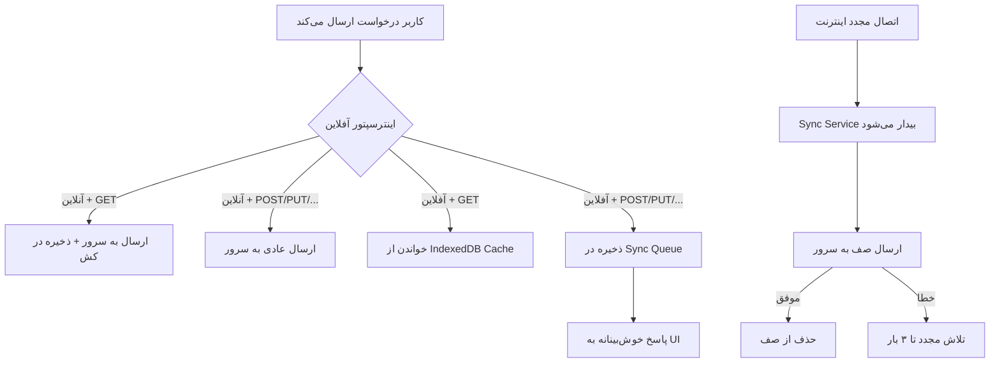

# Walkthrough — پیاده‌سازی PWA و آفلاین (Offline-First)

## خلاصه تغییرات
اپلیکیشن Angular انبار به یک PWA (Progressive Web App) با قابلیت کامل آفلاین تبدیل شد. کاربران می‌توانند برنامه را مثل یک اپلیکیشن واقعی روی گوشی نصب کنند، در حالت آفلاین با آن کار کنند، و پس از اتصال مجدد به اینترنت، تغییرات به صورت خودکار همگام‌سازی شوند.

---

## فایل‌های تغییر یافته

| فایل | نوع تغییر | توضیح |
|------|----------|-------|
| [package.json](file:///e:/warehouse%20project/warehouse-front/package.json) | MODIFY | افزودن `@angular/service-worker@22.0.2` و `dexie` |
| [index.html](file:///e:/warehouse%20project/warehouse-front/src/index.html) | MODIFY | افزودن متاتگ‌های PWA و لینک manifest |
| [angular.json](file:///e:/warehouse%20project/warehouse-front/angular.json) | MODIFY | فعال‌سازی `serviceWorker` در بیلد پروداکشن |
| [app.config.ts](file:///e:/warehouse%20project/warehouse-front/src/app/app.config.ts) | MODIFY | ثبت سرویس ورکر + اینترسپتور آفلاین + app initializer |
| [manifest.webmanifest](file:///e:/warehouse%20project/warehouse-front/public/manifest.webmanifest) | NEW | مشخصات PWA (نام فارسی، رنگ‌ها، آیکون‌ها) |
| [ngsw-config.json](file:///e:/warehouse%20project/warehouse-front/ngsw-config.json) | NEW | پیکربندی کش سرویس ورکر (App Shell + API) |
| [offline-db.ts](file:///e:/warehouse%20project/warehouse-front/src/app/core/services/offline-db.ts) | NEW | دیتابیس IndexedDB با Dexie.js |
| [network-status.service.ts](file:///e:/warehouse%20project/warehouse-front/src/app/core/services/network-status.service.ts) | NEW | تشخیص آنلاین/آفلاین |
| [offline-sync.service.ts](file:///e:/warehouse%20project/warehouse-front/src/app/core/services/offline-sync.service.ts) | NEW | صف همگام‌سازی و ارسال خودکار |
| [offline.interceptor.ts](file:///e:/warehouse%20project/warehouse-front/src/app/core/interceptors/offline.interceptor.ts) | NEW | هدایت شفاف درخواست‌ها بین سرور و کش لوکال |
| `public/icons/icon-*.svg` | NEW | آیکون‌های PWA (۸ سایز مختلف) |

---

## معماری سیستم آفلاین

---

## نتایج تست

| تست | نتیجه |
|-----|-------|
| بیلد Development | ✅ بدون خطا |
| بیلد Production | ✅ بدون خطا |
| تولید `ngsw-worker.js` | ✅ (84 KB) |
| تولید `ngsw.json` | ✅ (2.5 KB) |
| تولید `manifest.webmanifest` | ✅ (1.5 KB) |

---

## نکات مهم

> [!TIP]
> **سرویس ورکر فقط در بیلد پروداکشن فعال می‌شود.** در حالت توسعه (`ng serve`) سرویس ورکر غیرفعال است تا با hot reload تداخل نداشته باشد.

> [!IMPORTANT]
> **برای تست PWA روی گوشی** باید از طریق HTTPS یا localhost دسترسی داشته باشید. می‌توانید سرور Express فعلی (`server.js`) را برای سرو فایل‌های پروداکشن تنظیم کنید.

> [!NOTE]
> **آیکون‌ها فعلاً SVG هستند.** برای ظاهر بهتر در صفحه اصلی گوشی، توصیه می‌شود لوگوی اختصاصی پروژه را در قالب PNG آماده کنید.

