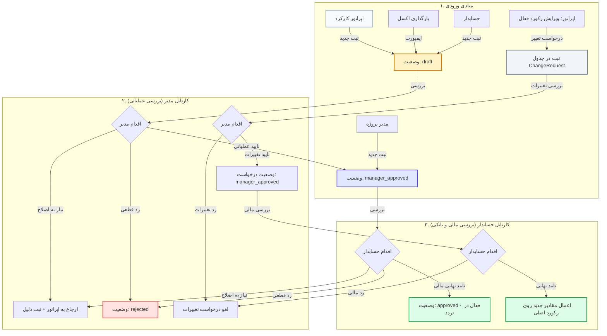

# سند طرح جامع چرخه تایید دو مرحله‌ای پرسنل و ناوگان (Two-Step Approval & Change Governance)

این سند طراحی تفصیلی معماری، مدل‌های داده، فرآیندها، لایه‌های امنیتی و ایجنت‌های نگهبان را برای پیاده‌سازی چرخه تایید دو مرحله‌ای (مدیر و حسابدار) در تعریف و ویرایش پرسنل و خودروهای ناوگان تشریح می‌کند.

---

## ۱. اهداف و نیازمندی‌های کلیدی سیستم (Core Requirements)

1. **تفکیک وظایف و کنترل داخلی (Segregation of Duties):**
   * کاربر ثبت کارکرد (اپراتور) تنها مجاز به ایجاد پیش‌نویس (`draft`) یا ثبت درخواست تغییرات (`pending_edit`) است.
   * تا پیش از تایید نهایی توسط هر دو نقش **مدیر پروژه** (تایید عملیاتی) و **حسابدار** (تایید مالی)، امکان ثبت هیچ‌گونه کارکرد روزانه یا سرویس ناوگان برای فرد/خودرو وجود ندارد.
2. **سناریوهای چندگانه ایجاد رکورد بر اساس نقش ایجادکننده:**
   * **ثبت توسط اپراتور / اکسل:** ورود به چرخه کامل ۲ مرحله‌ای (`draft` ⬅️ مدیر ⬅️ حسابدار ⬅️ `approved`).
   * **ثبت توسط مدیر:** دریافت خودکار تاییدیه مرحله ۱ (`manager_approved`) و ارسال مستقیم به کارتابل حسابدار.
   * **ثبت توسط حسابدار:** ورود به وضعیت `draft` جهت تایید عملیاتی مدیر، و نهایی شدن خودکار پس از تایید مدیر.
3. **مکانیزم پیش‌نویس تغییرات در ویرایش (Pending Edit Staging):**
   * ویرایش پرسنل یا خودروی فعال، داده‌های جاری را بازنویسی نمی‌کند و در قالب یک درخواست تغییرات (`ChangeRequest`) ثبت می‌شود تا در کارکردهای جاری با نرخ و مشخصات قبلی وقفه‌ای ایجاد نشود. پس از تایید نهایی مدیر و حسابدار، داده‌های جدید روی رکورد اصلی اعمال می‌گردند.
4. **سیاست رد و ارجاع به اصلاح (Rejection & Revision Policy):**
   * امکان ارجاع برای بازنگری به اپراتور با ذکر دلیل اجباری، یا رد قطعی رکورد.
5. **سازگاری ۱۰۰٪ با داده‌های قبلی (Zero Retroactive Impact):**
   * ارتقای خودکار تمامی پرسنل و خودروهای موجود فعلی به وضعیت `approved` و تضمین عدم تغییر کارکردها یا محاسبات حقوق ماه‌های قبل.

---

## ۲. دیاگرام جریان تایید و ماتریس حالت‌ها (State Machine & Workflow)

---

## ۳. تغییرات در لایه دیتابیس و مدل‌ها (Database & Schema Changes)

### الف) فیلدهای جدید در `PersonnelProfile` و `VehicleDriverProfile`:
* `approval_status`: شامل انتخاب‌های `draft` (پیش‌نویس)، `manager_approved` (تایید مدیر)، `approved` (تایید نهایی)، `revision_required` (نیازمند اصلاح)، `rejected` (رد شده). پیش‌فرض در مایگریشن برای رکوردهای قبلی: `approved`.
* `manager_approved_by`: کلید خارجی به کاربر مدیر تاییدکننده (`User`).
* `manager_approved_at`: زمان ثبت تاییدیه مدیر (`DateTimeField`).
* `accountant_approved_by`: کلید خارجی به حسابدار تاییدکننده (`User`).
* `accountant_approved_at`: زمان ثبت تاییدیه حسابدار (`DateTimeField`).
* `rejection_reason`: متن توضیحات و دلیل رد یا ارجاع به اصلاح (`TextField`).
* `has_pending_changes`: فلگ بولی (`BooleanField`) نشان‌دهنده وجود درخواست تغییرات در صف تایید.

### ب) مدل‌های جدید برای پیش‌نویس تغییرات (`ChangeRequest`):
* `PersonnelChangeRequest`: ذخیره فیلدهای تغییریافته پرسنل (شبا، حساب، حقوق، سمت، و...) در قالب ساختاریافته به همراه شناسه پرسنل هدف، ایجادکننده درخواست و وضعیت تایید ۲ مرحله‌ای.
* `VehicleChangeRequest`: ذخیره فیلدهای تغییریافته راننده/خودرو (نرخ سرویس، پلاک، شبا، مالکیت و...) به همراه وضعیت تایید ۲ مرحله‌ای.

---

## ۴. ماتریس دسترسی‌های دانه‌ای (Granular RBAC)

| ردیف | کد پرمیشن (Permission Code) | عنوان دسترسی | نقش‌های مجاز پیش‌فرض |
| :--- | :--- | :--- | :--- |
| ۱ | `personnel.can_create_personnel` | ثبت اولیه پرسنل و ارسال درخواست | اپراتور، مدیر، حسابدار، ادمین |
| ۲ | `personnel.can_approve_personnel_manager` | تایید مرحله اول (عملیاتی) پرسنل | مدیر پروژه، سرپرست کارگاه، ادمین |
| ۳ | `personnel.can_approve_personnel_finance` | تایید مرحله دوم (مالی) پرسنل | حسابدار، مدیر مالی، ادمین |
| ۴ | `personnel.can_create_vehicle` | ثبت اولیه خودرو و ناوگان | اپراتور، مدیر، حسابدار، ادمین |
| ۵ | `personnel.can_approve_fleet_manager` | تایید مرحله اول (عملیاتی) ناوگان | مدیر پروژه، سرپرست ترابری، ادمین |
| ۶ | `personnel.can_approve_fleet_finance` | تایید مرحله دوم (مالی) ناوگان | حسابدار، مدیر مالی، ادمین |

---

## ۵. قفل‌های امنیتی لایه سرویس (Backend Enforcement Gates)

> [!IMPORTANT]
> **قفل نفوذناپذیر در ثبت تردد و کارکرد:**
> در متدهای `DailyAttendanceViewSet.bulk_save` و `VehicleTripViewSet.bulk_save`، کوئری لود و ذخیره کارکرد مستقیماً فیلتر `approval_status='approved'` و `is_active=True` را اعمال می‌کند. در صورتی که کاربری با دستکاری Payload تلاش کند برای رکورد غیرتاییدشده کارکرد بفرستد، خطای `400 Bad Request` با پیام شفاف بازگردانده می‌شود.

---

## ۶. مجموعه ایجنت‌های مستقل نگهبان (Strict Phase Guardians)

برای اطمینان از سلامت ۱۰۰٪ سیستم و جلوگیری از کوچک‌ترین رگرسیون، آزمون‌های نگهبان خودکار در قالب اسکریپت‌های ایزوله اجرا خواهند شد:

| شماره ایجنت | نام ایجنت نگهبان | مسئولیت و آزمون‌های سختگیرانه |
| :---: | :--- | :--- |
| 🛡️ ۱ | **Schema & Migration Guardian** | تضمین عدم حذف داده‌های قبلی، اعمال مایگریشن‌ها و مقداردهی `approved` برای رکوردهای تاریخی. |
| 🛡️ ۲ | **Workflow State Machine Guardian** | آزمون جامع انتقال وضعیت‌ها (`draft` ⬅️ `manager_approved` ⬅️ `approved`) و مسدودسازی جهش‌های غیرمجاز. |
| 🛡️ ۳ | **RBAC Bypass & Security Guardian** | شبیه‌سازی حملات نفوذ و بررسی مسدود شدن تلاش‌های اپراتور برای تایید مستقیم رکوردهای خود. |
| 🛡️ ۴ | **Attendance & Trip Lock Guardian** | تست عملیاتی ثبت تردد برای رکوردهای `draft`/`rejected` و اطمینان از رد قطعی تراکنش در بک‌اند. |
| 🛡️ ۵ | **Pending Edit Staging Guardian** | تست ویرایش شبا و نرخ سرویس؛ اطمینان از حفظ داده‌های فعال قبلی تا لحظه تایید نهایی مدیر و حسابدار. |
| 🛡️ ۶ | **Historical Payroll & Zero-Regression Guardian** | محاسبه مجدد حقوق و تسویه‌های گذشته و تطبیق ۱۰۰٪ ریالی با فایل مرجع `حقوق تیر ماه انبارداری.xlsm`. |

