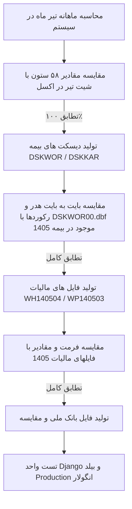

# 🏛️ طرح جامع معماری و پیاده‌سازی سیستم پرسنل، ناوگان، حقوق و دستمزد و تولید دیسکت‌های رسمی

این طرح فنی، نقشه راه پیاده‌سازی فازهای ۲ تا ۷ ماژول **پرسنل، ناوگان و حقوق و دستمزد** را بر مبنای فایل مرجع شرکت (`حقوق تیر ماه انبارداری.xlsm`)، ماکروهای استخراج‌شده، و ساختار فایل‌های دیسکت بیمه، مالیات و بانک تشریح می‌کند.

---

## 🎯 اهداف کلیدی طرح (Key Objectives)

1. **تفکیک دو پورتال مجزا با کنترل دسترسی (RBAC):**
   * **پورتال انباردار:** ثبت فوق‌سریع کارکرد روزانه پرسنل و سرویس‌های ناوگان با پنهان‌سازی ۱۰۰٪ اطلاعات و مبالغ محرمانه مالی.
   * **پورتال حسابدار:** مدیریت پرونده کارگزینی، تنظیمات پایه سالانه (جدول ۲۰ گروه شغلی و قانون کار)، محاسبه ماهانه ۵۸ ستون حقوقی، قفل دوره و صدور فایل‌های دیسکت.
2. **انطباق ریاضی و ساختاری ۱۰۰٪ با اکسل شرکت:**
   * پیاده‌سازی دقیق تمامی فرمول‌های شیت `تیر` و جداول شیت `Settings`.
3. **تولید دیسکت‌های بیمه با انکودینگ ایران‌سیستم (`IranSystem CodePage`):**
   * تولید فایل‌های باینری `DSKWOR00.DBF` و `DSKKAR00.DBF` که مستقیماً در نرم‌افزار تأمین اجتماعی بدون خطا باز و تأیید می‌شوند.
4. **تولید فایل‌های مالیات حقوق (`WH/WP`) و پرداخت گروهی بانک ملی:**
   * تولید فایل‌های متنی استاندارد سامانه مالیات و فایل‌های فرمت‌شده بانک ملی.

---

## 📦 جزئیات تغییرات فنی به تفکیک مؤلفه‌ها

### 🔹 ۱. بک‌اند (`warehouse-backend/personnel/`):
* **مدل‌های جدید تنظیمات (`models.py`):**
  * `PayrollYearlySettings`: سال مالی، تعداد روزهای هر ماه، بن خانوار، حق مسکن، حق تاهل، حق اولاد، ضرایب فوق‌العاده‌ها، هزینه سفر روزانه.
  * `JobGradeTier`: جدول ۲۰ گروه شغلی (شماره گروه ۱ تا ۲۰، مزد شغل روزانه، پایه سنواتی روزانه).
  * `WorkshopInsuranceSettings`: کد کارگاه ۱۰ رقمی، نام کارگاه، نام کارفرما، آدرس کارگاه، نرخ بیمه (۲۷٪)، ردیف پیمان، شرح پیش‌فرض لیست.
  * `TaxRuleSettings`: نوع پرداختی، محل خدمت، استثنائات، نوع ارز، نرخ تسعیر، الگوهای نام‌گذاری فایل‌های `WH` و `WP`.
  * `BankExportFormat`: فرمت خروجی بانک ملی، شناسه واریز، شرح پیش‌فرض.
* **مدل محاسبه ماهانه حقوق (`MonthlyPayrollRecord`):**
  * نگهداری سوابق ۵۸ ستون حقوق ماهانه برای هر پرسنل به همراه پیوند به دوره کاری (`MonthlyWorkPeriod`).
* **ماژول تبدیلگر ایران‌سیستم (`iransystem.py`):**
  * پیاده‌سازی دقیق الگوریتم جایگزینی کاراکترهای فارسی و اتصال حروف بر اساس ماکروی `IransystemAndOEMByteConverte.bas`.
* **ماژول تولیدکننده باینری DBF (`dbf_generator.py`):**
  * خواندن تمپلیت از `فایل خام بیمه` و تزریق فیلدها با ساختار باینری دقیق dBase III/IV.
* **ماژول تولیدکننده فایل‌های مالیات و بانک (`tax_bank_exporter.py`):**
  * تولید فایل‌های `WH1405xx` و `WP1405xx` و فایل واریز بانک ملی.
* **سرویس تجمیع کارکرد و موتور محاسبات (`payroll_engine.py`):**
  * موتور محاسباتی جهت تبدیل اتومایز کارکرد روزانه به مقادیر ناخالص، بیمه، مالیات، مزایا و خالص پرداختی.

---

### 🔹 ۲. فرانت‌اند (`warehouse-front/src/app/components/personnel/`):
* **جداسازی تب‌ها به ۲ بخش کلان:**
  * **بخش ۱: «عملیات و کارکرد انبار» (مخصوص انباردار)**
    * ثبت تقویمی حضور و غیاب ۱۰ ساعته، اضافه‌کار، مأموریت و جمعه‌کاری.
    * ثبت تردد و سرویس‌های خودروها و ناوگان.
  * **بخش ۲: «حسابداری و حقوق و دستمزد» (مخصوص حسابدار)**
    * زیرتب ۱: پرونده پرسنلی و ناوگان (با قابلیت درون‌ریزی اکسل).
    * زیرتب ۲: تنظیمات پایه سالانه (جدول ۲۰ گروه شغلی، قانون کار، بیمه، مالیات، بانک).
    * زیرتب ۳: محاسبه ماهانه حقوق (شیت تیر ماه) با کلید تجمیع سریع و بازنگری زنده.
    * زیرتب ۴: کارت ابزار صدور و دانلود دیسکت‌های بیمه، فایل‌های مالیات و بانک.

---

## 🛡️ برنامه راستی‌آزمایی ایجنت نگهبان (Safeguard Verification Plan)

