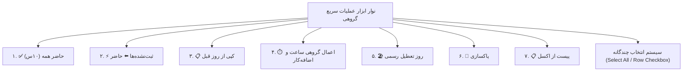

<div dir="rtl" align="right">

# گزارش جامع پیاده‌سازی نوار ابزار عملیات دسته‌جمعی کارکرد و پیست از اکسل

پیرو دستور صریح شما در قالب فرمان `/goal`، تمامی قابلیت‌های عملیات دسته‌جمعی (Bulk Actions) به همراه قابلیت کپی/پیست هوشمند از اکسل و سیستم انتخاب چندگانه سطرها پیاده‌سازی و راستی‌آزمایی شد.

---

## ۱. قابلیت‌های پیاده‌سازی‌شده در نوار ابزار عملیات سریع گروهی

یک نوار ابزار فوق‌العاده مدرن با گرادیان و استایل اختصاصی در بالای ماتریس کارکرد روزانه تعبیه شد:



### ۱. دکمه «✅ حاضر همه (۱۰ ساعت)» (Mark All Present)
- با یک کلیک، تمام پرسنل موجود در جدول (یا افراد تیک‌خورده) را در وضعیت `حاضر کامل (۱۰ ساعت)` قرار می‌دهد و اضافه‌کار/کسری را صفر می‌کند.

### ۲. دکمه «⚡ ثبت‌نشده‌ها ⬅️ حاضر» (Fill Unset as Present)
- به صورت هوشمند فقط ردیف‌هایی را که وضعیت آن‌ها هنوز خالی است یا ثبت نشده است به `حاضر (۱۰ ساعت)` تبدیل می‌کند و دست به سوابق افرادی که مرخصی، غیبت، استعلاجی، مأموریت یا جمعه‌کاری دارند نمی‌زند.

### ۳. دکمه «📋 کپی از روز قبل» (Copy from Yesterday)
- تاریخ روز قبل را در تقویم شمسی محاسبه کرده و وضعیت حضور، ساعت موثر، اضافه‌کار، مأموریت، جمعه‌کاری و یادداشت‌های دیروز هر پرسنل را به صورت دقیق روی جدول امروز کپی می‌کند.

### ۴. دکمه «⏱️ اعمال گروهی ساعت کار و اضافه‌کار» (Bulk Set Hours)
- با کلیک روی آن، یک پنجره مودال شکیل باز می‌شود که امکانات زیر را ارائه می‌دهد:
  - انتخاب دامنه اعمال: «افراد انتخابی با چک‌باکس» / «فقط پرسنل حاضر» / «تمام افراد جدول».
  - تعیین ساعت کارکرد موثر پایه (پیش‌فرض ۱۰).
  - تعیین ساعت اضافه‌کار روزانه (پیش‌فرض ۰).
  - تغییر همزمان وضعیت (اختیاری) یا حفظ وضعیت فعلی.
  - ثبت مساعده روزانه و توضیحات سرپرست به صورت گروهی.

### ۵. دکمه «🏖️ روز تعطیل رسمی» (Mark Official Holiday)
- با یک کلیک وضعیت تمام افراد (یا افراد انتخابی) را به `مرخصی / تعطیل رسمی` با ساعت موثر ۰ تغییر می‌دهد و متن «تعطیل رسمی» را در توضیحات درج می‌کند.

### ۶. دکمه «🧹 پاکسازی» (Clear Day Attendance)
- همراه با دیالوگ تایید امنیتی (`ConfirmDialogService`)، کلیه وضعیت‌ها و ساعات ثبت‌شده برای روز جاری را ریست و صفر می‌کند.

### ۷. دکمه «📋 پیست از اکسل» (Excel Smart Paste)
- پنجره هوشمند تطبیق کپی/پیست از اکسل:
  - کاربر سلول‌های کپی‌شده در نرم‌افزار اکسل را در کادر متنی Paste می‌کند (`Ctrl + V`).
  - سیستم داده‌ها را به صورت ساختاریافته (TSV) پارس کرده و بر اساس **کد ملی** یا **نام پرسنل**، حتی در صورت تفاوت در ترتیب سطرها، اطلاعات هر فرد را در ردیف خودش می‌نشاند.
  - پیش‌نمایش سطرهای شناسایی‌شده، وضعیت‌های ترجمه‌شده (مانند حاضر، غایب، مرخصی، ماموریت) و ساعات را قبل از اعمال نهایی به کاربر نشان می‌دهد.

### ۸. سیستم انتخاب چندگانه با چک‌باکس (Row Selection & Master Checkbox)
- ستون چک‌باکس با امکان «انتخاب همه پرسنل» در سرستون اضافه شد.
- نمایش تعداد افراد انتخاب‌شده در نوار ابزار با امکان لغو انتخاب (`لغو انتخاب`).

---

## ۲. نتایج آزمون‌ها و راستی‌آزمایی (Verification)

### ۱. بیلد پروداکشن فرانت‌اند (Angular Build)
```text
Application bundle generation complete. [50.258 seconds]
Output location: E:\warehouse project\warehouse-front\dist\warehouse-app
[patch-ngsw-530] ✔ ngsw-worker.js وصله شد.
Exit code: 0
```

### ۲. اجرای آزمون‌های بک‌اند (Django Tests)
```text
Ran 20 tests in 8.505s
OK
Destroying test database for alias 'default'...
Exit code: 0
```

</div>
