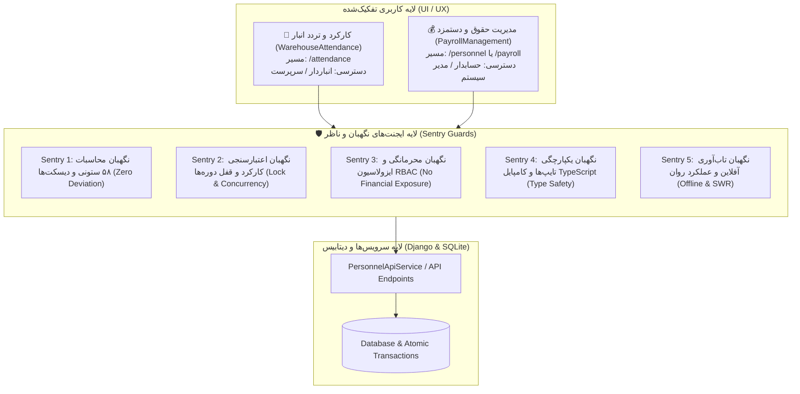

# طرح جامع مهندسی تفکیک و بهینه‌سازی «کارکرد انبار» و «حقوق و دستمزد» با ایجنت‌های نگهبان (Sentry Guards)

## ۱. صورت مسئله و اهداف معماری

در وضعیت فعلی، سیستم ثبت کارکرد روزانه (انباردار) با سیستم محاسبه ۵۸ ستونی حقوق و دستمزد و صدور دیسکت‌های قانونی (حسابدار) در یک کامپوننت غول‌پیکر ۲۴۰۰ خطی (`PersonnelManagement`) ادغام شده است. این ادغام باعث مشکلات زیر شده است:
1. **ازدحام شدید بصری و خستگی کاربر (UI Overload & Clutter):** انباشت ۴ لایه هدر، تکرار دکمه‌ها و ۱۲۰ دکمه در جدول.
2. **نقض اصل تفکیک وظایف و محرمانگی مالی (RBAC & Confidentiality):** انباردار نباید حقوق و دستمزد و ضرایب شغلی را مشاهده کند.
3. **ریسک بالای رگرسیون (Regression Risk):** هر تغییر در ظاهر ممکن است محاسبات حساس حقوق، فایل‌های دیسکت بیمه/مالیات یا قفل دوره‌ها را مختل کند.

---

## ۲. معماری ماژولار جدید (Separation of Concerns)

---

## ۳. معرفی ایجنت‌های نگهبان و لایه‌های نظارتی سخت‌گیر (The 5 Sentry Guards)

برای تضمین اینکه «تغییر ظاهر و تفکیک ماژول‌ها به هیچ عنوان کارکرد سیستم را خراب نکند»، ۵ ایجنت ناظر در فرآیند پیاده‌سازی تعریف شده است:

### 🛡️ ایجنت نگهبان ۱: محاسبات ۵۸ ستونی و دیسکت‌ها (Payroll Calculation & Diskette Sentry)
* **وظیفه:** تطابق ۱۰۰٪ و بدون حتی ۱ ریال خطا بین محاسبات سیستم با فایل مرجع اکسل (`حقوق تیر ماه انبارداری.xlsm`).
* **چک‌لیست سخت‌گیرانه:**
  - فرمول اضافه کار (مبنای روزانه ۱۰ ساعته: مزد روزانه تقسیم بر ۱۰).
  - اقلام معاف و مشمول بیمه (۷٪ کارگر، ۲۰٪ کارفرما، ۳٪ بیکاری).
  - جدول پلکانی مالیات حقوق سال ۱۴۰۴ / ۱۴۰۵.
  - ساختار دقیق فایل‌های دیسکت تأمین اجتماعی (`DSKWOR00.DBF`, `DSKKAR00.DBF`) و مالیات حقوق (`WH`/`WP`) و فایل واریز اکسل بانک ملی.
  - خروجی اکسل ۲ سطری با فریز `A3` و هدرهای رسمی.

### 🛡️ ایجنت نگهبان ۲: ماتریس کارکرد و قفل دوره‌ها (Attendance Matrix & Period Lock Sentry)
* **وظیفه:** اطمینان از ثبت اتمیک کارکرد، صحت فیلدهای تاریخ شمسی و انبار، و غیرفعال‌سازی مطلق ویرایش در زمان قفل بودن دوره.
* **چک‌لیست سخت‌گیرانه:**
  - در صورت `is_locked === true` یا وضعیت `LOCKED`، تمام فیلدها و دکمه‌های ویرایشی در فرانت‌اند `disabled` شوند و بک‌اند نیز در سطح سرویس `select_for_update` و اعتبارسنجی قفل را بررسی کند.
  - اکشن‌های گروهی (حاضر همه، کپی از دیروز، تعطیل رسمی) داده‌های قبلی خارج از فیلتر انبار جاری را خراب نکنند.

### 🛡️ ایجنت نگهبان ۳: محرمانگی داده‌ها و دسترسی RBAC (Data Privacy & Isolation Sentry)
* **وظیفه:** مسدودسازی قطعی نشت داده‌های مالی در محیط انباردار.
* **چک‌لیست سخت‌گیرانه:**
  - در نمای `/attendance` هیچ ستونی از دستمزد روزانه، حقوق پایه، مساعده ریالی حساس یا مجموع دریافتی‌ها به هیچ شکلی رندر نشود.
  - بررسی سطح دسترسی با `permission: 'view_wh_attendance'` برای انبار و `permission: 'view_sys_personnel'` برای مالی.

### 🛡️ ایجنت نگهبان ۴: صحت تایپ‌ها و سلامت بیلد (TypeScript & Type Integrity Sentry)
* **وظیفه:** انطباق کامل اینترفیس‌ها در `personnel.model.ts` و عدم وجود خطای کامپایل یا Any-casting بی‌مورد.
* **چک‌لیست سخت‌گیرانه:**
  - اجرای کامل `ng build` بعد از هر فاز.
  - حفظ کامل تمام اینترفیس‌ها و متدهای سرویس `PersonnelApiService`.

### 🛡️ ایجنت نگهبان ۵: عملکرد و پایداری شبکه (Performance & Offline Sentry)
* **وظیفه:** بارگذاری سریع، عدم افت فریم در جداول بزرگ و پشتیبانی از کش آفلاین با `SKIP_GLOBAL_ERROR_TOAST: true`.

---

## ۴. جزئیات طراحی رابط کاربری بازطراحی‌شده (UI/UX Transformation)

### الف) ماژول ثبت کارکرد و ناوگان انبار (`WarehouseAttendanceComponent`):
* **هدر فشرده و مدرن (Single Row Toolbar):** انتخاب انبار + انتخاب تاریخ شمسی (با ناوبری دیروز/امروز/فردا) + دکمه سوئیچ بین «ثبت روزانه» و «تقویم ماهانه ۳۱ روزه».
* **نوار ابزار عملیات سریع (Compact Bulk Actions Bar):**
  - ادغام اکشن‌های تکراری و حذف دکمه‌های زائد.
  - دکمه‌های مینیمال با رنگ‌بندی ملایم و هماهنگ (حاضر همه، ثبت‌نشده‌ها، کپی دیروز، ابزار اکسل).
* **جدول کارکرد روزانه بهینه‌شده:**
  - جایگزینی ۶ دکمه حجیم داخل سلول با یک **Segmented Badge Selector** فشرده و ارگونومیک (تنظیم وضعیت با ۱ کلیک بدون شلوغی).
  - ستون‌های سبک: ردیف، نام و کد ملی، سمت شغلی، وضعیت حضور، ساعت کارکرد، اضافه‌کار، توضیحات.
* **نوار شناور پایین صفحه (Sticky Floating Action Bar):** نمایش تعداد تغییرات ثبت‌شده + دکمه بزرگ و در دسترس «ذخیره کارکرد روزانه».

### ب) ماژول حقوق و دستمزد و امور مالی (`PayrollManagementComponent`):
* **تب‌های مالی متمرکز:**
  1. محاسبه و تجمیع ۵۸ ستونی حقوق ماهانه (شیت تیر).
  2. صدور دیسکت‌های بیمه تأمین اجتماعی، مالیات دارایی و اکسل بانک ملی.
  3. تنظیمات پایه و جدول ۲۰ گروه شغلی و ضرایب قانون کار.
  4. پرونده جامع پرسنل و ناوگان (`Emp_info`).
* **جدول داده‌های مالی ۵۸ ستونی با ناوبری و فیلترهای پیشرفته.**

---

## ۵. برنامه فازبندی پیاده‌سازی (Phased Implementation Plan)

| فاز | عنوان فاز | خروجی کلیدی | ایجنت نگهبان مسئول |
| :---: | :--- | :--- | :---: |
| **۱** | **استخراج و پیاده‌سازی ماژول کارکرد انبار** | ایجاد `WarehouseAttendance` با مسیر `/attendance` و UI خلوت و سریع | Sentry 2, Sentry 3 |
| **۲** | **بهینه‌سازی ماژول حقوق و دستمزد مالی** | اختصاصی‌سازی `PayrollManagement` برای مالی و دیسکت‌ها | Sentry 1, Sentry 4 |
| **۳** | **به‌روزرسانی روتینگ و منوهای سایدبار** | اتصال دقیق منوی انبار به `/attendance` و منوی سیستم به `/personnel` | Sentry 3, Sentry 4 |
| **۴** | **تست و ارزیابی جامع با ایجنت‌های نگهبان** | اجرای سناریوهای تایید کارکرد، دیسکت‌های DBF، قفل دوره و بیلد فرانت‌اند | تمام ایجنت‌ها |

---

## ۶. طرح اعتبارسنجی و تست (Verification Plan)

### تست‌های خودکار و دستی:
1. **تست بیلد فرانت‌اند:** اجرای دستور کامپایل Angular و بررسی عدم وجود خطای تایپ و کامپوننت.
2. **تست موتور حقوق ۵۸ ستونی:** بررسی یک دوره نمونه حقوق با داده‌های اکسل مرجع و اعتبارسنجی صفر بودن مغایرت‌ها.
3. **تست دیسکت‌های بیمه و مالیات:** خروجی گرفتن فایل‌های `DSKWOR00.DBF` و `DSKKAR00.DBF` و اعتبارسنجی هدر و بایت‌ها.
4. **تست کارکرد و قفل دوره:** ثبت یک روز کارکرد برای انبار، قفل کردن دوره، و بررسی غیرقابل ویرایش شدن فیلدها.
5. **تست رابط کاربری:** اعتبارسنجی ریسپانسیو بودن، کاهش فضای اشغال‌شده هدرها و تجربه کاربری تک‌کلیک.

