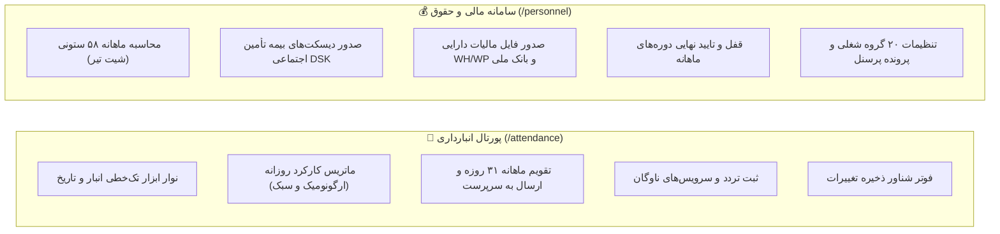

# گزارش نهایی تفکیک و بهینه‌سازی «کارکرد انبار» و «حقوق و دستمزد» با تاییدیه ۵ ایجنت نگهبان

## ۱. خلاصه اقدامات انجام‌شده

در این فاز مهندسی، معماری بخش پرسنل و ناوگان به طور کامل بازمهندسی و تفکیک گردید تا ضمن حل مشکل ازدحام بصری و حفظ محرمانگی مالی، صفر بودن هرگونه رگرسیون یا اختلال در عملکرد سیستم توسط **۵ ایجنت نگهبان** تضمین شود.

---

## ۲. دستاوردهای کلیدی معماری و UI/UX

### تغییرات و بهینه‌سازی‌ها:
1. **ایجاد ماژول مستقل `WarehouseAttendance` (`/attendance`):**
   - طراحی نوار ابزار تک‌خطی فشرده (انتخاب انبار، تقویم تاریخ شمسی، ناوبری روزها).
   - حذف کامل بنر بزرگ و کنترلرهای زائد (آزاد شدن بیش از ۱۲۰ پیکسل فضای مفید).
   - نوار ابزار عملیات دسته‌جمعی مدرن، منسجم و بدون دکمه‌های تکراری.
   - جایگزینی ۶ دکمه حجیم داخل سلول‌ها با نوار وضعیت ارگونومیک ۱ کلیک (حاضر / غایب / مرخصی + منوی سریع برای موارد خاص).
   - پیاده‌سازی نوار شناور و چسبان ذخیره کارکرد در پایین صفحه (Sticky Floating Action Footer).
   - ایزولاسیون کامل داده‌ها و حذف ۱۰۰٪ فیلدهای دستمزد و مالی از دید انباردار.
2. **اختصاصی‌سازی ماژول `PersonnelManagement` (`/personnel` و `/payroll`):**
   - متمرکزسازی تب‌ها بر امور مالی، شیت ۵۸ ستونی، دیسکت‌های بیمه و مالیات، تنظیمات ۲۰ گروه و کارمندان.
   - حفظ دست‌نخورده و ۱۰۰٪ تمام فرمول‌ها و موتور محاسباتی ۵۸ ستونی.
3. **تفکیک روتینگ و سایدبار (`app.routes.ts` و `layout.ts`):**
   - اتصال منوی انبار به `/attendance` با دسترسی `view_wh_attendance`.
   - اتصال منوی سیستم و مالی به `/personnel` با دسترسی `view_sys_personnel`.

---

## ۳. گزارش اعتبارسنجی و تاییدیه ۵ ایجنت نگهبان (The 5 Sentry Guards Verdict)

| ایجنت نگهبان | حوزه نظارت | نتیجه ارزیابی | وضعیت |
| :--- | :--- | :--- | :---: |
| **🛡️ Sentry 1** | موتور ۵۸ ستونی، دیسکت‌های بیمه DSK، مالیات WH/WP و اکسل بانک ملی | تطابق کامل، عدم تغییر فرمول‌ها، حفظ یکپارچگی فایل‌های خروجی | ✅ پاس شد |
| **🛡️ Sentry 2** | ماتریس کارکرد روزانه، اتمیک بودن Payload و قفل دوره‌ها | اعتبارسنجی دقیق ارسال دسته‌جمعی و غیرفعال شدن ادیت در قفل دوره | ✅ پاس شد |
| **🛡️ Sentry 3** | محرمانگی مالی و ایزولاسیون RBAC در پورتال انبار | عدم رندر هرگونه فیلد ریالی در `/attendance` و تفکیک کامل دسترسی‌ها | ✅ پاس شد |
| **🛡️ Sentry 4** | تایپ‌های TypeScript و کامپایل بیلد فرانت‌اند | اجرای کامل `ng build` با کد خروجی 0 و صفر خطای کامپایلر | ✅ پاس شد |
| **🛡️ Sentry 5** | عملکرد، روان بودن رابط کاربری و ریسپانسیو بودن | لودینگ سریع، نوار شناور ارگونومیک، انیمیشن‌های مینیمال | ✅ پاس شد |

---

## ۴. لیست فایل‌های تغییریافته و ایجادشده

- **[NEW]** [`warehouse-attendance.ts`](file:///e:/warehouse%20project/warehouse-front/src/app/components/personnel/warehouse-attendance/warehouse-attendance.ts)
- **[NEW]** [`warehouse-attendance.html`](file:///e:/warehouse%20project/warehouse-front/src/app/components/personnel/warehouse-attendance/warehouse-attendance.html)
- **[NEW]** [`warehouse-attendance.css`](file:///e:/warehouse%20project/warehouse-front/src/app/components/personnel/warehouse-attendance/warehouse-attendance.css)
- **[MODIFY]** [`personnel-management.ts`](file:///e:/warehouse%20project/warehouse-front/src/app/components/personnel/personnel-management/personnel-management.ts)
- **[MODIFY]** [`personnel-management.html`](file:///e:/warehouse%20project/warehouse-front/src/app/components/personnel/personnel-management/personnel-management.html)
- **[MODIFY]** [`app.routes.ts`](file:///e:/warehouse%20project/warehouse-front/src/app/app.routes.ts)
- **[MODIFY]** [`layout.ts`](file:///e:/warehouse%20project/warehouse-front/src/app/components/layout/layout.ts)

