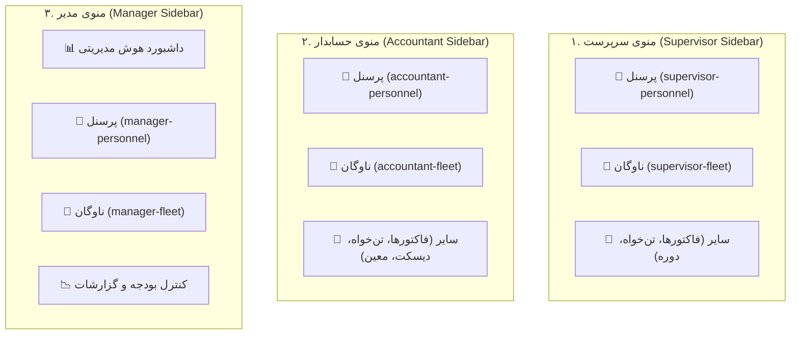

<div dir="rtl" align="right">

# طرح جامع معماری دو هاب بنیادین «پرسنل» و «ناوگان» در منوی سمت راست (سایدبار) برای ۳ نقش سرپرست، حسابدار و مدیر (Triple-Role Dual-Hub Architecture)

## ۱. خلاصه هدف و انگیزه تغییرات (Goal Description)
بر اساس بازخورد و تصمیم اتخاذ شده، به جای تجمیع تب‌های درون‌صفحه‌ای یا پراکندگی چندین منوی ناهمگون، ساختار کلان ماژول‌های منابع انسانی و لجستیک در سایدبار سمت راست برای هر **سه نقش کلیدی (سرپرست، حسابدار، مدیر)** به یک معماری استاندارد، خلوت و مقیاس‌پذیر تبدیل می‌شود:

> در منوی سمت راست (سایدبار) هر یک از این ۳ نقش، دقیقاً دو منوی اصلی و شاخص به نام‌های **«👥 پرسنل»** و **«🚚 ناوگان»** تعبیه خواهد شد. کلیه نیازمندی‌ها، فرآیندها و ابزارهای مرتبط با این دو حوزه (پرونده‌های جدید، کارکرد، احکام و حقوق، تسویه‌حساب و تغییرات) به صورت **زیرتب‌های افقی (In-Page Subtabs)** درون همان دو صفحه تجمیع می‌شوند.

این ساختار دارای مزایای بنیادین زیر است:
1. **تقارن کامل (Symmetry):** در منوی کارمند نیز ثبت اولیه به تفکیک دو ماژول مستقل انجام می‌شود (`employee-new-personnel` و `employee-new-vehicle`).
2. **سایدبار تمیز و خلوت (Decluttered Sidebar):** کاهش ده‌ها آیتم تکراری به دو هاب تخصصی.
3. **توسعه‌پذیری نامحدود (Future-Proof):** هر ویژگی جدید در آینده (بیمه تکمیلی، جرایم رانندگی، بارنامه، پاداش) صرفاً به عنوان یک زیرتب در هاب مربوطه اضافه می‌شود بدون آنکه ساختار منوی اصلی تغییر کند.

---

## ۲. ساختار منوی سمت راست در ۳ نقش (Sidebar Structure)



---

## ۳. ماتریس کارکردی زیرتب‌ها درون صفحات هاب (Subtabs Functional Matrix)

| نقش سازمانی | هاب اصلی سایدبار | زیرتب‌های افقی بالای صفحه (In-Page Subtabs) | اقدامات و دسترسی‌های کلیدی |
| :--- | :--- | :--- | :--- |
| **سرپرست کارگاه** | **👥 پرسنل** | ۱. `🆕 پرونده‌های جدید`<br>۲. `📋 کارکرد و حضورغیاب`<br>۳. `🔄 درخواست‌های تغییرات`<br>۴. `📁 همه پرسنل و سوابق` | - تایید اولیه مشخصات پرسنل کارگاه<br>- ثبت/تایید کارکرد روزانه و اضافه کاری<br>- تایید درخواست‌های تغییرات مشخصات پرسنل<br>- عودت به بازنگری یا رد با ذکر علت مستند |
| **سرپرست کارگاه** | **🚚 ناوگان** | ۱. `🆕 خودروهای جدید`<br>۲. `🚛 کارکرد ماشین‌آلات`<br>۳. `🔄 درخواست‌های تغییرات`<br>۴. `📁 همه ناوگان و سوابق` | - تایید فیزیکی ورود خودرو و ماشین‌آلات به کارگاه<br>- تایید سرویس‌ها و ساعات کارکرد روزانه ماشین‌آلات<br>- بررسی تغییرات اطلاعات راننده/مالک |
| **حسابدار مالی** | **👥 پرسنل** | ۱. `🆕 پرونده‌ها و احکام مالی`<br>۲. `💳 حقوق و دستمزد ماهانه`<br>۳. `🔄 درخواست‌های تغییرات`<br>۴. `📁 همه پرسنل و سوابق` | - تعیین گروه شغلی، پایه سنوات و مزد مبنا<br>- ثبت شماره بیمه، مالیات و اعتبارسنجی الگوریتم شبا<br>- ارسال به مدیر (`pending_manager`)<br>- محاسبه کارکرد و فیش حقوقی ماهانه |
| **حسابدار مالی** | **🚚 ناوگان** | ۱. `🆕 خودروها و نرخ کرایه`<br>۲. `🚚 تسویه‌حساب و کارکرد`<br>۳. `🔄 درخواست‌های تغییرات`<br>۴. `📁 همه ناوگان و سوابق` | - تعیین نرخ ثابت یا سرویسی قرارداد ناوگان<br>- ممیزی کارکرد ماشین‌آلات و ثبت سند تسویه‌حساب<br>- تایید حساب بانکی راننده/مالک |
| **مدیر ارشد** | **👥 پرسنل** | ۱. `🆕 تصویب پرونده‌های جدید`<br>۲. `📜 تصویب احکام و قراردادها`<br>۳. `🔄 تصویب تغییرات پرسنل`<br>۴. `📁 پرسنل فعال و سوابق` | - تایید نهایی استخدام و فعال‌سازی سراسری پرسنل<br>- امضا و تصویب احکام مالی و بودجه حقوقی<br>- رسیدگی به تغییرات حساس هویتی/قراردادی |
| **مدیر ارشد** | **🚚 ناوگان** | ۱. `🆕 تصویب خودروهای جدید`<br>۲. `🚚 تصویب تسویه‌حساب ناوگان`<br>۳. `🔄 تصویب تغییرات ناوگان`<br>۴. `📁 ناوگان فعال و سوابق` | - تصویب نهایی ورود ناوگان و قراردادهای استیجاری<br>- تایید پرداخت اسناد مالی و تسویه‌حساب ناوگان |

---

## ۴. بررسی نیازمندی‌ها و نکات معماری (User Review Required)

> [!IMPORTANT]
> **۱. هماهنگی کامل با گذشته و عدم شکستن روت‌های قبلی (100% Backward Compatibility):**  
> برای جلوگیری از بروز خطای ۴۰۴ یا شکستن بوک‌مارک‌ها و تست‌های موجود، کلیه روت‌های قبلی (نظیر `/app/finance/supervisor-new-profiles`، `/app/finance/accountant-new-profiles`، `/app/finance/supervisor-attendance`، `/app/finance/accountant-payroll` و `/app/finance/manager-approvals`) به عنوان `alias` یا ریدایرکت خودکار به تب متناظر در هاب جدید فعال خواهند ماند.

> [!TIP]
> **۲. مدیریت وضعیت با URL Query Params دو سطحی:**  
> ساختار آدرس‌دهی مرورگر به صورت شفاف و پایدار به شکل زیر خواهد بود:
> - برای سرپرست: `/app/finance/supervisor-personnel?tab=new` یا `?tab=attendance` یا `?tab=changes`
> - برای حسابدار: `/app/finance/accountant-personnel?tab=new` یا `?tab=payroll` یا `?tab=changes`
> - برای ناوگان: `/app/finance/accountant-fleet?tab=new` یا `?tab=settlement`
> با رفرش صفحه، موقعیت دقیق کاربر حفظ می‌گردد.

> [!NOTE]
> **۳. رعایت استاندارد Unified Sticky Command Center:**  
> تمامی صفحات هاب از هدر چسبان استاندارد با فیلتر بخش ایزوله شده (`mySections`)، بج‌های شمارنده زنده، جستجوی بلادرنگ و دکمه‌های آیکونی سه‌گانه (خروجی اکسل در رنگ زمردی، ورودی اکسل در رنگ نیلی، و همگام‌سازی در رنگ طوسی) بهره‌مند خواهند شد.

---

## ۵. جزئیات دقیق فایل‌ها و کدهای نیازمند تغییر (Proposed Code Changes)

### الف) لایه منوی سایدبار و ناوبری (Navigation Layer)
#### [MODIFY] `src/app/modules/accounting/nav-items.ts`
- بازنویسی آرایه‌های `SUPERVISOR_NAV_ITEMS`، `ACCOUNTANT_NAV_ITEMS` و `MANAGER_NAV_ITEMS`:
```typescript
export const SUPERVISOR_NAV_ITEMS: NavItem[] = [
  { id: 'supervisor-personnel', label: '👥 پرسنل', icon: 'users', permission: 'perm_approve_personnel_supervisor', module: 'accounting', isAccounting: true },
  { id: 'supervisor-fleet', label: '🚚 ناوگان', icon: 'truck', permission: 'perm_approve_fleet_supervisor', module: 'accounting', isAccounting: true },
  { id: 'supervisor-invoices', label: '🧾 تایید فاکتورهای هزینه', icon: 'dollar-sign', permission: 'view_sys_payroll', module: 'accounting', isAccounting: true },
  { id: 'supervisor-petty-cash', label: '💰 تایید اسناد تن‌خواه', icon: 'credit-card', permission: 'view_sys_payroll', module: 'accounting', isAccounting: true },
  { id: 'supervisor-period-lock', label: '🔒 بستن دوره کارکرد ماهانه', icon: 'briefcase', permission: 'perm_lock_work_period', module: 'accounting', isAccounting: true },
];

export const ACCOUNTANT_NAV_ITEMS: NavItem[] = [
  { id: 'accountant-personnel', label: '👥 پرسنل', icon: 'users', permission: 'view_sys_payroll', module: 'accounting', isAccounting: true },
  { id: 'accountant-fleet', label: '🚚 ناوگان', icon: 'truck', permission: 'view_sys_fleet_settlement', module: 'accounting', isAccounting: true },
  { id: 'accountant-invoices', label: '🧾 ممیزی فاکتورهای هزینه', icon: 'file-text', permission: 'view_sys_payroll', module: 'accounting', isAccounting: true },
  { id: 'accountant-petty-cash', label: '💰 کنترل تن‌خواه‌گردان', icon: 'credit-card', permission: 'view_sys_payroll', module: 'accounting', isAccounting: true },
  { id: 'accountant-diskettes', label: '📑 دیسکت‌های بیمه و مالیات', icon: 'briefcase', permission: 'view_sys_payroll', module: 'accounting', isAccounting: true },
  { id: 'accountant-counterparties', label: '🤝 معین طرف‌حساب‌های مالی', icon: 'users', permission: 'view_sys_payroll', module: 'accounting', isAccounting: true },
];

export const MANAGER_NAV_ITEMS: NavItem[] = [
  { id: 'manager-dashboard', label: '📊 داشبورد هوش مدیریتی', icon: 'bar-chart-2', permission: 'can_act_as_company_manager', module: 'accounting', isAccounting: true },
  { id: 'manager-personnel', label: '👥 پرسنل', icon: 'users', permission: 'can_act_as_company_manager', module: 'accounting', isAccounting: true },
  { id: 'manager-fleet', label: '🚚 ناوگان', icon: 'truck', permission: 'can_act_as_company_manager', module: 'accounting', isAccounting: true },
  { id: 'manager-budget', label: '📉 کنترل بودجه و هزینه‌ها', icon: 'activity', permission: 'can_act_as_company_manager', module: 'accounting', isAccounting: true },
  { id: 'manager-reports', label: '📑 گزارشات جامع مدیریتی', icon: 'briefcase', permission: 'can_act_as_company_manager', module: 'accounting', isAccounting: true },
];
```

#### [MODIFY] `src/app/components/layout/layout.ts`
- افزودن شناسه‌های روت‌های جدید به آرایه `accountingTabs` در متد `switchTab`:
```typescript
'supervisor-personnel', 'supervisor-fleet',
'accountant-personnel', 'accountant-fleet',
'manager-personnel', 'manager-fleet',
```

#### [MODIFY] `src/app/modules/accounting/accounting.routes.ts`
- ثبت روت‌های اختصاصی و ریدایرکت‌های سازگار:
```typescript
// روت‌های سرپرست
{ path: 'supervisor-personnel', component: SupervisorPersonnelHubComponent, data: { reuse: true } },
{ path: 'supervisor-fleet', component: SupervisorFleetHubComponent, data: { reuse: true } },
{ path: 'supervisor-new-profiles', redirectTo: 'supervisor-personnel', pathMatch: 'full' },
{ path: 'supervisor/personnel', redirectTo: 'supervisor-personnel', pathMatch: 'full' },

// روت‌های حسابدار
{ path: 'accountant-personnel', component: AccountantPersonnelHubComponent, data: { reuse: true } },
{ path: 'accountant-fleet', component: AccountantFleetHubComponent, data: { reuse: true } },
{ path: 'accountant-new-profiles', redirectTo: 'accountant-personnel', pathMatch: 'full' },
{ path: 'accountant/personnel', redirectTo: 'accountant-personnel', pathMatch: 'full' },

// روت‌های مدیر
{ path: 'manager-personnel', component: ManagerPersonnelHubComponent, data: { reuse: true } },
{ path: 'manager-fleet', component: ManagerFleetHubComponent, data: { reuse: true } },
{ path: 'manager/personnel', redirectTo: 'manager-personnel', pathMatch: 'full' },
{ path: 'manager/fleet', redirectTo: 'manager-fleet', pathMatch: 'full' },
```

---

## ۶. تفکیک فازهای اجرایی (Execution Phases)

### فاز ۱: زیرساخت سایدبار، مسیریابی و سازگاری (Navigation & Routing Layer)
1. ویرایش `nav-items.ts` و پیاده‌سازی دو آیتم ثابت `👥 پرسنل` و `🚚 ناوگان` در منوی سرپرست، حسابدار و مدیر.
2. ثبت روت‌های جدید و ریدایرکت‌های سازگار در `accounting.routes.ts`.
3. به‌روزرسانی متد ناوبری در `layout.ts`.

### فاز ۲: پیاده‌سازی و استقرار هاب‌های سرپرست (Supervisor Hubs)
1. ساخت/تکمیل `supervisor-personnel` با زیرتب‌های جدید، کارکرد، تغییرات و سوابق.
2. ارتقای `supervisor-fleet` با زیرتب‌های خودروهای جدید، کارکرد ماشین‌آلات و تغییرات.
3. اتصال به `queryParams` جهت پایداری تب انتخابی.

### فاز ۳: پیاده‌سازی و استقرار هاب‌های حسابدار (Accountant Hubs)
1. ساخت/تکمیل `accountant-personnel` با ادغام پرونده‌های مالی، مودال ۴ تب احکام، دکمه‌های تایید مالی و حقوق.
2. ارتقای `accountant-fleet` با زیرتب‌های تایید خودرو و نرخ، تسویه‌حساب و تغییرات.
3. اتصال به الگوریتم ISO 7064 Mod 97 شبا و جدول ۲۰ گانه مزد.

### فاز ۴: پیاده‌سازی و استقرار هاب‌های مدیر ارشد (Manager Hubs)
1. ساخت `manager-personnel` متصل به تاییدات نهایی `pending_manager` و احکام.
2. ساخت `manager-fleet` متصل به تصویب ناوگان و پرداخت‌های نهایی.
3. تعبیه مودال ثبت یادداشت تایید (`approval_note`).

### فاز ۵: تست‌های جامع، بیلد پروژه و آزمون عملکردی مرورگر (Testing & Build Verification)
1. به‌روزرسانی تست‌های واحد و DOM مبتنی بر Vitest و jsdom.
2. اجرای بیلد کامل بدون هیچ خطای تایپ‌اسکریپت (`npm run build`).
3. بازبینی چشمی ریسپانسیو و هماهنگی بصری هدر و زیرتب‌ها.

---

## ۷. برنامه اعتبارسنجی و تست‌ها (Verification Plan)

### تست‌های خودکار (Automated Tests)
```bash
# ۱. تست‌های DOM هاب حسابدار
npx vitest run src/app/components/finance/accountant/accountant-new-profiles/accountant-new-profiles.dom.spec.ts

# ۲. تست‌های واحد هاب سرپرست
npx vitest run src/app/components/finance/supervisor/supervisor-new-profiles/supervisor-new-profiles.spec.ts

# ۳. تست‌های کلی پرمیشن‌ها و ناوبری
npx vitest run src/app/core/auth/all-users-permissions-dom.spec.ts
```

### بررسی دستی و چشمی (Manual Verification)
1. **بررسی سایدبار ۳ نقش:** ورود به عنوان سرپرست، حسابدار و مدیر و اطمینان از وجود ۲ منوی شفاف «👥 پرسنل» و «🚚 ناوگان» در منوی سمت راست هر سه نقش.
2. **بررسی زیرتب‌های افقی:** باز کردن هر هاب و جابجایی بین زیرتب‌ها و راستی‌آزمایی تغییر آدرس مرورگر (`?tab=...`).
3. **بررسی اکشن‌های مالی:** باز کردن مودال احکام در هاب پرسنل حسابدار، تولید خودکار شبا با دکمه `⚡` و ثبت تایید مالی.
4. **تست گردش‌کار مدیر:** مشاهده موارد ارسال‌شده در هاب پرسنل و ناوگان مدیر و تصویب نهایی.

</div>
