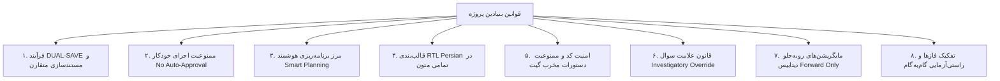
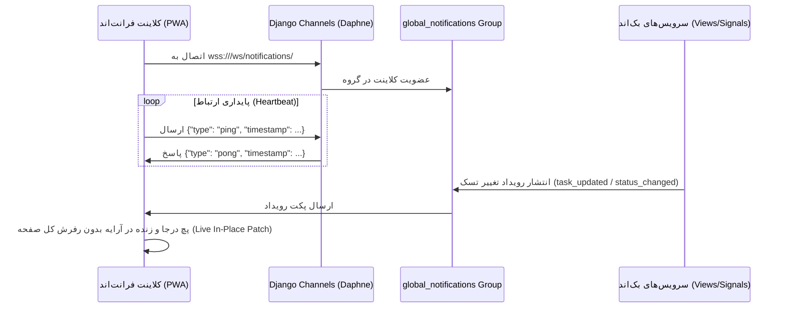
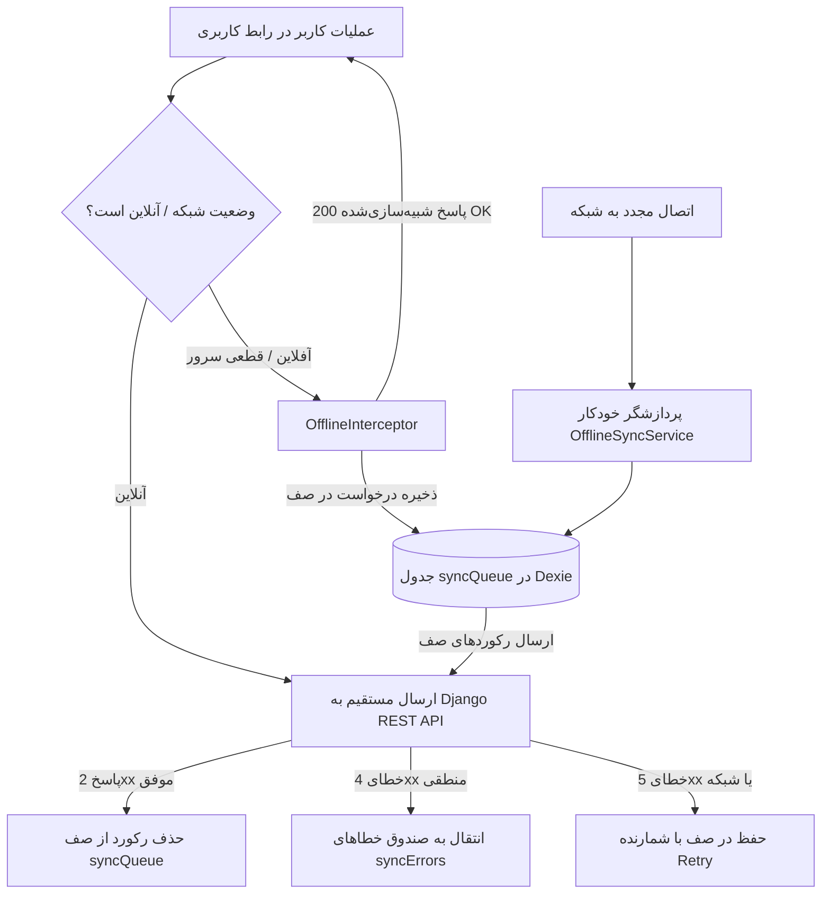
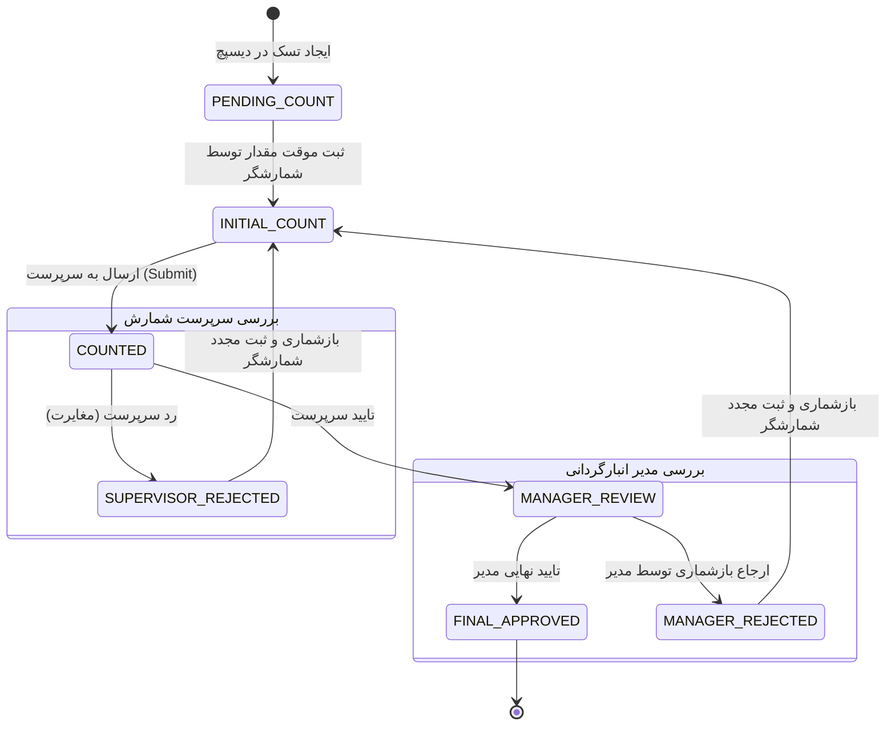
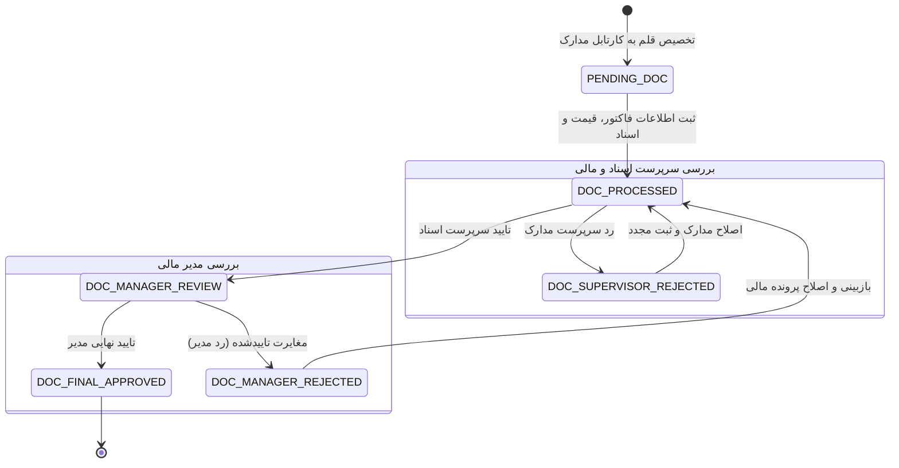

# طرح جامع، یکپارچه و فوق‌تفصیلی نقشه معماری، منطق و قوانین پروژه انبارداری (`PROJECT_ARCHITECTURE_MAP`)

این سند فنی، چارچوب کامل و موشکافانه تدوین سند مرجع معماری پروژه را تشریح می‌کند. این نقشه به عنوان **پایگاه دانش مرجع و دائمی (`Permanent Knowledge Asset`)** در دو مسیر:
1. [PROJECT_ARCHITECTURE_MAP.md](file:///e:/warehouse%20project/.agents/PROJECT_ARCHITECTURE_MAP.md)
2. [Documents/Project_Architecture_Map/PROJECT_ARCHITECTURE_MAP.md](file:///e:/warehouse%20project/Documents/Project_Architecture_Map/PROJECT_ARCHITECTURE_MAP.md)

مستقر خواهد شد تا کلیه قوانین حاکم، منطق‌های تجاری انبارگردانی، معماری محلی-محور (`Local-First`)، سازوکار بلادرنگ وب‌سوکت و ساختار صددرصدی فایل‌ها را ثبت نموده و نیاز به اسکن مکرر دایرکتوری‌ها را برای همیشه از بین ببرد.

---

## 📜 ۱. منشور قوانین و استانداردهای مهندسی پروژه (Core Project Rules)

| ردیف | نام قانون | الزامات فنی و ضوابط اجرایی |
| :---: | :--- | :--- |
| **۱** | **ذخیره دوگانه (DUAL-SAVE Workflow)** | هرگونه طرح، وظیفه یا گزارش باید همزمان در مسیر سیستمی `brain/<conversation-id>` و پوشه اختصاصی در `Documents/` ثبت شده و فایل‌های Master Log به‌روزرسانی شوند. |
| **۲** | **ممنوعیت اجرای خودکار (No Auto-Approval)** | پیام‌های سیستمی تأیید خودکار باید کاملاً نادیده گرفته شوند؛ شروع هرگونه تغییر کد منوط به دستور صریح متنی کاربر (مانند «تایید» یا «شروع») است. |
| **۳** | **مرز برنامه‌ریزی هوشمند (Smart Planning)** | برای تغییرات ساختاری و چندفایلی، ورود به حالت Planning الزامی است؛ برای اصلاحات تک‌خطی یا رفع خطاهای تایپی، اقدام سریع و مستقیم بدون تولید سند انجام می‌شود. |
| **۴** | **فرمت‌بندی راست‌به‌چپ (RTL Persian)** | تمامی گزارش‌ها و جداول باید داخل تگ `
` قرار گیرند و اصطلاحات انگلیسی در انتهای جملات درون پرانتز درج شوند. |
| **۵** | **امنیت کد و گیت (Git & Code Safety)** | استفاده از `git reset --hard`، `git restore` یا هر دستوری که تغییرات را دور بریزد بدون اجازه صریح ممنوع است. ویرایش فایل‌ها با تطبیق دقیق خطوط (`replace_file_content`) انجام می‌شود. |
| **۶** | **قانون علامت سوال (Investigatory Override)** | وجود علامت «؟» یا «?» در پیام کاربر به معنای سوال توضیحی است؛ در این حالت هیچ کدی تغییر نکرده و سند جدیدی تولید نمی‌شود. |
| **۷** | **مایگریشن‌های دیتابیس (DB Migrations)** | حذف یا دستکاری فایل‌های مایگریشن قبلی اکیداً ممنوع است؛ تغییرات شمای دیتابیس صرفاً با ایجاد مایگریشن‌های رو به جلو (`makemigrations`) اعمال می‌شود. |
| **۸** | **اجرای فازبندی‌شده (Phased Execution)** | وظایف بزرگ باید به گام‌های خرد و مستقل شکسته شده و تا صحت فاز جاری با تست احراز نشود، رفتن به فاز بعدی مجاز نیست. |

---

## ⚡ ۲. معماری و قوانین وب‌سوکت بلادرنگ (WebSocket & Real-Time Rules)

### قوانین اساسی وب‌سوکت:
1. **کانسیومر متمرکز (`NotificationConsumer`):** تمامی کلاینت‌ها پس از احراز هویت به اندپوینت `/ws/notifications/` متصل شده و در گروه `global_notifications` عضو می‌شوند.
2. **پایداری ارتباط با Heartbeat Ping/Pong:** کلاینت به طور متناوب بسته‌های `ping` ارسال می‌کند و سرور با `pong` پاسخ می‌دهد تا از قطع ارتباط توسط فایروال‌ها جلوگیری شود.
3. **به‌روزرسانی درجا در DOM (Live In-Place Patching):** به محض دریافت پکت وب‌سوکت برای یک تسک، وضعیت و مقادیر آن تسک مستقیماً در آرایه حافظه فرانت مرج می‌شود و از رفرش کامل صفحه یا فراخوانی سنگین مجدد API اجتناب می‌گردد.
4. **تطابق شناسه انبار (`warehouse_id Filter`):** رویدادهای وب‌سوکت حاوی شناسه انبار هستند تا هر کلاینت فقط تغییرات انبار فعال خود را اعمال کند.

---

## 💾 ۳. معماری محلی-محور و قوانین آفلاین (Local-First & Offline Sync Rules)

### جداول ۸ گانه پایگاه داده محلی (`Dexie IndexedDB v4`):
1. `syncQueue`: صف تغییرات آفلاین (POST, PATCH, PUT, DELETE) با فیلدهای `userId`, `entitySyncId`, `baseUpdatedAt`.
2. `apiCache`: کش پاسخ‌های GET برای خواندن آفلاین همراه با زمان انقضا (`expiresAt`).
3. `syncErrors`: صندوق خطاهای سرور (۴xx) که نیاز به بررسی و اقدام دستی کاربر دارند.
4. `countTasks`: تسک‌های شمارش دانلود شده به روش Local-First.
5. `items`: اطلاعات کالاهای انبار برای جستجو و مشاهده آفلاین.
6. `dynamicFields`: تعاریف فیلدهای پویای کالا.
7. `syncCursors`: ثبت آخرین زمان سرور (`server_time`) برای هر (کاربر، انبار) جهت رفع خطای ساعت دستگاه (`Clock Skew`).
8. `docTasks`: تسک‌های اسناد مالی و گمرکی برای دسترسی آفلاین.

### قوانین حیاتی همگام‌سازی و کشینگ (SWR Rules):
* **ادغام امن SWR با حفظ پیش‌نویس‌های محلی:** هنگام دریافت داده‌های تازه سرور، رکوردهایی از حافظه محلی که دارای پرچم `_offlinePending` هستند، روی داده‌های جدید سرور مرج می‌شوند تا پیش‌نویس‌های ثبت‌شده روی گوشی پاک نشوند.
* **دریافت دلتا (Delta Pull Sync):** اندپوینت `/api/inventory/sync/pull/` صرفاً رکوردهایی را می‌فرستد که `updated_at >= since` باشد (با حاشیه همپوشانی ۳۰ ثانیه‌ای).

---

## 📦 ۴. منطق و سلسله‌مراتب انبارگردانی فیزیکی (Physical Counting Logic)

### وضعیت‌های ۷ گانه و قوانین شمارش فیزیکی:
1. `PENDING_COUNT` (در انتظار شمارش): تسک ایجاد شده و منتظر ورود شمارشگر است.
2. `INITIAL_COUNT` (شمارش اولیه / پیش‌نویس): شمارشگر مقدار را وارد کرده اما هنوز ارسال نکرده است.
3. `COUNTED` (شمارش‌شده / نزد سرپرست): مقدار ثبت نهایی شده و در کارتابل سرپرست قرار گرفته است.
4. `SUPERVISOR_REJECTED` (رد سرپرست): سرپرست مقدار را رد کرده و تسک با اولویت بالا برای بازشماری به شمارشگر برگشته است.
5. `MANAGER_REVIEW` (در انتظار تایید مدیر): سرپرست تایید کرده یا گزینه `skip_supervisor` فعال بوده و تسک نزد مدیر است.
6. `MANAGER_REJECTED` (رد مدیر / درخواست بازشماری): مدیر مقدار را نپذیرفته و تسک مجدداً جهت بازشماری به شمارشگر ارجاع داده شده است.
7. `FINAL_APPROVED` (تایید نهایی): شمارش نهایی شده و قفل می‌گردد.

### قوانین عملیاتی بخش شمارش:
* **قانون ارسال گروهی امن (`bulk_submit Safety Rule`):** در ارسال بدون `task_ids` (ارسال همه)، کوئری فقط تسک‌های در وضعیت `INITIAL_COUNT` را ارسال می‌کند تا اقلام ردشده بازشماری‌نشده ارسال نشوند.
* **قانون اولویت بازشماری (`Recount Sorting Priority`):** اقلام ردشده (`SUPERVISOR_REJECTED` و `MANAGER_REJECTED`) همواره باید در بالاترین ردیف‌های کارتابل شمارشگر نمایش داده شوند.
* **قانون شمارش کور (`Blind Counting Redaction`):** فیلدهای موجودی سیستمی (`inventory`, `bal4miv`) از شمارشگر مخفی است تا دقت شمارش فیزیکی تضمین شود.
* **قانون استخر کالاها (`Pool Claiming Atomicity`):** تخصیص کالاهای بدون مسئول در استخر با `transaction.atomic` انجام می‌شود.

---

## 💰 ۵. منطق و سلسله‌مراتب کارتابل مالی و مدارک (Financial & Customs Logic)

### فیلدهای تخصصی و اقلام اطلاعاتی مالی:
* **نوع فاکتور (`invoice_type`):** رسمی/مالیاتی (`formal`)، خریدهای داخلی (`domestic`)، خریدهای خارجی (`foreign`)، امانی (`consignment`).
* **ارز و مبالغ:** ارز (`IRR`, `USD`, `EUR`, `OTHER`)، قیمت واحد (`price_amount`)، ارزش کل (`total_value`)، قیمت کالای مشابه (`similar_unit_price`).
* **مستندات و ردیابی:** شماره RTI فاکتور (`inv_rti_number`)، شماره RTI اضافه‌شده (`added_rti_no`)، صفحه فاکتور (`invoice_page`)، ردیف صفحه (`page_row`)، تأمین‌کننده (`doc_supplier`)، وضعیت مهر (`stamp`) و امضا (`signature`).

---

## 🌐 ۶. اطلس کامل مسیرها و اندپوینت‌ها (All Routes & Endpoints)

### الف) ۱۹ روت فرانت‌اند (`warehouse-front`):
* `/login`, `/verify-card/:code`, `/change-password`
* `/dashboard`, `/projects`, `/dispatch`, `/docs`, `/users`, `/settings`, `/wh-settings`, `/audit`, `/feeding`
* `/counter`, `/supervisor`, `/manager-review`, `/count-tracking`, `/reports`, `/customs`, `/placeholders`

### ب) تمامی اندپوینت‌های بک‌اند (`warehouse-backend`):
* احراز هویت و کاربران: `/api/auth/login/`, `/api/auth/refresh/`, `/api/auth/users/`, `/api/auth/roles/`, `/api/auth/permissions/`, `/api/auth/table-views/`
* انبارها و لیبل: `/api/warehouses/`, `/api/warehouses/<id>/settings/`, `/api/warehouses/label-templates/`
* انبارداری و تسک‌ها: `/api/inventory/items/`, `/api/inventory/count-tasks/`, `/api/inventory/doc-tasks/`, `/api/inventory/dynamic-fields/`, `/api/inventory/sync/pull/`
* گزارش‌ساز پویا: `/api/reports/entities/`, `/api/reports/entities/<k>/fields/`, `/api/reports/run/`, `/api/reports/export/`, `/api/reports/exports/`, `/api/reports/templates/`
* تنظیمات و پشتیبان: `/api/settings/global/`, `/api/public/config/`, `/api/backup/create/`, `/api/backup/restore/`
* وب‌سوکت: `/ws/notifications/`

---

## 📂 ۷. ماتریس کامل نگاشت فایل‌ها به مسئولیت‌ها (File Responsibility Matrix)

| ردیف | مسیر فایل در پروژه | لایه | مسئولیت کلیدی و وظیفه عملیاتی |
| :---: | :--- | :---: | :--- |
| **۱** | [`inventory/models.py`](file:///e:/warehouse%20project/warehouse-backend/inventory/models.py) | Backend | تعاریف مدل‌های `Item`, `CountTask`, `DocTask`, `ItemFieldDefinition` |
| **۲** | [`inventory/views.py`](file:///e:/warehouse%20project/warehouse-backend/inventory/views.py) | Backend | متدهای تجاری تسک‌ها (`bulk_submit`, `claim_tasks`, `revert_status`, `export`) |
| **۳** | [`inventory/sync_views.py`](file:///e:/warehouse%20project/warehouse-backend/inventory/sync_views.py) | Backend | سرویس دریافت دلتای آفلاین با کرسر Base64 (`SyncPullView`) |
| **۴** | [`notifications/consumers.py`](file:///e:/warehouse%20project/warehouse-backend/notifications/consumers.py) | Backend | کانسیومر وب‌سوکت، پایداری ارتباط با Heartbeat و ارسال اعلان‌ها |
| **۵** | [`reports/engine.py`](file:///e:/warehouse%20project/warehouse-backend/reports/engine.py) | Backend | موتور تولید کوئری‌های پویا، جوین چندجدوله و خروجی داده |
| **۶** | [`warehouses/label_pdf_generator.py`](file:///e:/warehouse%20project/warehouse-backend/warehouses/label_pdf_generator.py) | Backend | رسم و صدور لیبل‌های استاندارد با ReportLab و حل فونت فارسی Bidi |
| **۷** | [`core/services/offline-sync.service.ts`](file:///e:/warehouse%20project/warehouse-front/src/app/core/services/offline-sync.service.ts) | Frontend | هماهنگ‌کننده صف تغییرات آفلاین، پردازش خودکار و مدیریت خطاها |
| **۸** | [`core/services/offline-db.ts`](file:///e:/warehouse%20project/warehouse-front/src/app/core/services/offline-db.ts) | Frontend | ساختار پایگاه داده محلی Dexie v4 شامل ۸ جدول کلیدی |
| **۹** | [`core/interceptors/offline.interceptor.ts`](file:///e:/warehouse%20project/warehouse-front/src/app/core/interceptors/offline.interceptor.ts) | Frontend | رهگیری درخواست‌های HTTP متغیر و تولید پاسخ شبیه‌سازی‌شده 200 OK |
| **۱۰** | [`counter-dashboard.ts`](file:///e:/warehouse%20project/warehouse-front/src/app/components/counter/counter-dashboard/counter-dashboard.ts) | Frontend | میزکار شمارشگر، ثبت مقادیر، سورت بازشماری و همگام‌سازی زنده |
| **۱۱** | [`supervisor-dashboard.ts`](file:///e:/warehouse%20project/warehouse-front/src/app/components/supervisor/supervisor-dashboard/supervisor-dashboard.ts) | Frontend | کارتابل سرپرست شمارش، تایید/رد مقادیر و مانیتورینگ مغایرت‌ها |
| **۱۲** | [`manager-review.ts`](file:///e:/warehouse%20project/warehouse-front/src/app/components/manager-review/manager-review.ts) | Frontend | کارتابل تایید نهایی مدیر و ارجاع اقلام مغایر به چرخه بازشماری |
| **۱۳** | [`customs.ts`](file:///e:/warehouse%20project/warehouse-front/src/app/components/customs/customs.ts) | Frontend | کارتابل مالی، گمرکی، ثبت اسناد، شماره فاکتور و قیمت‌گذاری کالاها |

---

## 🧪 ۸. برنامه ارزیابی و اعتبارسنجی (Verification Plan)

1. **انطباق کامل منطق با کدهای فعال:** ارزیابی هماهنگی تمامی قوانین با پیاده‌سازی‌های واقعی در فرانت‌اند و بک‌اند.
2. **صحت‌سنجی حذف نرم:** اطمینان از خروج کامل تومب‌استون و حذف نرم از کل مستندات.
3. **سلامت لینک‌های مستقیم:** اعتبارسنجی باز شدن تمامی لینک‌های `file:///` در ادیتور.
4. **تایید ساختار DUAL-SAVE:** ثبت متقارن و بدون نقص اسناد در `.agents/` و `Documents/`.

