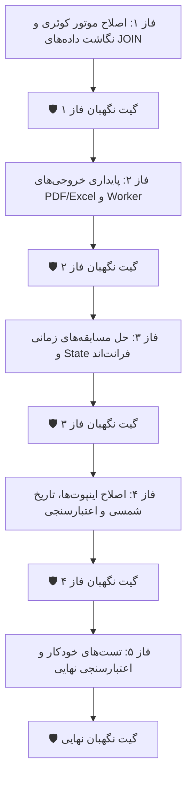

<div dir="rtl" align="right">

# طرح جامع بازنگری‌شده اصلاح ایرادات منطقی، جریانی و بکند در گزارش‌ساز پویا (با پروتکل ایجنت‌های نگهبان)

این سند نقشه راه فنی و اجرایی بازنگری‌شده برای برطرف‌سازی تمامی ایرادات منطقی، باگ‌های دیتابیس، مسابقه‌های زمانی (Race Conditions)، ناهماهنگی خروجی‌ها (Excel/PDF) و مشکلات فرم‌های ورودی در صفحه گزارش‌ساز پویا با لحاظ گیت‌های بازبینی ایجنت نگهبان در هر فاز است.

---

## 📌 مرور تغییرات، اصلاحات کلیدی و تحلیل بازنگری‌شده

| حوزه | موضوع تغییر | اصلاح تحلیلی انجام‌شده (Refinements) | هدف نهایی |
| :--- | :--- | :--- | :--- |
| 🗄️ **بکند و ORM** | تطابق نام کلیدهای فیلدهای پیوندی (Key Aliasing) | انتقال Mapping به مرحله دیکشنری خروجی (`_jsonable`) و عدم کاربرد نقطه در `qs.values()` | نمایش صحیح داده‌های جداول متصل‌شده بدون خطای `FieldError` |
| ⚙️ **محاسبات و روابط** | پشتیبانی فیلدهای محاسباتی (`annotation`) در JOINها | بازتولید داینامیک عبارات `F(...)` با پیشوند مسیر JOIN در Expression Factory | جلوگیری از کرش `FieldError` هنگام انتخاب نام شخص، سرپرست یا بررسی‌کننده |
| 📄 **خروجی PDF و اکسل** | استخراج صحیح ستون‌های پیوندی و رفع کرش ۰ ردیف | خواندن سلول‌ها بر اساس دیکشنری نگاشت کلیدها و شرطی‌سازی استایل‌های جدول ReportLab | تولید بی‌نقص فایل‌های PDF/Excel با داده‌های کامل حتی در جداول پیوندی و خالی |
| 🛡️ **پایداری Worker** | مهار حلقه تسک‌های مسموم (Poison Pill) و گارد همزمانی | افزودن فیلد `attempts` با مایگریشن جدید و محدودسازی تلاش‌ها به ۳ بار در `_recover_orphans` | پایداری ۱۰۰٪ پروسه پس‌زمینه در برابر کرش‌های غیرمنتظره سرور |
| 🔄 **جریان داده فرانت‌اند** | حل مسابقه زمانی لود قالب‌های JOIN و سینک انبار | لود متادیتای JOIN پس از قطعی شدن پاسخ `loadFields` و بروزرسانی با تغییر انبار | نمایش بی‌نقص فیلدهای پیوندی قالب‌های ذخیره‌شده و سینک کامل با انبار |
| 🎯 **فیلترها و فرم‌ها** | رفع باگ تایپ اپراتور `in`، تفکیک تاریخ شمسی/میلادی و ولیدیشن دقیق | جداسازی State متن در تایپ، تفکیک لایه Display شمسی از Payload میلادی و اعتبارسنجی دقیق | تجربه کاربری روان، بدون پرش کیبورد، بدون کرش تاریخ و بدون بلوکه شدن ناخواسته |

---

## 🛡️ پروتکل بازرسی ایجنت نگهبان (Guardian Agent Protocol)

> [!IMPORTANT]
> **قانون گیت نگهبان (Guardian Gate Enforcement):**
> در پایان هر فاز اجرایی، یک **ایجنت نگهبان مستقل** وظیفه دارد صحت عملکرد تغییرات آن فاز، عدم وجود رگرسیون (Side Effects) و تست‌های مربوطه را به صورت موشکافانه راستی‌آزمایی کند.
> **در صورت عدم تأیید یا رد شدن فاز توسط ایجنت نگهبان، انتقال به فاز بعدی اکیداً ممنوع بوده و فوراً اصلاحات تا حصول تأییدیه کامل ۱۰۰٪ اعمال خواهد شد.**

---

## ⚠️ نیازمند بررسی کاربر (User Review Required)

> [!IMPORTANT]
> **ایجاد مایگریشن جدید دیتابیس (Forward-Only Database Migration):**
> برای افزودن فیلد `attempts` به مدل `ReportExportJob`، یک مایگریشن جدید جلوبرنده (`0003_reportexportjob_attempts.py`) با دستور `makemigrations` ایجاد و اعمال خواهد شد تا هیچ تغییری در فایل‌های مایگریشن قبلی اعمال نشود.

> [!NOTE]
> **نگهداری فرمت استاندارد میلادی (ISO 8601) در لایه State و ارسال API:**
> تاریخ‌های انتخابی کاربر در تقویم شمسی صرفاً در لایه Template ورودی به صورت فرمت خوانای شمسی (مثلاً `۱۴۰۳/۰۵/۱۲`) نمایش داده می‌شوند؛ اما مقدار ذخیره‌شده در State و ارسالی به موتور کوئری بکند همواره فرمت استاندارد میلادی (`YYYY-MM-DD`) خواهد بود تا سازگاری کامل با `parse_date` جنگو حفظ شود.

---

## 🛠️ فازهای پیاده‌سازی و گیت‌های نگهبان (Implementation & Guardian Gates)



---

### فاز ۱: اصلاح موتور کوئری و نگاشت داده‌های JOIN در بکند (Backend Query Engine & Data Mapping)

#### [MODIFY] [registry.py](file:///e:/warehouse%20project/warehouse-backend/reports/registry.py)
1. **پشتیبانی انوتیشن‌ها از پیشوندگذاری داینامیک:**
   - اصلاح `_person_name_annotation(prefix)` برای پذیرش پیشوند والد جهت ساخت مسیرهای چند سطحی مانند `f'{base_prefix}__{prefix}__first_name'`.

#### [MODIFY] [engine.py](file:///e:/warehouse%20project/warehouse-backend/reports/engine.py)
1. **نگاشت کلیدهای خروجی در مرحله استخراج ردیف‌ها (`_jsonable`):**
   - ساخت دیکشنری نگاشت `source_to_key_map = {fd.source: fd.key for fd in self.fields.values()}` و اعمال در `_jsonable` و خروجی `run()`.
2. **پشتیبانی از Annotationهای موجودیت مقصد در JOIN:**
   - ساخت و الصاق انوتیشن‌های فیلدهای محاسباتی جداول مقصد به کوئری با پیشوند `f'{alias}_fr'` در `_process_joins`.
3. **هماهنگ‌سازی `ORDER BY` با `SELECT DISTINCT` در PostgreSQL:**
   - تضمین وجود تمام فیلدهای `order_by` در لیست `values()` در حالت Many JOIN.

> 🛡️ **بازرسی ایجنت نگهبان فاز ۱:**
> اعتبارسنجی ساختار خروجی کوئری‌های JOIN، صحت نام کلیدها در دیکشنری ردیف‌ها، تست عملکرد `counter_name` در JOIN و عدم وقوع خطای PostgreSQL.

---

### فاز ۲: پایداری خروجی‌های PDF، Excel و Worker پس‌زمینه (Export & Background Worker)

#### [MODIFY] [pdf.py](file:///e:/warehouse%20project/warehouse-backend/reports/pdf.py)
1. **اصلاح استخراج مقادیر ستون‌های پیوندی و رفع کرش ۰ ردیف:**
   - استفاده از مپینگ ستون‌ها هنگام استخراج داده و شرطی‌سازی `ROWBACKGROUNDS` بر اساس `row_count > 0`.

#### [MODIFY] [excel.py](file:///e:/warehouse%20project/warehouse-backend/reports/excel.py)
1. **استخراج صحیح سلول‌های پیوندی و گارد همزمانی:**
   - تطابق کلیدهای ستون با فیلدهای واقعی ORM و تغییر وضعیت به `running` پیش از شروع Thread.
2. **پاکسازی فایل‌های یتیم روی دیسک در `cleanup_old_jobs`.**

#### [MODIFY] [models.py](file:///e:/warehouse%20project/warehouse-backend/reports/models.py)
1. **افزودن فیلد شمارنده تلاش:** `attempts = models.PositiveSmallIntegerField(default=0)`.

#### [NEW] [0003_reportexportjob_attempts.py](file:///e:/warehouse%20project/warehouse-backend/reports/migrations/0003_reportexportjob_attempts.py)
1. **ایجاد مایگریشن جدید جلوبرنده با `makemigrations`.**

#### [MODIFY] [run_export_worker.py](file:///e:/warehouse%20project/warehouse-backend/reports/management/commands/run_export_worker.py)
1. **مهار حلقه تسک‌های مسموم در `_recover_orphans`:** تغییر وضعیت به `failed` در صورت `attempts >= 3`.

> 🛡️ **بازرسی ایجنت نگهبان فاز ۲:**
> تست تولید PDF و Excel با فیلدهای پیوندی و در حالت ۰ نتیجه، اعتبارسنجی اعمال صحیح مایگریشن دیتابیس و شبیه‌سازی کرش تسک جهت اطمینان از شکستن حلقه مسموم Worker.

---

### فاز ۳: حل مسابقه‌های زمانی و مدیریت وضعیت در Store فرانت‌اند (Frontend State & Race Conditions)

#### [MODIFY] [report-store.ts](file:///e:/warehouse%20project/warehouse-front/src/app/components/reports/report-store.ts)
1. **اصلاح نرمال‌سازی Aliasها (`.replace(/\./g, '_')`).**
2. **هرس شروط فیلترهای غیرمجاز در زمان `loadFields`.**

#### [MODIFY] [reports.ts](file:///e:/warehouse%20project/warehouse-front/src/app/components/reports/reports.ts)
1. **حل Race Condition در `loadTemplate` و بروزرسانی فیلدهای پیوندی با تغییر انبار فعال.**

> 🛡️ **بازرسی ایجنت نگهبان فاز ۳:**
> تست ذخیره و لود مجدد قالب‌های شامل JOIN، اطمینان از مقداردهی صحیح `joinsMeta` و عدم بروز خطای اعتبارسنجی HAVING در بکند.

---

### فاز ۴: اصلاح اینپوت‌های فیلتر، تاریخ شمسی و اعتبارسنجی فرم‌ها (Filter Inputs & Validation)

#### [MODIFY] [filter-value.component.ts](file:///e:/warehouse%20project/warehouse-front/src/app/components/reports/filter-value.component.ts)
1. **اصلاح باگ تایپ کلمات در اپراتور `in` از طریق متغیر محلی `rawText`.**
2. **نمایش فرمت خوانای تاریخ شمسی در کادر ورودی با حفظ مقدار استاندارد ISO میلادی در State.**

#### [MODIFY] [reports.ts](file:///e:/warehouse%20project/warehouse-front/src/app/components/reports/reports.ts)
1. **اعتبارسنجی دقیق فیلترها با حفظ اعتبار مقادیر `0`، `false` و عملگر `isnull`.**

#### [MODIFY] [export-progress.component.ts](file:///e:/warehouse%20project/warehouse-front/src/app/components/reports/export-progress.component.ts)
1. **مهار نشت حافظه در Polling هنگام بروز خطاهای متوالی یا ۴۰۴.**

> 🛡️ **بازرسی ایجنت نگهبان فاز ۴:**
> تست تعاملی تایپ آزاد کلمات با ویرگول و فاصله در اینپوت «یکی از»، انتخاب تاریخ شمسی و بررسی دیتای ارسالی به سرور در کنسول، و تست اجرای گزارش با مقادیر صفر و فیلترهای بولین.

---

### فاز ۵: تست‌های جامع خودکار و اعتبارسنجی نهایی (Verification & Automated Tests)

#### [MODIFY] [tests.py](file:///e:/warehouse%20project/warehouse-backend/reports/tests.py)
1. **افزودن تست‌های جامع کوئری، انوتیشن‌ها، PDF خالی و پایداری Worker.**

> 🛡️ **بازرسی ایجنت نگهبان نهایی (فاز ۵):**
> اجرای موفقیت‌آمیز ۱۰۰٪ تست‌های جنگو (`python manage.py test reports`) و بررسی قبولی کامل بیلد فرانت‌اند (`npx ng build`) بدون هیچ‌گونه خطا یا وارنینگ مسدودکننده.

---

## 🧪 طرح اعتبارسنجی (Verification Plan)

### ۱. تست‌های خودکار بکند (Automated Backend Tests)
```bash
python manage.py test reports
```

### ۲. اعتبارسنجی کامپایل و تایپ‌های فرانت‌اند (Frontend Compilation)
```bash
npx ng build --configuration=development
```

### ۳. بررسی تعاملی در مرورگر (Manual & Browser Verification)
- سناریوی کامل JOIN موجودیت‌ها + انتخاب فیلدهای محاسباتی.
- دانلود خروجی‌های PDF و Excel.
- بررسی تعاملی فرم فیلترها و تقویم شمسی.

</div>
