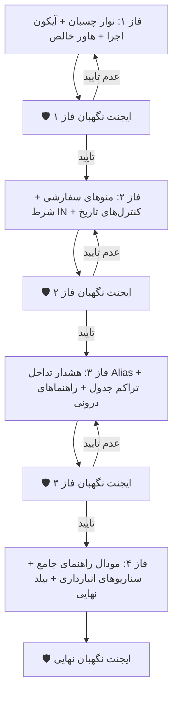

# 📋 طرح جامع فازبندی‌شده: نوار ابزار چسبان، آیکون‌سازی اجرای گزارش، هاور خالص دیتابیسی و رفع کلیه موارد ممیزی

این طرح بر مبنای آخرین بازخوردهای کاربر و بازبینی دقیق فهرست ممیزی اولیه (پیام اول) با رویکرد فازبندی گام‌به‌گام و استقرار **ایجنت‌های نگهبان در پایان هر فاز** آماده شده است.

---

## 🎯 اهداف کلیدی طرح

1. **نوار ابزار چسبان و پین‌شده (Sticky Action Bar):** پین شدن نوار ابزار بالای گزارش‌ساز هنگام اسکرول صفحه تا دکمه‌های «اجرا»، «ذخیره قالب»، «خروجی اکسل/PDF»، «بروزرسانی» و «راهنما» همیشه در دسترس کاربر باشند.
2. **تبدیل دکمه «اجرای گزارش» به آیکون استاندارد:** تبدیل این دکمه به ساختار آیکونی مربعی هماهنگ (`btn-icon-square btn-icon-indigo`) همراه با آیکون اجرا (`Play`)، اسپینر لودینگ و تولتیپ کامل.
3. **هاورهای ۱۰۰٪ خالص دیتابیسی (Raw DB Tooltips):** نمایش دقیق و صرفاً نام فنی ستون/جدول (مانند `fa_unic_code`، `items`، `count_tasks`) روی فیلدها، موجودیت‌ها و پیوندها بدون هیچ پیشوند یا کلمه فارسی.
4. **تکمیل تمام موارد معوق پیام اول:**
   - استایل سفارشی منوهای کشویی با فلش SVG اختصاصی.
   - بازطراحی کنترل شرط `یکی از (IN)` به چیپ‌های انتخابی مدرن (حذف لیست‌باکس سنتی).
   - افزودن آیکون تقویم و پاک‌سازی به کنترل‌های تاریخ.
   - نمایش کادر قرمز و پیام هشدار برای خطای تداخل نام‌های مستعار (`Alias Conflict Indicator`).
   - تنظیم دکمه‌های تراکم سطرها در جدول خروجی (`Density Toggle`).
5. **پنجره مودال راهنمای جامع گزارش‌ساز:** آموزش گام‌به‌گام و سناریوهای واقعی انبارداری همراه با مثال‌های ملموس.

---

## 🗺️ ساختار فازهای اجرایی و ایجنت‌های نگهبان

---

## 📝 شرح تفصیلی فازها

### 🔹 فاز ۱: نوار ابزار چسبان، دکمه آیکونی اجرا و هاورهای خالص دیتابیسی
- ایجاد نوار ابزار چسبان با کلاس‌های `sticky top-0 z-30 bg-white/95 backdrop-blur-md border-b border-slate-200 py-3 -mx-4 px-4 shadow-xs`.
- تبدیل دکمه «اجرای گزارش» به `btn-icon-square btn-icon-indigo` با آیکون پلی، چرخش اسپینر در وضعیت بارگذاری و تولتیپ «اجرای فرآیند تولید گزارش».
- خالص‌سازی ۱۰۰٪ ویژگی‌های `[title]` در سرتاسر فیلدها و موجودیت‌ها:
  - سلکتور موجودیت: `[title]="e.key"`
  - دکمه‌های فیلدهای پایه: `[title]="f.key"`
  - فیلدهای پیوندی: `[title]="f.key"`
  - چیپ‌های پیوند: `[title]="jm.target"`
  - چیپ‌های نوار ترتیب: `[title]="key"`
- 🛡️ **ایجنت نگهبان فاز ۱**: بررسی اسکرول صفحه در مرورگر، اطمینان از ثابت ماندن نوار ابزار، کلیک روی دکمه آیکونی اجرا و راستی‌آزمایی هاورهای خالص دیتابیسی.

---

### 🔹 فاز ۲: استایل سفارشی منوهای کشویی، نوسازی اپراتور IN و کنترل‌های تاریخ
- افزودن کلاس‌های سفارشی به سلکت‌ها با `appearance-none pr-8 pl-3 bg-no-repeat` و درج آیکون فلش SVG در بک‌گراند یا رپر.
- بازطراحی کنترل شرط `in` در `filter-value.component.ts`: جایگزینی سلکتور سنتی `size="3"` با یک کامپوننت چیپ‌های انتخابی چندگانه با امکان انتخاب/لغو آسان.
- اضافه کردن آیکون تقویم و دکمه پاک‌سازی به اینپوت‌های تاریخ فارسی.
- 🛡️ **ایجنت نگهبان فاز ۲**: ممیزی بصری فرم‌ها و تست انواع شروط فیلتر در مرورگر.

---

### 🔹 فاز ۳: نشانگر خطای تداخل Alias، تراکم جدول نتایج و راهنماهای درونی با مثال
- استایل‌دهی به اینپوت‌های دارای تداخل نام مستعار با حاشیه قرمز (`border-rose-400 focus:ring-rose-100 bg-rose-50/30`) و نمایش متن راهنمای هشدار زیر فیلد.
- افزودن نوار ابزار بالای جدول نتایج شامل دکمه‌های تغییر تراکم سطرها (`فشرده / استاندارد`) و شمارنده دقیق داده‌ها.
- قرار دادن پلیس‌هولدرها و متن‌های راهنمای نمونه‌دار (مانند `مثال: PIPING یا INSTRUMENT`، `مثال: 500 یا 1200`).
- 🛡️ **ایجنت نگهبان فاز ۳**: ایجاد سناریوی نام مستعار تکراری و اعتبارسنجی هایلایت قرمز، تغییر تراکم خطوط جدول و بررسی راهنماها.

---

### 🔹 فاز ۴: پنجره مودال راهنمای جامع گزارش‌ساز، سناریوهای آماده انبارداری و بیلد نهایی
- اضافه کردن دکمه راهنما (`btn-icon-square btn-icon-purple`) در نوار ابزار چسبان.
- طراحی مودال جامع راهنما با ۳ بخش کلیدی:
  1. آموزش تصویری مراحل ۶ گانه ساخت گزارش.
  2. ۳ سناریوی آماده و کاربردی در انبار (گزارش مغایرت‌های شمارش، گزارش ارزش و موجودی دیسیپلین‌ها، پیگیری اقلام فاقد تگ/اسناد).
  3. راهنمای توابع تجمیعی، شروط HAVING و خروجی‌ها.
- اجرای کامل دستور `npm run build` فرانت‌اند.
- 🛡️ **ایجنت نگهبان نهایی**: ممیزی نهایی انطباق با تمامی موارد، بررسی کنسول مرورگر و تایید خروجی.

---

## 📁 پرونده‌های تحت تغییر

1. [reports.html](file:///e:/warehouse%20project/warehouse-front/src/app/components/reports/reports.html) (نوار چسبان، دکمه آیکونی اجرا، هاور خالص، تراکم جدول، دکمه و مودال راهنما)
2. [reports.ts](file:///e:/warehouse%20project/warehouse-front/src/app/components/reports/reports.ts) (مدیریت مودال راهنما و وضعیت تراکم جدول)
3. [filter-value.component.ts](file:///e:/warehouse%20project/warehouse-front/src/app/components/reports/filter-value.component.ts) (چیپ‌های انتخابی برای شرط IN و آیکون‌های تقویم)
4. [filter-group.component.ts](file:///e:/warehouse%20project/warehouse-front/src/app/components/reports/filter-group.component.ts) (هاور خالص دیتابیسی فیلترها و استایل دکمه نقیض)
5. [styles.css](file:///e:/warehouse%20project/warehouse-front/src/styles.css) (استایل‌های سفارشی منوهای کشویی، جدول و اسکرول‌بار)

