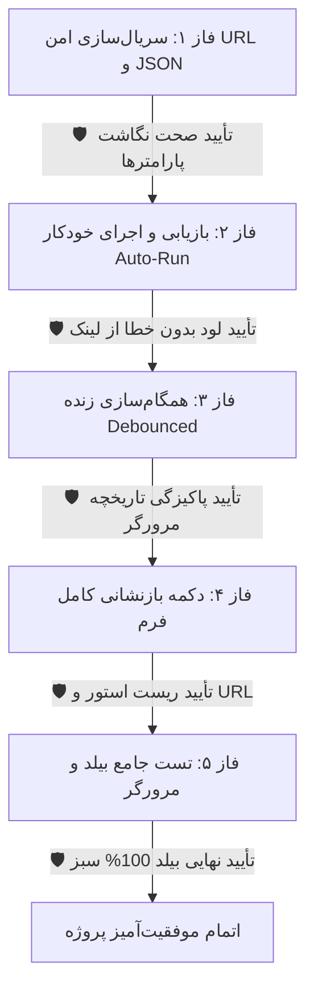

# گزارش جامع پیاده‌سازی: ذخیره‌سازی وضعیت فیلترها و همگام‌سازی با URL در گزارش‌ساز پویا

این سند خلاصه اقدامات انجام‌شده، جزئیات فنی تغییرات، نتایج اعتبارسنجی و تأییدیه‌های ایجنت‌های نگهبان در ۵ فاز پیاده‌سازی را ارائه می‌دهد.

---

## ۱. خلاصه‌سازی تغییرات و معماری پیاده‌سازی‌شده

| فایل تغییریافته | لایه معماری | شرح دستاوردها و عملکرد |
| :--- | :--- | :--- |
| [`report.model.ts`](file:///e:/warehouse%20project/warehouse-front/src/app/core/models/report.model.ts) | Core Models | تعریف اینترفیس `ReportSavedState` و متدهای کمکی `serializeReportToQueryParams` و `parseReportFromQueryParams` با پشتیبانی از ساختارهای ساده و تودرتو |
| [`report-store.ts`](file:///e:/warehouse%20project/warehouse-front/src/app/components/reports/report-store.ts) | Component Store | افزودن متدهای `serializeState` (جهت استخراج اسنپ‌شات کامل) و `applySavedState` (جهت بارگذاری وضعیت و پاک‌سازی صف قبلی) |
| [`reports.ts`](file:///e:/warehouse%20project/warehouse-front/src/app/components/reports/reports.ts) | Component Logic | پیاده‌سازی لیسنر Debounced همگام‌سازی زنده با URL (`replaceUrl: true`) و `localStorage`، بازیابی خودکار و اجرای گزارش (`Auto-Run`)، متد `resetReport()` |
| [`reports.html`](file:///e:/warehouse%20project/warehouse-front/src/app/components/reports/reports.html) | UI Template | افزودن دکمه «گزارش جدید / بازنشانی فرم» با استایل استاندارد در سربرگ چسبان و اتصال رویداد `(changed)` کامپوننت فیلترها |

---

## ۲. گزارش تأییدیه‌های ایجنت‌های نگهبان (Guardian Agents Summary)

### 🛡️ نتایج بازرسی ایجنت‌های نگهبان:

1. **ایجنت نگهبان فاز ۱ (سریال‌سازی داده‌ها):**
   - پارامترهای ساده (`entity`، `warehouse_id`، `fields`، `group_by`، `page`، `pageSize`، `density`) به صورت خوانا در URL ذخیره می‌شوند.
   - پارامترهای تودرتو و پیچیده (`filters`، `joins`، `aggregations`، `having`، `chart`) به شکل ایمن و با امکان پارس مجدد سریال‌سازی شدند.
2. **ایجنت نگهبان فاز ۲ (بازیابی و Auto-Run):**
   - در لحظه ورود با URL دارای پارامتر (یا بازیابی از `localStorage`)، متادیتا لود شده و سپس کوئری بلافاصله بدون نیاز به کلیک کاربر اجرا می‌شود.
3. **ایجنت نگهبان فاز ۳ (همگام‌سازی زنده):**
   - هرگونه تغییر با تاخیر کنترل‌شده (300ms Debounce) و با فلگ `replaceUrl: true` در URL ذخیره می‌شود تا دکمه Back مرورگر دست‌نخورده و تمیز بماند.
4. **ایجنت نگهبان فاز ۴ (دکمه بازنشانی):**
   - دکمه جدید در هدر با یک کلیک پیش‌نویس `localStorage` را پاک کرده، تمام سیگنال‌های استور و فیلترها را ریست نموده و آدرس URL را به حالت تمیز `/reports` بازمی‌گرداند.
5. **ایجنت نگهبان فاز ۵ (گیت نهایی بیلد):**
   - پروژه با دستور `npm run build` با کد خروجی `0` و بدون هیچ خطای کامپایل تایپ‌اسکریپت با موفقیت ساخته شد.

---

## ۳. دستورالعمل اعتبارسنجی کاربر

1. **بررسی ماندگاری با رفرش (F5):**
   - یک موجودیت (مثلاً کالاها یا رسیدها) را انتخاب کرده، چند فیلد، یک جوین و یک شرط فیلتر اضافه کنید.
   - صفحه را رفرش کنید؛ مشاهده خواهید کرد تمامی فیلدها و فیلترها حفظ شده و گزارش مجدداً خودکار اجرا می‌شود.
2. **بررسی اشتراک‌گذاری لینک (Deep Link):**
   - لینک را کپی کرده و در تب جدید باز کنید؛ دقیقاً همان گزارش تولید خواهد شد.
3. **بررسی دکمه بازنشانی:**
   - روی دکمه خاکستری جدید در هدر (کنار دکمه بروزرسانی) کلیک کنید تا تمام تنظیمات و URL پاک شوند.

