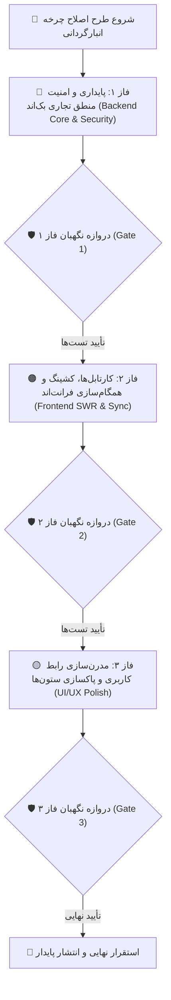

# 🏛️ طرح جامع و فازبندی‌شده اصلاح چرخه انبارگردانی (Stocktaking Cycle Comprehensive Remediation)

این سند فنی نقشه راه، جزئیات معماری، فازبندی اجرایی و چک‌لیست دقیق برای اصلاح کامل چرخه انبارگردانی (شامل انبارگردان، سرپرست، مدیر، دیسپچ، پیگیری و خروجی اکسل) را همراه با **ایجنت نگهبان (Guardian Agent)** بر اساس اصول بنیادین مهندسی نرم‌افزار و انبارداری استاندارد ارائه می‌دهد.

---

## 🧭 تصمیمات معماری کلیدی

* **انبارگردانی کور و بی‌طرفانه (Blind Recount Standard):** در صورت رد مستقیم مدیر و بازگشت به انبارگردان، مقدار `counted_balance` تسک خالی می‌شود تا شمارشگر بدون سوگیری شناختی اقدام به شمارش مجدد نماید؛ سابقه و علت رد در تاریخچه (`CountTaskHistory`) به صورت کامل حفظ می‌گردد.
* **حفاظت از ماتریس دسترسی فیلدها (Field Permissions Security):** تفکیک دقیق شرط‌های دسترسی به موجودی دفتری و فیزیکی برای جلوگیری از نشت اطلاعاتی در کارتابل شمارشگر.
* **انسداد تغییر وضعیت با متد PATCH (Status Transition Lockdown):** انتقال و تغییر وضعیت تسک‌ها منحصراً از طریق اکشن‌های تراکنشی اعتبارسنجی‌شده صورت می‌پذیرد و متد PATCH عمومی روی فیلد `status` قفل می‌شود.
* **ایزولاسیون کامل کش SWR (Cache Scope Isolation):** کلیدهای کش در فرانت‌اند با شناسه نقش (`as_role`) و انبار ترکیب می‌شوند تا از پدیده کوتاه شدن آرایه‌ها و تداخل بین کاربران جلوگیری شود.

---

## 🧱 فازبندی ۳ مرحله‌ای پیاده‌سازی

---

## 📂 شرح تفصیلی تغییرات به تفکیک ۳ فاز

### 🔴 فاز ۱: پایداری و امنیت منطق تجاری بک‌اند (Backend Core & Security)
1. **[`warehouse-backend/inventory/views.py`](file:///e:/warehouse%20project/warehouse-backend/inventory/views.py#L2120):** حذف فیلدهای منسوخ `item_no` و `old_location` از شرط `Q` در `CountTaskViewSet` (خطوط ۲۱۲۶ و ۲۱۲۹) و جایگزینی با فیلدهای فعال (`tag`، `new_location`، `fa_unic_code`، `description`، `po`، `pk_number`). پاکسازی مشابه در `DocTaskViewSet:3225`.
2. **[`warehouse-backend/inventory/views.py`](file:///e:/warehouse%20project/warehouse-backend/inventory/views.py#L1971) و [`serializers.py`](file:///e:/warehouse%20project/warehouse-backend/inventory/serializers.py#L221):** پیاده‌سازی `get_serializer_context()` در `CountTaskViewSet` جهت ارسال `is_blind: False` برای نقش‌های `manager`، `supervisor`، `count_tracking` و اکشن `export_excel` تا فیلدهای موجودی و مغایرت به درستی محاسبه شوند.
3. **[`warehouse-backend/inventory/views.py`](file:///e:/warehouse%20project/warehouse-backend/inventory/views.py#L2038):** حذف تعریف تکراری `perform_update` (خط ۲۲۴۵) و قفل‌گذاری تغییر مستقیم فیلد `status` در متد PATCH.
4. **[`warehouse-backend/inventory/views.py`](file:///e:/warehouse%20project/warehouse-backend/inventory/views.py#L2484) و [`views.py:2734`](file:///e:/warehouse%20project/warehouse-backend/inventory/views.py#L2734):** افزودن اعتبارسنجی دسترسی انبار با `can_access_warehouse` به متدهای `bulk_manager_approve` و `bulk_manager_reject` (حفاظت IDOR).
5. **[`warehouse-backend/inventory/views.py`](file:///e:/warehouse%20project/warehouse-backend/inventory/views.py#L4080):** اصلاح فرمول محاسبه مغایرت در خروجی اکسل به مبنای موجودی دفتری اولیه (`bal4miv`) به جای `item.inventory`.

### 🟠 فاز ۲: کارتابل‌ها، کشینگ و همگام‌سازی فرانت‌اند (Frontend SWR & Sync)
1. **سرویس‌های فرانت‌اند و استور:** افزودن پارامترهای `as_role` و `warehouse_id` به کلیدهای کش SWR جهت تفکیک کارتابل‌ها و جلوگیری از کوتاه شدن آرایه رکوردهای سرپرست و مدیر.
2. **[`counter-dashboard.ts:1770`](file:///e:/warehouse%20project/warehouse-front/src/app/components/counter/counter-dashboard/counter-dashboard.ts#L1770):** حذف خط `Object.assign(task, updatedTask, { status: targetStatus })` و خواندن وضعیت قطعی تسک مستقیماً از دیتای بازگشتی سرور (`res`).
3. **[`counter-dashboard.html:741`](file:///e:/warehouse%20project/warehouse-front/src/app/components/counter/counter-dashboard/counter-dashboard.html#L741):** حفظ شرط `!selectedTask.is_blind` روی کانتینر، و تفکیک نمایش هر فیلد متناسب با ماتریس دسترسی (`isFieldVisible('bal4miv')` و `isFieldVisible('inventory')`).
4. **[`counter-dashboard.html`](file:///e:/warehouse%20project/warehouse-front/src/app/components/counter/counter-dashboard/counter-dashboard.html):** نمایش سابقه شمارش قبلی و یادداشت رد مدیر به صورت برچسب کمکی (Read-Only) در تب بازشماری بدون پر کردن خودکار اینپوت.

### 🟡 فاز ۳: مدرن‌سازی رابط کاربری و پاکسازی ستون‌ها (UI/UX Polish)
1. **کامپوننت‌های فرانت‌اند (`dispatch.ts`, `counter-dashboard.ts`, `supervisor-dashboard.ts`, `manager-review.ts`, `count-tracking.ts`):** جایگزینی کامل `confirm()` بومی مرورگر با `ConfirmModalComponent` راست‌چین و مدرن.
2. **[`dispatch.html:298,366`](file:///e:/warehouse%20project/warehouse-front/src/app/components/dispatch/dispatch.html#L298-L366):** پاکسازی تمپلیت‌های ستون‌های منسوخ `old_location` و `item_no`.
3. **[`count-tracking.ts`](file:///e:/warehouse%20project/warehouse-front/src/app/components/count-tracking/count-tracking.ts):** هماهنگ‌سازی استایل و ترجمه فارسی تمامی وضعیت‌های چرخه.

---

## 🛡️ دروازه‌های کنترل کیفیت ایجنت نگهبان (Guardian Verification Gates)

* **🛡️ Gate 1:** تست خروجی اکسل با کلمه جستجو بدون خطای ۵۰۰ + رویت موجودی در کارتابل مدیر + مسدود بودن تغییر وضعیت با PATCH + تست امنیت دسترسی انبار.
* **🛡️ Gate 2:** تست همگام‌سازی وضعیت تسک با تصمیم سرور + ایزولاسیون کامل کش SWR بین نقش‌ها بدون حذف اقلام.
* **🛡️ Gate 3:** تست عملکرد مودال‌های تأیید مدرن در کل چرخه + لود بی‌نقص جدول دیسپچ + موفقیت بیلد نهایی پروژه (`ng build`).

