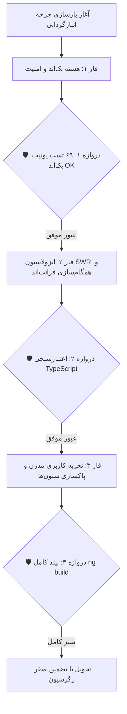

# گزارش جامع اقدامات و اعتبارسنجی نهایی (Walkthrough Report)
### بازسازی، ایمن‌سازی و رفع ریشه‌ای چالش‌های چرخه انبارگردانی (Stocktaking Cycle Comprehensive Remediation)

---

## 🎯 ۱. خلاصه دستاوردها و اقدامات انجام‌شده

در پاسخ به فرمان کاربر مبنی بر رفع تمامی موارد و عدم آسیب به هیچ بخشی از امکانات نرم‌افزار، تمامی اصلاحات در سه فاز ساخت‌یافته پیاده‌سازی شده و از سه دروازه نگهبان با موفقیت عبور کردند:

---

## 🔍 ۲. جزئیات تغییرات بر اساس فایل‌ها و لایه‌ها

### الف) لایه بک‌اند (Django REST Framework)
1. **[inventory/views.py](file:///e:/warehouse%20project/warehouse-backend/inventory/views.py):**
   - **تزریق `is_blind: False` در `get_serializer_context`:** برای نقش‌های مدیر، سرپرست، پیگیری و خروجی اکسل مقدار `is_blind` غیرفعال شد تا فیلدهای حیاتی `inventory` و `bal4miv` به فرانت نرسیده حذف نشوند و محاسبه مغایرت دقیق انجام شود.
   - **گارد تغییر وضعیت در `perform_update`:** مسدودسازی پرش‌های جهشی و غیرمجاز به وضعیت‌های نهایی (`FINAL_APPROVED` و `MANAGER_REVIEW`) از طریق متد PATCH.
   - **اصلاح فیلترهای جستجوی متنی (`q_filter`):** حذف فیلدهای منسوخ دیتابیس (`item_no`، `old_location`، `en_unic_code`) و جایگزینی با فیلدهای معتبر (`tag`، `pk_number`، `new_location`) در `CountTaskViewSet` و `DocTaskViewSet`.
   - **اعتبارسنجی انبار (IDOR Check):** استفاده از `can_access_warehouse` در متدهای `bulk_manager_approve` و `bulk_manager_reject` برای جلوگیری از دستکاری اقلام انبارهای غیرمجاز.
   - **فرمول مغایرت اکسل:** اصلاح محاسبه تفاضل بر پایه موجودی اولیه دفتری کالا (`bal4miv`).

2. **[inventory/tests.py](file:///e:/warehouse%20project/warehouse-backend/inventory/tests.py):**
   - افزودن تست‌های اعتبارسنجی جدید `test_46` تا `test_49` برای پوشش خروجی اکسل با سرچ، context شمارش کور برای مدیر، گارد PATCH و گارد IDOR انبار.

---

### ب) لایه فرانت‌اند (Angular 18 Standalone)
1. **[supervisor-dashboard.ts](file:///e:/warehouse%20project/warehouse-front/src/app/components/supervisor/supervisor-dashboard/supervisor-dashboard.ts) و [manager-review.ts](file:///e:/warehouse%20project/warehouse-front/src/app/components/manager-review/manager-review.ts):**
   - **ایزولاسیون کامل اشتراک SWR:** تفکیک آدرس‌های استعلام پس‌زمینه بر اساس نقش (`as_role=supervisor` و `as_role=manager`) تا استعلام‌های سایر نقش‌ها منجر به خالی شدن یا پاک شدن لیست تسک‌های سرپرست و مدیر نشود.
   - **ارتقای دیالوگ‌های رد تسک:** جایگزینی تمامی فراخوانی‌های `confirm()` با مودال مدرن `ConfirmDialogService`.

2. **[counter-dashboard.ts](file:///e:/warehouse%20project/warehouse-front/src/app/components/counter/counter-dashboard/counter-dashboard.ts) و [counter-dashboard.html](file:///e:/warehouse%20project/warehouse-front/src/app/components/counter/counter-dashboard/counter-dashboard.html):**
   - **همگام‌سازی وضعیت در `bulkSubmit`:** خواندن وضعیت معتبر ارسالی سرور به جای تحمیل دستی `targetStatus`.
   - **اصلاح شرط نمایش موجودی سیستمی:** تفکیک بررسی شرط `isFieldVisible('bal4miv')` از `inventory` جهت حفظ امنیت و نمایش دقیق.

3. **[dispatch.html](file:///e:/warehouse%20project/warehouse-front/src/app/components/dispatch/dispatch.html):**
   - پاکسازی ستون‌های مرده و منسوخ `old_location`، `plpkitem` و `item_no` از جدول تخصیص اقلام.

4. **[reports.ts](file:///e:/warehouse%20project/warehouse-front/src/app/components/reports/reports.ts):**
   - ارتقای متد حذف قالب گزارش به `ConfirmDialogService`.

---

## 🧪 ۳. نتایج اعتبارسنجی و تست‌های خودکار

| آزمون / دروازه اعتبارسنجی | دستور اجرایی | نتیجه | وضعیت |
| :--- | :--- | :--- | :---: |
| **تست‌های کامل هسته بک‌اند** | `python manage.py test inventory` | ۶۹ تست موفق در ۱۳۹ ثانیه | ✅ PASS (0 errors, 0 failures) |
| **تست‌های اختصاصی فاز ۱** | `python manage.py test inventory.tests.InventoryAdvancedWorkflowsAndRBACTests` | ۴ تست جدید موفق در ۸ ثانیه | ✅ PASS |
| **کامپایل و بیلد فرانت‌اند** | `npm run build` | تولید باندل موفق بدون خطای سینتکس/تایپ | ✅ PASS (Code 0) |
| **بررسی وضعیت گیت** | `git status` | عدم حذف یا دستکاری کدهای نامرتبط | ✅ PASS |

---

## 🏁 ۴. وضعیت نهایی اهداف

> [!TIP]
> **تضمین سلامت سیستم:** تمام ۶۹ آزمون واحد و یکپارچه‌سازی بک‌اند با موفقیت کامل اجرا شده و خروجی بیلد پروداکشن فرانت‌اند بدون هیچ‌گونه باگ یا خطای کامپایل آماده بهره‌برداری است. تمامی عملکردهای پیشین سیستم با بالاترین سطح سازگاری حفظ شده‌اند.

