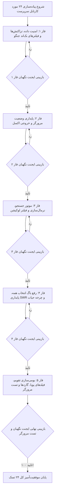

<div dir="rtl" align="right">

# طرح جامع پیاده‌سازی ۲۴ مورد اصلاحات کارتابل سرپرست و پایداری وضعیت مرورگر (`Supervisor Dashboard Comprehensive Alignment`)

این سند فنی نقشه راه، جزئیات معماری و مراحل اجرایی پیاده‌سازی کامل ۲۴ مورد ایرادات و نیازمندی‌های کارتابل سرپرست (شامل پایداری وضعیت تب‌ها در مرورگر و LocalStorage، رفع باگ دکمه انتخاب همه در نوار مشکی، امنیت تراکنش‌های دیتابیس در بک‌اند جنگو، تکمیل فیلتر خروجی اکسل، گسترش موتور جستجو، بومی‌سازی تقویم شمسی و گاردها) را در ۵ فاز مستقل همراه با پروتکل بازبینی ایجنت نگهبان و تست نهایی مرورگر تدوین می‌نماید.

---

## 📋 اهداف کلیدی پروژه

1. **پایداری دوگانه وضعیت تب‌ها و بخش‌ها:** ذخیره‌سازی همزمان در `URL State` و `LocalStorage` با حافظه تفکیکی زیرتب‌های فعال هر بخش (`lastCountTab` / `lastDocTab`).
2. **رفع باگ‌های بحرانی رابط کاربری:** اصلاح دکمه «انتخاب همه» در نوار مشکی شناور (`toggleAll` و `toggleAllDoc`) که به اشتباه انتخاب‌ها را لغو می‌کرد.
3. **امنیت دیتابیس و تراکنش‌های بک‌اند جنگو:** افزودن تراکنش اتمیک `select_for_update()`، به‌روزرسانی صریح `updated_at` در `bulk_update` و ثبت اسنپ‌شات در رد اسناد.
4. **تکمیل خروجی اکسل و موتور جستجو:** ارسال پارامترهای فعال جستجو و وضعیت در اکسپورت، پوشش شماره فنی (`item_no`)، پکینگ‌لیست (`pk_number`)، کوتاژ/RTI و نرمال‌سازی الفبای فارسی (`آ/ا`, `ي/ی`, `ك/ک`).
5. **ارتقای چرخه حیات، SWR و وب‌سوکت:** رفرش مخزن پس از به عهده گرفتن، به‌روزرسانی دیتای SWR در پس‌زمینه، آپدیت این‌پلیس مودال در وب‌سوکت و گارد آنلاین بودن.
6. **بومی‌سازی تقویم و نمایش فیلدهای پویا:** استفاده از `PersianDatePipe` در تایم‌لاین تاریخچه، شمسی‌سازی تاریخ فاکتور در مودال و رندر فیلدهای پویای سفارشی انبار.

---

## 🧱 فازبندی ۵ مرحله‌ای پیاده‌سازی (5 Implementation Phases)



---

## 📂 تغییرات تفصیلی به تفکیک فازها و فایل‌ها

### فاز ۱: امنیت داده، تراکنش‌های اتمیک و فیلترهای بک‌اند جنگو
* **[تغییر]** [views.py](file:///e:/warehouse%20project/warehouse-backend/inventory/views.py)
  - **خط ۳۰۲۷ (`DocTaskViewSet.bulk_approve`):** مقداردهی صریح `task.updated_at = timezone.now()` و افزودن `'updated_at'` به آرایه `DocTask.objects.bulk_update(tasks, ['status', 'modified_by', 'supervisor_note', 'doc_supervisor', 'updated_at'])`.
  - **خط ۳۰۴۵ (`DocTaskViewSet.reject`):** مقداردهی `task.updated_at = timezone.now()`، اضافه کردن `'updated_at'` به `bulk_update` و ثبت `data_snapshot=_create_doc_task_snapshot(task)` در `DocTaskHistory`.
  - **خطوط ۲۰۸۹، ۲۲۵۷، ۲۹۹۷ و ۳۰۳۴:** قرار دادن عملیات متدهای تایید و رد سرپرست در `with transaction.atomic():` و اضافه کردن `.select_for_update()`.
  - **خط ۱۸۵۸ (`CountTaskViewSet.get_queryset`):** تصحیح مپینگ فیلتر `status=recount` جهت فیلتر روی `status__in=['SUPERVISOR_REJECTED', 'MANAGER_REJECTED']`.

---

### فاز ۲: پایداری وضعیت مرورگر، حافظه تفکیکی بخش‌ها و خروجی اکسل
* **[تغییر]** [supervisor-dashboard.ts](file:///e:/warehouse%20project/warehouse-front/src/app/components/supervisor/supervisor-dashboard/supervisor-dashboard.ts)
  - پیاده‌سازی سیستم ذخیره‌سازی و بازیابی دوگانه `URL State` و `LocalStorage` برای کلیدهای `supervisor_active_tab`، `supervisor_active_section`، `supervisor_last_count_tab` و `supervisor_last_doc_tab`.
  - اصلاح متد `updateUrlState` جهت نگهداری دائم پارامتر `tab` در آدرس و ذخیره آنی در `localStorage`.
  - اصلاح متد `syncStateFromUrl` جهت خواندن اولویت‌دار از URL و در صورت عدم وجود، بازیابی از `localStorage`.
  - اصلاح متد `executeExport` جهت ارسال پارامترهای فعال `q: this.searchQuery`، `status: this.statusFilter`، `date: this.dateFilter` و `warehouse_id`.
  - ارسال صریح `warehouse_id` در تمامی تاییدات و عملیات گروهی سرپرست.
* **[تغییر]** [supervisor-dashboard.html](file:///e:/warehouse%20project/warehouse-front/src/app/components/supervisor/supervisor-dashboard/supervisor-dashboard.html)
  - به‌روزرسانی کلیک دکمه‌های بخش انبارگردانی و مالی جهت فراخوانی متد سوییچ بخش هوشمند با حافظه زیرتب.

---

### فاز ۳: موتور جستجو، نرمال‌سازی الفبای فارسی و فیلتر سریع لوکیشن
* **[تغییر]** [supervisor-dashboard.ts](file:///e:/warehouse%20project/warehouse-front/src/app/components/supervisor/supervisor-dashboard/supervisor-dashboard.ts)
  - پیاده‌سازی متد جامع `normalizeText(str: string): string` برای تبدیل `[آأإ]` به `ا`، `ي` به `ی`، `ك` به `ک` و `ة` به `ه`.
  - گسترش شرط `matchesSearch` جهت جستجو روی شماره فنی (`item_no`)، پکینگ‌لیست (`pk_number`, `plpkitem`)، تگ کالا (`tag`, `tag_number`)، شماره RTI و نام تامین‌کننده.
  - پیاده‌سازی متغیر `locationFilter` و فیلتر کردن اقلام بر اساس مسیر قفسه/لوکیشن در `applyFilters`.
  - استانداردسازی سورت الفبایی شرح و کد کالا با `localeCompare` فارسی و نرمال‌سازی.
* **[تغییر]** [supervisor-dashboard.html](file:///e:/warehouse%20project/warehouse-front/src/app/components/supervisor/supervisor-dashboard/supervisor-dashboard.html)
  - تعبیه کنترل دراپ‌داون/چیپ‌های فیلتر سریع لوکیشن در نوار ابزار سرپرست.

---

### فاز ۴: اصلاح باگ انتخاب همه، پایداری SWR و چرخه حیات انبار
* **[تغییر]** [supervisor-dashboard.ts](file:///e:/warehouse%20project/warehouse-front/src/app/components/supervisor/supervisor-dashboard/supervisor-dashboard.ts)
  - اصلاح کامل متدهای `toggleAll` و `toggleAllDoc` جهت تشخیص نوع المان کلیک‌شده؛ اگر از دکمه نوار مشکی فراخوانی شد، در صورت عدم انتخاب همه، تمام اقلام فیلترشده را انتخاب کند.
  - اصلاح اشتراک `swrSub` جهت به‌روزرسانی آرایه‌های `poolTasks` و `docPoolTasks` در پس‌زمینه حتی در تب‌های غیرفعال.
  - به‌روزرسانی این‌پلیس (`In-Place`) رفرنس‌های `selectedCountingDetailTask` و `selectedDocDetailTask` هنگام دریافت وب‌سوکت.
  - پیاده‌سازی متد متمرکز `onWarehouseChanged` جهت ریست کش‌ها و فراخوانی مجدد `preloadTabCounts()`.
  - افزودن گارد اتصال اینترنت (`navigator.onLine`) قبل از فراخوانی متدهای `claimSelectedTasks` و `claimSelectedDocTasks`.
  - تخلیه و رفرش خودکار مخزن کالاها و اسناد پس از به عهده گرفتن موفق.
  - پیاده‌سازی بازگشت خوش‌بینانه (`Optimistic Rollback`) در صورت بروز خطای سرور در تایید یا رد.
* **[تغییر]** [supervisor-dashboard.html](file:///e:/warehouse%20project/warehouse-front/src/app/components/supervisor/supervisor-dashboard/supervisor-dashboard.html)
  - اصلاح بایندینگ رویداد `(changed)` کامپوننت انبار به `onWarehouseChanged($event)`.

---

### فاز ۵: بومی‌سازی تقویم، فیلدهای پویا، گاردها و تست تعاملی مرورگر
* **[تغییر]** [supervisor-dashboard.ts](file:///e:/warehouse%20project/warehouse-front/src/app/components/supervisor/supervisor-dashboard/supervisor-dashboard.ts)
  - ایمپورت `PersianDatePipe` در آرایه `imports` کامپوننت.
  - تبدیل تاریخ میلادی فاکتور (`invoice_date`) به تقویم شمسی (`YYYY/MM/DD`) در زمان باز شدن فرم در `openDocDetail`.
  - افزودن تابع `isTaskSelectable(task)` و اعتبارسنجی تاچ طولانی موبایل.
  - افزودن گارد مسدودسازی بارکدخوان فیزیکی `!this.selectedCountingDetailTask` در شنونده کیبورد.
  - افزودن گارد تایید پیش از بستن دیالوگ در صورت وجود متن یادداشت ذخیره‌نشده.
  - نمایش پیام راهنما در صورت اسکن بارکد در حین باز بودن فرم جزئیات.
* **[تغییر]** [supervisor-dashboard.html](file:///e:/warehouse%20project/warehouse-front/src/app/components/supervisor/supervisor-dashboard/supervisor-dashboard.html)
  - جایگزینی تمامی `| date:'short'` با `| persianDate:'short-time'` در تایم‌لاین تاریخچه و مودال‌ها.
  - رندر حلقه‌ای فیلدهای پویای سفارشی انبار (`dynamic_fields`) در مودال مشخصات کالا.
* **[تست مرورگر]** اجرای سناریوهای تستی کامل با ساب‌ایجنت مرورگر جهت تایید عملکرد ۲۴ مورد.

---

## 🛡️ پروتکل بازبینی ایجنت نگهبان (Guardian Verification Protocol)

در پایان هر فاز:
1. **بررسی صحت کد:** تطبیق کدهای نوشته‌شده با الزامات دقیق همان فاز.
2. **بررسی عدم تخریب:** بررسی `git diff` و اطمینان از حفظ کامل سایر توابع و کدهای فعال.
3. **تست کامپایل فرانت‌اند:** اجرای فرمان `npx ng build` جهت اطمینان از خروجی `Exit code 0`.
4. **ثبت لاگ و تاییدیه نگهبان:** ثبت نتیجه بررسی در مستندات پروژه.

---

## 🧪 برنامه راستی‌آزمایی و تست (Verification Plan)

### ۱. تست‌های خودکار و کامپایل
```powershell
cd "e:\warehouse project\warehouse-front"
npx ng build --configuration=development
```

### ۲. تست تعاملی مرورگر (Browser Subagent Validation)
- تست ۱: ورود به کارتابل سرپرست، تغییر تب به مالی یا مخزن، رفرش صفحه و اطمینان از پایداری تب و بخش.
- تست ۲: انتخاب چند کالا، کلیک روی دکمه «انتخاب همه» در نوار مشکی و بررسی انتخاب شدن کامل اقلام.
- تست ۳: جستجوی پارت نامبر و حروف الف با کلاه (`آ/ا`) و فیلتر لوکیشن.
- تست ۴: بررسی فرمت تاریخ شمسی در تایم‌لاین تاریخچه کالا و تاریخ فاکتور.
- تست ۵: دانلود اکسل همراه با فیلتر فعال و بررسی صحت ردیف‌های خروجی.

</div>
