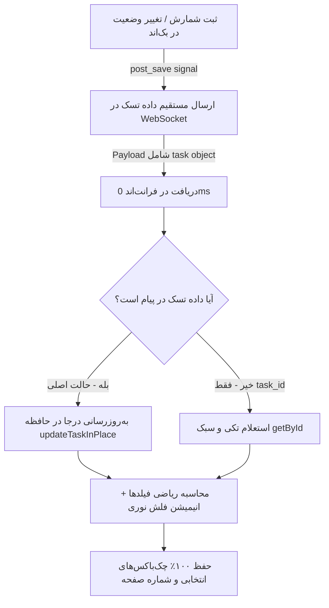

<div dir="rtl" align="right">

# طرح جامع ارتقای هوشمند وب‌سوکت (Granular Real-time Updates) و اصلاحات کارتابل‌های سرپرست و مدیر (فاز ۳۱)

این طرح اجرایی با هدف پیاده‌سازی **به‌روزرسانی نقطه‌ای و هوشمند وب‌سوکت (Zero-Fetch Granular Updates)** تدوین شده است تا در زمان وقوع هر تغییر در انبار، فقط و فقط اطلاعات همان یک تسک جابجا شده و کارتابل‌های سرپرست، مدیر و مانیتورینگ بدون بارگذاری مجدد کل لیست، بدون مصرف پهنای باند و بدون پرتاب صفحه یا پریدن تیک‌های انتخابی به‌روزرسانی شوند.

---

## ۱. مرور وضعیت فعلی و نیازمندی‌های معماری (Problem & Architecture)

1. **ارسال بدون داده در وب‌سوکت بک‌اند:** در حال حاضر تابع `broadcast_count_task_update` در بک‌اند فقط نوع پیام و گاهی `task_id` را می‌فرستد. در نتیجه فرانت‌اند مجبور است برای فهمیدن وضعیت جدید، کل لیست ۱۰۰۰ رکوردی را دوباره Fetch کند.
2. **پریدن چک‌باکس‌ها و Freeze صفحه:** با هر بار لود مجدد در کارتابل سرپرست و مدیر، `this.selectedTasks.clear()` اجرا شده و در ترافیک بالای شمارش همزمان، سیستم دچار افت سرعت می‌شود.
3. **عدم هماهنگی با حالت آفلاین و استریم SWR:** عملیات تایید/رد گروهی در شرایط قطعی شبکه فاقد فیدبک مناسب بوده و استریم SWR به دلیل شرط کلی URL، داده‌های نقش‌های مختلف را با هم تداخل می‌دهد.

---

## ۲. معماری به‌روزرسانی نقطه‌ای هوشمند (Granular In-Place Pipeline)



---

## ۳. شرح تغییرات پیشنهادی (Proposed Changes)

### بک‌اند (Django Backend)

#### [MODIFY] [signals.py](file:///e:/warehouse%20project/warehouse-backend/inventory/signals.py)
* ارتقای `broadcast_count_task_update` و `broadcast_doc_task_update` جهت دریافت پارامتر `task_data` یا `instance`.
* سریال‌سازی فیلدهای اساسی تسک (`id`, `status`, `counted_balance`, `counter`, `supervisor`, `manager`, `warehouse_id`, `updated_at`, ...) و قرار دادن آن در فیلد `task` پیام وب‌سوکت.

### فرانت‌اند (Warehouse Frontend)

#### [MODIFY] [supervisor-dashboard.ts](file:///e:/warehouse%20project/warehouse-front/src/app/components/supervisor/supervisor-dashboard/supervisor-dashboard.ts)
* ارتقای شنونده وب‌سوکت با الگوی ترکیبی هوشمند (به‌روزرسانی درجا با داده دریافتی یا فال‌بک `getById` تکی).
* حذف هوشمندانه تسک از تب فعلی در صورت تغییر وضعیت (مثلاً رفتن به کارتابل مدیر) یا افزودن به تب در صورت ارجاع به سرپرست.
* **حفظ اکید رکوردهای انتخاب‌شده (`selectedTasks`)** در تمام به‌روزرسانی‌های پس‌زمینه.
* اعمال فیلتر دقیق روی سابسکرایبر SWR (`as_role=supervisor`).
* به‌روزرسانی خوش‌بینانه عملیات تایید/رد گروهی (`bulkApprove`, `bulkReject`) با پشتیبانی صف آفلاین.

#### [MODIFY] [manager-review.ts](file:///e:/warehouse%20project/warehouse-front/src/app/components/manager-review/manager-review.ts)
* ارتقای شنونده وب‌سوکت با به‌روزرسانی موضعی تسک و فال‌بک `getById`.
* **حفظ اکید رکوردهای انتخاب‌شده (`selectedTasks`)** و وضعیت فیلترها.
* پالایش استریم SWR با قید دقیق `as_role=manager`.
* به‌روزرسانی خوش‌بینانه تایید نهایی و بازشماری (`bulkManagerApprove`, `confirmSingleReject`) در حالت آفلاین.

#### [MODIFY] [count-tracking.ts](file:///e:/warehouse%20project/warehouse-front/src/app/components/count-tracking/count-tracking.ts)
* هماهنگ‌سازی تکمیلی با دریافت payload غنی‌شده وب‌سوکت و فال‌بک `getById` تکی برای تسک‌های منفرد.

---

## ۴. برنامه راستی‌آزمایی و آزمون‌ها (Verification Plan)

### آزمون‌های خودکار و کامپایل
```powershell
# ۱. اعتبارسنجی بیلد فرانت‌اند
cd "e:\warehouse project\warehouse-front"
npm run build

# ۲. تست سیگنال‌های وب‌سوکت بک‌اند در محیط مجازی
cd "e:\warehouse project\warehouse-backend"
.\venv\Scripts\python.exe -c "import django; django.setup(); from inventory.signals import broadcast_count_task_update; broadcast_count_task_update(1, 1); print('OK')"
```

### آزمون‌های دستی (Manual Verification)
1. **آزمون به‌روزرسانی نقطه‌ای:** تغییر وضعیت یک کالا در پنل انبارگردان و مشاهده آنی تغییر همان یک کالا در کارتابل سرپرست/مدیر بدون هیچ لودینگی در جدول و بدون ارسال درخواست `getAll` به سرور.
2. **آزمون حفظ انتخاب‌ها:** انتخاب ۳ کالا توسط سرپرست/مدیر، ایجاد تغییر در کالای چهارم توسط کاربر دیگر، و تایید دست‌نخورده ماندن تیک‌های ۳ کالای انتخابی.
3. **آزمون تایید/رد آفلاین:** قطع شبکه در تب Network، زدن تایید گروهی و بررسی تغییر رنگ فوری و درج در صف IndexedDB.

</div>
