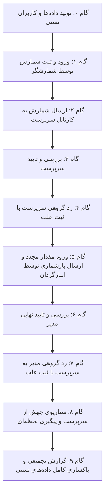

# 📋 طرح پیاده‌سازی آزمون‌های ریزدانه TestSprite برای چرخه انبارگردانی

این طرح شامل تولید داده‌های آزمایشی و کاربران با نقش‌های تفکیک‌شده، اجرای گام‌به‌گام پلن‌های تست در TestSprite برای تک‌تک مراحل و مودال‌های چرخه انبارگردانی، ثبت گزارش خطاها و در نهایت پاکسازی داده‌های تستی است.

---

## 🔍 بازبینی نیازمندی‌ها و معماری تست (Requirements & Architecture)

- **محیط هدف:** فرانت‌اند بر روی محیط دپلوی‌شده به آدرس `https://app.farsalish.ir` (شناسه پروژه TestSprite: `1f6c07ba-e8f1-4733-8656-a8ef3a56efee`).
- **کاربران تستی اختصاصی:**
  1. `test_counter` (نقش انبارگردان میدانی) با پرمیشن `view_sys_counter`.
  2. `test_supervisor` (نقش سرپرست شمارش) با پرمیشن `view_sys_supervisor`.
  3. `test_manager` (نقش مدیر انبارگردانی) با پرمیشن `view_sys_manager`.
- **داده‌های تستی اختصاصی:**
  - یک انبار موقت تستی (`انبار آزمایشی TestSprite`) همراه با ۳ قلم کالا با سناریوهای:
    - کالای ۱: مسیر استاندارد شمارش و تایید نهایی.
    - کالای ۲: سناریوی رد توسط سرپرست و بازشماری.
    - کالای ۳: سناریوی جهش از سرپرست (`skip_supervisor = true`) و رد/تایید مستقیم مدیر.
- **استراتژی اجرا:** آزمون‌ها به صورت کاملاً ریزدانه و تفکیک‌شده (یک تست مستقل برای هر عملکرد) اجرا شده و نتایج همراه با لینک‌های داشبورد ثبت می‌شوند. در پایان داده‌های تستی به طور کامل حذف می‌گردند.

---

## 👥 نیازمند بررسی کاربر (User Review Required)

> [!IMPORTANT]
> برای اجرای تست‌ها در TestSprite، اسکریپت بک‌اند کاربران و کالاهای آزمایشی بالا را روی سرور ایجاد کرده و پس از اتمام تمامی تست‌ها، اسکریپت پاکسازی آن‌ها را اجرا خواهد کرد.

---

## 🗺️ گام‌های اجرایی و فازبندی تست‌های ریزدانه (Proposed Test Phases)

### گام ۰: آماده‌سازی و تزریق داده‌های تستی (Seed Test Data)
- ایجاد اسکریپت موقت در بک‌اند جنگو جهت ساخت:
  - کاربران `test_counter`، `test_supervisor`، `test_manager` با رمز عبور مشخص.
  - انبار آزمایشی `TestSprite Test Warehouse` و تخصیص تسک‌های شمارش.

### گام ۱: میزکار انبارگردان - ثبت شمارش و ویرایش موقعیت (Counter Draft & Details)
- **پلن TestSprite:** ورود با `test_counter`، باز کردن تسک، وارد کردن مقدار شمارش، ثبت توضیحات و ویرایش موقعیت جدید، و کلیک روی دکمه ذخیره موقت.
- **اعتبارسنجی:** مشاهده پیام ذخیره موفق و نمایش وضعیت «آماده ارسال».

### گام ۲: میزکار انبارگردان - ارسال تکی و گروهی (Counter Submit)
- **پلن TestSprite:** انتخاب اقلام و کلیک روی دکمه ارسال گروهی / ارسال تکی مستقیم.
- **اعتبارسنجی:** نمایش دیالوگ تایید، ارسال موفق و انتقال تسک‌ها به وضعیت `COUNTED`.

### گام ۳: کارتابل سرپرست - بررسی و تایید تکی/گروهی (Supervisor Approve)
- **پلن TestSprite:** ورود با `test_supervisor`، مشاهده تسک‌های ارسال‌شده، انتخاب رکوردهای بدون مغایرت و تایید گروهی/تکی.
- **اعتبارسنجی:** انتقال وضعیت تسک‌ها به `MANAGER_REVIEW`.

### گام ۴: کارتابل سرپرست - رد گروهی و تکی با ثبت علت (Supervisor Bulk Reject)
- **پلن TestSprite:** انتخاب تسک دارای مغایرت، کلیک روی دکمه رد گروهی در نوار شناور، وارد کردن علت رد در مودال اختصاصی و تایید با میانبر یا دکمه.
- **اعتبارسنجی:** انتقال وضعیت به `SUPERVISOR_REJECTED` و بازگشت به کارتابل انبارگردان.

### گام ۵: چرخه بازشماری در انبارگردان (Counter Recount Handling)
- **پلن TestSprite:** ورود با `test_counter`، مشاهده علت رد در بخش جزئیات تسک ردشده، وارد کردن مقدار جدید، ذخیره و ارسال مجدد.
- **اعتبارسنجی:** ارتقای وضعیت به `INITIAL_COUNT` و سپس `COUNTED`.

### گام ۶: کارتابل مدیر - بررسی نهایی و تایید گروهی (Manager Final Approval)
- **پلن TestSprite:** ورود با `test_manager`، بررسی اقلام، اعمال تایید گروهی در نوار شناور پایین.
- **اعتبارسنجی:** انتقال به وضعیت `FINAL_APPROVED`.

### گام ۷: کارتابل مدیر - رد گروهی به سرپرست با ثبت علت (Manager Bulk Reject)
- **پلن TestSprite:** انتخاب تسک مورد نظر، کلیک روی رد گروهی، وارد کردن علت و تایید در مودال.
- **اعتبارسنجی:** انتقال به وضعیت `MANAGER_REJECTED` و ارسال به کارتابل سرپرست.

### گام ۸: سناریوی جهش از سرپرست و پیگیری لحظه‌ای (Skip Supervisor & Tracking)
- **پلن TestSprite:** تست ارسال مستقیم از شمارشگر به مدیر برای اقلام با فلگ `skip_supervisor` و بررسی صفحه پیگیری لحظه‌ای شمارش.

### گام ۹: ارائه گزارش تجمیعی و پاکسازی داده‌ها (Consolidated Report & Cleanup)
- گردآوری نتایج تمام اجراها، استخراج لاگ‌ها و لینک‌های ویدیو.
- اجرای اسکریپت حذف انبار، تسک‌ها و کاربران تستی از دیتابیس.

---

## 🧪 طرح راستی‌آزمایی (Verification Plan)

### Automated TestSprite Runs
- اجرای تک‌تک پلن‌های ایجاد شده از طریق فرمان `testsprite test create --plan-from <plan.json> --run --wait` یا `testsprite test run <testId> --wait`.
- دریافت کدهای خروجی و ثبت لاگ و ویدیوی اجرا در پوشه اسناد.

### Final DB Integrity Check
- بررسی دیتابیس پس از اجرای اسکریپت پاکسازی جهت اطمینان از عدم باقی ماندن رکوردهای تستی.

