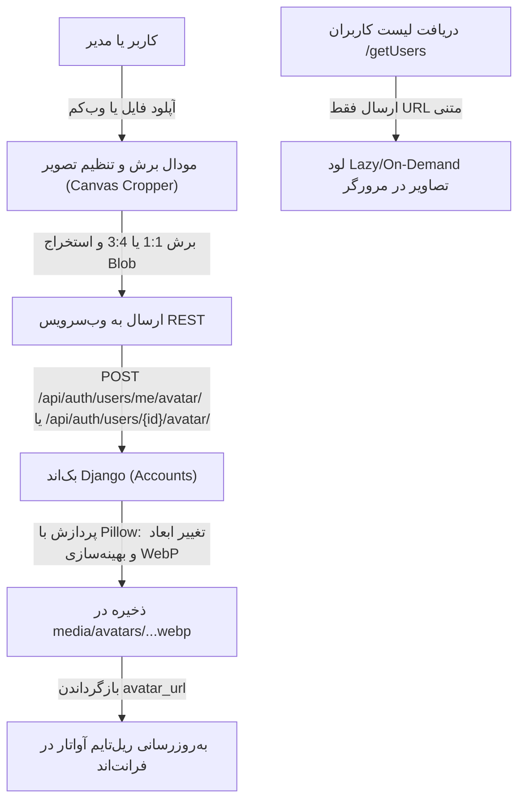

# طرح پیاده‌سازی سیستم تصویر پرسنلی و آواتار هوشمند کاربران (User Avatar & Cropper)

این طرح بر اساس توافق انجام‌شده، به منظور پیاده‌سازی **سطح ۲ (سازمانی و کامل)** سیستم تصاویر پرسنلی، امکان تغییر تصویر توسط خودِ کاربر (Self-Service) و استریم ریل‌تایم بدون سنگین شدن لود اولیه تدوین شده است.

---

## ۱. اهداف و معماری فنی طرح (Architecture Overview)

---

## ۲. نیازمندی‌های بازبینی کاربر (User Review Required)

> [!IMPORTANT]
> **اصول کلیدی معماری:**
> 1. **پردازش و بهینه‌سازی WebP در بک‌اند:** تصاویر با استفاده از کتابخانه Pillow به فرمت WebP با کیفیت ۸۵ و رزولوشن استاندارد (حداکثر ۶۰۰×۶۰۰ پیکسل) تبدیل و ذخیره می‌شوند تا حجم فایل همواره زیر **۴۰ کیلوبایت** بماند.
> 2. **استریم ریل‌تایم و بدون Base64 در لیست‌ها:** در وب‌سرویس‌های دریافت کاربران (`/api/auth/users/`)، بایت‌های تصویر ارسال نمی‌شوند؛ فقط آدرس متنی سبک `avatar` (مانند `/media/avatars/...webp`) ارسال شده و مرورگر به‌صورت `loading="lazy"` و کش‌شده تصاویر را لود می‌کند.
> 3. **دسترسی عمومی ویرایش تصویر شخصی:** هر کاربر در منوی بالای صفحه (هدر) می‌تواند تصویر خود را از طریق وب‌کم یا آپلود فایل تغییر دهد، بدون نیاز به داشتن دسترسی‌های مدیریتی.

---

## ۳. تغییرات پیشنهادی (Proposed Changes)

### الف) بک‌اند پایگاه‌داده و سرویس‌ها (Django Backend)

#### [MODIFY] [models.py](file:///e:/warehouse%20project/warehouse-backend/accounts/models.py)
- افزودن فیلد `avatar = models.ImageField(upload_to='avatars/%Y/%m/', null=True, blank=True, verbose_name="تصویر پرسنلی")` به مدل `CustomUser`.

#### [MODIFY] [settings.py](file:///e:/warehouse%20project/warehouse-backend/config/settings.py) & [urls.py](file:///e:/warehouse%20project/warehouse-backend/config/urls.py)
- پیکربندی `MEDIA_URL = '/media/'` و `MEDIA_ROOT = BASE_DIR / 'media'`.
- اضافه کردن مسیردهی و سرو فایل‌های `media` در `urls.py`.

#### [NEW] [avatar_utils.py](file:///e:/warehouse%20project/warehouse-backend/accounts/avatar_utils.py)
- تابع اختصاصی `process_and_optimize_avatar(image_file, max_size=(600, 600), quality=85)`:
  - باز کردن تصویر با Pillow، اصلاح چرخش Exif (جهت عکس‌های موبایل).
  - تبدیل به فضای رنگی RGB.
  - تغییر اندازه هوشمند به حداکثر ۶۰۰ پیکسل با فیلتر Lanczos.
  - خروجی با پسوند `.webp` و ذخیره بهینه.

#### [MODIFY] [serializers.py](file:///e:/warehouse%20project/warehouse-backend/accounts/serializers.py)
- افزودن `avatar` به فیلدهای `UserSerializer` و ساخت متد `get_avatar` برای بازگرداندن URL مطلق/نسبی تصویر.

#### [MODIFY] [views.py](file:///e:/warehouse%20project/warehouse-backend/accounts/views.py)
- افزودن اکشن `me/avatar` (متدهای POST و DELETE) برای تغییر تصویر پروفایل توسط خودِ کاربر لاگین‌شده.
- افزودن اکشن `avatar` روی آبجکت کاربر (`detail=True`) برای تغییر/حذف تصویر هر پرسنل توسط مدیر سیستم.

---

### ب) فرانت‌اند و رابط کاربری (Angular Frontend)

#### [NEW] [avatar-cropper-modal](file:///e:/warehouse%20project/warehouse-front/src/app/shared/components/avatar-cropper-modal/)
- کامپوننت مستقل و مدرن با قابلیت‌های:
  - **حالت آپلود فایل:** درگ اند دراپ و انتخاب فایل تصویر (JPG, PNG, WebP).
  - **حالت وب‌کم (Camera):** دسترسی به وب‌کم با `navigator.mediaDevices.getUserMedia` و ثبت فوری عکس با دکمه شاتر.
  - **ابزار برش و تنظیم تعاملی Canvas:**
    - قابلیت انتخاب نسبت ۱:۱ (مربعی) یا ۳:۴ (کارت پرسنلی).
    - اسلایدر زوم، چرخش ۹۰ درجه، جابه‌جایی عکس در کادر.
  - خروجی تصویر برش‌خورده به فرمت Blob و ارسال مستقیم به سرور.
  - دکمه «حذف تصویر فعلی» برای ریست کردن آواتار.

#### [MODIFY] [accounts-http.service.ts](file:///e:/warehouse%20project/warehouse-front/src/app/core/http/accounts-http.service.ts)
- افزودن متدهای `updateMyAvatar(file: Blob)`، `deleteMyAvatar()`، `updateUserAvatar(userId: number, file: Blob)` و `deleteUserAvatar(userId: number)`.

#### [MODIFY] [layout.html](file:///e:/warehouse%20project/warehouse-front/src/app/components/layout/layout.html) & [layout.ts](file:///e:/warehouse%20project/warehouse-front/src/app/components/layout/layout.ts)
- نمایش عکس واقعی کاربر در هدر به جای آیکون متنی (در صورت داشتن آواتار).
- افزودن گزینه «ویرایش تصویر پروفایل 📷» در منوی کاربری هدر با باز شدن مودال برش تصویر.

#### [MODIFY] [users.html](file:///e:/warehouse%20project/warehouse-front/src/app/components/users/users.html) & [users.ts](file:///e:/warehouse%20project/warehouse-front/src/app/components/users/users.ts)
- در کارت‌های لیست پرسنل: نمایش عکس واقعی `avatar` با `loading="lazy"` و انیمیشن انتقال نرم، و در صورت عدم وجود عکس، نمایش حرف اول نام فارسی با پس‌زمینه نقش.
- در فرم ویرایش کاربر: اتصال دکمه «مدیریت تصویر» به باز شدن مودال برش عکس برای کاربر در حال ویرایش.

---

## ۴. برنامه راستی‌آزمایی و تست (Verification Plan)

### تست‌های خودکار و بک‌اند:
- اجرای `python manage.py makemigrations accounts` و `python manage.py migrate`.
- اجرای `python manage.py check` برای تایید صحت تنظیمات Django.
- بیلد کامل فرانت‌اند `npx ng build --configuration=development` و بررسی عدم وجود خطای کامپایل.

### تست‌های کارکردی (Manual Tests):
1. **تست آپلود و برش تصویر از هدر:** ورود با کاربر، باز کردن منوی هدر، انتخاب عکس، برش با نسبت ۱:۱ و ذخیره — بررسی فشرده‌سازی WebP و لود ریل‌تایم.
2. **تست وب‌کم:** فعال‌سازی دوربین در مودال، ثبت عکس و ذخیره روی پروفایل.
3. **تست مدیریت پرسنل:** ورود به صفحه کاربران، ویرایش پرونده یک کاربر، آپلود عکس پرسنلی ۳×۴ و مشاهده در کارت پرسنل.
4. **تست حذف تصویر:** حذف عکس و بازگشت خودکار به حالت آواتار متنی حرف اول نام.

