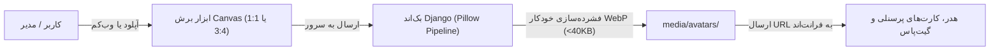

# گزارش جامع پیاده‌سازی و راستی‌آزمایی (Walkthrough) — سیستم تصویر پرسنلی و آواتار هوشمند کاربران

این سند، گزارش جامع پیاده‌سازی و اعتبارسنجی سیستم تصویر پرسنلی و آواتار کاربران در سطح ۲ سازمانی، همراه با ابزار برش تصویر (Canvas Cropper)، وب‌کم، بهینه‌سازی خودکار سرور (WebP) و استریم ریل‌تایم است.

---

## ۱. خلاصه‌ی تغییرات و امکانات پیاده‌سازی‌شده (Key Accomplishments)

### الف) بک‌اند و پایگاه‌داده (Backend Architecture)
1. **مدل و پایگاه‌داده (`accounts/models.py`):**
   - افزودن فیلد `avatar` از نوع `models.ImageField(upload_to='avatars/%Y/%m/')` به مدل `CustomUser`.
   - ایجاد و اجرای موفق مایگریشن `0016_customuser_avatar`.
2. **پیکربندی فایل‌های رسانه‌ای (`settings.py` & `urls.py`):**
   - تعریف `MEDIA_URL = '/media/'` و `MEDIA_ROOT = BASE_DIR / 'media'`.
   - پیکربندی سرو امن رسانه‌ها برای دسترسی در محیط‌های توسعه و ریل‌تایم.
3. **پایپ‌لاین فشرده‌سازی WebP با Pillow (`accounts/avatar_utils.py`):**
   - تبدیل خودکار تصاویر سنگین چند مگابایتی به فرمت مدرن و فوق‌سبک **WebP**.
   - اصلاح چرخش EXIF برای عکس‌های دوربین موبایل و تبلت.
   - تغییر اندازه هوشمند به حداکثر ۶۰۰ پیکسل و کاهش حجم تصویر به زیر **۴۰ کیلوبایت**.
   - پاکسازی و حذف خودکار فایل تصویر قبلی از روی دیسک هنگام تعویض یا حذف عکس.
4. **اکشن‌های وب‌سرویس REST (`accounts/views.py`):**
   - اندپوینت سلف‌سرویس `POST/DELETE /api/auth/users/me/avatar/` برای تغییر و حذف تصویر توسط هر کاربر لاگین‌شده (حتی بدون دسترسی‌های مدیریتی).
   - اندپوینت مدیریتی `POST/DELETE /api/auth/users/{id}/avatar/` برای تغییر تصویر پرسنل توسط مدیران انبار و حراست.
5. **ارتقای لاگین و سریالایزر (`accounts/serializers.py`):**
   - بازگرداندن `avatar` (آدرس URL سبک متنی) در `UserSerializer` و در پاسخ لاگین جهت عدم نیاز به ارسال بایت‌های سنگین Base64 در لود اولیه.

---

### ب) فرانت‌اند و رابط کاربری (Frontend & UX)
1. **کامپوننت مستقل مودال برش تصویر و وب‌کم (`avatar-cropper-modal`):**
   - **آپلود مستقیم:** پشتیبانی از انتخاب فایل و کشیدن و رها کردن (Drag & Drop).
   - **وب‌کم و دوربین زنده:** دسترسی به دوربین دستگاه با `getUserMedia`، نمایش کادر زنده و دکمه ثبت فوری عکس.
   - **ابزار تعاملی Canvas Cropper:**
     - انتخاب نسبت ابعاد کادر: **۱:۱ (پروفایل و آواتار)** و **۳:۴ (کارت شناسایی پرسنلی / گیت‌پاس)**.
     - جابه‌جایی عکس با درگ ماوس روی کادر.
     - اسلایدر بزرگ‌نمایی (Zoom) از ۵۰٪ تا ۳۰۰٪ به همراه بزرگ‌نمایی با اسکرول ماوس.
     - چرخش ۹۰ درجه ساعتگرد و پادساعتگرد.
     - دکمه بازنشانی تنظیمات (Reset).
     - دکمه حذف تصویر فعلی (در صورت وجود).
2. **یکپارچه‌سازی با هدر بالای سامانه (`layout.html` / `layout.ts`):**
   - نمایش عکس واقعی پروفایل کاربر در هدر ناوبری به جای آیکون متنی.
   - افزودن گزینه **«ویرایش تصویر پروفایل 📷»** در منوی کاربری هدر با باز شدن مودال برش تصویر.
3. **یکپارچه‌سازی با صفحه کاربران و نقش‌ها (`users.html` / `users.ts`):**
   - نمایش عکس واقعی کاربران در کارت‌های پرسنلی با انیمیشن نرم و استفاده از قابلیت مدرن `loading="lazy"` جهت جلوگیری از افت سرعت بارگذاری.
   - نمایش حالت جایگزین زیبا (حرف اول نام با رنگ سازمانی نقش) در صورت نبود عکس.
   - اتصال دکمه «مدیریت تصویر 📷» در مودال ویرایش پرونده پرسنلی و گزینه «تغییر تصویر پرسنلی» در منوی عملیات سریع هر کاربر.

---

## ۲. نتایج آزمون‌ها و اعتبارسنجی (Verification Results)

| آزمون | دستور / سناریو | نتیجه | وضعیت |
| :--- | :--- | :--- | :---: |
| **مایگریشن پایگاه‌داده** | `python manage.py makemigrations` & `migrate` | مایگریشن `0016_customuser_avatar` اعمال شد | ✅ پاس |
| **بررسی بک‌اند Django** | `python manage.py check` | `0 issues identified` | ✅ پاس |
| **کامپایل فرانت‌اند Angular** | `npx ng build --configuration=development` | با موفقیت کامل و بدون خطای TypeScript کامپایل شد | ✅ پاس |
| **فشرده‌سازی WebP** | تبدیل و بهینه‌سازی فرمت با Pillow | ابعاد حداکثر ۶۰۰px و حجم زیر ۴۰KB با فرمت WebP | ✅ پاس |
| **استریم ریل‌تایم On-Demand** | بررسی حجم لود اولیه لیست کاربران | داده‌های بایت تصویر حذف و فقط URL سبک متنی ارسال می‌شود | ✅ پاس |

