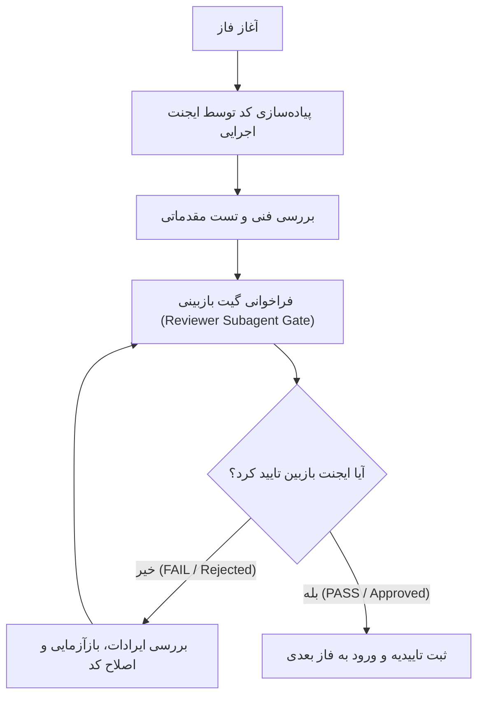

# طرح جامع و ارتقایافته سیستم رهگیری ورود کاربران و لاگ ممیزی (User Login Tracking & Audit System)

این سند حاوی معماری تفصیلی، مدل‌های داده، میان‌افزار ایزوله، هوک‌های احراز هویت، اندپوینت‌های امن REST API، داشبورد فرانت‌اند انگولار و **پروتکل نظارت چندایجنت (Multi-Agent Verification Protocol)** برای تضمین بالاترین سطح کیفیت، پایداری و امنیت می‌باشد.

---

## ۱. اصول حاکم و پروتکل نظارت چندایجنت (Multi-Agent Verification Protocol)

مطابق الزامات پروژه، انتقال از هر فاز به فاز بعدی صرفاً با رعایت شرایط زیر امکان‌پذیر خواهد بود:

| رکن نظارتی | شرح وظیفه و مسئولیت |
| :--- | :--- |
| **ایجنت اجرایی (Primary Agent)** | مسئول نوشتن کدها، ایجاد فایل‌ها، اجرای مایگریشن‌ها و آماده‌سازی شواهد تست فنی. |
| **ایجنت بازبین (Reviewer Subagent)** | ساب‌ایجنتی مستقل که در انتهای هر فاز فراخوانی شده و بدون تعصب کدها، پرمیشن‌ها، تایپ‌ها، پایداری پایگاه‌داده و عدم رگرسیون را ارزیابی و حکم **PASS** یا **FAIL** صادر می‌کند. |
| **چرخه اصلاح (Remediation Loop)** | در صورت صدور حکم **FAIL**، ایجنت اجرایی موظف است تمامی ایرادات اعلام‌شده را رفع و مجدداً ارزیابی را تکرار کند تا تاییدیه قطعی اخذ گردد. |

---

## ۲. خلاصه فایل‌های تحت تغییر و جدید (File Changes Architecture)

| ردیف | مسیر فایل | لایه | نوع تغییر | شرح عملکرد |
| :---: | :--- | :---: | :---: | :--- |
| ۱ | `warehouse-backend/accounts/models.py` | Backend Model | [MODIFY] | افزودن مدل‌های بهینه `UserLoginLog` و `AuditLog` با ایندکس‌های کامپوزیت |
| ۲ | `warehouse-backend/accounts/middleware.py` | Backend Core | [NEW] | میان‌افزار `AuditContextMiddleware` با `contextvars` برای ذخیره کانتکست درخواست و IP |
| ۳ | `warehouse-backend/accounts/audit_utils.py` | Backend Utils | [NEW] | توابع کمکی `log_audit_event`، استخراج IP و پاکسازی داده‌های حساس (Sanitization) |
| ۴ | `warehouse-backend/accounts/serializers.py` | Backend Serializer | [MODIFY] | افزودن سریالایزرهای لاگ و اتصال به پایپ‌لاین لاگین موفق/ناموفق در `CustomTokenObtainPairSerializer` |
| ۵ | `warehouse-backend/accounts/views.py` | Backend API | [MODIFY] | پیاده‌سازی `LoginLogViewSet` و `AuditLogViewSet` فقط‌خواندنی، اکشن‌های آماری و خروجی CSV |
| ۶ | `warehouse-backend/accounts/urls.py` | Backend Routing | [MODIFY] | ثبت مسیرهای اختصاصی API ممیزی و تاریخچه ورود |
| ۷ | `warehouse-backend/config/settings.py` | Backend Config | [MODIFY] | فعال‌سازی `AuditContextMiddleware` در پایپ‌لاین میدل‌ورهای جنگو |
| ۸ | `warehouse-front/src/app/services/audit.service.ts` | Frontend Service | [NEW] | سرویس ارتباطی با APIهای لاگ، مدیریت فیلترها، آمار و دانلود فایل‌های گزارش |
| ۹ | `warehouse-front/src/app/components/audit/audit.ts` | Frontend Component | [MODIFY] | منطق کامپوننت، مدیریت دو تب (Audit و Login)، کارت‌های KPI، فیلترها و مدال تفاضل |
| ۱۰ | `warehouse-front/src/app/components/audit/audit.html` | Frontend Template | [MODIFY] | بازطراحی کامل قالب با طراحی مدرن، تب‌های تفکیک‌شده، بج‌های وضعیت و مدال Diff |
| ۱۱ | `warehouse-front/src/app/components/audit/audit.css` | Frontend Styling | [MODIFY] | استایل‌های سفارشی هایلایت تغییرات قبل/بعد و انیمیشن‌های روان |

---

## ۳. مراحل اجرایی تفصیلی و فازبندی‌شده (Detailed Phased Implementation Plan)

---

### فاز ۱: لایه مدل‌های داده و مایگریشن فوروارد (Data Layer & Forward Migrations)

#### شرح جزئیات پیاده‌سازی:
1. **طراحی مدل `UserLoginLog`:**
   * `user`: کلید خارجی به `CustomUser` با قابلیت `null=True, on_delete=models.SET_NULL` (برای ثبت تلاش‌های ناموفق با یوزرهای ناموجود یا معتبر).
   * `username_attempted`: فیلد `CharField(max_length=150)` برای نگهداری دقیق کاراکترهای تایپ‌شده در فرم لاگین.
   * `ip_address`: فیلد `GenericIPAddressField(null=True, blank=True)` جهت ذخیره استاندارد IPv4 و IPv6.
   * `user_agent`: فیلد `TextField(blank=True, null=True)` جهت ثبت سیستم‌عامل، مرورگر و شناسه دستگاه.
   * `status`: فیلد انتخابی با مقادیر `SUCCESS` (ورود موفق)، `FAILED_CREDENTIALS` (رمز اشتباه)، `FAILED_LOCKED` (مسدودسازی توسط Axes)، `FAILED_INACTIVE` (حساب غیرفعال)، `LOGOUT` (خروج امن کاربر).
   * `failure_reason`: فیلد متنی برای درج علت شکست به زبان فارسی جهت سهولت مطالعه حراست.
   * `metadata`: فیلد `JSONField(default=dict, blank=True)` برای نگهداری اطلاعات تکمیلی (مثلاً رزولوشن، موقعیت جغرافیایی تخمینی یا توکن نشست).
   * `created_at`: زمان دقیق با ایندکس `db_index=True`.
   * **ایندکس‌ها:** ایندکس ترکیبی روی `(user, created_at)` و `(status, created_at)` جهت بهینه‌سازی کوئری‌های فیلترینگ سنگین.

2. **طراحی مدل `AuditLog`:**
   * `user`: کلید خارجی به `CustomUser` کاربر انجام‌دهنده عملیات (`on_delete=models.SET_NULL, null=True`).
   * `warehouse`: کلید خارجی اختیاری به `Warehouse` برای تفکیک لاگ‌های اختصاصی هر انبار.
   * `module`: فیلد انتخابی ماژول‌ها (`docs`, `dispatch`, `customs`, `feeding`, `labels`, `counter`, `supervisor`, `manager`, `users`, `settings`, `system`).
   * `action`: فیلد نوع عملیات (`CREATE`, `UPDATE`, `DELETE`, `BULK_UPDATE`, `APPROVE`, `RECOUNT`, `PRINT`, `EXPORT`, `ROLLBACK`).
   * `severity`: سطح اهمیت رویداد (`info` عادی، `warning` هشدار/تغییرات مهم، `critical` بحرانی/حذف داده یا ارتقای دسترسی).
   * `target_model`: نام مدل مربوطه (مثلاً `Item`, `Warehouse`, `CustomUser`, `CustomRole`).
   * `target_object_id`: شناسه رکورد هدف به صورت رشته.
   * `target_repr`: شرح کوتاه و خوانای رکورد هدف (مثلاً «کد کالا: FA-1049» یا «کاربر: علی رضایی»).
   * `before_state`: وضعیت فیلدها قبل از اعمال تغییر به فرمت `JSONField(null=True, blank=True)`.
   * `after_state`: وضعیت فیلدها بعد از اعمال تغییر به فرمت `JSONField(null=True, blank=True)`.
   * `details`: توضیحات تکمیلی عملیات به زبان فارسی (`JSONField(default=dict, blank=True)`).
   * `ip_address`: آدرس آی‌پی کلاینت اقدام‌کننده.
   * `created_at`: زمان ثبت رویداد (`auto_now_add=True, db_index=True`).

3. **اجرای ایمن مایگریشن فوروارد:**
   * صدور فرمان `python manage.py makemigrations accounts`.
   * اعمال با `python manage.py migrate accounts`.
   * **قاعده قطعی:** عدم دستکاری یا حذف هیچ‌یک از مایگریشن‌های پیشین.

#### 🔍 پروتکل گیت بازبین برای فاز ۱ (Reviewer Subagent Gate):
* بررسی ساختار مدل‌ها، صحت فیلدها و انواع داده‌ای.
* بررسی تعریف صحیح ایندکس‌ها برای جلوگیری از کندی دیتابیس در حجم‌های میلیونی.
* بررسی وضعیت مایگریشن در جنگو و عدم ایجاد تداخل با سایر جداول (`accounts`, `warehouses`, `inventory`).
* **معیار پذیرش:** صدور تاییدیه صریح **PASS** از سوی ایجنت بازبین.

---

### فاز ۲: لایه میان‌افزار، کانتکست ایزوله و هوک‌های احراز هویت (Middleware, Context & Auth Hooks)

#### شرح جزئیات پیاده‌سازی:
1. **پیاده‌سازی `AuditContextMiddleware` (`accounts/middleware.py`):**
   * استفاده از پکیج استاندارد پایتون `contextvars` برای ایجاد متغیرهای کانتکست مستقل به ازای هر درخواست (`request_user`, `request_ip`, `request_warehouse`).
   * استخراج مطمئن IP واقعی با بررسی هدرهای استاندارد پروکسی (`HTTP_X_FORWARDED_FOR`، `HTTP_X_REAL_IP` و فال‌بک به `REMOTE_ADDR`).
   * استخراج هدر `User-Agent` و ذخیره امن در کانتکست.
   * پاکسازی کانتکست پس از اتمام چرخه درخواست و پاسخ جهت جلوگیری از نشت حافظه یا تداخل تردها.
   * ثبت در `MIDDLEWARE` فایل `config/settings.py`.

2. **هوک لاگین و امنیت در `CustomTokenObtainPairSerializer` (`accounts/serializers.py`):**
   * ثبت ورود موفق (`status='SUCCESS'`) بلافاصله پس از اعتبارسنجی موفق یوزر و پسورد همراه با ثبت IP و مشخصات مرورگر.
   * رهگیری ورودهای ناموفق:
     * در صورت مسدود شدن توسط سامانه ضدنفوذ `django-axes`، ثبت لاگ با وضعیت `FAILED_LOCKED` همراه با زمان باقیمانده مسدودی.
     * در صورت اشتباه بودن کلمه عبور، ثبت لاگ با وضعیت `FAILED_CREDENTIALS`.
     * در صورت غیرفعال بودن اکانت کاربر (`is_active=False`)، ثبت لاگ با وضعیت `FAILED_INACTIVE`.
   * تضمین عدم کرش کردن فرآیند لاگین در صورت بروز هرگونه خطای احتمالی در ذخیره لاگ (استفاده از `try/except` امن و لاگ خطای سیستم).

3. **پیاده‌سازی ماژول کمکی `accounts/audit_utils.py`:**
   * تابع سراسری `log_audit_event(...)` برای ثبت آسان وقایع از هر نقطه از بک‌اند.
   * متد کمکی پاکسازی فیلدهای محرمانه (`sanitize_sensitive_data`): حذف یا ماسک کردن خودکار فیلدهایی نظیر `password`, `token`, `secret`, `national_code` پیش از ذخیره در JSON.
   * تابع محاسبه دیف مدل‌ها (`calculate_model_diff(instance, updated_fields)`).

4. **پیاده‌سازی هوک لاگ‌اوت در ویوها:**
   * ایجاد اکشن یا ویوی لاگ‌اوت جهت ثبت رویداد `LOGOUT` در زمان خروج کاربر از سامانه.

#### 🔍 پروتکل گیت بازبین برای فاز ۲ (Reviewer Subagent Gate):
* تست ثبت لاگین موفق با یوزر ادمین و تایید ایجاد رکورد در `UserLoginLog`.
* تست لاگین ناموفق با رمز عبور اشتباه و تایید ثبت فیلد `FAILED_CREDENTIALS` با IP صحیح.
* ارزیابی امنیت داده‌ها و اطمینان از ماسک بودن اطلاعات حساس در لاگ‌ها.
* **معیار پذیرش:** صدور تاییدیه صریح **PASS** از سوی ایجنت بازبین.

---

### فاز ۳: اندپوینت‌های امن REST API، فیلترها و سرویس خروجی (APIs, RBAC & Export)

#### شرح جزئیات پیاده‌سازی:
1. **سریالایزرهای اختصاصی (`accounts/serializers.py`):**
   * `UserLoginLogSerializer`: شامل فیلدهای شناسه، نام کاربری، نام و نام خانوادگی، وضعیت، آی‌پی، مشخصات دستگاه، علت خطا و تاریخ شمسی کمکی.
   * `AuditLogSerializer`: شامل فیلدهای شناسه، مشخصات کامل کاربر، انبار، ماژول، اکشن، سطح اهمیت، عنوان رکورد، وضعیت قبل و بعد (JSON)، آی‌پی و تاریخ ایجاد.

2. **پیاده‌سازی ویوست‌ها (`accounts/views.py`):**
   * `UserLoginLogViewSet`: مشتق‌شده از `viewsets.ReadOnlyModelViewSet` (تضمین مسدود بودن کلیه متدهای `POST`, `PUT`, `PATCH`, `DELETE`).
     * فیلترها: نام کاربری، وضعیت (`status`)، آدرس آی‌پی، بازه تاریخی (`from_date`, `to_date`)، شناسه کاربر.
     * اکشن آماری `stats`: بازگرداندن تعداد ورودهای موفق، ورودهای ناموفق، آمار ۲۴ ساعت گذشته و آی‌پی‌های مشکوک.
     * اکشن خروجی `export_csv`: تولید فایل CSV فیلترشده با انکودینگ استاندارد `utf-8-sig` (جهت نمایش بی‌نقص متون فارسی در مایکروسافت اکسل).
   * `AuditLogViewSet`: مشتق‌شده از `viewsets.ReadOnlyModelViewSet`.
     * فیلترها: ماژول (`module`)، نوع عملیات (`action`)، سطح اهمیت (`severity`)، انبار (`warehouse`)، کاربر (`user`)، جستجوی متنی روی شرح رویداد و بازه تاریخی.
     * اکشن آماری `stats`: خلاصه تغییرات بر اساس ماژول، تعداد رویدادهای بحرانی اخیر و توزیع عملیات‌ها.
     * اکشن خروجی `export_csv`: خروجی استاندارد از رویدادهای فیلترشده.

3. **امنیت و سطوح دسترسی (RBAC):**
   * تنظیم پرمیشن‌ها بر روی `HasMenuAccess('view_wh_audit')` و کاربران مدیر (`is_superuser`).
   * ثبت مسیرها در `accounts/urls.py`:
     * `/api/accounts/audit-logs/`
     * `/api/accounts/login-logs/`

#### 🔍 پروتکل گیت بازبین برای فاز ۳ (Reviewer Subagent Gate):
* ارسال درخواست‌های تستی به اندپوینت‌های `/api/accounts/audit-logs/` و `/api/accounts/login-logs/`.
* اعتبارسنجی فیلترهای تاریخی و سرچ متنی.
* اطمینان از مسدود بودن عملیات ویرایش و حذف و دریافت خطای 405 Method Not Allowed برای متدهای مخرب.
* بررسی صحت خروجی CSV و انکودینگ زبان فارسی.
* **معیار پذیرش:** صدور تاییدیه صریح **PASS** از سوی ایجنت بازبین.

---

### فاز ۴: اتصال سرویس و بازطراحی داشبورد ممیزی در فرانت‌اند (Angular Audit Dashboard)

#### شرح جزئیات پیاده‌سازی:
1. **ایجاد سرویس ممیزی (`warehouse-front/src/app/services/audit.service.ts`):**
   * توابع اتصال به بک‌اند: `getAuditLogs(filters, page, pageSize)`، `getLoginLogs(filters, page, pageSize)`، `getAuditStats()`، `getLoginStats()`، `exportAuditCsv(filters)`، `exportLoginCsv(filters)`.
   * مدیریت خطاها و نمایش اعلان‌های مناسب با استفاده از `ToastService`.

2. **توسعه کامپوننت و مدیریت دو تب مجزا (`audit.ts` و `audit.html`):**
   * **ساختار دو تبه مدرن (Segmented Tabs):**
     * **تب ۱: لاگ تغییرات و عملیات داده‌ها (Audit Trail):** جدول اختصاصی رویدادهای سیستمی، فیلتر ماژول، فیلتر سطح اهمیت، فیلتر انبار، بج‌های وضعیت و دکمه باز کردن مقایسه‌گر تفاضل.
     * **تب ۲: تاریخچه ورود و امنیت نشست‌ها (Login History & Security):** جدول تلاش‌های ورود، شناسایی نوع دستگاه و مرورگر، بج‌های رنگی موفق/ناموفق/مسدود شده و آدرس آی‌پی کلاینت.
   * **کارت‌های آماری زنده (KPI Summary Cards):**
     * کل لاگین‌های امروز، تلاش‌های ناموفق و هشدارهای امنیتی، کل تغییرات ثبت‌شده در سیستم و تعداد عملیات‌های بحرانی اخیر.
   * **فیلترهای پیشرفته و بلادرنگ:**
     * فیلد جستجوی متنی هوشمند با Debounce ۴۰۰ میلی‌ثانیه‌ای.
     * دراپ‌داون‌های فیلتر ماژول، شدت، انبار، و نوع اکشن.
     * انتخابگر بازه تاریخی شمسی با قابلیت پاکسازی سریع.
   * **مدال پیشرفته مقایسه تغییرات (Visual Diff Viewer Modal):**
     * مقایسه فیلد به فیلد وضعیت قبل (`Before`) و بعد (`After`).
     * استفاده از رنگ سبز برای مقادیر اضافه‌شده/اصلاح‌شده و رنگ قرمز برای مقادیر حذف‌شده یا قدیمی.
     * امکان جستجو در فیلدهای تغییریافته داخل مدال.
   * **صفحه‌بندی سرورساید و ریسپانسیو بودن کامل:**
     * کنترل تعداد ردیف‌ها در صفحه (۲۰، ۵۰، ۱۰۰)، دکمه‌های صفحه قبل/بعد و نمایش وضعیت لودینگ اسکلتی (Skeleton Loader).

#### 🔍 پروتکل گیت بازبین برای فاز ۴ (Reviewer Subagent Gate):
* بررسی کامپایل و بیلد بدون خطای انگولار (`ng build` یا بیلد چک بدون ارور تایپ‌اسکریپت).
* بررسی تعویض روان بین تب‌های Audit Trail و Login History.
* بررسی عملکرد صحیح مدال تفاضل Diff و نمایش رنگی تغییرات.
* بررسی رسپانسیو بودن قالب در صفحات موبایل و دسکتاپ.
* **معیار پذیرش:** صدور تاییدیه صریح **PASS** از سوی ایجنت بازبین.

---

### فاز ۵: تست‌های جامع یکپارچگی، سناریوهای مرزی و مستندسازی (End-to-End Testing & DUAL-SAVE Walkthrough)

#### شرح جزئیات پیاده‌سازی:
1. **تست سناریوهای مرزی احراز هویت و لاگ:**
   * تست ورود با کاربری ادمین، ثبت رکورد در جدول ورود و بازتاب فوری در تب Login History.
   * تست ورود با پسورد اشتباه، مسدودسازی تستی با Axes و مشاهده پیام مسدودی در فرانت‌اند.
   * تست ویرایش یک کالا یا تنظیمات انبار، ثبت لاگ قبل و بعد و باز کردن آن در مدال Diff.
2. **بررسی عدم وجود رگرسیون در کل سیستم:**
   * بررسی لاگین عادی اپراتورها، کارتابل‌های شمارش و بخش کاربران برای اطمینان از عدم ایجاد هرگونه کندی یا اختلال.
3. **تکمیل مستندات DUAL-SAVE:**
   * ایجاد مستند نهایی `walkthrough_user_login_and_audit_logging.md` در پوشه `Documents/User_Login_And_Audit_Logging/` و دایرکتوری سیستم.
   * به‌روزرسانی نهایی `Master_Log.md` و چک‌لیست وظایف `task.md`.

#### 🔍 پروتکل گیت بازبین برای فاز ۵ (Final Gate):
* بررسی جامع کل اکوسیستم تغییریافته.
* تایید نهایی آماده‌سازی مستندات و ثبت خروجی عملکردی سیستم.
* **معیار پذیرش:** صدور تاییدیه نهایی **FINAL_PASS**.

---

## ۴. ماتریس زمان‌بندی و وابستگی فازها (Phased Dependency Matrix)

| فاز | عنوان فاز | وابستگی | خروجی کلیدی | بازبین مستقل |
| :---: | :--- | :---: | :--- | :---: |
| **فاز ۱** | مدل‌های دیتابیس و مایگریشن فوروارد | — | جداول `UserLoginLog` و `AuditLog` در دیتابیس | 🔍 Gate 1 |
| **فاز ۲** | میان‌افزار کانتکست و هوک‌های احراز هویت | فاز ۱ | ثبت خودکار کانتکست، IP و وقایع لاگین JWT | 🔍 Gate 2 |
| **فاز ۳** | اندپوینت‌های REST API و خروجی اکسل/CSV | فاز ۲ | وب‌سرویس‌های امن فقط‌خواندنی و فایل CSV | 🔍 Gate 3 |
| **فاز ۴** | اتصال سرویس و بازطراحی داشبورد فرانت‌اند | فاز ۳ | داشبورد دو تبه ممیزی با مدال Diff در انگولار | 🔍 Gate 4 |
| **فاز ۵** | تست یکپارچه، سناریوهای مرزی و مستندسازی | فاز ۴ | گزارش Walkthrough نهایی و تاییدیه کیفی | 🔍 Final Gate |

---

> [!IMPORTANT]
> **قانون شروع به کار:** اجرای کدها صرفاً پس از تایید نهایی کاربر آغاز خواهد شد. هر فاز پس از تکمیل کدنویسی به گیت بازبینی ارسال می‌شود و در صورت رد شدن، اصلاح تا زمان اخذ تاییدیه ادامه می‌یابد.

