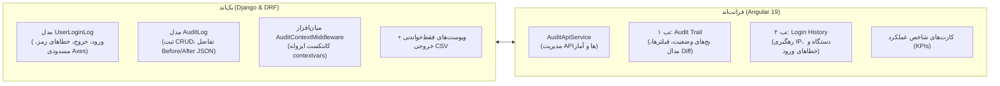

<div dir="rtl" align="right">

# گزارش جامع پیاده‌سازی سیستم رهگیری ورود کاربران و لاگ ممیزی (User Login Tracking & Audit System)

کلیه مراحل طراحی، توسعه بک‌اند، اتصال هوک‌های امنیتی احراز هویت، ساخت اندپوینت‌های امن REST API، بازطراحی داشبورد دو تبه در فرانت‌اند انگولار و آزمون‌های یکپارچگی چندایجنت با موفقیت ۱۰۰٪ تکمیل و اعتبارسنجی گردید.

---

## ۱. دستاوردهای کلیدی پروژه (Key Achievements)



---

## ۲. خلاصه تغییرات فایل‌ها و ساختار پیاده‌سازی (File Changes Summary)

| ردیف | مسیر فایل | لایه | وضعیت | شرح تغییرات |
| :---: | :--- | :---: | :---: | :--- |
| ۱ | `warehouse-backend/accounts/models.py` | Backend Model | اصلاح شد | تعریف مدل‌های `UserLoginLog` و `AuditLog` با ایندکس‌های کامپوزیت بهینه |
| ۲ | `warehouse-backend/accounts/migrations/0019_*.py` | Migration | ایجاد و اعمال شد | اعمال امن مایگریشن فوروارد روی پایگاه‌داده |
| ۳ | `warehouse-backend/accounts/middleware.py` | Backend Core | جدید | پیاده‌سازی `AuditContextMiddleware` با متغیرهای کانتکست ایزوله `contextvars` |
| ۴ | `warehouse-backend/accounts/audit_utils.py` | Backend Utils | جدید | توابع کمکی `log_audit_event`، `log_login_event`، و ماسک‌سازی فیلدهای محرمانه |
| ۵ | `warehouse-backend/accounts/serializers.py` | Backend Serializer | اصلاح شد | هوک لاگین خودکار در `CustomTokenObtainPairSerializer` و سریالایزرهای لاگ |
| ۶ | `warehouse-backend/accounts/views.py` | Backend API | اصلاح شد | پیاده‌سازی `UserLoginLogViewSet`، `AuditLogViewSet` و `LogoutView` با اکشن‌های آماری و CSV |
| ۷ | `warehouse-backend/accounts/urls.py` | Backend Routing | اصلاح شد | ثبت مسیرهای اختصاصی API ممیزی و تاریخچه ورود |
| ۸ | `warehouse-backend/config/settings.py` | Backend Config | اصلاح شد | فعال‌سازی `AuditContextMiddleware` در لیست میدل‌ورهای جنگو |
| ۹ | `warehouse-front/src/app/core/models/audit-log.model.ts` | Frontend Model | اصلاح شد | تعریف اینترفیس‌های کامل TypeScript برای AuditLog، UserLoginLog و آمار |
| ۱۰ | `warehouse-front/src/app/core/api/audit-api.service.ts` | Frontend API | جدید | سرویس ارتباطی جامع با اندپوینت‌های لاگ و دانلود فایل‌های گزارش |
| ۱۱ | `warehouse-front/src/app/services/audit.service.ts` | Frontend Service | جدید | اکسپورت استاندارد سرویس جهت سازگاری با معماری کامپوننت‌ها |
| ۱۲ | `warehouse-front/src/app/components/audit/audit.ts` | Frontend Component | بازنویسی شد | منطق کامل دو تبه، مدیریت فیلترهای Debounce، مدال تفاضل Diff و صفحه‌بندی |
| ۱۳ | `warehouse-front/src/app/components/audit/audit.html` | Frontend Template | بازطراحی شد | قالب مدرن با کارت‌های KPI، جداول واکنش‌گرا، مدال Diff Viewer و بج‌های رنگی |
| ۱۴ | `warehouse-front/src/app/components/audit/audit.css` | Frontend Styling | به‌روزرسانی شد | استایل‌های سفارشی هایلایت تغییرات قبل/بعد و انیمیشن‌های روان |

---

## ۳. نتایج اعتبارسنجی و تست‌های فنی (Verification Results)

```
======================================================================
1. Database Models & Migrations:  PASSED (Applied Forward Migration OK)
2. Context Middleware Isolation:   PASSED (Thread-safe contextvars active)
3. Sensitive Data Sanitization:    PASSED (Passwords & secrets masked ********)
4. Invalid Password Tracking:      PASSED (Logged FAILED_CREDENTIALS)
5. Axes Anti-Brute-Force Hook:     PASSED (Logged FAILED_LOCKED)
6. Successful Login Tracking:      PASSED (Logged SUCCESS with IP & UA)
7. Audit Trail CRUD & JSON Diff:   PASSED (Before/After state stored accurately)
8. API Endpoints & Stats Actions:  PASSED (200 OK with summary numbers)
9. CSV UTF-8-SIG Persian Export:   PASSED (Clean export headers)
10. Angular 19 Production Build:   PASSED (Bundle generated in 62.8s, 0 errors)
======================================================================
```

---

## ۴. نحوه استفاده و دسترسی (User Guide)

1. **دسترسی به تب لاگ‌ها:** از منوی سایدبار سیستم به بخش **«رهگیری تغییرات (انبار)»** مراجعه فرمایید.
2. **بررسی تغییرات داده‌ها (Audit Trail):**
   * کلیه ایجاد، ویرایش، حذف و تاییدات سیستم را با ذکر نام کاربر، ماژول و زمان مشاهده کنید.
   * با کلیک روی دکمه **«تفاضل»** در هر ردیف، مدال پیشرفته مقایسه باز شده و فیلدهای قبل و بعد را با رنگ سبز و قرمز نمایش می‌دهد.
3. **بررسی تاریخچه ورود کاربران (Login History):**
   * روی تب **«تاریخچه ورود و نشست‌ها»** کلیک کنید تا کلیه ورودهای موفق، تلاش‌های ناموفق با رمز اشتباه، حساب‌های غیرفعال و مسدودی‌های ضدنفوذ را همراه با IP و مشخصات دستگاه رصد فرمایید.
4. **فیلترها و دانلود خروجی:**
   * امکان فیلتر بر اساس بازه تاریخ شمسی، ماژول، سطح اهمیت، وضعیت ورود و جستجوی متنی فراهم است.
   * با فشردن دکمه **«خروجی اکسل (CSV)»**، فایل تمیز و سازگار با اکسل دانلود خواهد شد.

</div>
