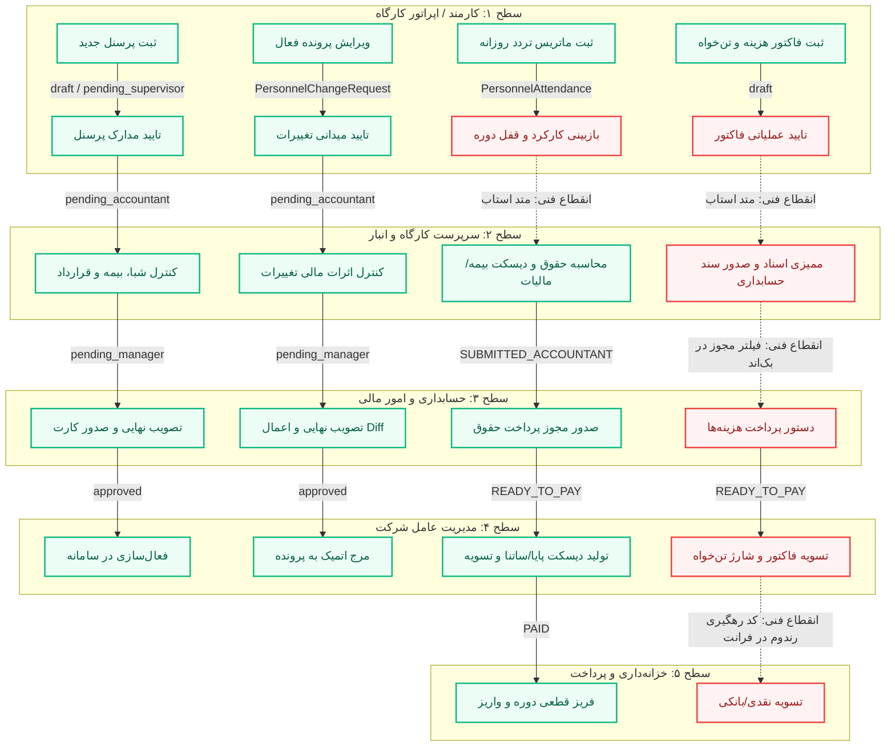

# طرح جامع و گزارش ممیزی عمیق چرخه گردش‌کار سازمانی (از کارمند تا مدیر)
## Comprehensive Audit & Architectural Plan: Employee-to-Manager End-to-End Workflows

> [!IMPORTANT]
> **هدف این سند:** بررسی کالبدشکافانه، بسیار عمیق و خط‌به‌خط تمامی فرایندهای سازمانی که از ثبت اولیه توسط کارمند (اپراتور) آغاز شده و با عبور از سرپرست و حسابدار به تصویب نهایی مدیر و تسویه خزانه‌داری ختم می‌شوند. این طرح شامل تحلیل ریشه‌ای ایرادات (Root Cause Analysis)، آسیب‌شناسی انقطاع‌های نرم‌افزاری و ارائه راهکارهای معماری استاندارد است. **هیچ کدی در این فاز تغییر نیافته و صرفاً گزارش تحلیلی و نقشه راه ارائه می‌گردد.**

---

## ۱. جدول ماتریس بررسی وضعیت چرخه‌های ۶گانه (Workflows Audit Matrix)

| ردیف | چرخه فرایندی | مسیر ثبت (کارمند) | مسیر تایید میدانی (سرپرست) | مسیر ممیزی مالی (حسابدار) | مسیر تصویب نهایی (مدیر) | مسیر تسویه (خزانه‌دار) | وضعیت اتصال فنی به دیتابیس |
| :---: | :--- | :--- | :--- | :--- | :--- | :--- | :---: |
| **۱** | **تعریف پرسنل جدید** | `employee-new-personnel` | `supervisor-new-profiles` | `finance-cartable` | `manager-approvals` | `profiles` | 🟢 **متصل کامل** (دوطرفه) |
| **۲** | **ویرایش پرونده پرسنل** | `employee-new-personnel` | `supervisor-new-profiles` | `finance-cartable` | `manager-approvals` (Diff) | اعمال به پرونده | 🟡 **متصل با اشکال در دیده‌شدن** |
| **۳** | **تعریف ناوگان و راننده** | `employee-new-vehicle` | `supervisor-new-profiles` | `accountant-fleet` | `manager-approvals` | بانک ناوگان | 🟢 **متصل کامل** (دوطرفه) |
| **۴** | **ویرایش مدارک ناوگان** | `employee-new-vehicle` | `supervisor-new-profiles` | `accountant-fleet` | `manager-approvals` (Diff) | اعمال به ناوگان | 🟡 **متصل با اشکال در دسترسی دکمه** |
| **۵** | **کارکرد و تردد ماهانه** | `employee-attendance` | `supervisor-attendance` (شبیه‌سازی) | `accountant-payroll` | `manager-approvals` (Work Periods) | `treasurer-disbursements` | 🔴 **انقطاع در تایید سرپرست** |
| **۶** | **فاکتورها و تن‌خواه** | `employee-invoices` / `petty-cash` | `supervisor-invoices` (شبیه‌سازی) | `accountant-invoices` (شبیه‌سازی) | `manager-dashboard` / `approvals` | `treasurer-invoices` (شبیه‌سازی) | 🔴 **انقطاع گسترده در لایه‌های تایید** |

---

## ۲. دیاگرام جریان داده و معماری گردش‌کار (Workflow Architecture Flow)

---

## ۳. تحلیل آسیب‌شناسی و کالبدشکافی ریشه‌ای ایرادات (Root Cause Analysis)

### 🔴 بحران اول: انقطاع در کامپوننت‌های ماژولار سرپرست، حسابدار و خزانه‌دار (The Mock Stub Disconnect)
در طی بازمهندسی ماژولار سامانه، مسیرهای جدیدی برای پرتال‌های سرپرست، حسابدار و خزانه‌دار تعریف شده‌اند؛ اما بررسی خط‌به‌خط سورس کد کامپوننت‌های فرانت‌اند نشان داد که چندین کامپوننت **صرفاً دارای کدهای شبیه‌سازی (Mock) با `setTimeout` و نمایش پیام موفقیت ساختگی (`toast.success`) هستند** و هیچ‌گونه ترافیک شبکه‌ای واقعی به بک‌اند ارسال نمی‌کنند:

1. **کامپوننت `SupervisorAttendanceHubComponent` (`supervisor-attendance.ts`):**
   * متغیر داده‌ها به صورت `items: any[] = [];` تعریف شده است.
   * متد `fetchAttendanceData()` با یک `setTimeout(200ms)` شمارنده‌ها را از روی آرایه خالی فیلتر می‌کند.
   * متدهای `approveSingle` و `rejectSingle` صرفاً یک Toast متنی نمایش می‌دهند و وضعیت رکورد را در دیتابیس آپدیت نمی‌کنند.
2. **کامپوننت `SupervisorFleetHubComponent` (`supervisor-fleet.ts`):**
   * کارکردهای ثبت‌شده ناوگان را از سرور دریافت نمی‌کند و متدهای تایید و رد آن فاقد هرگونه فراخوانی API هستند.
3. **کامپوننت `SupervisorInvoicesHubComponent` (`supervisor-invoices.ts`) و `SupervisorPettyCashHubComponent` (`supervisor-petty-cash.ts`):**
   * فاکتورهای ثبت‌شده توسط کارمندان را واکشی نمی‌کنند و متدهای تایید/رد کاملاً صوری هستند.
4. **کامپوننت `SupervisorPeriodLockHubComponent` (`supervisor-period-lock.ts`):**
   * دکمه «قفل و ارسال دوره به حسابداری» پس از ۵۰۰ میلی‌ثانیه پیام موفقیت می‌دهد، اما متد `periodWorkflowAction({ action: 'submit' })` را فراخوانی نمی‌کند. بنابراین دوره در دیتابیس همچنان `OPEN` باقی می‌ماند!
5. **کامپوننت `AccountantInvoicesHubComponent` و `AccountantPettyCashHubComponent`:**
   * متد `bookDocument()` تنها یک پیام ثبت سند صادر می‌کند و هیچ ارتیاطی با موتور ثبت اسناد دفتر کل (`GL / JournalEntry`) ندارد.
6. **کامپوننت `TreasurerInvoicesComponent` (`treasurer-invoices.ts`):**
   * برای تسویه فاکتور یا شارژ تن‌خواه، یک کد ساختگی با فرمول `'BNK-' + Math.floor(...)` تولید می‌کند و فقط آرایه داخل حافظه جاوااسکریپت را تغییر می‌دهد؛ در نتیجه با رفرش صفحه همه تغییرات از بین می‌روند!

---

### 🟡 بحران دوم: دوگانگی معماری بک‌اند (Divergence: Custom ViewSet Actions vs Unified 5-Tier Cartable)
در بک‌اند جنگو دو سیستم موازی برای پیشبرد گردش‌کار وجود دارد که کاملاً هماهنگ نیستند:
* **مسیر الف (اکشن‌های منفرد ViewSet):** مانند `approve_supervisor` و `approve_finance` در `PersonnelProfileViewSet` و `PersonnelChangeRequestViewSet`. این اکشن‌ها تغییرات را مستقیماً روی فیلدهای متنی اعمال می‌کنند و الزامات `workflow_engine.py` را دور می‌زنند.
* **مسیر ب (موتور یکپارچه کارتابل ۵ سطحی `cartable_views.py`):** شامل `SupervisorCartableAPIView`، `AccountantCartableAPIView` و `ManagerCartableAPIView` که با تابع اتمیک `advance_workflow_step()` و با قفل بدبینانه `select_for_update()` کار می‌کنند.
* **پیامد:** 
  1. در ماژول فاکتورها (`ExpenseInvoiceViewSet`)، متد `perform_update` به طور صلب هرگونه ارتقای وضعیت فراتر از `pending_supervisor` توسط کاربران غیر Superuser را بلاک می‌کند! حتی سرپرست و حسابدار مجاز نیز نمی‌توانند فاکتور را جلو ببرند!
  2. مدل‌های `ExpenseInvoice` و `PettyCashTransaction` در دیکشنری مدل‌های موتور کارتابل (`_get_target_instance` در `cartable_views.py`) تعریف نشده‌اند.

---

### 🟡 بحران سوم: مدفون ماندن «درخواست‌های ویرایش» در برابر «پرسنل جدید» (The Visibility Blindspot)
* **ریشه اشکال:** در تمام کارتابل‌ها (سرپرست، مالی، مدیر)، تب پیش‌فرض «پرسنل جدید» است. وقتی کارمند یک پرسنل موجود (مانند احمد حسینی) را ویرایش می‌کند، سیستم به درستی یک رکورد `PersonnelChangeRequest` ایجاد می‌کند تا اطلاعات اصلی تا زمان تایید حفظ شود.
* **مشکل کاربری:** سرپرست یا مدیر وقتی وارد کارتابل می‌شوند، تب ۱ را می‌بینند که خالی است (چون فرد جدیدی ثبت نشده). تب ویرایش‌ها (تب ۳) به دلیل Lazy-Loading شمارنده‌اش صفر یا نامرئی است؛ بنابراین مسئول تصور می‌کند هیچ کاری برای انجام دادن وجود ندارد.

---

### 🟡 بحران چهارم: عدم اجرای عبور هوشمند (Auto-Pass) در چرخه زنده
* در `workflow_engine.py` متد پیشرفته `process_creation_with_auto_pass()` طراحی شده است تا اگر مدیر یا حسابدار رکوردی را ثبت کرد، سیستم نیازمند تایید سطوح پایین‌تر نباشد و مستقیماً به سطح متناظر برود.
* **ایراد:** این متد در هیچ یک از متدهای `perform_create` ویوست‌ها در `views.py` صدا زده نشده است و عملاً یک کد بدون استفاده (Dead Code) باقی مانده است.

---

### 🟡 بحران پنجم: اتلاف تاریخچه در رد و بازنگری پرونده‌ها (Lack of Audit History Log)
* فیلد `rejection_reason` یک رشته متنی منفرد روی رکوردهای پرسنل، ناوگان و درخواست‌ها است.
* اگر سرپرست یک پرونده را بازنگری بزند، سپس اپراتور اصلاح کند و مجدداً حسابدار آن را بازنگری کند، دلیل قبلی بازنویسی (Overwrite) می‌شود و تاریخچه ممیزی مکاتبات بین کارمند، سرپرست و مدیر ثبت پایدار نمی‌شود.

---

## ۴. طرح پیشنهادی و راهکارهای جامع معماری (Proposed Architectural Solutions)

### فاز ۱: اتصال واقعی کلیه کامپوننت‌های فرانت‌اند به APIهای بک‌اند (End-to-End API Integration)
1. **ماژول کارکرد سرپرست (`supervisor-attendance.ts`):**
   * حذف آرایه ساختگی `items = []` و اتصال به `getAttendanceMatrix` و `getAttendanceMonthlySummary`.
   * افزودن متد تایید دسته‌جمعی روزانه کارکرد بخش توسط سرپرست.
2. **ماژول قفل دوره سرپرست (`supervisor-period-lock.ts`):**
   * پیاده‌سازی متد واقعی فراخوانی `api.periodWorkflowAction({ action: 'submit' })` به جای `setTimeout`.
3. **ماژول‌های فاکتور و تن‌خواه سرپرست و حسابدار:**
   * اتصال کامل `supervisor-invoices` و `accountant-invoices` به `api.getExpenseInvoices({ status: ... })`.
   * افزودن اکشن‌های تایید/رد فاکتور و صدور آرتیکل سند.
4. **ماژول خزانه‌داری فاکتورها (`treasurer-invoices.ts`):**
   * حذف کد تصادفی `Math.random()` و اتصال به سرویس واقعی پرداخت فاکتور با ثبت شماره تراکنش بانکی و فایل پیوست فیش واریز.

### فاز ۲: یکپارچه‌سازی کامل موتور گردش‌کار در بک‌اند (Workflow Engine Unification)
1. افزودن مدل‌های `ExpenseInvoice` و `PettyCashTransaction` به موتور ماشین حالت ۵ سطحی (`WorkflowTiers` و `cartable_views.py`).
2. حذف محدودیت انحصاری سوپریوزر در `ExpenseInvoiceViewSet.perform_update` و جایگزینی آن با متد استاندارد `advance_workflow_step(instance, user, is_financial=True)`.
3. فراخوانی یکپارچه `process_creation_with_auto_pass()` در تمام متدهای `perform_create` پرسنل، ناوگان، فاکتور و تن‌خواه.

### فاز ۳: معماری ممیزی پایدار مکاتبات و رد/بازنگری (Workflow Audit Trail Architecture)
* ایجاد مدل اتمیک `WorkflowAuditLog`:
  * فیلدهای: `content_type`, `object_id`, `actor_user`, `from_stage`, `to_stage`, `action` (تایید / بازنگری / رد), `reason`, `created_at`.
  * نمایش تایم‌لاین کامل بازنگری‌ها در پنجره Diff کارتابل مدیر و سرپرست.

### فاز ۴: بهینه‌سازی UX کارتابل‌ها و بارگذاری زنده شمارنده‌ها (Command Center Standardization)
1. بارگذاری مشتاقانه (Eager Loading) تمام بج‌های کارتابل‌ها در متد `ngOnInit` تا هیچ تبی با شمارنده صفر کاذب نمایش داده نشود.
2. برجسته‌سازی خودکار تب‌های دارای مورد معلق (مثلاً هدایت خودکار مدیر به تب ۳ در صورت وجود درخواست‌های ویرایش معلق).
3. اعمال استاندارد Unified Sticky Command Center مطابق ضوابط پروژه برای تمام ۶ پرتال فرانت‌اند.

---

## ۵. برنامه زمان‌بندی و ترتیب فازهای اجرایی (Implementation Phasing)

| فاز | شرح اقدامات | خروجی قابل لمس | درجه فوریت |
| :---: | :--- | :--- | :---: |
| **فاز ۱** | احیای کامپوننت‌های استاب سرپرست و حسابدار (اتصال واقعی به دیتابیس) | داده‌های زنده و دکمه‌های تایید واقعی در پرتال سرپرست و حسابدار | 🔴 بسیار بالا (بحرانی) |
| **فاز ۲** | اصلاح بک‌اند فاکتورها، تن‌خواه و ادغام در `workflow_engine` | قابلیت تایید چندسطحی فاکتورها تا مدیر و خزانه‌دار | 🔴 بسیار بالا (بحرانی) |
| **فاز ۳** | فعال‌سازی عبور هوشمند (Auto-Pass) و لاگ پایدار ممیزی (Audit Trail) | رفع کاغذبازی برای نقش‌های بالا و ثبت تاریخچه رد/اصلاح | 🟡 بالا |
| **فاز ۴** | بازطراحی هدرها و تجربه کاربری بر اساس ضوابط Sticky Command Center | رابط کاربری روان، بدون خطای دید و هماهنگ در کل سامانه | 🟢 نرمال |

