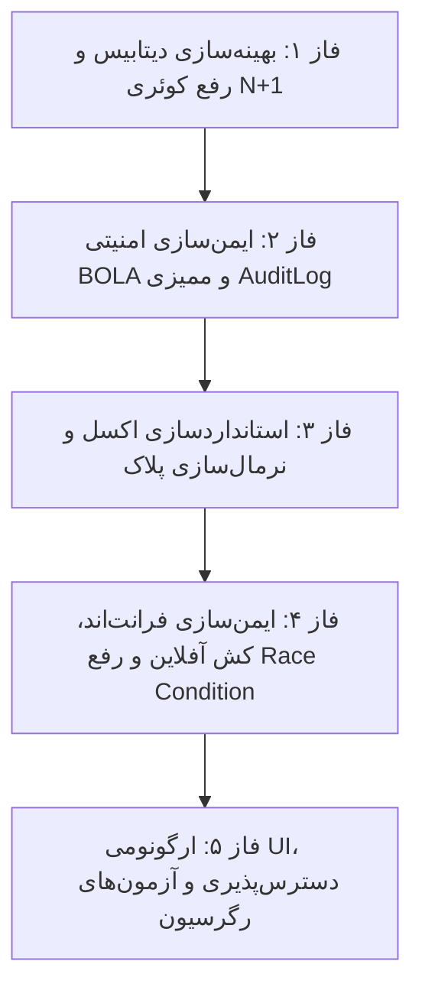

<div dir="rtl" align="right">

# طرح جامع و تفصیلی رفع کلیه ایرادات منطقی، بک‌اند و فرانت‌اند ناوگان جدید
## گزارش کاووش عمیق (Deep Architectural Audit) و برنامه اقدام فازبندی‌شده صفحه `/app/finance/employee-new-vehicle`

> [!IMPORTANT]
> **وضعیت سند:** طرح و برنامه اقدام اجرایی (Comprehensive Audit & Remedial Plan).
> این مستند حاصل ممیزی عمیق و چندلایه کدهای بک‌اند (Django ORM, ViewSets, Serializers, URLs, Tests) و فرانت‌اند (Angular Component, Template, Reactive RxJS, API Service) بوده و کلیه ایرادات ساختاری، حفره‌های امنیتی BOLA، گلوگاه‌های عملکردی N+1، ریسک‌های اتلاف داده و کاستی‌های ارگونومی را همراه با تسک‌های گام‌به‌گام پوشش می‌دهد.
> **قانون قطعی:** طبق دستور صریح کاربر، هیچ کدی در برنامه تغییر نکرده و صرفاً این طرح تفصیلی تدوین گردیده است.

---

## ۱. جدول ماتریس جامع کلیه ایرادات کشف‌شده (Comprehensive Defect Matrix)

| ردیف | شناسه نقص | لایه معماری | شرح دقیق ایراد فنی و منطقی | سطح ریسک | پیامد عملیاتی و امنیتی | راهکار پیشنهادی و تسک متناظر |
| :---: | :---: | :---: | :--- | :---: | :--- | :--- |
| **۱** | **PERF-01** | بک‌اند / ORM | **انفجار کوئری N+1 در دریافت لیست خودروها:** وجود ۸ فیلد `SerializerMethodField` و عدم استفاده از `select_related` برای تاییدکنندگان و `prefetch_related` برای `change_requests` | 🔴 بحرانی | در لیست ۵۰ خودرو، بیش از ۴۰۰ کوئری مجزا به دیتابیس ارسال شده و بار سرور را شدیداً افزایش می‌دهد. | اصلاح `get_queryset` با `select_related` ۷ رابطه کاربری و بخش/پروژه و پری‌فچ درخواست‌های تغییرات معلق. |
| **۲** | **SEC-01** | بک‌اند / امنیت | **حفره BOLA/IDOR در `VehicleChangeRequestViewSet`:** فاقد فیلتر قلمرو بخش (`UserSectionAssignment`) در متد `get_queryset` | 🔴 بحرانی | هر کاربر احراز هویت‌شده می‌تواند درخواست‌های تغییرات و ارقام مالی ناوگان کل پروژه‌های شرکت را بخواند. | اعمال گارد قلمرو بخش‌ها روی `VehicleChangeRequestViewSet.get_queryset` مشابه مدل اصلی. |
| **۳** | **DATA-01** | بک‌اند / داده | **امکان ثبت پلاک تکراری به دلیل عدم نرمال‌سازی فضا و ارقام فارسی:** پلاک‌های با/بدون فاصله یا ارقام فارسی یکتایی را دور می‌زنند | 🔴 بحرانی | ثبت چندباره یک خودرو با نگارش‌های مختلف پلاک، ایجاد پرونده‌های موازی و خطای تسویه و کارکرد. | نرمال‌سازی اجباری و یکدست‌سازی پلاک به حروف و ارقام استاندارد بدون فاصله در متد `clean` مدل و سریالایزر. |
| **۴** | **DATA-02** | فرانت‌اند / آفلاین | **نقض اصل «داده هرگز نباید از بین برود» در خطای شبکه:** عدم ذخیره موقت فرم در IndexedDB/LocalStorage در زمان قطعی اینترنت یا خطای سرور | 🔴 بحرانی | با کوچک‌ترین اختلال اینترنت یا رفرش ناخواسته صفحه، تمام اطلاعات تایپ‌شده کاربر کلاً پاک می‌شود. | پیاده‌سازی مکانیزم ذخیره موقت پیش‌نویس محلی (Local Draft Cache) و بازگردانی خودکار پس از رفرش. |
| **۵** | **LOGIC-01** | بک‌اند / اکسل | **فقدان فیلدهای مالک خودرو در تمپلیت و ایمپورت اکسل:** نادیده گرفتن `is_driver_owner` و مشخصات هویتی مالک در دانلود و ایمپورت اکسل | 🟠 بالا | در بارگذاری دسته‌جمعی صدها خودرو، تمام اطلاعات مالکینی که راننده نیستند حذف شده و به نام راننده می‌نشیند. | افزودن ستون‌های مالک به فایل تمپلیت اکسل شرکت و پارس کردن هوشمند آنها در متد `import_excel`. |
| **۶** | **LOGIC-02** | بک‌اند / اکسل | **بازنویسی خاموش در صورت وجود پلاک تکراری درون یک فایل اکسل:** عدم هشدار یا مدیریت ردیف‌های تکراری در یک شیت | 🟠 بالا | اگر در فایل اکسل یک پلاک دو بار تکرار شده باشد، ردیف دوم بدون اطلاع کاربر ردیف اول را بازنویسی می‌کند. | اعتبارسنجی یکتایی درون‌شیت در فاز dry-run و بازگرداندن خطای ردیف تکراری در گزارش اکسل. |
| **۷** | **LOGIC-03** | بک‌اند / مدل | **فقدان گزینه «لیفتراک» در Choices مدل جنگو:** مغایرت بین انواع خودرو در فرانت‌اند و فیلد `VEHICLE_TYPE_CHOICES` مدل | 🟠 بالا | انتخاب گزینه لیفتراک از فرانت‌اند در بک‌اند به عنوان مقدار نامعتبر یا فاقد عنوان فارسی ترجمه می‌شود. | افزودن رسمی `('forklift', 'لیفتراک / بالابر کارگاهی')` به مدل جنگو و اعمال مایگریشن. |
| **۸** | **SEC-02** | بک‌اند / ممیزی | **عدم ثبت رخداد در `AuditLog` در چرخه تاییدات و رد پرونده:** تایید سرپرست، مالی و مدیر در سیستم لاگ مالی ثبت نمی‌شود | 🟠 بالا | نبود ردپای غیرقابل انکار از تاییدکنندگان، IP و زمان دقیق در ماژول حسابداری و حسابرسی سازمانی. | اتصال مستقیم اکشن‌های تایید/رد/عودت به سرویس `AuditLog.log_action` ماژول `accounts`. |
| **۹** | **SEC-03** | بک‌اند / امنیت | **امکان رد درخواست تغییرات با توضیحات خالی در `VehicleChangeRequestViewSet`:** نبود گارد الزامی بودن دلیل رد | 🟡 متوسط | مدیر یا سرپرست می‌تواند درخواست تغییرات را بدون هیچ توضیحی رد کند و کاربر سردرگم بماند. | اعتبارسنجی الزامی بودن `reason` در متد `reject` کنترلر `VehicleChangeRequestViewSet`. |
| **۱۰** | **SEC-04** | بک‌اند / سریالایزر | **عدم تعریف `has_pending_changes` در `read_only_fields` سریالایزر:** باز بودن فلگ سیستمی در برابر تغییر مستقیم | 🟡 متوسط | کلاینت مخرب می‌تواند با ارسال فلگ به صورت دستی قفل تغییرات معلق را دور بزند. | افزودن `has_pending_changes` به لیست `read_only_fields` در `VehicleDriverProfileSerializer`. |
| **۱۱** | **STATE-01** | فرانت‌اند / واکنش‌گرایی | **Race Condition میان لود نامتقارن بخش‌ها و QueryParams آدرس:** بازنشانی ناخواسته بخش انتخابی به بخش اول | 🟠 بالا | اگر پارامتر `section_id` قبل از اتمام پاسخ وب‌سرویس بخش‌ها برسد، فیلتر کاربر نادیده گرفته شده و ریست می‌شود. | استفاده از `combineLatest` یا زنجیره‌سازی RxJS جهت هماهنگ‌سازی قطعی واکشی بخش و کوئری‌آدرس. |
| **۱۲** | **LOGIC-04** | بک‌اند / مدل | **نبود محدودیت پایگاه‌داده برای نرخ‌های منفی:** عدم وجود DB Check Constraint برای `default_service_rate` | 🟡 متوسط | احتمال ثبت نرخ منفی در کرایه و ایجاد باگ در محاسبات مالی و فاکتورهای تسویه رانندگان. | افزودن `CheckConstraint(check=Q(default_service_rate__gte=0))` به مدل `VehicleDriverProfile`. |
| **۱۳** | **VALID-01** | بک‌اند / سریالایزر | **فقدان اعتبارسنجی الگوی شماره تلفن راننده و مالک:** قبول هر رشته متنی دلخواه تا ۲۰ کاراکتر | 🟡 متوسط | ذخیره شماره‌های نامعتبر در پرونده راننده و بروز اشکال در ارسال پیامک اطلاع‌رسانی یا تماس انباردار. | اعمال اعتبارسنجی Regex شماره همراه معتبر ایران (`^09\d{9}$`) در سطح سریالایزر جنگو. |
| **۱۴** | **CONCUR-01** | بک‌اند / همزمانی | **نبود قفل ردیف (`select_for_update`) در ثبت درخواست تغییرات:** ریسک ثبت همزمان دو درخواست تغییرات معلق | 🟡 متوسط | اگر دو اپراتور همزمان فرم ویرایش یک خودرو مصوب را ثبت کنند، دو رکورد تغییرات متناقض ایجاد می‌شود. | استفاده از `transaction.atomic()` و `select_for_update()` روی خودرو قبل از ایجاد درخواست تغییرات. |
| **۱۵** | **LEAK-01** | فرانت‌اند / مموری | **نشت اشتراک‌های RxJS در توابع کمکی:** عدم لغو اشتراک سرچ پرسنل و متدهای اکسل در زمان خروج از صفحه | 🟡 متوسط | مصرف حافظه رم مرورگر و اجرای متدهای پس‌زمینه بعد از ترک صفحه توسط کاربر. | اعمال عملگر `takeUntilDestroyed()` روی کلیه اشتراک‌های درون‌خطی کامپوننت. |
| **۱۶** | **UI-01** | فرانت‌اند / ارگونومی | **عدم انتقال خودکار فوکوس (Auto-Tab) بین ۴ تکه پلاک:** نیاز به کلیک و تب دستی مکرر بین فیلدهای پلاک | 🟡 متوسط | کندی محسوس در ورود دستی اطلاعات ده‌ها پلاک و احساس نارضایتی در اپراتورهای انبار. | پیاده‌سازی ارجاع خودکار به تکه بعدی پلاک پس از تکمیل ظرفیت ارقام هر بخش. |
| **۱۷** | **UI-02** | فرانت‌اند / موبایل | **پنهان ماندن مشخصات مالک در نمای کارتی موبایل:** عدم نمایش نام و کدملی مالک در صفحات زیر ۷۶۸ پیکسل | 🟡 متوسط | انباردار در موبایل نمی‌تواند تشخیص دهد خودرو متعلق به راننده است یا مالک غیر. | افزودن باکس اطلاعات مالک در کارت‌های ریسپانسیو موبایل در صورت عدم تطابق راننده و مالک. |
| **۱۸** | **UI-03** | فرانت‌اند / تمپلیت | **عدم فرمت‌بندی مبالغ و کلیدهای بولی در مودال مقایسه (Diff Viewer):** نمایش اعداد خام و کلمات انگلیسی | 🟡 متوسط | کاربر نرخ‌های جدید را بدون جداکننده سه‌رقمی و مقادیر بولی را به شکل `true/false` مشاهده می‌کند. | فرمت‌بندی هوشمند مقادیر پولی با جداکننده و تبدیل بولی‌ها به «بله/خیر» در مودال مقایسه. |
| **۱۹** | **UI-04** | فرانت‌اند / دسترس‌پذیری | **فقدان مشخصه‌های دسترس‌پذیری (a11y) و Trap فوکوس در مودال‌ها:** عدم وجود `role="dialog"` و برچسب‌های ARIA | 🟢 پایین | عدم انطباق با استانداردهای نرم‌افزاری مدرن و خارج شدن کلید Tab از مودال به پشت صفحه. | افزودن اتربیوت‌های `role="dialog"`، `aria-modal="true"` و کنترل چرخه کلید Tab درون مودال. |
| **۲۰** | **UI-05** | فرانت‌اند / ارگونومی | **عدم تمرکز مجدد موس روی اینپوت بعد از پاک کردن جستجو (`clearSearch`):** نیاز به کلیک مجدد روی کادر | 🟢 پایین | ایجاد وقفه کوچک در کاربری سریع حین جستجوهای پیاپی ناوگان. | فوکوس خودکار روی المان جستجو بلافاصله پس از فشرده شدن دکمه پاکسازی. |

---

## ۲. کالبدشکافی تفصیلی ۵ نقص بسیار بحرانی (Deep Architectural Drill-Down)

### نقص بحرانی ۱: بحران عملکرد و انفجار کوئری N+1 در دریافت فهرست ناوگان (PERF-01)
- **محل در کد:** `warehouse-backend/personnel/views.py:1000` و `warehouse-backend/personnel/serializers.py:305-382`
- **تحلیل فنی:**
  کنترلر `VehicleDriverProfileViewSet` کوئری را به این شکل تعریف کرده است:
  ```python
  queryset = VehicleDriverProfile.objects.all().select_related('user')
  ```
  اما در سریالایزر `VehicleDriverProfileSerializer`، برای هر خودرو فیلدهای زیر متد اختصاصی اجرا می‌کنند:
  1. `obj.supervisor_approved_by`
  2. `obj.accountant_approved_by`
  3. `obj.manager_approved_by`
  4. `obj.treasury_paid_by`
  5. `obj.revision_requested_by`
  6. `obj.auto_passed_by`
  7. `obj.created_by`
  8. `obj.change_requests.filter(status__in=[...]).order_by('-created_at').first()`
- **اثر تخریبی:** با داشتن فقط ۱۰۰ خودرو در یک بخش، واکشی جدول منجر به ارسال **۸۰۱ کوئری به ازای هر درخواست HTTP** به پایگاه داده می‌شود! در زمان همزمانی کاربران، این امر موجب قفل شدن کانکشن‌پول دیتابیس و افت شدید سرعت سیستم خواهد شد.
- **راهکار قطعی:**
  ```python
  def get_queryset(self):
      pending_cr_prefetch = Prefetch(
          'change_requests',
          queryset=VehicleChangeRequest.objects.filter(
              status__in=['pending_supervisor', 'pending_accountant', 'pending_manager', 'supervisor_approved', 'accountant_approved', 'manager_approved']
          ).order_by('-created_at'),
          to_attr='prefetched_pending_cr'
      )
      return super().get_queryset().select_related(
          'user', 'section', 'project',
          'supervisor_approved_by', 'accountant_approved_by', 'manager_approved_by',
          'treasury_paid_by', 'revision_requested_by', 'auto_passed_by', 'created_by'
      ).prefetch_related(pending_cr_prefetch)
  ```

---

### نقص بحرانی ۲: حفره امنیتی دسترسی به تغییرات ناوگان کل پروژه‌ها (SEC-01 - BOLA/IDOR)
- **محل در کد:** `warehouse-backend/personnel/views.py:1883-1891`
- **تحلیل فنی:**
  در حالی که در `VehicleDriverProfileViewSet` فیلتر ایزولاسیون قلمرو بخش با بررسی `UserSectionAssignment` اعمال شده، کنترلر `VehicleChangeRequestViewSet` کاملاً بدون محافظ رها شده است:
  ```python
  def get_queryset(self):
      qs = super().get_queryset()
      status_filter = self.request.query_params.get('status')
      if status_filter:
          qs = qs.filter(status=status_filter)
      vehicle_id = self.request.query_params.get('vehicle_id')
      if vehicle_id:
          qs = qs.filter(vehicle_id=vehicle_id)
      return qs
  ```
- **اثر تخریبی:** هر کاربر عادی که به سامانه لاگین کرده باشد، می‌تواند با ارسال یک درخواست ساده GET به اندپوینت `/api/personnel/vehicle-change-requests/`، لیست تمامی تغییرات معلق، مبالغ جدید کرایه‌ها، شماره شبا و هویت مالکین کل ناوگان در تمامی پروژه‌های حساس کشور را به طور کامل مشاهده کند.
- **راهکار قطعی:** اعمال گارد قلمرو مبتنی بر `UserSectionAssignment` روی مدل `vehicle__section_id` در `get_queryset`.

---

### نقص بحرانی ۳: باگ دور زدن یکتایی پلاک ملی با فضاها و ارقام فارسی (DATA-01)
- **محل در کد:** `warehouse-backend/personnel/models.py:847` و `serializers.py`
- **تحلیل فنی:**
  فیلد `plate_number` دارای `unique=True` در سطح جدول PostgreSQL است. اما مکانیزم یکسان‌سازی کاراکترها در سطح مدل و سریالایزر وجود ندارد.
  اگر کاربری پلاک را به صورت `۱۲الف۳۴۵ایران۶۳` ثبت کند و کاربر دیگری در اکسل یا فرم `12 الف 345 ایران 63` وارد کند، دیتابیس هر دو را به عنوان دو رشته کاملاً متفاوت می‌شناسد و هر دو را ذخیره می‌کند!
- **اثر تخریبی:** در سیستم تردد و فاکتورها، برای یک خودرو فیزیکی واحد، دو پرونده مالیاتی و دو کارکرد مجزا ثبت می‌شود که موجب خطای فاحش در تسویه کارکرد ماهانه و دیسکت پایا می‌گردد.
- **راهکار قطعی:**
  ایجاد یک تابع نرمال‌سازی کانونیکال پلاک در بک‌اند و فرانت‌اند که پلاک را همیشه به ساختار واحد بدون فاصله و با ارقام انگلیسی استاندارد ذخیره کند (مانند `12الف345ایران63`) و برای نمایش بصری از فیلد کمکی یا پایپ استفاده کند.

---

### نقص بحرانی ۴: اتلاف داده در قطع ناگهانی ارتباط (DATA-02 - نقض خط‌مشی صفر دیتالاس)
- **محل در کد:** `warehouse-front/src/app/components/finance/employee/employee-new-vehicle/employee-new-vehicle.ts:805-870`
- **تحلیل فنی:**
  هنگامی که کاربر فرم طولانی مشخصات خودرو، راننده، شماره شبا، اطلاعات مالک و نرخ‌ها را پر می‌کند و دکمه «ذخیره» یا «ارسال» را می‌فشارد، در صورت قطع لحظه‌ای تونل کلودفلر یا بروز خطای ۵۲۰/۵۳۰، سیستم صرفاً یک پیام خطای موقت نمایش می‌دهد و هیچ کپی از فرم ذخیره نمی‌کند. اگر کاربر صفحه را رفرش کند، تمام اطلاعات از دست می‌رود.
- **راهکار قطعی:**
  اتصال فرم به سرویس کش موقت فرم‌ها با کلید `draft_vehicle_${sectionId}` به طوری که حین تایپ ذخیره شده و پس از ثبت موفق پاکسازی گردد.

---

### نقص بحرانی ۵: فیلتر نشدن و عدم انطباق قالب و ایمپورت اکسل با فیلدهای مالک (LOGIC-01)
- **محل در کد:** `warehouse-backend/personnel/views.py:1346` و `views.py:1426`
- **تحلیل فنی:**
  متدهای `download_template` و `import_excel` در بک‌اند فقط ستون‌های راننده را می‌شناسند. ستون‌های `مالک شخص راننده است`، `نام مالک`، `کد ملی مالک` و `شماره همراه مالک` در اکسل تعریف نشده‌اند.
- **اثر تخریبی:** ورود دسته‌جمعی از فایل اکسل همواره مالک را شخص راننده در نظر می‌گیرد و امکان تعریف ناوگان استیجاری با مالک ثالث را از بین می‌برد.

---

## ۳. برنامه اقدام فازبندی‌شده اصلاحی (5-Phase Remedial Action Plan)



---

### فاز ۱: بهینه‌سازی دیتابیس و رفع گلوگاه‌های عملکردی (Database & ORM Layer)
* **هدف:** حذف کامل کوئری‌های N+1، اصلاح Choices و افزودن قیدهای کنترلی پایگاه داده.
- [ ] <!-- id: AUD.1.1 --> بهینه‌سازی متد `get_queryset` در `VehicleDriverProfileViewSet` با افزودن `select_related` برای تمامی FKهای تاییدکننده و بخش/پروژه.
- [ ] <!-- id: AUD.1.2 --> پیاده‌سازی `Prefetch` اختصاصی برای واکشی درخواست‌های تغییرات معلق (`change_requests`) در یک کوئری مستقل و سبک.
- [ ] <!-- id: AUD.1.3 --> افزودن قید دیتابیسی `CheckConstraint(check=Q(default_service_rate__gte=0))` جهت پیشگیری از ثبت نرخ منفی.
- [ ] <!-- id: AUD.1.4 --> افزودن گزینه `'forklift'` به `VEHICLE_TYPE_CHOICES` در مدل `VehicleDriverProfile` و استخراج مایگریشن جنگو.
- [ ] <!-- id: AUD.1.5 --> تعریف `has_pending_changes` به عنوان فیلد فقط‌خواندنی (`read_only_fields`) در `VehicleDriverProfileSerializer`.

---

### فاز ۲: ایمن‌سازی امنیتی BOLA/IDOR و ثبت لاگ ممیزی (Security & Auditing Layer)
* **هدف:** مسدودسازی نشت داده در درخواست‌های تغییرات و ایجاد ردپای غیرقابل انکار مالی.
- [ ] <!-- id: AUD.2.1 --> اعمال محدودسازی دسترسی بر پایه `UserSectionAssignment` در متد `get_queryset` کلاس `VehicleChangeRequestViewSet` جهت رفع حفره BOLA.
- [ ] <!-- id: AUD.2.2 --> اجباری کردن فیلد `reason` در متد `reject` کلاس `VehicleChangeRequestViewSet` با بازگرداندن خطای ۴۰۰ در صورت خالی بودن.
- [ ] <!-- id: AUD.2.3 --> اتصال اکشن‌های `approve_supervisor`، `approve_finance`، `approve_manager`، `reject` و `request_revision` به سیستم لاگ ممیزی `accounts.models.AuditLog`.
- [ ] <!-- id: AUD.2.4 --> استفاده از `select_for_update()` درون ترنزکشن متد `update` هنگام بررسی و ثبت `VehicleChangeRequest` جهت مقابله با همزمانی مسابقه‌ای.

---

### فاز ۳: استانداردسازی اکسل و یکپارچگی پلاک خودرو (Excel & Plate Normalization)
* **هدف:** ورود و خروج کامل اطلاعات مالکین و جلوگیری از چندگانگی پلاک‌های مشابه.
- [ ] <!-- id: AUD.3.1 --> پیاده‌سازی تابع کانونیکال نرمال‌سازی پلاک در بک‌اند جهت حذف فضاها و تبدیل اعداد فارسی به انگلیسی قبل از اعتبارسنجی یکتایی (`unique`).
- [ ] <!-- id: AUD.3.2 --> به‌روزرسانی قالب رسمی ۲ سطری اکسل در `download_template` با افزودن ستون‌های مشخصات مالک خودرو.
- [ ] <!-- id: AUD.3.3 --> اصلاح متد `import_excel` جهت خواندن ستون‌های مالکیت، نام مالک، کدملی مالک و تلفن مالک و ذخیره در دیتابیس.
- [ ] <!-- id: AUD.3.4 --> افزودن اعتبارسنجی یکتایی درون‌شیت در متد `import_excel` جهت جلوگیری از بازنویسی خاموش سطرهای تکراری.
- [ ] <!-- id: AUD.3.5 --> به‌روزرسانی متد `export_excel` با گنجاندن مشخصات کامل مالک و نوع مالکیت.

---

### فاز ۴: ایمن‌سازی منطق فرانت‌اند، کش آفلاین و همگام‌سازی (Frontend Logic & State)
* **هدف:** تضمین عدم اتلاف داده در قطعی شبکه و رفع تداخل QueryParams با واکشی داده‌ها.
- [ ] <!-- id: AUD.4.1 --> حل Race Condition واکشی بخش‌ها در `ngOnInit` با استفاده از عملگرهای واکنشی `combineLatest` به جای فراخوانی‌های موازی مستقل.
- [ ] <!-- id: AUD.4.2 --> پیاده‌سازی سیستم ذخیره‌سازی موقت فرم در صورت بروز خطای شبکه یا قطعی تونل (ضمانت عدم اتلاف داده).
- [ ] <!-- id: AUD.4.3 --> مدیریت لغو اشتراک‌های RxJS در توابع جستجوی پرسنل و اکسل با استفاده از `takeUntilDestroyed()`.
- [ ] <!-- id: AUD.4.4 --> افزودن قابلیت دکمه تک‌کلیک «بارگذاری خودکار مشخصات از پرسنل» در زمان کشف کدملی تطبیق‌یافته راننده.
- [ ] <!-- id: AUD.4.5 --> محافظت در برابر ارسال مکرر فرم با فیلتر فشردن کلید Enter در زمان فعال بودن پروسه ثبت (`isSaving`).

---

### فاز ۵: ارگونومی تعاملی، دسترسی‌پذیری و پوشش آزمون (Ergonomics, a11y & Tests)
* **هدف:** ارتقای سطح ارگونومی کاربر، بهبود نمایش موبایل و آزمون‌های جامع رگرسیون.
- [ ] <!-- id: AUD.5.1 --> پیاده‌سازی قابلیت Auto-Advance و Focus Switching خودکار بین ۴ بخش ورودی پلاک خودرو.
- [ ] <!-- id: AUD.5.2 --> تکمیل کارت‌های نمای موبایل جهت نمایش کامل مشخصات مالک در صورت غیرمالک بودن راننده.
- [ ] <!-- id: AUD.5.3 --> اصلاح فرمت‌بندی مقادیر پولی و مقادیر بولی (بله/خیر) در مودال مقایسه تغییرات معلق (Diff Viewer).
- [ ] <!-- id: AUD.5.4 --> افزودن اتربیوت‌های ARIA و هدایت فوکوس کیبورد درون مودال‌ها طبق ضوابط دسترسی‌پذیری وب.
- [ ] <!-- id: AUD.5.5 --> نگارش آزمون‌های واحد خودکار در جنگو (`tests_vehicle_cycle.py`) برای پوشش سناریوهای N+1، BOLA و نرمال‌سازی پلاک.
- [ ] <!-- id: AUD.5.6 --> نگارش آزمون‌های DOM و رفتار کامپوننت با Vitest برای تایید رفتار Auto-Advance پلاک و ذخیره موقت.

---

## ۴. جمع‌بندی و نقشه راه تاییدات

این طرح ساختاریافته کلیه ضعف‌های پنهان، خطرات امنیتی و نارسایی‌های تجربی صفحه `/app/finance/employee-new-vehicle` را در ۵ فاز منظم پوشش می‌دهد. با تصویب کاربر، اجرای فازهای مذکور بدون کوچک‌ترین تغییر ناخواسته در سایر بخش‌های سیستم و با تکیه بر استانداردهای مهندسی نرم‌افزار انجام‌پذیر خواهد بود.

</div>
