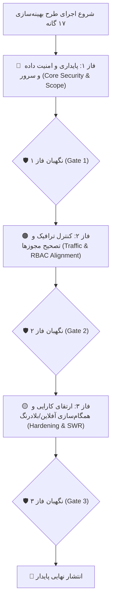

# طرح جامع و فازبندی‌شده بهینه‌سازی و رفع ایرادات ۱۷ گانه کدبیس (همراه با ایجنت نگهبان)

این سند فنی نقشه راه، جزئیات معماری، فازبندی اجرایی و چک‌لیست دقیق برای بهینه‌سازی ۱۷ مورد ارزیابی کدبیس را بر اساس اولویت‌های کلیدی پروژه (**حفظ کامل داده‌های واقعی و تضمین پایداری در حالت آفلاین**) ارائه می‌دهد.

---

## 🧭 تصمیمات معماری کلیدی

* **داده‌های واقعی:** هیچ رکوردی از دسترس خارج نمی‌شود؛ با استانداردسازی `page_size = 100` به همراه صفحه‌بندی سروری، ۱۰۰٪ داده‌ها در دسترس خواهند بود.
* **حفظ معماری Eager Loading:** روت‌ها بدون Lazy Loading باقی می‌مانند تا از خطاهای `ChunkLoadError` هنگام قطعی شبکه در انبارهای دورافتاده جلوگیری شود.

---

## 🧱 فازبندی ۳ مرحله‌ای پیاده‌سازی

---

## 📂 شرح تفصیلی تغییرات به تفکیک ۳ فاز

### 🔴 فاز ۱: پایداری و امنیت داده و سرور (Core Security & Scope)
1. **[`config/settings.py`](file:///e:/warehouse%20project/warehouse-backend/config/settings.py):** انتقال `DEBUG`, `SECRET_KEY`, `ALLOWED_HOSTS` به متغیرهای محیطی با مقادیر پیش‌فرض محلی امن.
2. **[`inventory/views.py`](file:///e:/warehouse%20project/warehouse-backend/inventory/views.py):** اعمال اسکوپ انبار در `get_queryset` روی `ItemViewSet`، `ItemFieldDefinitionViewSet` و اصلاح باگ شرط تخصیص در `CountTaskViewSet`.
3. **[`users.ts`](file:///e:/warehouse%20project/warehouse-front/src/app/components/users/users.ts):** حذف انتساب رمز عبور از کدملی در فرانت‌اند و فعال‌سازی اجبار تغییر رمز در اولین ورود.

### 🟠 فاز ۲: کنترل ترافیک و تصحیح مجوزها (Traffic & RBAC Alignment)
1. **[`layout.ts`](file:///e:/warehouse%20project/warehouse-front/src/app/components/layout/layout.ts):** اصلاح مجوز آیتم منوی `count-tracking` در سایدبار متناسب با `auth.guard.ts`.
2. **داشبوردهای فرانت‌اند (`supervisor`, `manager-review`, `customs`, `count-tracking`):** جایگزینی `page_size: 100000` با `page_size: 100` استاندارد با صفحه‌بندی کامل.
3. **بک‌اند (`inventory/views.py`):** تنظیم سقف مجاز `max_page_size = 500`.

### 🟡 فاز ۳: ارتقای کارایی و همگام‌سازی آفلاین/بلادرنگ (Hardening & SWR)
1. **کارتابل‌های فرانت‌اند:** اضافه کردن `takeUntilDestroyed()` به سابسکرایب‌های استریم‌های باز (`liveDataUpdates$`).
2. **[`offline-sync.service.ts`](file:///e:/warehouse%20project/warehouse-front/src/app/core/services/offline-sync.service.ts):** بروزرسانی و ابطال کش IndexedDB هنگام دریافت وب‌سوکت.
3. **[`global-error-handler.ts`](file:///e:/warehouse%20project/warehouse-front/src/app/core/error/global-error-handler.ts):** ایجاد و رجیستر هندلر سراسری خطاهای انگولار.
4. **[`audit.html`](file:///e:/warehouse%20project/warehouse-front/src/app/components/audit/audit.html):** غیرفعال‌سازی اکشن‌های وابسته به سرور در وضعیت آفلاین.

---

## 🛡️ دروازه‌های کنترل کیفیت ایجنت نگهبان (Guardian Verification Gates)

* **Gate 1:** تست لاگین کاربر بدون انبار + عدم نشت داده + تست متغیرهای محیطی `.env`.
* **Gate 2:** تست رویت منوی پیگیری توسط سرپرست + بررسی عدم ارسال کوئری‌های سنگین‌تر از ۱۰۰ در تب Network.
* **Gate 3:** تست پایداری حافظه + تست آفلاین و SWR با قطعی و وصل شبکه + بیلد موفق `ng build`.

